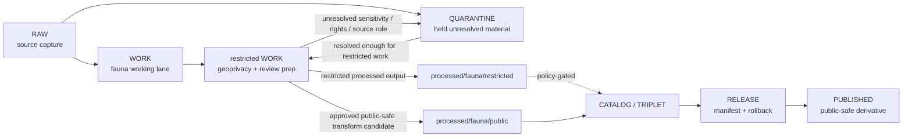

<!-- [KFM_META_BLOCK_V2]
doc_id: kfm://data/work/fauna/restricted/readme
title: Fauna Restricted WORK README
type: data-work-restricted-sublane-readme
version: v0.1.0
status: draft
owners:
  - <fauna-domain-steward>
  - <fauna-data-steward>
  - <sensitivity-reviewer>
  - <geoprivacy-steward>
  - <rights-holder-representative>
  - <access-control-steward>
  - <pipeline-steward>
  - <release-steward>
created: 2026-06-29
updated: 2026-06-29
policy_label: restricted-review
truth_posture: cite-or-abstain
lifecycle_phase: work
responsibility_root: data/
domain: fauna
artifact_family: restricted-fauna-working-material
sensitivity_posture: deny-by-default; no-public-path; restricted-work; geoprivacy-required; source-role-preservation-required; release-blocked
related:
  - ../README.md
  - ../../README.md
  - ../../../README.md
  - ../../../raw/fauna/README.md
  - ../../../quarantine/fauna/README.md
  - ../../../processed/fauna/README.md
  - ../../../processed/fauna/restricted/README.md
  - ../../../catalog/domain/fauna/public/README.md
  - ../../../catalog/domain/fauna/restricted/README.md
  - ../../../published/layers/fauna/README.md
  - ../../../proofs/README.md
  - ../../../receipts/README.md
  - ../../../registry/sources/README.md
  - ../../../../docs/domains/fauna/README.md
  - ../../../../docs/domains/fauna/SENSITIVITY.md
  - ../../../../docs/domains/fauna/POLICY.md
  - ../../../../docs/domains/fauna/DATA_LIFECYCLE.md
  - ../../../../docs/domains/fauna/CANONICAL_PATHS.md
  - ../../../../docs/runbooks/fauna/SOURCE_REFRESH_RUNBOOK.md
  - ../../../../release/manifests/README.md
tags:
  - kfm
  - data
  - work
  - fauna
  - restricted
  - biodiversity
  - occurrence
  - sensitive-geometry
  - sensitive-sites
  - telemetry
  - geoprivacy
  - redaction
  - deny-by-default
  - no-public-path
  - evidence-first
notes:
  - "This README expands a blank placeholder at `data/work/fauna/restricted/README.md`."
  - "This lane is for restricted working material only; it is not RAW source capture, QUARANTINE hold authority, PROCESSED restricted artifact authority, catalog truth, proof authority, receipt authority, policy authority, release authority, public API/UI output, public map/tile output, or generated-answer authority."
  - "Fauna restricted WORK material must preserve source role, rights, sensitivity, taxon identity, geometry/support, geoprivacy state, review state, and rollback context before any downstream move."
  - "The parent `data/work/fauna/README.md` remains a greenfield stub as of this edit; parent-lane implementation depth and child inventory remain NEEDS VERIFICATION."
[/KFM_META_BLOCK_V2] -->

<a id="top"></a>

# Fauna Restricted WORK

Restricted working lane for non-public Fauna normalization, geoprivacy preparation, redaction trials, source-role reconciliation, sensitivity review preparation, and correction work before quarantine resolution, processed artifacts, catalog records, releases, or public-safe derivatives exist.

<p>
  
  
  
  
  
  
</p>

**Quick links:** [Scope](#scope) · [Repo fit](#repo-fit) · [Lifecycle boundary](#lifecycle-boundary) · [Accepted inputs](#accepted-inputs) · [Exclusions](#exclusions) · [Restricted working rules](#restricted-working-rules) · [Directory map](#directory-map) · [Exit gates](#exit-gates) · [Forbidden shortcuts](#forbidden-shortcuts) · [Required checks](#required-checks-before-use) · [Status notes](#status-notes)

> [!CAUTION]
> `data/work/fauna/restricted/` is a no-public-path restricted WORK lane. It is not public, not processed truth, not catalog truth, not proof, not receipt authority, not source registry authority, not policy authority, not release authority, not occurrence truth, not sensitive-site truth, not range truth, not telemetry truth, not a public map/API/UI source, and not an AI-answer source. Public clients, normal UI surfaces, map layers, PMTiles, reports, stories, graph/vector indexes, search indexes, and generated answers must not read this lane directly.

---

## Scope

`data/work/fauna/restricted/` holds restricted in-progress Fauna material after RAW source admission or quarantine return, while stewards and pipelines prepare it for source-role reconciliation, geoprivacy handling, redaction/generalization, validation, correction, sensitivity review, access review, or downstream processed-stage routing.

This lane exists because some Fauna work must happen in a **controlled, non-public work area** before a decision can be made. Examples include exact sensitive occurrence review, sensitive-site geometry review, telemetry simplification, rare-species location handling, landowner/private-parcel risk checks, rights-holder restrictions, taxon identity reconciliation, re-identifying join review, and redaction parameter testing.

Restricted WORK is still WORK. It is not a permanent authority record, not a proof bundle, not a processed restricted artifact, not a release candidate, and not a public-safe derivative. Material that is too unresolved to work safely belongs in `data/quarantine/fauna/`; material that has passed work-stage gates belongs in `data/processed/fauna/restricted/` or a public-candidate processed lane only when policy allows.

---

## Repo fit

| Field | Value |
|---|---|
| Path | `data/work/fauna/restricted/` |
| Responsibility root | `data/` |
| Lifecycle phase | `work/` |
| Domain lane | `fauna` |
| Sublane | `restricted` |
| Artifact role | Restricted working material for geoprivacy, redaction, source-role reconciliation, sensitivity review preparation, and correction planning |
| Public access posture | No public path; no normal UI; no governed-public API exposure |
| Upstream | `data/raw/fauna/` after source admission, or `data/quarantine/fauna/` after governed hold resolution |
| Downstream | `data/quarantine/fauna/` for unresolved holds, `data/processed/fauna/restricted/` for restricted processed artifacts, or `data/processed/fauna/public/` only after approved public-safe transform preparation |
| Release authority | `release/`, not this directory |
| Proof authority | `data/proofs/`, not this directory |
| Receipt authority | `data/receipts/`, not this directory |
| Registry authority | `data/registry/`, not this directory |
| Policy authority | `policy/`, not this directory |
| Default failure posture | `HOLD`, `QUARANTINE`, `DENY`, `RESTRICT`, or `ABSTAIN` when source role, rights, sensitivity, taxon identity, geometry/support, geoprivacy, redaction, evidence, review, correction, rollback, access basis, or release support is insufficient |

---

## Lifecycle boundary

```text
RAW -> WORK / QUARANTINE -> PROCESSED -> CATALOG / TRIPLET -> PUBLISHED
```



Restricted WORK may support later restricted processed artifacts or public-safe derivatives, but it does not bypass quarantine, processed validation, proof construction, policy review, access review, release, correction, or rollback requirements.

---

## Accepted inputs

Accepted material is limited to non-public restricted working artifacts such as:

- admitted occurrence, monitoring, telemetry, range, invasive-species, or sensitive-site working records that require geoprivacy or redaction work;
- exact or high-resolution geometry used for review, correction, generalization, aggregation, withholding, suppression, or delayed-publication planning;
- working joins that could re-identify sensitive taxa, nests, dens, roosts, hibernacula, spawning sites, breeding sites, aggregation sites, landowners, private parcels, observer/user-like fields, or steward-controlled records;
- taxon identity reconciliation, synonym/crosswalk review, source-role reconciliation, geometry-uncertainty review, observation-time review, and source-quality notes;
- draft redaction/generalization/aggregation work products that are not final `RedactionReceipt`, `AggregationReceipt`, `ReviewRecord`, `PolicyDecision`, or `ReleaseManifest` records;
- restricted QA notes, transform notes, work manifests, input references, checksums, and digest sidecars needed to understand a working transform;
- lane-local README or manifest notes that explain working boundaries without becoming proof, receipt, catalog, registry, policy, access authority, release authority, or public output.

> [!IMPORTANT]
> Restricted working material must keep source role visible. Observed, regulatory, authority, aggregate, administrative, candidate, modeled, context, synthetic, generated, telemetry, and steward-controlled records must not be flattened into one authority class for convenience.

---

## Exclusions

| Do not place here | Correct authority home |
|---|---|
| Immutable RAW source captures, source-native files, source media, source logs, and original source exports | `data/raw/fauna/` |
| Material too unresolved or unsafe for restricted WORK handling | `data/quarantine/fauna/` |
| Ordinary non-restricted work material | `data/work/fauna/` or another documented work sublane |
| Validated restricted processed artifacts | `data/processed/fauna/restricted/` |
| Public-candidate generalized or aggregated processed artifacts | `data/processed/fauna/public/` until release |
| Published public-safe layers, PMTiles, reports, stories, API payloads, downloads, or public artifacts | `data/published/` only after release gates close |
| Catalog records, STAC/DCAT/PROV records, triplets, graph records, or EvidenceBundle state | `data/catalog/`, `data/triplets/`, or proof lanes |
| EvidenceBundle, ProofPack, validation report, or claim-proof authority | `data/proofs/` |
| Final `RedactionReceipt`, `AggregationReceipt`, `ReviewRecord`, `PolicyDecision`, `ValidationReceipt`, access receipt, correction receipt, or release receipt records | `data/receipts/` or accepted review/receipt lanes |
| SourceDescriptor, source activation, source registry, rights registry, sensitivity registry, or access registry records | `data/registry/` or accepted registry lanes |
| Release manifests, correction notices, withdrawal notices, signatures, rollback cards, release decisions, or release candidates | `release/` |
| Schemas, contracts, validators, tests, packages, pipelines, app/UI/API code, or policy rules | `schemas/`, `contracts/`, `tools/`, `tests/`, `pipelines/`, `apps/`, `policy/` |
| Public API/UI/tile payloads, direct downloads, Focus Mode answers, public map layers, enforcement aids, landowner/parcel targeting aids, hunting/fishing/legal advice, operational wildlife guidance, emergency alerts, or life-safety guidance | Governed public/release/authority surfaces only; otherwise abstain or deny |
| Secrets, credentials, access tokens, private agreement terms, exact transform seeds, fuzzing offsets, or redaction parameters that could aid exposure | Do not store in this README or ordinary working Markdown |

---

## Restricted working rules

| Rule | Handling |
|---|---|
| Keep restricted WORK non-public | Nothing here is a public surface, public-candidate artifact, or normal UI/API source. |
| Preserve sensitivity posture | Sensitive taxon, sensitive occurrence, sensitive site, telemetry, steward-controlled, private, and restricted-use flags travel with every working artifact. |
| Preserve source and rights context | SourceDescriptor/admission context, source role, license, agreement, steward restriction, citation, and allowed-use posture must remain attached or referenced. |
| Keep exact geometry controlled | Exact occurrence geometry, nests, dens, roosts, hibernacula, spawning sites, breeding sites, aggregation sites, and comparable records fail closed. |
| Do not launder quarantine | Quarantined material cannot enter this lane unless the hold reason is resolved enough to permit restricted working handling. |
| Do not launder into public | Restricted WORK cannot become public-candidate or published material without governed redaction/generalization/aggregation, review, policy, receipts, release, correction, and rollback support. |
| Preserve re-identification risk | Joins with habitat, land, infrastructure, ownership, time, observer/user-like fields, rare taxa, or small cells must be treated as risk-amplifying until reviewed. |
| Keep review separate from transform | A redaction trial or geoprivacy draft does not equal reviewer approval, policy decision, receipt closure, release approval, or public permission. |

---

## Directory map

```text
data/work/fauna/restricted/
├── README.md
├── <workstream_or_risk_class>/
│   └── <run_id_or_batch_id>/
│       ├── work_manifest.json
│       ├── input_refs.json
│       ├── transform_notes.md
│       ├── review_prep_notes.md
│       ├── qa_notes.md
│       ├── checksums.sha256
│       └── README.md
└── index.local.json
```

`index.local.json` is optional and must remain restricted-WORK-local. It is not a public index, catalog record, release manifest, source registry, review record, graph edge source, layer/story/report pointer, search index, vector index, map source, occurrence-truth index, sensitive-site authority, access registry, or retrieval source for generated answers.

> [!NOTE]
> The directory map is a proposed local pattern for future restricted workstreams. It does not prove child payloads, schemas, validators, fixtures, workflows, receipts, access controls, or CI checks exist.

---

## Exit gates

| Exit route | Minimum requirement |
|---|---|
| Stay restricted WORK | Geoprivacy, redaction, taxonomy, source-role reconciliation, rights review, sensitivity review, access review, validation preparation, or correction planning remains incomplete. |
| Quarantine | Source role, rights, sensitivity, taxon identity, geometry/support, observer/user-like fields, private parcel/landowner risk, telemetry risk, citation, digest, policy, review, correction, or rollback state is unresolved enough that work should stop. |
| Reject / return | Steward review says the material is misfiled, unsupported, not retainable, or outside the restricted Fauna work lane. |
| Promote to restricted PROCESSED | Working artifact has sufficient lineage, sensitivity posture, access basis, source-role preservation, validation support, rights posture, review state where required, correction path, rollback context, and downstream-ready metadata. |
| Prepare public-candidate derivative | Only a transformed derivative, not the restricted source artifact, may move toward `data/processed/fauna/public/` after redaction/generalization/aggregation, review, policy, receipt, correction, and rollback requirements are satisfied. |
| Support catalog/release later | Only after later PROCESSED, CATALOG/TRIPLET, proof, receipt, review, policy, release, correction, and rollback gates close. |

A more public tier requires the required redaction/generalization/aggregation receipt, evidence support, review record, policy decision, release manifest, correction path, and rollback target. A more restrictive correction can happen immediately when risk is discovered.

---

## Forbidden shortcuts

```text
data/work/fauna/restricted/
→ data/catalog/
→ data/published/
→ public API / MapLibre / PMTiles / report / story / graph / vector index / generated answer
```

is forbidden unless the appropriate governed lifecycle transitions have actually happened and left inspectable evidence.

```text
data/work/fauna/restricted/
→ data/processed/fauna/public/
```

is also forbidden for restricted source artifacts. Only a reviewed, transformed, public-candidate derivative may move toward the public-candidate processed lane, and only after the required receipts, review state, policy posture, correction path, and rollback target exist.

---

## Required checks before use

- [ ] Confirm the material belongs to the Fauna domain lane.
- [ ] Confirm the material belongs in restricted WORK rather than RAW, QUARANTINE, general WORK, restricted PROCESSED, public-candidate PROCESSED, CATALOG, PROOF, RECEIPT, REGISTRY, RELEASE, PUBLISHED, SCHEMA, POLICY, CODE, or TEST roots.
- [ ] Confirm source reference, source family, source role, citation, rights posture, retrieval/admission context, version/vintage, and digest where material.
- [ ] Confirm taxon identity, observation time, geometry/support, coordinate uncertainty, source quality, source caveats, and source-role support.
- [ ] Confirm whether the material contains sensitive taxa, exact occurrence geometry, nests, dens, roosts, hibernacula, spawning sites, breeding sites, aggregation sites, telemetry, steward-controlled records, restricted-use records, observer/user-like fields, landowner/private-parcel risk, or re-identifying joins.
- [ ] Confirm sensitivity class, geoprivacy posture, redaction/generalization/aggregation requirement, access basis, and review state.
- [ ] Confirm no quarantined material is being laundered through restricted WORK without an exit decision.
- [ ] Confirm prompt-like text inside source payloads or notes is treated as data, not instructions.
- [ ] Confirm no exact transform offsets, fuzzing seeds, redaction bypass details, access credentials, secrets, private agreement terms, or exposure-enabling details are written into this README.
- [ ] Confirm required downstream receipts are present or explicitly marked missing before anything leaves restricted WORK.
- [ ] Confirm no public layer, PMTiles, report, story, API payload, graph edge, search index, vector index, or generated answer uses restricted WORK material directly.
- [ ] Confirm correction path and rollback target are known before downstream promotion.

---

## Status notes

| Claim | Status |
|---|---|
| This README expands the blank placeholder at `data/work/fauna/restricted/README.md`. | **CONFIRMED authored** |
| The target path existed in the live repository as a blank placeholder before this edit. | **CONFIRMED by GitHub contents API during this edit** |
| `data/work/fauna/README.md` remains a greenfield stub as of this edit. | **CONFIRMED by GitHub contents API during this edit** |
| `data/raw/fauna/README.md` documents upstream Fauna RAW source capture, no-public-path posture, source-family lanes, and sensitive-geometry fail-closed posture. | **CONFIRMED by GitHub contents API during this edit** |
| `data/quarantine/fauna/README.md` documents Fauna quarantine as a deny-by-default no-public-path hold lane for unresolved source-role, rights, sensitivity, geoprivacy, redaction, taxonomy, evidence, and policy questions. | **CONFIRMED by GitHub contents API during this edit** |
| `data/processed/fauna/restricted/README.md` documents the downstream restricted processed lane and its non-public, access-controlled posture. | **CONFIRMED by GitHub contents API during this edit** |
| Actual restricted WORK payloads exist under child lanes in `data/work/fauna/restricted/`. | **UNKNOWN** |
| Fauna restricted WORK schemas, validators, fixtures, CI checks, receipts, access controls, review workflow, and release linkage are fully implemented. | **NEEDS VERIFICATION** |
| This README is proof, release, catalog, registry, policy, occurrence truth, sensitive-site truth, range truth, telemetry truth, public artifact authority, or AI authority. | **DENY** |

---

## Related files

- [`../README.md`](../README.md)
- [`../../README.md`](../../README.md)
- [`../../../README.md`](../../../README.md)
- [`../../../raw/fauna/README.md`](../../../raw/fauna/README.md)
- [`../../../quarantine/fauna/README.md`](../../../quarantine/fauna/README.md)
- [`../../../processed/fauna/README.md`](../../../processed/fauna/README.md)
- [`../../../processed/fauna/restricted/README.md`](../../../processed/fauna/restricted/README.md)
- [`../../../catalog/domain/fauna/public/README.md`](../../../catalog/domain/fauna/public/README.md)
- [`../../../catalog/domain/fauna/restricted/README.md`](../../../catalog/domain/fauna/restricted/README.md)
- [`../../../published/layers/fauna/README.md`](../../../published/layers/fauna/README.md)
- [`../../../proofs/README.md`](../../../proofs/README.md)
- [`../../../receipts/README.md`](../../../receipts/README.md)
- [`../../../registry/sources/README.md`](../../../registry/sources/README.md)
- [`../../../../docs/domains/fauna/README.md`](../../../../docs/domains/fauna/README.md)
- [`../../../../docs/domains/fauna/SENSITIVITY.md`](../../../../docs/domains/fauna/SENSITIVITY.md)
- [`../../../../docs/domains/fauna/POLICY.md`](../../../../docs/domains/fauna/POLICY.md)
- [`../../../../docs/domains/fauna/DATA_LIFECYCLE.md`](../../../../docs/domains/fauna/DATA_LIFECYCLE.md)
- [`../../../../docs/domains/fauna/CANONICAL_PATHS.md`](../../../../docs/domains/fauna/CANONICAL_PATHS.md)
- [`../../../../release/manifests/README.md`](../../../../release/manifests/README.md)

---

## Maintenance checklist

- [ ] Replace placeholder owners with confirmed steward roles.
- [ ] Confirm whether restricted child workstream lanes exist and add them to the directory map only after verification.
- [ ] Confirm Fauna restricted WORK schemas, validators, and fixture expectations.
- [ ] Confirm required receipt family names and storage homes for restricted WORK-to-PROCESSED promotion.
- [ ] Confirm source-role review, geoprivacy, redaction/generalization, aggregation, sensitivity review, access review, and validation linkage.
- [ ] Confirm parent `data/work/fauna/README.md` is expanded so this sublane has a documented parent contract.
- [ ] Confirm all relative links after adjacent docs stabilize.
- [ ] Confirm rollback target for this README expansion in the commit or release notes.

[Back to top](#top)
