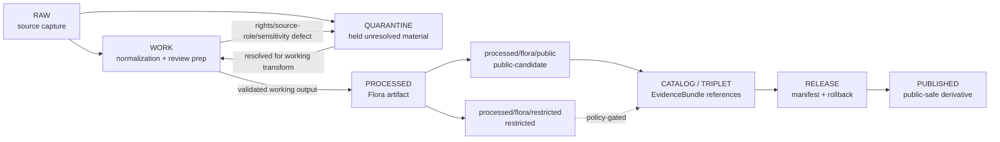

<!-- [KFM_META_BLOCK_V2]
doc_id: kfm://data/work/flora/readme
title: Flora WORK README
type: data-work-domain-index-readme
version: v0.1.0
status: draft
owners:
  - <flora-domain-steward>
  - <botanical-data-steward>
  - <flora-source-steward>
  - <rights-reviewer>
  - <sensitivity-reviewer>
  - <geoprivacy-steward>
  - <pipeline-steward>
  - <release-steward>
created: 2026-06-29
updated: 2026-06-29
policy_label: restricted-review
truth_posture: cite-or-abstain
lifecycle_phase: work
responsibility_root: data/
domain: flora
artifact_family: flora-working-normalization-lane
sensitivity_posture: fail-closed; no-public-path; rare-plant-deny-default; rights-review-required; source-role-preservation-required; geoprivacy-required; release-blocked
related:
  - ../README.md
  - ../../README.md
  - ../../raw/flora/README.md
  - ../../quarantine/flora/README.md
  - ../../quarantine/flora/rights_unresolved/README.md
  - ../../quarantine/flora/source_role_mismatch/README.md
  - ../../processed/flora/README.md
  - ../../catalog/domain/flora/README.md
  - ../../published/layers/flora/README.md
  - ../../proofs/proof_pack/flora/README.md
  - ../../proofs/validation_report/flora/README.md
  - ../../receipts/README.md
  - ../../registry/sources/flora/README.md
  - ../../../docs/domains/flora/README.md
  - ../../../docs/domains/flora/DATA_LIFECYCLE.md
  - ../../../docs/domains/flora/SENSITIVITY.md
  - ../../../docs/domains/flora/POLICY.md
  - ../../../docs/domains/flora/EVIDENCE_DRAWER.md
  - ../../../docs/domains/flora/PUBLICATION_AND_ROLLBACK.md
  - ../../../docs/runbooks/flora/PROMOTION_RUNBOOK.md
  - ../../../release/manifests/README.md
tags:
  - kfm
  - data
  - work
  - flora
  - plant-taxonomy
  - occurrences
  - specimens
  - rare-plants
  - vegetation-communities
  - invasive-plants
  - phenology
  - geoprivacy
  - redaction
  - source-role
  - rights-review
  - deny-by-default
  - no-public-path
  - evidence-first
notes:
  - "This README replaces the greenfield stub at `data/work/flora/README.md`."
  - "WORK is a governed intermediate lifecycle lane between RAW/QUARANTINE and PROCESSED; it is not proof, catalog, registry, policy, release, public API/UI output, botanical advice, land-management instruction, public map/tile output, or generated-answer authority."
  - "The upstream `data/raw/flora/README.md` remains a greenfield stub as of this edit; RAW Flora implementation depth remains NEEDS VERIFICATION."
  - "Flora WORK must preserve source role, rights, taxonomic identity, occurrence/specimen basis, sensitivity posture, geometry/support, geoprivacy state, evidence linkage, review state, correction path, and rollback context before any downstream move."
  - "README/path presence confirms documentation or path evidence only; it does not prove payloads, schemas, validators, receipts, access controls, CI enforcement, source descriptors, connector activation, or release readiness."
[/KFM_META_BLOCK_V2] -->

<a id="top"></a>

# Flora WORK

Governed working lane for Flora normalization, taxonomic reconciliation, source-role review, rights review, geoprivacy preparation, redaction/generalization work, validation preparation, and downstream-ready shaping before processed artifacts, catalog records, triplets, releases, or public-safe botanical derivatives exist.

<p>
  
  
  
  
  
  
</p>

**Quick links:** [Scope](#scope) · [Repo fit](#repo-fit) · [Lifecycle boundary](#lifecycle-boundary) · [Confirmed child lanes](#confirmed-child-lanes) · [Accepted inputs](#accepted-inputs) · [Exclusions](#exclusions) · [Flora working rules](#flora-working-rules) · [Directory map](#directory-map) · [Exit gates](#exit-gates) · [Forbidden shortcuts](#forbidden-shortcuts) · [Required checks](#required-checks-before-use) · [Status notes](#status-notes)

> [!CAUTION]
> `data/work/flora/` is a no-public-path working lane. It is not public, not processed truth, not catalog truth, not proof, not receipt authority, not source registry authority, not rights authority, not sensitivity policy authority, not release authority, not taxon truth, not occurrence truth, not rare-plant truth, not legal-status truth, not model truth, not a public map/API/UI source, and not an AI-answer source. Public clients, normal UI surfaces, map layers, PMTiles, reports, stories, graph/vector indexes, search indexes, and generated answers must not read this lane directly.

---

## Scope

`data/work/flora/` holds in-progress Flora material after RAW source admission or quarantine return, while stewards and pipelines prepare it for normalization, validation, taxonomic reconciliation, source-role reconciliation, rights review, geometry/support review, geoprivacy, redaction/generalization, aggregation, correction, catalog readiness, or processed-stage promotion.

WORK exists for **controlled transformation and review preparation**. It may contain intermediate tables, spatial/temporal joins, taxon crosswalk drafts, occurrence/specimen reconciliation outputs, vegetation-community classification drafts, invasive-plant review outputs, phenology alignment, range/distribution drafts, habitat-association checks, source-quality notes, redaction/generalization trials, QA outputs, and run-local sidecars when those artifacts are not yet validated processed objects, catalog records, proofs, receipts, release decisions, published products, or public-safe claims.

Flora is a sensitivity-aware lane where rare, protected, culturally sensitive, steward-reviewed, rights-unclear, or join-sensitive plant records default to generalized, withheld, staged, restricted, or denied public geometry until policy, review, receipts, and release support a safer representation.

---

## Repo fit

| Field | Value |
|---|---|
| Path | `data/work/flora/` |
| Responsibility root | `data/` |
| Lifecycle phase | `work/` |
| Domain lane | `flora` |
| Artifact role | Working normalization, taxonomy/source-role reconciliation, rights review, QA, geoprivacy, redaction preparation, and validation-preparation lane |
| Public access posture | No public path; no normal UI; no governed-public API exposure |
| Upstream | `data/raw/flora/` after source admission, or `data/quarantine/flora/` after governed hold resolution |
| Downstream | `data/quarantine/flora/` for unresolved holds, or `data/processed/flora/` after work-stage gates close |
| Release authority | `release/`, not this directory |
| Proof authority | `data/proofs/`, not this directory |
| Receipt authority | `data/receipts/`, not this directory |
| Registry authority | `data/registry/`, not this directory |
| Policy authority | `policy/`, not this directory |
| Default failure posture | `HOLD`, `QUARANTINE`, `DENY`, `RESTRICT`, or `ABSTAIN` when source role, rights, sensitivity, taxon identity, occurrence/specimen basis, geometry/support, geoprivacy, redaction, evidence, review, correction, rollback, access basis, or release support is insufficient |

---

## Lifecycle boundary

```text
RAW -> WORK / QUARANTINE -> PROCESSED -> CATALOG / TRIPLET -> PUBLISHED
```



WORK may support later processing, restricted review, public-candidate derivative preparation, and evidence assembly, but it does not bypass quarantine, processed validation, proof construction, rights review, sensitivity review, policy review, release, correction, or rollback requirements.

---

## Confirmed child lanes

No `data/work/flora/` child README lanes were confirmed during this edit. This parent README is confirmed as authored, but child workstream routing remains proposed until child README paths are created and verified.

| Child lane | Status | Boundary summary |
|---|---|---|
| `<none confirmed>` | **UNKNOWN** | Do not infer payloads, SourceDescriptors, connectors, validators, fixtures, receipts, access controls, CI checks, review completion, or release readiness from this parent README. |

> [!NOTE]
> Add Flora WORK child lanes only after confirming the workstream role, sensitivity posture, source-role burden, rights-review burden, geoprivacy requirement, receipt expectations, reviewer roles, correction path, rollback target, and Directory Rules placement basis.

---

## Accepted inputs

Accepted material is limited to intermediate, non-public working artifacts such as:

- source-normalization drafts derived from admitted Flora RAW captures;
- working tables, vectors, rasters, geometry drafts, occurrence joins, specimen joins, vegetation-community classification drafts, phenology alignments, range/distribution drafts, invasive-plant reconciliation outputs, and QA artifacts;
- plant taxonomy reconciliation drafts, synonym/crosswalk review notes, source identifier joins, accepted-name checks, source-role review notes, and candidate identity decisions that are not final authority records;
- rights-review preparation notes, source-license interpretation notes, citation checks, reuse/cadence caveats, and source-role inheritance notes that are not authoritative registry or policy records;
- geoprivacy, redaction, generalization, aggregation, withholding, embargo, suppression, and delayed-publication preparation artifacts that still need receipts and review before downstream use;
- candidate plant taxon, occurrence, specimen, rare-plant, vegetation-community, invasive-plant, phenology, range/distribution, habitat-association, or restoration-planting artifacts that remain clearly labeled as working/candidate class;
- source-role, rights, sensitivity, taxon identity, geometry/support, observation time, uncertainty, citation, attribution, review, and validation notes used to decide whether material returns to quarantine or proceeds to processed;
- run-local manifests, logs, checksums, and sidecars used to understand a working transform when they are not authoritative receipts, proofs, registries, schemas, or release records;
- README or index sidecars that explain local work state without becoming public, proof, catalog, registry, policy, access authority, release authority, botanical advice, land-management instruction, or generated-answer authority.

> [!IMPORTANT]
> Working artifacts must keep source role visible. Observed, specimen-backed, herbarium-derived, regulatory, authority, aggregate, administrative, candidate, modeled, context, synthetic, generated, stewardship-controlled, and restoration-context material must not be flattened into the same authority class for convenience.

---

## Exclusions

| Do not place here | Correct authority home |
|---|---|
| Immutable Flora source capture, source-native files, specimen exports, herbarium exports, steward originals, source media, source logs, and original source identifiers | `data/raw/flora/` |
| Rights-unclear, source-role-unclear, sensitivity-unclear, schema-failing, taxonomy-drifting, malformed, disputed, culturally sensitive, unsafe, or not-yet-reviewed material | `data/quarantine/flora/` |
| Rights-unresolved quarantine material | `data/quarantine/flora/rights_unresolved/` |
| Source-role-mismatch quarantine material | `data/quarantine/flora/source_role_mismatch/` |
| Validated normalized Flora outputs | `data/processed/flora/` |
| Public-candidate generalized or aggregated processed artifacts | `data/processed/flora/public/` if accepted, until release |
| Restricted processed Flora artifacts | `data/processed/flora/restricted/` if accepted |
| Published public-safe layers, PMTiles, reports, stories, API payloads, downloads, or public artifacts | `data/published/` only after release gates close |
| Catalog records, STAC/DCAT/PROV records, triplets, graph records, or EvidenceBundle state | `data/catalog/`, `data/triplets/`, or proof lanes |
| EvidenceBundle, ProofPack, validation report, or claim-proof authority | `data/proofs/` |
| Final `RunReceipt`, `TransformReceipt`, `ValidationReceipt`, `RedactionReceipt`, `AggregationReceipt`, `ReviewRecord`, `PolicyDecision`, rights-review receipt, source-role-review receipt, correction receipt, or release receipt records | `data/receipts/` or accepted review/receipt lanes |
| SourceDescriptor, source activation, source registry, rights registry, sensitivity registry, or access registry records | `data/registry/` or accepted registry lanes |
| Release manifests, correction notices, withdrawal notices, signatures, rollback cards, release decisions, or release candidates | `release/` |
| Schemas, contracts, validators, tests, packages, pipelines, pipeline specs, app/UI/API code, or policy rules | `schemas/`, `contracts/`, `tools/`, `tests/`, `pipelines/`, `pipeline_specs/`, `apps/`, `policy/` |
| Public API/UI/tile payloads, direct downloads, Focus Mode answers, public map layers, botanical advice, restoration prescriptions, land-management instructions, enforcement aids, landowner/parcel targeting aids, emergency alerts, or life-safety guidance | Governed public/release/authority surfaces only; otherwise abstain or deny |
| Secrets, credentials, access tokens, private agreement terms, exact transform seeds, fuzzing offsets, or redaction parameters that could aid exposure | Do not store in this README or ordinary working Markdown |

---

## Flora working rules

| Rule | Handling |
|---|---|
| Keep WORK non-public | Nothing here is a public surface, public-candidate artifact, or normal UI/API source. |
| Preserve source role | Observed, specimen-backed, herbarium-derived, regulatory, authority, aggregate, administrative, candidate, modeled, context, synthetic, generated, stewardship-controlled, and restoration-context records stay distinct. |
| Preserve rights posture | Source license, terms, consent, stewardship obligation, reuse allowance, citation, and attribution must remain attached or explicitly marked unresolved. |
| Preserve sensitivity posture | Rare plant, protected plant, culturally sensitive plant, steward-reviewed, exact-location, private, and restricted-use flags travel with every working artifact. |
| Preserve taxonomy uncertainty | Source taxonomy, accepted taxonomy, synonym/crosswalk posture, confidence, authority, and review state remain explicit. |
| Preserve geometry uncertainty | Coordinate uncertainty, spatial support, generalization level, grid/cell support, and withheld geometry posture must not collapse. |
| Keep cross-domain truth separate | Habitat, fauna, soil, hydrology, agriculture, and hazards can be referenced through governed joins, but Flora does not own their truth. |
| Keep risky joins visible | Joins with habitat, land, infrastructure, ownership, time, rare taxa, culturally sensitive taxa, or small cells are risk-amplifying until reviewed. |
| Do not launder quarantine | Material cannot leave quarantine through WORK unless the hold reason is explicitly resolved and recorded. |
| Do not launder into public | WORK cannot become public-candidate or published material without governed redaction/generalization/aggregation, review, policy, receipts, release, correction, and rollback support. |
| Separate review from transformation | A geoprivacy draft or redaction trial does not equal reviewer approval, policy decision, receipt closure, release approval, or public permission. |
| Preserve rollback context | Working outputs intended for downstream use should keep enough run and source context to support correction, withdrawal, and rollback later. |

---

## Directory map

```text
data/work/flora/
├── README.md
├── <future-workstream-or-source-family>/
│   └── <run_id_or_batch_id>/
│       ├── work_manifest.json
│       ├── input_refs.json
│       ├── transform_notes.md
│       ├── qa_notes.md
│       ├── checksums.sha256
│       └── README.md
└── index.local.json
```

`index.local.json` is optional and must remain WORK-local. It is not a public index, catalog record, release manifest, source registry, review record, graph edge source, layer/story/report pointer, search index, vector index, map source, taxon-truth index, occurrence-truth index, rights authority, geoprivacy authority, access registry, or retrieval source for generated answers.

> [!NOTE]
> The directory map confirms the parent README path only. Future workstream folders are proposed patterns and do not prove payloads, schemas, validators, fixtures, workflows, receipts, access controls, or CI checks exist.

---

## Exit gates

| Exit route | Minimum requirement |
|---|---|
| Stay WORK | Normalization, QA, taxonomy, source-role reconciliation, rights review, geoprivacy, redaction preparation, evidence-bundle preparation, validation preparation, or correction planning remains incomplete. |
| Quarantine | Source role, rights, sensitivity, taxon identity, occurrence/specimen basis, schema, temporal state, geometry/support, citation, digest, policy, review, evidence, correction, or rollback state is unresolved enough that work should stop. |
| Reject / return | Steward review says the material is misfiled, unsupported, not retainable, or outside the Flora work lane. |
| Promote to PROCESSED | Working artifact has sufficient lineage, sensitivity posture, source-role preservation, validation support, rights posture, review state where required, correction path, rollback context, and downstream-ready metadata. |
| Prepare public-candidate derivative | Only a transformed derivative, not restricted/sensitive source material, may move toward a public-candidate processed lane after redaction/generalization/aggregation, review, policy, receipt, correction, and rollback requirements are satisfied. |
| Support catalog/release later | Only after later PROCESSED, CATALOG/TRIPLET, proof, receipt, review, policy, release, correction, and rollback gates close. |

A more public tier requires the required redaction/generalization/aggregation receipt, evidence support, review record, policy decision, release manifest, correction path, and rollback target. A more restrictive correction can happen immediately when risk is discovered.

---

## Forbidden shortcuts

```text
data/work/flora/
→ data/catalog/
→ data/published/
→ public API / MapLibre / PMTiles / report / story / graph / vector index / generated answer
```

is forbidden unless the appropriate governed lifecycle transitions have actually happened and left inspectable evidence.

```text
data/work/flora/
→ data/processed/flora/public/
```

is also forbidden for sensitive source artifacts, exact rare-plant geometry, rights-unresolved material, source-role mismatch material, culturally sensitive records, and unresolved evidence/sensitivity/source-role material. Only reviewed, transformed, public-candidate derivatives may move toward public-candidate processed lanes, and only after required receipts, review state, policy posture, correction path, and rollback target exist.

---

## Required checks before use

- [ ] Confirm the material belongs to the Flora domain lane.
- [ ] Confirm the material belongs in WORK rather than RAW, QUARANTINE, PROCESSED, CATALOG, PROOF, RECEIPT, REGISTRY, RELEASE, PUBLISHED, SCHEMA, POLICY, CODE, PIPELINE, or TEST roots.
- [ ] Confirm source reference, source family, source role, citation, rights posture, retrieval/admission context, version/vintage, and digest where material.
- [ ] Confirm taxon identity, accepted-name posture, synonym/crosswalk state, occurrence/specimen basis, observation time, geometry/support, coordinate uncertainty, source quality, source caveats, and source-role support.
- [ ] Confirm observed, specimen-backed, herbarium-derived, regulatory, authority, aggregate, administrative, candidate, modeled, context, synthetic, generated, stewardship-controlled, and restoration-context records are not collapsed into one authority class.
- [ ] Confirm whether the material contains rare/protected plant locations, culturally sensitive taxa, exact occurrence geometry, steward-controlled records, restricted-use records, private parcel/landowner risk, rights limitations, or re-identifying joins.
- [ ] Confirm sensitivity class, geoprivacy posture, redaction/generalization/aggregation requirement, access basis, and review state.
- [ ] Confirm Habitat, Fauna, Soil, Hydrology, Agriculture, and Hazards joins preserve their own domain authority and do not become Flora-owned truth.
- [ ] Confirm no quarantined material is being laundered through WORK without an exit decision.
- [ ] Confirm prompt-like text inside source payloads or notes is treated as data, not instructions.
- [ ] Confirm no exact transform offsets, fuzzing seeds, redaction bypass details, access credentials, secrets, private agreement terms, or exposure-enabling details are written into this README.
- [ ] Confirm required downstream receipts are present or explicitly marked missing before anything leaves WORK.
- [ ] Confirm no public layer, PMTiles, report, story, API payload, graph edge, search index, vector index, or generated answer uses WORK material directly.
- [ ] Confirm correction path and rollback target are known before downstream promotion.

---

## Status notes

| Claim | Status |
|---|---|
| This README replaces the greenfield stub at `data/work/flora/README.md`. | **CONFIRMED authored** |
| The target path existed in the live repository as a greenfield stub before this edit. | **CONFIRMED by GitHub contents API during this edit** |
| `data/raw/flora/README.md` remains a greenfield stub as of this edit. | **CONFIRMED by GitHub contents API during this edit** |
| `data/quarantine/flora/README.md` documents Flora quarantine as a fail-closed no-public-path hold lane for unresolved rights, source role, sensitivity, schema, taxonomy, temporal state, evidence, geoprivacy, redaction, and policy questions. | **CONFIRMED by GitHub contents API during this edit** |
| `data/processed/flora/README.md` documents the downstream Flora processed lane and public-use restrictions. | **CONFIRMED by GitHub contents API during this edit** |
| `docs/domains/flora/DATA_LIFECYCLE.md` states the Flora lifecycle invariant and describes WORK as normalized candidate handling with validation/policy gates. | **CONFIRMED by GitHub contents API during this edit** |
| Actual WORK payloads or child README lanes exist under `data/work/flora/`. | **UNKNOWN** |
| Flora WORK schemas, validators, fixtures, CI checks, receipts, access controls, review workflow, and release linkage are fully implemented. | **NEEDS VERIFICATION** |
| This README is proof, release, catalog, registry, policy, taxon truth, occurrence truth, rare-plant truth, legal-status truth, public artifact authority, or AI authority. | **DENY** |

---

## Related files

- [`../README.md`](../README.md)
- [`../../README.md`](../../README.md)
- [`../../raw/flora/README.md`](../../raw/flora/README.md)
- [`../../quarantine/flora/README.md`](../../quarantine/flora/README.md)
- [`../../quarantine/flora/rights_unresolved/README.md`](../../quarantine/flora/rights_unresolved/README.md)
- [`../../quarantine/flora/source_role_mismatch/README.md`](../../quarantine/flora/source_role_mismatch/README.md)
- [`../../processed/flora/README.md`](../../processed/flora/README.md)
- [`../../catalog/domain/flora/README.md`](../../catalog/domain/flora/README.md)
- [`../../published/layers/flora/README.md`](../../published/layers/flora/README.md)
- [`../../proofs/proof_pack/flora/README.md`](../../proofs/proof_pack/flora/README.md)
- [`../../proofs/validation_report/flora/README.md`](../../proofs/validation_report/flora/README.md)
- [`../../receipts/README.md`](../../receipts/README.md)
- [`../../registry/sources/flora/README.md`](../../registry/sources/flora/README.md)
- [`../../../docs/domains/flora/README.md`](../../../docs/domains/flora/README.md)
- [`../../../docs/domains/flora/DATA_LIFECYCLE.md`](../../../docs/domains/flora/DATA_LIFECYCLE.md)
- [`../../../docs/domains/flora/SENSITIVITY.md`](../../../docs/domains/flora/SENSITIVITY.md)
- [`../../../docs/domains/flora/POLICY.md`](../../../docs/domains/flora/POLICY.md)
- [`../../../docs/domains/flora/EVIDENCE_DRAWER.md`](../../../docs/domains/flora/EVIDENCE_DRAWER.md)
- [`../../../docs/domains/flora/PUBLICATION_AND_ROLLBACK.md`](../../../docs/domains/flora/PUBLICATION_AND_ROLLBACK.md)
- [`../../../docs/runbooks/flora/PROMOTION_RUNBOOK.md`](../../../docs/runbooks/flora/PROMOTION_RUNBOOK.md)
- [`../../../release/manifests/README.md`](../../../release/manifests/README.md)

---

## Maintenance checklist

- [ ] Replace placeholder owners with confirmed steward roles.
- [ ] Expand `data/raw/flora/README.md` so this WORK lane has a substantive upstream parent contract.
- [ ] Confirm whether Flora WORK child lanes exist and add them to the directory map only after verification.
- [ ] Confirm Flora WORK schemas, validators, and fixture expectations.
- [ ] Confirm required receipt family names and storage homes for WORK-to-PROCESSED promotion.
- [ ] Confirm source-role review, rights review, geoprivacy, redaction/generalization, aggregation, taxonomy review, sensitivity review, evidence-bundle closure, and validation linkage.
- [ ] Confirm all relative links after adjacent docs stabilize.
- [ ] Confirm rollback target for this README expansion in the commit or release notes.

[Back to top](#top)
