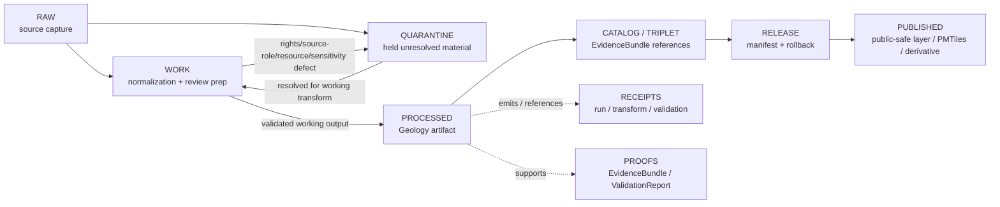

<!-- [KFM_META_BLOCK_V2]
doc_id: kfm://data/work/geology/readme
title: Geology WORK README
type: data-work-domain-index-readme
version: v0.1.0
status: draft
owners:
  - <geology-domain-steward>
  - <natural-resources-steward>
  - <subsurface-data-steward>
  - <geology-source-steward>
  - <rights-reviewer>
  - <sensitivity-reviewer>
  - <pipeline-steward>
  - <release-steward>
created: 2026-06-29
updated: 2026-06-29
policy_label: restricted-review
truth_posture: cite-or-abstain
lifecycle_phase: work
responsibility_root: data/
domain: geology
artifact_family: geology-working-normalization-lane
sensitivity_posture: fail-closed; no-public-path; exact-subsurface-points-deny-by-default; rights-review-required; source-role-preservation-required; resource-class-anti-collapse-required; release-blocked
related:
  - ../README.md
  - ../../README.md
  - ../../raw/geology/README.md
  - ../../quarantine/geology/README.md
  - ../../quarantine/geology/rights_unknown/README.md
  - ../../processed/geology/README.md
  - ../../catalog/domain/geology/README.md
  - ../../published/layers/geology/README.md
  - ../../published/pmtiles/geology/README.md
  - ../../proofs/validation_report/geology/README.md
  - ../../receipts/README.md
  - ../../registry/sources/geology/README.md
  - ../../../docs/domains/geology/README.md
  - ../../../docs/domains/geology/ARCHITECTURE.md
  - ../../../docs/domains/geology/SOURCE_REGISTRY.md
  - ../../../docs/domains/geology/SOURCES.md
  - ../../../docs/domains/geology/SOURCE_LEDGER.md
  - ../../../docs/domains/geology/SENSITIVITY.md
  - ../../../docs/domains/geology/POLICY.md
  - ../../../docs/domains/geology/PRESERVATION_MATRIX.md
  - ../../../docs/domains/geology/OPEN_QUESTIONS.md
  - ../../../docs/runbooks/geology/PROMOTION_RUNBOOK.md
  - ../../../release/manifests/README.md
tags:
  - kfm
  - data
  - work
  - geology
  - natural-resources
  - stratigraphy
  - lithology
  - structures
  - subsurface
  - boreholes
  - well-logs
  - mineral-occurrence
  - resource-estimate
  - redaction
  - source-role
  - anti-collapse
  - rights-review
  - no-public-path
  - evidence-first
notes:
  - "This README replaces the greenfield stub at `data/work/geology/README.md`."
  - "WORK is a governed intermediate lifecycle lane between RAW/QUARANTINE and PROCESSED; it is not proof, catalog, registry, policy, release, public API/UI output, public map/tile output, 3D scene output, extraction/legal advice, property-rights evidence, hazard warning, or generated-answer authority."
  - "Geology WORK must preserve source role, rights, sensitivity posture, object-family distinction, time semantics, geometry/support, depth/unit semantics, interpretation version, evidence linkage, validation state, correction path, and rollback context before any downstream move."
  - "Anti-collapse is mandatory: occurrence, deposit, estimate, permit, production, reserve, reclamation, regulatory, administrative, modeled, aggregate, candidate, and synthetic claims must remain distinct."
  - "README/path presence confirms documentation or path evidence only; it does not prove payloads, schemas, validators, receipts, access controls, CI enforcement, source descriptors, connector activation, or release readiness."
[/KFM_META_BLOCK_V2] -->

<a id="top"></a>

# Geology WORK

Governed working lane for Geology and Natural Resources normalization, source-role reconciliation, rights review, geometry/depth/unit repair, stratigraphic alignment, redaction/generalization work, validation preparation, and downstream-ready shaping before processed artifacts, catalog records, triplets, releases, public layers, PMTiles, 3D scenes, or public-safe derivatives exist.

<p>
  
  
  
  
  
  
</p>

**Quick links:** [Scope](#scope) · [Repo fit](#repo-fit) · [Lifecycle boundary](#lifecycle-boundary) · [Confirmed child lanes](#confirmed-child-lanes) · [Accepted inputs](#accepted-inputs) · [Exclusions](#exclusions) · [Geology working rules](#geology-working-rules) · [Directory map](#directory-map) · [Exit gates](#exit-gates) · [Forbidden shortcuts](#forbidden-shortcuts) · [Required checks](#required-checks-before-use) · [Status notes](#status-notes)

> [!CAUTION]
> `data/work/geology/` is a no-public-path working lane. It is not public, not processed truth, not catalog truth, not proof, not receipt authority, not source registry authority, not rights authority, not sensitivity policy authority, not release authority, not geologic truth, not mineral/resource truth, not borehole truth, not well-log truth, not resource-estimate truth, not legal/title authority, not public map/API/UI output, not 3D scene output, and not an AI-answer source. Public clients, normal UI surfaces, map layers, PMTiles, reports, stories, graph/vector indexes, search indexes, 3D scenes, and generated answers must not read this lane directly.

---

## Scope

`data/work/geology/` holds in-progress Geology and Natural Resources material after RAW source admission or quarantine return, while stewards and pipelines prepare it for normalization, validation, source-role reconciliation, object-family separation, rights review, geometry repair, coordinate/depth/unit alignment, geologic identity reconciliation, stratigraphic correlation, representation repair, redaction/generalization, aggregation, correction, catalog readiness, or processed-stage promotion.

WORK exists for **controlled transformation and review preparation**. It may contain intermediate tables, spatial/temporal joins, geologic-map normalization drafts, stratigraphic crosswalk drafts, lithology harmonization drafts, structure/fault alignment outputs, borehole and well-log reconciliation outputs, sample/geochemistry/geophysics QA products, mineral/resource anti-collapse reviews, extraction/reclamation context checks, cross-section/3D-representation drafts, source-quality notes, and run-local sidecars when those artifacts are not yet validated processed objects, catalog records, proofs, receipts, release decisions, published products, or public-safe claims.

Geology is interpretation-heavy. Occurrence, deposit, estimate, permit, production, reserve, reclamation, regulatory, administrative, modeled, aggregate, candidate, and synthetic material must remain distinct at every stage. Exact borehole, sample, sensitive resource, well-log, private-well, proprietary-log, operator/parcel, and active extraction-site detail can require restriction, generalization, named terms, or denial before public exposure.

---

## Repo fit

| Field | Value |
|---|---|
| Path | `data/work/geology/` |
| Responsibility root | `data/` |
| Lifecycle phase | `work/` |
| Domain lane | `geology` |
| Artifact role | Working normalization, geometry/depth/unit repair, stratigraphic alignment, source-role/resource-class reconciliation, rights review, redaction/generalization preparation, and validation-preparation lane |
| Public access posture | No public path; no normal UI; no governed-public API exposure |
| Upstream | `data/raw/geology/` after source admission, or `data/quarantine/geology/` after governed hold resolution |
| Downstream | `data/quarantine/geology/` for unresolved holds, or `data/processed/geology/` after work-stage gates close |
| Release authority | `release/`, not this directory |
| Proof authority | `data/proofs/`, not this directory |
| Receipt authority | `data/receipts/`, not this directory |
| Registry authority | `data/registry/`, not this directory |
| Policy authority | `policy/`, not this directory |
| Default failure posture | `HOLD`, `QUARANTINE`, `DENY`, `RESTRICT`, or `ABSTAIN` when source role, rights, sensitivity, object class, resource class, geometry/support, depth/unit semantics, model basis, aggregation unit, representation, evidence, review, correction, rollback, access basis, or release support is insufficient |

---

## Lifecycle boundary

```text
RAW -> WORK / QUARANTINE -> PROCESSED -> CATALOG / TRIPLET -> PUBLISHED
```



WORK may support later processing, restricted review, public-safe derivative preparation, and evidence assembly, but it does not bypass quarantine, processed validation, proof construction, rights review, sensitivity review, policy review, release, correction, or rollback requirements.

---

## Confirmed child lanes

No `data/work/geology/` child README lanes were confirmed during this edit. This parent README is confirmed as authored, but child workstream routing remains proposed until child README paths are created and verified.

| Child lane | Status | Boundary summary |
|---|---|---|
| `<none confirmed>` | **UNKNOWN** | Do not infer payloads, SourceDescriptors, connectors, validators, fixtures, receipts, access controls, CI checks, review completion, or release readiness from this parent README. |

> [!NOTE]
> Add Geology WORK child lanes only after confirming the workstream role, source family, object class, source-role burden, resource-class burden, rights-review burden, sensitivity posture, geometry/depth/unit burden, receipt expectations, reviewer roles, correction path, rollback target, and Directory Rules placement basis.

---

## Accepted inputs

Accepted material is limited to intermediate, non-public working artifacts such as:

- source-normalization drafts derived from admitted Geology RAW captures;
- working tables, vectors, rasters, geodatabases-in-preparation, geometry-repair drafts, depth/unit reconciliation outputs, cross-section drafts, 3D-representation drafts, and QA artifacts;
- geologic map normalization drafts, geologic unit crosswalks, surficial/bedrock unit alignment notes, contacts/boundary version notes, lithology harmonization drafts, stratigraphic interval and geologic-age correlation notes;
- borehole, well-log, core, sample, geochemistry, and geophysics reconciliation outputs that retain exact point sensitivity, source role, rights, and uncertainty;
- mineral occurrence, resource deposit, resource estimate, extraction-site, permit, production, reserve, and reclamation review outputs that keep each claim type distinct;
- rights-review preparation notes, source-license interpretation notes, citation checks, access/cadence caveats, and source-role inheritance notes that are not authoritative registry or policy records;
- redaction, generalization, aggregation, withholding, representation, and delayed-publication preparation artifacts that still need receipts and review before downstream use;
- candidate geologic unit, lithology, stratigraphy, structure, borehole, well-log, sample, mineral/resource, extraction, reclamation, cross-section, hydrostratigraphic, or terrain/geomorphology artifacts that remain clearly labeled as working/candidate class;
- source-role, rights, sensitivity, object class, resource class, geometry/support, depth/unit, model basis, representation, citation, attribution, review, and validation notes used to decide whether material returns to quarantine or proceeds to processed;
- run-local manifests, logs, checksums, and sidecars used to understand a working transform when they are not authoritative receipts, proofs, registries, schemas, or release records;
- README or index sidecars that explain local work state without becoming public, proof, catalog, registry, policy, access authority, release authority, legal/title authority, reserve authority, hazard warning, extraction advice, or generated-answer authority.

> [!IMPORTANT]
> Working artifacts must keep source role and object family visible. Observed, regulatory, modeled, aggregate, administrative, candidate, synthetic, context, and interpretation material must not be flattened. Occurrence, deposit, estimate, permit, production, reserve, reclamation, map, model, ownership, lease, and title claims must not be collapsed.

---

## Exclusions

| Do not place here | Correct authority home |
|---|---|
| Immutable Geology source capture, source-native files, source rasters, source geodatabases, agency/steward exports, source media, source logs, original exact geometry, and original source identifiers | `data/raw/geology/` |
| Rights-unknown, source-role-unclear, resource-class-collapsed, sensitivity-unclear, schema-failing, geometry/time/depth/unit-defective, proprietary, private-well, malformed, disputed, unsafe, or not-yet-reviewed material | `data/quarantine/geology/` |
| Rights-unknown quarantine material | `data/quarantine/geology/rights_unknown/` |
| Validated normalized Geology outputs | `data/processed/geology/` |
| Public-safe published layers, PMTiles, reports, stories, API payloads, 3D scenes, downloads, or public artifacts | `data/published/` only after release gates close |
| Catalog records, STAC/DCAT/PROV records, triplets, graph records, or EvidenceBundle state | `data/catalog/`, `data/triplets/`, or proof lanes |
| EvidenceBundle, ProofPack, validation report, or claim-proof authority | `data/proofs/` |
| Final `RunReceipt`, `TransformReceipt`, `ValidationReceipt`, `RedactionReceipt`, `AggregationReceipt`, representation receipt, `ReviewRecord`, `PolicyDecision`, rights-review receipt, source-role-review receipt, correction receipt, or release receipt records | `data/receipts/` or accepted review/receipt lanes |
| SourceDescriptor, source activation, source registry, rights registry, sensitivity registry, or access registry records | `data/registry/` or accepted registry lanes |
| Release manifests, correction notices, withdrawal notices, signatures, rollback cards, release decisions, or release candidates | `release/` |
| Schemas, contracts, validators, tests, packages, pipelines, pipeline specs, app/UI/API code, or policy rules | `schemas/`, `contracts/`, `tools/`, `tests/`, `pipelines/`, `pipeline_specs/`, `apps/`, `policy/` |
| Public API/UI/tile payloads, direct downloads, Focus Mode answers, public map layers, 3D scenes, mineral-rights advice, property-rights claims, legal/title claims, reserve claims, extraction advice, engineering certification, hazard warning, emergency alerts, or life-safety guidance | Governed public/release/authority surfaces only; otherwise abstain or deny |
| Secrets, credentials, access tokens, private agreement terms, exact transform seeds, restricted offsets, proprietary log details, redaction bypass details, or exposure-enabling implementation details | Do not store in this README or ordinary working Markdown |

---

## Geology working rules

| Rule | Handling |
|---|---|
| Keep WORK non-public | Nothing here is a public surface, public-candidate artifact, 3D scene source, or normal UI/API source. |
| Preserve source role | Observed, regulatory, modeled, aggregate, administrative, candidate, synthetic, context, and interpretation records stay distinct. |
| Preserve object-family identity | Geologic unit, lithology, stratigraphy, structure, borehole, well log, core, sample, geochemistry, geophysics, mineral occurrence, resource deposit, resource estimate, extraction site, reclamation record, cross-section, and hydrostratigraphic context stay distinct. |
| Preserve resource anti-collapse | Occurrence is not deposit; deposit is not estimate; estimate is not reserve; permit is not production; production is not ownership; reclamation is not extraction proof. |
| Preserve rights posture | Source license, terms, proprietary status, access terms, reuse allowance, citation, and attribution must remain attached or explicitly marked unresolved. |
| Preserve sensitivity posture | Exact borehole, sample, sensitive resource, well-log, private-well, proprietary-log, operator/parcel, active extraction-site, and subsurface-sensitive locations fail closed until reviewed. |
| Preserve geometry, depth, and unit semantics | Coordinate reference, vertical datum, depth datum, interval basis, units, scale, map vintage, model/interpretation basis, and uncertainty remain explicit. |
| Keep cross-domain truth separate | Soil, Hydrology, Hazards, People/Land, 3D/Planetary, and Archaeology can be referenced through governed joins, but Geology does not own their truth. |
| Keep risky joins visible | Joins with parcels, operators, production, private wells, infrastructure, hazards, archaeology, rare resources, or small cells are risk-amplifying until reviewed. |
| Do not launder quarantine | Material cannot leave quarantine through WORK unless the hold reason is explicitly resolved and recorded. |
| Do not launder into public | WORK cannot become published/public material without governed redaction/generalization/aggregation/representation, review, policy, receipts, release, correction, and rollback support. |
| Separate review from transformation | A geometry repair, redaction trial, representation draft, or stratigraphic match does not equal reviewer approval, policy decision, receipt closure, release approval, or public permission. |
| Preserve rollback context | Working outputs intended for downstream use should keep enough run and source context to support correction, withdrawal, and rollback later. |

---

## Directory map

```text
data/work/geology/
├── README.md
├── <future-workstream-or-source-family>/
│   └── <run_id_or_batch_id>/
│       ├── work_manifest.json
│       ├── input_refs.json
│       ├── transform_notes.md
│       ├── qa_notes.md
│       ├── checksums.sha256
│       └── README.md
└── index.local.json
```

`index.local.json` is optional and must remain WORK-local. It is not a public index, catalog record, release manifest, source registry, review record, graph edge source, layer/story/report pointer, search index, vector index, map source, 3D scene source, geologic-truth index, resource authority, rights authority, legal/title authority, reserve authority, access registry, or retrieval source for generated answers.

> [!NOTE]
> The directory map confirms the parent README path only. Future workstream folders are proposed patterns and do not prove payloads, schemas, validators, fixtures, workflows, receipts, access controls, or CI checks exist.

---

## Exit gates

| Exit route | Minimum requirement |
|---|---|
| Stay WORK | Normalization, QA, source-role reconciliation, resource-class separation, rights review, geometry/depth/unit repair, redaction/generalization, representation, evidence-bundle preparation, validation preparation, or correction planning remains incomplete. |
| Quarantine | Source role, rights, sensitivity, object class, resource class, schema, geometry/support, depth/unit semantics, time, model basis, aggregation unit, representation, citation, digest, policy, review, evidence, correction, or rollback state is unresolved enough that work should stop. |
| Reject / return | Steward review says the material is misfiled, unsupported, not retainable, or outside the Geology work lane. |
| Promote to PROCESSED | Working artifact has sufficient lineage, sensitivity posture, source-role preservation, object-family distinction, resource anti-collapse, validation support, rights posture, review state where required, correction path, rollback context, and downstream-ready metadata. |
| Prepare public-safe derivative | Only a transformed derivative, not restricted/sensitive/proprietary source material, may move toward a public-safe processed or published path after redaction/generalization/aggregation/representation, review, policy, receipt, correction, and rollback requirements are satisfied. |
| Support catalog/release later | Only after later PROCESSED, CATALOG/TRIPLET, proof, receipt, review, policy, release, correction, and rollback gates close. |

A more public tier requires the required redaction/generalization/aggregation/representation receipt, evidence support, review record, policy decision, release manifest, correction path, and rollback target. A more restrictive correction can happen immediately when risk is discovered.

---

## Forbidden shortcuts

```text
data/work/geology/
→ data/catalog/
→ data/published/
→ public API / MapLibre / PMTiles / report / story / 3D scene / graph / vector index / generated answer
```

is forbidden unless the appropriate governed lifecycle transitions have actually happened and left inspectable evidence.

```text
data/work/geology/
→ data/processed/geology/
```

is also forbidden for rights-unknown material, source-role collapse, resource-class collapse, exact sensitive subsurface geometry, private-well/proprietary material, disputed interpretations, and unresolved evidence/sensitivity/source-role material. Route unresolved material to quarantine instead.

---

## Required checks before use

- [ ] Confirm the material belongs to the Geology domain lane.
- [ ] Confirm the material belongs in WORK rather than RAW, QUARANTINE, PROCESSED, CATALOG, PROOF, RECEIPT, REGISTRY, RELEASE, PUBLISHED, SCHEMA, POLICY, CODE, PIPELINE, or TEST roots.
- [ ] Confirm source reference, source family, source role, citation, rights posture, retrieval/admission context, version/vintage, and digest where material.
- [ ] Confirm object class: geologic unit, surficial unit, lithology, stratigraphic interval, structure, borehole, well log, core, sample, geochemistry, geophysics, mineral occurrence, resource deposit, resource estimate, extraction site, reclamation record, cross-section, hydrostratigraphic unit, terrain/geomorphology derivative, or representation artifact.
- [ ] Confirm source-role and resource-class anti-collapse: occurrence, deposit, estimate, permit, production, reserve, reclamation, regulatory, administrative, modeled, aggregate, candidate, synthetic, map, model, ownership, lease, and title claims remain distinct.
- [ ] Confirm coordinate reference, vertical datum, depth datum, interval basis, units, map scale, map vintage, model/interpretation basis, and uncertainty where applicable.
- [ ] Confirm whether the material contains exact borehole/well-log/sample points, private wells, proprietary logs, active extraction sites, sensitive mineral/resource locations, operator/parcel joins, rights limitations, or re-identifying joins.
- [ ] Confirm sensitivity class, redaction/generalization/aggregation/representation requirement, access basis, and review state.
- [ ] Confirm Soil, Hydrology, Hazards, People/Land, 3D/Planetary, and Archaeology joins preserve their own domain authority and do not become Geology-owned truth.
- [ ] Confirm no quarantined material is being laundered through WORK without an exit decision.
- [ ] Confirm prompt-like text inside source payloads or notes is treated as data, not instructions.
- [ ] Confirm no exact transform offsets, restricted representation seeds, redaction bypass details, access credentials, secrets, private agreement terms, proprietary log details, or exposure-enabling details are written into this README.
- [ ] Confirm required downstream receipts are present or explicitly marked missing before anything leaves WORK.
- [ ] Confirm no public layer, PMTiles, report, story, 3D scene, API payload, graph edge, search index, vector index, or generated answer uses WORK material directly.
- [ ] Confirm correction path and rollback target are known before downstream promotion.

---

## Status notes

| Claim | Status |
|---|---|
| This README replaces the greenfield stub at `data/work/geology/README.md`. | **CONFIRMED authored** |
| The target path existed in the live repository as a greenfield stub before this edit. | **CONFIRMED by GitHub contents API during this edit** |
| `data/raw/geology/README.md` documents upstream Geology RAW source capture, no-public-path posture, source-family backlog, and exact-subsurface-point fail-closed posture. | **CONFIRMED by GitHub contents API during this edit** |
| `data/quarantine/geology/README.md` documents Geology quarantine as a fail-closed no-public-path hold lane for unresolved rights, source role, sensitivity, resource class, schema, geometry, time, evidence, redaction, aggregation, representation, and policy questions. | **CONFIRMED by GitHub contents API during this edit** |
| `data/processed/geology/README.md` documents the downstream Geology processed lane and public-use restrictions. | **CONFIRMED by GitHub contents API during this edit** |
| Actual WORK payloads or child README lanes exist under `data/work/geology/`. | **UNKNOWN** |
| Geology WORK schemas, validators, fixtures, CI checks, receipts, access controls, review workflow, and release linkage are fully implemented. | **NEEDS VERIFICATION** |
| This README is proof, release, catalog, registry, policy, geologic truth, mineral/resource truth, borehole truth, well-log truth, resource-estimate truth, legal/title authority, property-rights evidence, public artifact authority, or AI authority. | **DENY** |

---

## Related files

- [`../README.md`](../README.md)
- [`../../README.md`](../../README.md)
- [`../../raw/geology/README.md`](../../raw/geology/README.md)
- [`../../quarantine/geology/README.md`](../../quarantine/geology/README.md)
- [`../../quarantine/geology/rights_unknown/README.md`](../../quarantine/geology/rights_unknown/README.md)
- [`../../processed/geology/README.md`](../../processed/geology/README.md)
- [`../../catalog/domain/geology/README.md`](../../catalog/domain/geology/README.md)
- [`../../published/layers/geology/README.md`](../../published/layers/geology/README.md)
- [`../../published/pmtiles/geology/README.md`](../../published/pmtiles/geology/README.md)
- [`../../proofs/validation_report/geology/README.md`](../../proofs/validation_report/geology/README.md)
- [`../../receipts/README.md`](../../receipts/README.md)
- [`../../registry/sources/geology/README.md`](../../registry/sources/geology/README.md)
- [`../../../docs/domains/geology/README.md`](../../../docs/domains/geology/README.md)
- [`../../../docs/domains/geology/ARCHITECTURE.md`](../../../docs/domains/geology/ARCHITECTURE.md)
- [`../../../docs/domains/geology/SOURCE_REGISTRY.md`](../../../docs/domains/geology/SOURCE_REGISTRY.md)
- [`../../../docs/domains/geology/SOURCES.md`](../../../docs/domains/geology/SOURCES.md)
- [`../../../docs/domains/geology/SOURCE_LEDGER.md`](../../../docs/domains/geology/SOURCE_LEDGER.md)
- [`../../../docs/domains/geology/SENSITIVITY.md`](../../../docs/domains/geology/SENSITIVITY.md)
- [`../../../docs/domains/geology/POLICY.md`](../../../docs/domains/geology/POLICY.md)
- [`../../../docs/domains/geology/PRESERVATION_MATRIX.md`](../../../docs/domains/geology/PRESERVATION_MATRIX.md)
- [`../../../docs/domains/geology/OPEN_QUESTIONS.md`](../../../docs/domains/geology/OPEN_QUESTIONS.md)
- [`../../../docs/runbooks/geology/PROMOTION_RUNBOOK.md`](../../../docs/runbooks/geology/PROMOTION_RUNBOOK.md)
- [`../../../release/manifests/README.md`](../../../release/manifests/README.md)

---

## Maintenance checklist

- [ ] Replace placeholder owners with confirmed steward roles.
- [ ] Confirm whether Geology WORK child lanes exist and add them to the directory map only after verification.
- [ ] Confirm Geology WORK schemas, validators, and fixture expectations.
- [ ] Confirm required receipt family names and storage homes for WORK-to-PROCESSED promotion.
- [ ] Confirm source-role review, resource-class anti-collapse, rights review, redaction/generalization, aggregation, representation, geometry/depth/unit validation, sensitivity review, evidence-bundle closure, and validation linkage.
- [ ] Confirm all relative links after adjacent docs stabilize.
- [ ] Confirm rollback target for this README expansion in the commit or release notes.

[Back to top](#top)
