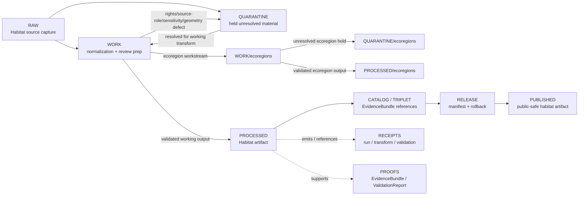

<!-- [KFM_META_BLOCK_V2]
doc_id: kfm://data/work/habitat/readme
title: Habitat WORK README
type: data-work-domain-index-readme
version: v0.1.0
status: draft
owners:
  - <habitat-domain-steward>
  - <ecology-data-steward>
  - <land-cover-steward>
  - <habitat-source-steward>
  - <rights-reviewer>
  - <sensitivity-reviewer>
  - <pipeline-steward>
  - <release-steward>
created: 2026-06-29
updated: 2026-06-29
policy_label: restricted-review
truth_posture: cite-or-abstain
lifecycle_phase: work
responsibility_root: data/
domain: habitat
artifact_family: habitat-working-normalization-lane
sensitivity_posture: fail-closed; no-public-path; join-induced-sensitivity; geoprivacy-required; source-role-preservation-required; release-blocked
related:
  - ecoregions/README.md
  - ../README.md
  - ../../README.md
  - ../../raw/habitat/README.md
  - ../../raw/habitat/ecoregions/README.md
  - ../../raw/habitat/gap-landfire/README.md
  - ../../raw/habitat/kdwp/README.md
  - ../../raw/habitat/natureserve/README.md
  - ../../raw/habitat/nlcd/README.md
  - ../../raw/habitat/nwi/README.md
  - ../../raw/habitat/occurrence-context/README.md
  - ../../raw/habitat/pad-us/README.md
  - ../../raw/habitat/usfws-ecos/README.md
  - ../../quarantine/habitat/README.md
  - ../../quarantine/habitat/ecoregions/README.md
  - ../../quarantine/habitat/land_cover/README.md
  - ../../quarantine/habitat/over_precise_geometry/README.md
  - ../../processed/habitat/README.md
  - ../../processed/habitat/ecoregions/README.md
  - ../../processed/habitat/land_cover/README.md
  - ../../processed/habitat/land_cover/change/README.md
  - ../../processed/habitat/land_cover/uncertainty/README.md
  - ../../catalog/domain/habitat/README.md
  - ../../published/layers/habitat/README.md
  - ../../proofs/README.md
  - ../../receipts/README.md
  - ../../registry/sources/habitat/README.md
  - ../../../docs/domains/habitat/README.md
  - ../../../docs/domains/habitat/DATA_LIFECYCLE.md
  - ../../../docs/domains/habitat/SENSITIVITY.md
  - ../../../docs/domains/habitat/SOURCE_REGISTRY.md
  - ../../../docs/domains/habitat/SOURCE_FAMILIES.md
  - ../../../docs/domains/habitat/SOURCES.md
  - ../../../docs/domains/habitat/POLICY.md
  - ../../../docs/domains/habitat/API_CONTRACTS.md
  - ../../../docs/domains/habitat/REASON_CODES.md
  - ../../../docs/domains/habitat/sublanes/ecoregions.md
  - ../../../docs/domains/habitat/sublanes/land_cover.md
  - ../../../release/manifests/README.md
tags:
  - kfm
  - data
  - work
  - habitat
  - landscape-context
  - ecoregions
  - land-cover
  - ecological-systems
  - habitat-patches
  - suitability
  - connectivity
  - corridors
  - restoration-opportunity
  - stewardship-zones
  - uncertainty
  - source-role
  - sensitive-joins
  - geoprivacy
  - no-public-path
  - evidence-first
notes:
  - "This README replaces the greenfield stub at `data/work/habitat/README.md`."
  - "Confirmed child WORK README lane during this edit: `ecoregions/`. Other Habitat WORK child lanes remain proposed unless matching README paths are verified."
  - "WORK is a governed intermediate lifecycle lane between RAW/QUARANTINE and PROCESSED; it is not proof, catalog, registry, policy, release, public API/UI output, public map/tile output, ecological/legal advice, restoration prescription, operational land-management guidance, or generated-answer authority."
  - "Habitat WORK must preserve source role, rights, sensitivity posture, landscape/object-family distinction, temporal semantics, geometry/support, class scheme, model/uncertainty state, evidence linkage, validation state, correction path, and rollback context before any downstream move."
  - "Habitat sensitivity is often join-induced; low-risk source layers can produce restricted or denied outputs when combined with Fauna, Flora, archaeology, stewardship, private-land, agriculture, infrastructure, hydrology, soil, hazards, or people/land context."
  - "README/path presence confirms documentation or path evidence only; it does not prove payloads, schemas, validators, receipts, access controls, CI enforcement, source descriptors, connector activation, or release readiness."
[/KFM_META_BLOCK_V2] -->

<a id="top"></a>

# Habitat WORK

Governed working lane for Habitat normalization, source-role reconciliation, geometry and raster repair, class-scheme/crosswalk preparation, geoprivacy and sensitive-join review, model/uncertainty preparation, validation preparation, and downstream-ready shaping before processed artifacts, catalog records, triplets, releases, public layers, PMTiles, COGs, reports, stories, or public-safe derivatives exist.

<p>
  
  
  
  
  
  
</p>

**Quick links:** [Scope](#scope) · [Repo fit](#repo-fit) · [Lifecycle boundary](#lifecycle-boundary) · [Confirmed child lanes](#confirmed-child-lanes) · [Proposed work lanes](#proposed-work-lanes) · [Accepted inputs](#accepted-inputs) · [Exclusions](#exclusions) · [Habitat working rules](#habitat-working-rules) · [Directory map](#directory-map) · [Exit gates](#exit-gates) · [Forbidden shortcuts](#forbidden-shortcuts) · [Required checks](#required-checks-before-use) · [Status notes](#status-notes)

> [!CAUTION]
> `data/work/habitat/` is a no-public-path working lane. It is not public, not processed truth, not catalog truth, not proof, not receipt authority, not source registry authority, not rights authority, not sensitivity policy authority, not release authority, not habitat truth, not species occurrence truth, not rare-plant truth, not habitat-patch truth, not suitability truth, not stewardship-zone truth, not public map/API/UI output, and not an AI-answer source. Public clients, normal UI surfaces, map layers, PMTiles, COGs, reports, stories, graph/vector indexes, search indexes, and generated answers must not read this lane directly.

---

## Scope

`data/work/habitat/` holds in-progress Habitat material after RAW source admission or quarantine return, while stewards and pipelines prepare it for normalization, validation, source-role reconciliation, rights review, geometry/CRS/raster repair, class-scheme and crosswalk handling, geoprivacy, redaction/generalization, aggregation, model/uncertainty preparation, sensitive-join review, catalog readiness, or processed-stage promotion.

WORK exists for **controlled transformation and review preparation**. It may contain intermediate tables, vectors, rasters, COGs-in-preparation, geodatabases-in-preparation, geometry repair drafts, raster warps, class reclassification drafts, crosswalk drafts, land-cover change comparison drafts, uncertainty-surface drafts, habitat-patch candidate outputs, suitability-model support drafts, corridor/connectivity drafts, stewardship-zone candidates, restoration-opportunity candidates, source-quality notes, QA outputs, and run-local sidecars when those artifacts are not yet validated processed objects, catalog records, proofs, receipts, release decisions, published products, or public-safe claims.

Habitat owns landscape and habitat context, not species records. Fauna owns animal occurrence truth; Flora owns plant/specimen/rare-plant truth; Soil, Hydrology, Agriculture, Hazards, Archaeology, and People/Land keep their own truth. Habitat WORK may prepare governed joins, but it must not collapse cross-domain truth into Habitat convenience fields.

---

## Repo fit

| Field | Value |
|---|---|
| Path | `data/work/habitat/` |
| Responsibility root | `data/` |
| Lifecycle phase | `work/` |
| Domain lane | `habitat` |
| Artifact role | Working normalization, source-role review, geometry/raster/class repair, sensitive-join review, model/uncertainty preparation, QA, and validation-preparation lane |
| Public access posture | No public path; no normal UI; no governed-public API exposure |
| Upstream | `data/raw/habitat/` after source admission, or `data/quarantine/habitat/` after governed hold resolution |
| Downstream | `data/quarantine/habitat/` for unresolved holds, or `data/processed/habitat/` after work-stage gates close |
| Confirmed child WORK lane | `ecoregions/` |
| Release authority | `release/`, not this directory |
| Proof authority | `data/proofs/`, not this directory |
| Receipt authority | `data/receipts/`, not this directory |
| Registry authority | `data/registry/`, not this directory |
| Policy authority | `policy/`, not this directory |
| Default failure posture | `HOLD`, `QUARANTINE`, `DENY`, `RESTRICT`, or `ABSTAIN` when source role, rights, source family, geometry/support, class scheme, crosswalk, raster validity, model basis, uncertainty, sensitive join, evidence, review, correction, rollback, access basis, or release support is insufficient |

---

## Lifecycle boundary

```text
RAW -> WORK / QUARANTINE -> PROCESSED -> CATALOG / TRIPLET -> PUBLISHED
```



WORK may support later processing, restricted review, public-safe derivative preparation, model/uncertainty handling, and evidence assembly, but it does not bypass quarantine, processed validation, proof construction, source-role review, rights review, geoprivacy review, policy review, release, correction, or rollback requirements.

---

## Confirmed child lanes

The child lanes below are README paths confirmed by current-session GitHub fetches or edits. This table confirms README/path evidence only; it does **not** prove payloads, SourceDescriptors, connectors, validators, fixtures, receipts, access controls, CI checks, review completion, or release readiness.

| Child lane | Status | Boundary summary |
|---|---|---|
| [`ecoregions/`](ecoregions/README.md) | **CONFIRMED README** | Working normalization, geometry/CRS repair, source-role review, crosswalk preparation, sensitive-join review, and validation-preparation lane for Habitat ecoregion and ecological-regionalization material. |

---

## Proposed work lanes

The work lanes below are planning targets implied by RAW, QUARANTINE, PROCESSED, and Habitat doctrine patterns. Treat them as **PROPOSED / NEEDS VERIFICATION** until README paths, payload policy, schemas, validators, fixtures, receipts, and CI enforcement are verified.

| Proposed lane | Purpose | Hard boundary |
|---|---|---|
| `land_cover/` | Working normalization, raster/vector repair, class-scheme review, and land-cover observation preparation. | Land cover is not suitability, crop truth, soil truth, hydrology truth, hazard truth, or regulatory truth by itself. |
| `land_cover/change/` | Working temporal comparison, change-window preparation, and transition review. | Change is not impact, cause, land-use/legal status, restoration prescription, or hazard claim by itself. |
| `land_cover/uncertainty/` | Working uncertainty, confidence, accuracy, mask, and error-matrix preparation. | Uncertainty qualifies interpretation; it is not proof or release authority. |
| `patches/` | Working habitat-patch candidate delineation and geometry review. | Habitat patches are not species occurrence or regulatory critical-habitat designations by themselves. |
| `ecological_systems/` | Working ecological-system classifications and crosswalks. | Modeled/compiled classifications are not regulatory determinations. |
| `quality/` | Working habitat-quality score inputs and uncertainty handling. | Scores are not management decisions or legal/ecological proof without evidence and release. |
| `suitability/` | Working suitability model support and candidate outputs. | Suitability is model context, not occurrence truth or public guidance by itself. |
| `connectivity/` | Working connectivity edges, corridors, and model support. | Connectivity candidates are not legal corridors, land-access rights, or management prescriptions. |
| `restoration_opportunity/` | Working restoration-opportunity candidate preparation. | Restoration opportunity is not a prescription, funding decision, or land-management instruction. |
| `stewardship_zones/` | Working stewardship-zone context and rights/sensitivity review. | Stewardship context can be rights-sensitive and must not become access/ownership truth. |

---

## Accepted inputs

Accepted material is limited to intermediate, non-public working artifacts such as:

- source-normalization drafts derived from admitted Habitat RAW captures;
- working tables, vectors, rasters, geometry drafts, COGs-in-preparation, PMTiles-in-preparation, geodatabases-in-preparation, raster warps, geometry repair outputs, and QA artifacts;
- class-scheme review notes, crosswalk drafts, source-vintage notes, valid-time/retrieval-time notes, classification dictionaries, and attribute allowlist drafts;
- ecoregion, ecological-system, land-cover, land-cover-change, uncertainty, habitat-patch, suitability, connectivity, corridor, restoration-opportunity, and stewardship-zone working candidates that remain clearly labeled as working/candidate class;
- geoprivacy, redaction, generalization, aggregation, clipping, masking, withholding, representation, small-cell, and delayed-publication preparation artifacts that still need receipts and review before downstream use;
- source-role, rights, sensitivity, geometry/support, class scheme, crosswalk, raster validity, model basis, uncertainty, evidence, citation, attribution, review, and validation notes used to decide whether material returns to quarantine or proceeds to processed;
- sensitive-join review outputs involving Fauna, Flora, rare species, rare plants, archaeology, private land, agriculture operations, infrastructure, hydrology, soil, hazards, or people/land context;
- run-local manifests, logs, checksums, and sidecars used to understand a working transform when they are not authoritative receipts, proofs, registries, schemas, policy rules, or release records;
- README or index sidecars that explain local work state without becoming public, proof, catalog, registry, policy, access authority, release authority, ecological/legal advice, land-management instruction, or generated-answer authority.

> [!IMPORTANT]
> Working artifacts must keep source role visible. Observed, regulatory, modeled, aggregate, administrative, candidate, synthetic, context, and interpretation material must not be flattened into the same authority class for convenience.

---

## Exclusions

| Do not place here | Correct authority home |
|---|---|
| Immutable Habitat source capture, source-native files, source rasters/vectors, source geodatabases, agency/steward exports, source media, source logs, original pixels/classes/geometry, and original source identifiers | `data/raw/habitat/` |
| Rights-unclear, source-role-unclear, malformed, disputed, unsafe, sensitive-join unresolved, over-precise geometry, geometry/raster/time/class failures, or not-yet-reviewed material | `data/quarantine/habitat/` |
| Ecoregion-specific working material | `data/work/habitat/ecoregions/` |
| Validated normalized Habitat outputs | `data/processed/habitat/` |
| Validated ecoregion processed outputs | `data/processed/habitat/ecoregions/` |
| Validated land-cover processed outputs | `data/processed/habitat/land_cover/` and child lanes where accepted |
| Public-safe published layers, PMTiles, COGs, reports, stories, API payloads, downloads, or public artifacts | `data/published/` only after release gates close |
| Catalog records, STAC/DCAT/PROV records, triplets, graph records, or EvidenceBundle state | `data/catalog/`, `data/triplets/`, or proof lanes |
| EvidenceBundle, ProofPack, validation report, or claim-proof authority | `data/proofs/` |
| Final `RunReceipt`, `TransformReceipt`, `ValidationReceipt`, `RedactionReceipt`, `AggregationReceipt`, `ModelRunReceipt`, representation receipt, `ReviewRecord`, `PolicyDecision`, rights-review receipt, source-role-review receipt, correction receipt, or release receipt records | `data/receipts/` or accepted review/receipt lanes |
| SourceDescriptor, source activation, source registry, rights registry, sensitivity registry, or access registry records | `data/registry/` or accepted registry lanes |
| Release manifests, correction notices, withdrawal notices, signatures, rollback cards, release decisions, or release candidates | `release/` |
| Schemas, contracts, validators, tests, packages, pipelines, pipeline specs, app/UI/API code, or policy rules | `schemas/`, `contracts/`, `tools/`, `tests/`, `pipelines/`, `pipeline_specs/`, `apps/`, `policy/` |
| Species occurrence records, plant specimen records, rare-species/rare-plant location records, soil map unit truth, hydrology measurement truth, hazard event truth, agriculture field truth, archaeology site truth, infrastructure truth, or land/ownership truth | Owning domain lanes, not Habitat WORK |
| Habitat suitability scores, regulatory critical-habitat determinations, restoration prescriptions, management decisions, corridor/connectivity claims, or ecological condition claims as final authority | Separate object contracts, evidence, validation, policy, and release state required; not this WORK lane by itself |
| Public API/UI/tile payloads, direct downloads, Focus Mode answers, public map layers, landowner/parcel targeting aids, ecological/legal advice, operational land-management guidance, emergency alerts, or life-safety guidance | Governed public/release/authority surfaces only; otherwise abstain or deny |
| Secrets, credentials, access tokens, private agreement terms, exact transform seeds, fuzzing offsets, redaction bypass details, sensitive join keys, or exposure-enabling implementation details | Do not store in this README or ordinary working Markdown |

---

## Habitat working rules

| Rule | Handling |
|---|---|
| Keep WORK non-public | Nothing here is a public surface, public-candidate artifact, map tile, PMTiles/COG output, or normal UI/API source. |
| Preserve source role | Observed, regulatory, modeled, aggregate, administrative, candidate, synthetic, context, and interpretation records stay distinct. |
| Preserve native classifications | Cowardin, NLCD, GAP/LANDFIRE, ecological-system, ecoregion, stewardship, and provider classes stay visible before crosswalk. |
| Preserve geometry/raster lineage | CRS, pixel alignment, resolution, nodata, valid mask, raster validity, topology repair, simplification, clipping, and area drift remain explicit. |
| Keep context as context | Habitat context does not become species occurrence truth, plant truth, critical-habitat truth, suitability truth, crop truth, soil truth, hydrology truth, hazard truth, or land ownership truth. |
| Keep sensitive joins visible | Joins to Fauna, Flora, rare species, rare plants, archaeology, private land, agriculture operations, infrastructure, hydrology, soil, hazards, or people/land fail closed until reviewed. |
| Do not launder quarantine | Material cannot leave quarantine through WORK unless the hold reason is explicitly resolved and recorded. |
| Do not launder into public | WORK cannot become public or published material without governed redaction/generalization/aggregation/representation, review, policy, receipts, release, correction, and rollback support. |
| Separate review from transformation | A geometry repair, reclassification draft, model run, crosswalk draft, tiling draft, or attribute allowlist trial does not equal reviewer approval, policy decision, receipt closure, release approval, or public permission. |
| Preserve rollback context | Working outputs intended for downstream use should keep enough run and source context to support correction, withdrawal, and rollback later. |

---

## Directory map

```text
data/work/habitat/
├── README.md
├── ecoregions/
│   └── README.md
├── <future-workstream-or-source-family>/
│   └── <run_id_or_batch_id>/
│       ├── work_manifest.json
│       ├── input_refs.json
│       ├── transform_notes.md
│       ├── qa_notes.md
│       ├── checksums.sha256
│       └── README.md
└── index.local.json
```

`index.local.json` is optional and must remain WORK-local. It is not a public index, catalog record, release manifest, source registry, review record, graph edge source, layer/story/report pointer, search index, vector index, map source, tile source, habitat-truth index, suitability authority, regulatory authority, access registry, or retrieval source for generated answers.

> [!NOTE]
> The directory map confirms the parent README and `ecoregions/README.md` path only. Future workstream folders are proposed patterns and do not prove payloads, schemas, validators, fixtures, workflows, receipts, access controls, or CI checks exist.

---

## Exit gates

| Exit route | Minimum requirement |
|---|---|
| Stay WORK | Normalization, QA, source-role reconciliation, rights review, geometry/raster/class repair, crosswalk review, attribute allowlisting, model/uncertainty preparation, sensitive-join review, evidence-bundle preparation, validation preparation, or correction planning remains incomplete. |
| Move to child WORK lane | Material has a defined workstream such as `ecoregions/` and still remains non-public working material. |
| Quarantine | Source role, rights, source family, geometry/support, CRS, class scheme, crosswalk, raster validity, model basis, uncertainty, sensitive join, schema, citation, digest, policy, review, evidence, correction, or rollback state is unresolved enough that work should stop. |
| Reject / return | Steward review says the material is misfiled, unsupported, not retainable, or outside the Habitat work lane. |
| Promote to PROCESSED | Working artifact has sufficient lineage, source-role preservation, landscape/object-family distinction, geometry/raster/class validation, rights posture, sensitive-join review where applicable, review state, correction path, rollback context, and downstream-ready metadata. |
| Prepare public-safe derivative | Only a transformed derivative, not unresolved source or sensitive-join material, may move toward public-safe processed/catalog/published paths after redaction/generalization/aggregation/representation, review, policy, receipt, correction, and rollback requirements are satisfied. |
| Support catalog/release later | Only after later PROCESSED, CATALOG/TRIPLET, proof, receipt, review, policy, release, correction, and rollback gates close. |

A more public tier requires validation, redaction/generalization/aggregation/representation support, evidence support, review record, policy decision, release manifest, correction path, and rollback target. A more restrictive correction can happen immediately when risk is discovered.

---

## Forbidden shortcuts

```text
data/work/habitat/
→ data/catalog/
→ data/published/
→ public API / MapLibre / PMTiles / COG / report / story / graph / vector index / generated answer
```

is forbidden unless the appropriate governed lifecycle transitions have actually happened and left inspectable evidence.

```text
data/work/habitat/
→ data/processed/habitat/
```

is also forbidden for rights-unresolved material, source-role collapse, geometry/CRS/raster/class defects, crosswalk defects, attribute-allowlist failures, sensitive joins, over-precise geometry, disputed classifications, and unresolved evidence/sensitivity/source-role material. Route unresolved material to quarantine instead.

---

## Required checks before use

- [ ] Confirm the material belongs to the Habitat domain lane.
- [ ] Confirm the material belongs in WORK rather than RAW, QUARANTINE, PROCESSED, CATALOG, PROOF, RECEIPT, REGISTRY, RELEASE, PUBLISHED, SCHEMA, POLICY, CODE, PIPELINE, or TEST roots.
- [ ] Confirm whether the material belongs in a child lane such as `ecoregions/`.
- [ ] Confirm source reference, source family, source role, citation, rights posture, retrieval/admission context, source version/vintage, and digest where material.
- [ ] Confirm native classifications, source labels, provider classes, class scheme, crosswalk state, confidence, and uncertainty where applicable.
- [ ] Confirm geometry validity, CRS provenance, raster validity, resolution, nodata, mask state, reprojection method, make-valid behavior, simplification method, area drift, topology repair, and boundary version where applicable.
- [ ] Confirm observed, regulatory, modeled, aggregate, administrative, candidate, synthetic, context, and interpretation material are not collapsed into one authority class.
- [ ] Confirm Habitat material is not being treated as species occurrence truth, plant/specimen truth, regulatory critical-habitat truth, suitability truth, crop truth, soil truth, hydrology truth, hazard truth, archaeology truth, infrastructure truth, or land ownership truth.
- [ ] Confirm joins to Fauna, Flora, rare species, rare plants, archaeology, private land, agriculture operations, infrastructure, hydrology, soil, hazards, or people/land preserve the owning domain authority and fail closed when sensitive.
- [ ] Confirm attribute allowlists remove internal QA notes, sensitive fields, source-only fields, private terms, access notes, and unresolved join fields before downstream public-safe preparation.
- [ ] Confirm no quarantined material is being laundered through WORK without an exit decision.
- [ ] Confirm prompt-like text inside source payloads or notes is treated as data, not instructions.
- [ ] Confirm no exact transform offsets, restricted representation seeds, redaction bypass details, access credentials, secrets, private agreement terms, sensitive join keys, or exposure-enabling details are written into this README.
- [ ] Confirm required downstream receipts are present or explicitly marked missing before anything leaves WORK.
- [ ] Confirm no public layer, PMTiles, COG, report, story, API payload, graph edge, search index, vector index, or generated answer uses WORK material directly.
- [ ] Confirm correction path and rollback target are known before downstream promotion.

---

## Status notes

| Claim | Status |
|---|---|
| This README replaces the greenfield stub at `data/work/habitat/README.md`. | **CONFIRMED authored** |
| The target path existed in the live repository as a greenfield stub before this edit. | **CONFIRMED by GitHub contents API during this edit** |
| `ecoregions/README.md` exists as a Habitat ecoregions WORK child-lane README. | **CONFIRMED by GitHub contents API during this edit** |
| `data/raw/habitat/README.md` documents upstream Habitat RAW source capture, no-public-path posture, confirmed source-family lanes, source-role preservation, native classification preservation, and sensitive-join fail-closed posture. | **CONFIRMED by GitHub contents API during this edit** |
| `data/quarantine/habitat/README.md` documents Habitat quarantine as a fail-closed no-public-path hold lane for unresolved rights, source role, sensitivity, geoprivacy, geometry precision, evidence, validation, review, and policy questions. | **CONFIRMED by GitHub contents API during this edit** |
| `data/processed/habitat/README.md` documents the downstream Habitat processed lane and public-use restrictions. | **CONFIRMED by GitHub contents API during this edit** |
| Actual WORK payloads or additional child README lanes exist under `data/work/habitat/`. | **UNKNOWN** |
| Habitat WORK schemas, validators, fixtures, CI checks, receipts, access controls, review workflow, and release linkage are fully implemented. | **NEEDS VERIFICATION** |
| This README is proof, release, catalog, registry, policy, habitat truth, species occurrence truth, rare-plant truth, habitat-patch truth, suitability truth, stewardship-zone truth, public artifact authority, or AI authority. | **DENY** |

---

## Related files

- [`ecoregions/README.md`](ecoregions/README.md)
- [`../README.md`](../README.md)
- [`../../README.md`](../../README.md)
- [`../../raw/habitat/README.md`](../../raw/habitat/README.md)
- [`../../raw/habitat/ecoregions/README.md`](../../raw/habitat/ecoregions/README.md)
- [`../../raw/habitat/gap-landfire/README.md`](../../raw/habitat/gap-landfire/README.md)
- [`../../raw/habitat/kdwp/README.md`](../../raw/habitat/kdwp/README.md)
- [`../../raw/habitat/natureserve/README.md`](../../raw/habitat/natureserve/README.md)
- [`../../raw/habitat/nlcd/README.md`](../../raw/habitat/nlcd/README.md)
- [`../../raw/habitat/nwi/README.md`](../../raw/habitat/nwi/README.md)
- [`../../raw/habitat/occurrence-context/README.md`](../../raw/habitat/occurrence-context/README.md)
- [`../../raw/habitat/pad-us/README.md`](../../raw/habitat/pad-us/README.md)
- [`../../raw/habitat/usfws-ecos/README.md`](../../raw/habitat/usfws-ecos/README.md)
- [`../../quarantine/habitat/README.md`](../../quarantine/habitat/README.md)
- [`../../quarantine/habitat/ecoregions/README.md`](../../quarantine/habitat/ecoregions/README.md)
- [`../../quarantine/habitat/land_cover/README.md`](../../quarantine/habitat/land_cover/README.md)
- [`../../quarantine/habitat/over_precise_geometry/README.md`](../../quarantine/habitat/over_precise_geometry/README.md)
- [`../../processed/habitat/README.md`](../../processed/habitat/README.md)
- [`../../processed/habitat/ecoregions/README.md`](../../processed/habitat/ecoregions/README.md)
- [`../../processed/habitat/land_cover/README.md`](../../processed/habitat/land_cover/README.md)
- [`../../processed/habitat/land_cover/change/README.md`](../../processed/habitat/land_cover/change/README.md)
- [`../../processed/habitat/land_cover/uncertainty/README.md`](../../processed/habitat/land_cover/uncertainty/README.md)
- [`../../catalog/domain/habitat/README.md`](../../catalog/domain/habitat/README.md)
- [`../../published/layers/habitat/README.md`](../../published/layers/habitat/README.md)
- [`../../proofs/README.md`](../../proofs/README.md)
- [`../../receipts/README.md`](../../receipts/README.md)
- [`../../registry/sources/habitat/README.md`](../../registry/sources/habitat/README.md)
- [`../../../docs/domains/habitat/README.md`](../../../docs/domains/habitat/README.md)
- [`../../../docs/domains/habitat/DATA_LIFECYCLE.md`](../../../docs/domains/habitat/DATA_LIFECYCLE.md)
- [`../../../docs/domains/habitat/SENSITIVITY.md`](../../../docs/domains/habitat/SENSITIVITY.md)
- [`../../../docs/domains/habitat/SOURCE_REGISTRY.md`](../../../docs/domains/habitat/SOURCE_REGISTRY.md)
- [`../../../docs/domains/habitat/SOURCE_FAMILIES.md`](../../../docs/domains/habitat/SOURCE_FAMILIES.md)
- [`../../../docs/domains/habitat/SOURCES.md`](../../../docs/domains/habitat/SOURCES.md)
- [`../../../docs/domains/habitat/POLICY.md`](../../../docs/domains/habitat/POLICY.md)
- [`../../../docs/domains/habitat/API_CONTRACTS.md`](../../../docs/domains/habitat/API_CONTRACTS.md)
- [`../../../docs/domains/habitat/REASON_CODES.md`](../../../docs/domains/habitat/REASON_CODES.md)
- [`../../../docs/domains/habitat/sublanes/ecoregions.md`](../../../docs/domains/habitat/sublanes/ecoregions.md)
- [`../../../docs/domains/habitat/sublanes/land_cover.md`](../../../docs/domains/habitat/sublanes/land_cover.md)
- [`../../../release/manifests/README.md`](../../../release/manifests/README.md)

---

## Maintenance checklist

- [ ] Replace placeholder owners with confirmed steward roles.
- [ ] Confirm whether additional Habitat WORK child lanes exist and add them to the directory map only after verification.
- [ ] Confirm Habitat WORK schemas, validators, and fixture expectations.
- [ ] Confirm required receipt family names and storage homes for WORK-to-PROCESSED promotion.
- [ ] Confirm source-role review, rights review, geometry/CRS/raster validation, crosswalk review, attribute allowlisting, sensitive-join review, model/uncertainty handling, evidence-bundle closure, and validation linkage.
- [ ] Confirm `ecoregions/README.md` remains synchronized with this parent lane.
- [ ] Confirm all relative links after adjacent docs stabilize.
- [ ] Confirm rollback target for this README expansion in the commit or release notes.

[Back to top](#top)
