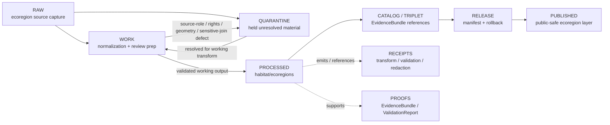

<!-- [KFM_META_BLOCK_V2]
doc_id: kfm://data/work/habitat/ecoregions/readme
title: Habitat Ecoregions WORK README
type: data-work-sublane-readme
version: v0.1.0
status: draft
owners:
  - <habitat-domain-steward>
  - <ecoregions-sublane-steward>
  - <ecology-data-steward>
  - <habitat-source-steward>
  - <rights-reviewer>
  - <sensitivity-reviewer>
  - <pipeline-steward>
  - <release-steward>
created: 2026-06-29
updated: 2026-06-29
policy_label: restricted-review
truth_posture: cite-or-abstain
lifecycle_phase: work
responsibility_root: data/
domain: habitat
sublane: ecoregions
source_family: ecoregions
artifact_family: habitat-ecoregions-working-normalization-lane
sensitivity_posture: fail-closed; no-public-path; ecoregions-are-context-not-occurrence-truth; sensitive-joins-deny-by-default; source-role-preservation-required; release-blocked
related:
  - ../README.md
  - ../../README.md
  - ../../../README.md
  - ../../../raw/habitat/ecoregions/README.md
  - ../../../quarantine/habitat/ecoregions/README.md
  - ../../../processed/habitat/ecoregions/README.md
  - ../../../catalog/domain/habitat/ecoregions/README.md
  - ../../../published/layers/habitat/ecoregions/README.md
  - ../../../proofs/README.md
  - ../../../receipts/README.md
  - ../../../registry/sources/habitat/README.md
  - ../../../../docs/domains/habitat/README.md
  - ../../../../docs/domains/habitat/sublanes/ecoregions.md
  - ../../../../docs/domains/habitat/SOURCE_REGISTRY.md
  - ../../../../docs/domains/habitat/SOURCE_FAMILIES.md
  - ../../../../docs/domains/habitat/SOURCES.md
  - ../../../../docs/domains/habitat/SENSITIVITY.md
  - ../../../../docs/domains/habitat/POLICY.md
  - ../../../../docs/domains/habitat/API_CONTRACTS.md
  - ../../../../docs/architecture/source-roles.md
  - ../../../../release/manifests/README.md
tags:
  - kfm
  - data
  - work
  - habitat
  - ecoregions
  - ecological-regions
  - ecological-systems
  - landscape-context
  - regionalization
  - source-role
  - crosswalks
  - geometry-repair
  - sensitive-joins
  - no-public-path
  - evidence-first
notes:
  - "This README expands the blank placeholder at `data/work/habitat/ecoregions/README.md`."
  - "Parent `data/work/habitat/README.md` is currently a greenfield stub, so this child file stays sublane-bounded."
  - "Ecoregions are regionalization and landscape-context fabric, not species occurrence truth, habitat patch truth, regulatory critical-habitat truth, suitability truth, restoration priority, or release authority by themselves."
  - "WORK is a governed intermediate lifecycle lane between RAW/QUARANTINE and PROCESSED; it is not proof, catalog, registry, policy, release, public API/UI output, public map/tile output, or generated-answer authority."
  - "README/path presence confirms documentation or path evidence only; it does not prove payloads, schemas, validators, receipts, access controls, CI enforcement, source descriptors, connector activation, or release readiness."
[/KFM_META_BLOCK_V2] -->

<a id="top"></a>

# Habitat Ecoregions WORK

Governed working lane for Habitat ecoregion and ecological-regionalization normalization, geometry repair, CRS handling, classification crosswalks, source-role review, sensitive-join review, validation preparation, and downstream-ready shaping before processed ecoregion artifacts, catalog records, triplets, releases, public layers, PMTiles, or public-safe derivatives exist.

<p>
  
  
  
  
  
  
</p>

**Quick links:** [Scope](#scope) · [Repo fit](#repo-fit) · [Lifecycle boundary](#lifecycle-boundary) · [Confirmed child lanes](#confirmed-child-lanes) · [Accepted inputs](#accepted-inputs) · [Exclusions](#exclusions) · [Ecoregion working rules](#ecoregion-working-rules) · [Directory map](#directory-map) · [Exit gates](#exit-gates) · [Forbidden shortcuts](#forbidden-shortcuts) · [Required checks](#required-checks-before-use) · [Status notes](#status-notes)

> [!CAUTION]
> `data/work/habitat/ecoregions/` is a no-public-path WORK sublane. It is not public, not processed truth, not catalog truth, not proof, not receipt authority, not source registry authority, not rights authority, not sensitivity policy authority, not release authority, not occurrence truth, not habitat-patch truth, not regulatory critical-habitat truth, not suitability truth, not restoration priority, not public map/API/UI output, and not an AI-answer source. Public clients, normal UI surfaces, map layers, PMTiles, reports, stories, graph/vector indexes, search indexes, and generated answers must not read this lane directly.

---

## Scope

`data/work/habitat/ecoregions/` holds in-progress Habitat ecoregion and ecological-regionalization material after RAW source admission or quarantine return, while stewards and pipelines prepare it for source-role reconciliation, rights review, geometry validation, CRS normalization, classification crosswalks, attribute allowlisting, sensitive-join review, validation, catalog readiness, or processed-stage promotion.

WORK exists for **controlled transformation and review preparation**. It may contain intermediate tables, vectors, rasters, geodatabases-in-preparation, geometry repair drafts, reprojection outputs, make-valid outputs, simplification trials, boundary matching drafts, area-drift checks, classification hierarchy reviews, EPA/Bailey/NatureServe/USNVC/GAP/LANDFIRE/NLCD/NWI crosswalk drafts, attribute allowlist checks, sensitive-join review notes, QA outputs, and run-local sidecars when those artifacts are not yet validated processed objects, catalog records, proofs, receipts, release decisions, published products, or public-safe claims.

Ecoregions are context fabric. They can support habitat stratification, ecological interpretation, regional summaries, and map context, but they do not prove species occurrence, habitat patch condition, regulatory critical habitat, suitability, ecological condition, restoration priority, or management action by themselves.

---

## Repo fit

| Field | Value |
|---|---|
| Path | `data/work/habitat/ecoregions/` |
| Responsibility root | `data/` |
| Lifecycle phase | `work/` |
| Domain lane | `habitat` |
| Sublane | `ecoregions` |
| Source family | `ecoregions` |
| Artifact role | Working normalization, geometry/CRS repair, source-role review, crosswalk preparation, sensitive-join review, and validation-preparation lane |
| Public access posture | No public path; no normal UI; no governed-public API exposure |
| Upstream | `data/raw/habitat/ecoregions/` after source admission, or `data/quarantine/habitat/ecoregions/` after governed hold resolution |
| Downstream | `data/quarantine/habitat/ecoregions/` for unresolved holds, or `data/processed/habitat/ecoregions/` after work-stage gates close |
| Parent work lane | `data/work/habitat/`, currently greenfield-stub depth as of this edit |
| Release authority | `release/`, not this directory |
| Proof authority | `data/proofs/`, not this directory |
| Receipt authority | `data/receipts/`, not this directory |
| Registry authority | `data/registry/`, not this directory |
| Policy authority | `policy/`, not this directory |
| Default failure posture | `HOLD`, `QUARANTINE`, `DENY`, `RESTRICT`, or `ABSTAIN` when source role, rights, framework/version, geometry/support, CRS, crosswalk state, attribute allowlist, sensitive joins, evidence, review, correction, rollback, access basis, or release support is insufficient |

---

## Lifecycle boundary

```text
RAW -> WORK / QUARANTINE -> PROCESSED -> CATALOG / TRIPLET -> PUBLISHED
```



WORK may support later processing, public-safe derivative preparation, and evidence assembly, but it does not bypass quarantine, processed validation, proof construction, source-role review, rights review, sensitive-join review, policy review, release, correction, or rollback requirements.

---

## Confirmed child lanes

No child README lanes under `data/work/habitat/ecoregions/` were confirmed during this edit. This README is the sublane parent for future ecoregion workstreams.

| Child lane | Status | Boundary summary |
|---|---|---|
| `<none confirmed>` | **UNKNOWN** | Do not infer payloads, SourceDescriptors, connectors, validators, fixtures, receipts, access controls, CI checks, review completion, or release readiness from this README. |

> [!NOTE]
> Add Habitat ecoregion WORK child lanes only after confirming the source family, framework, source role, rights-review burden, geometry/CRS burden, crosswalk burden, sensitive-join burden, receipt expectations, reviewer roles, correction path, rollback target, and Directory Rules placement basis.

---

## Accepted inputs

Accepted material is limited to intermediate, non-public working artifacts such as:

- ecoregion source-normalization drafts derived from admitted RAW captures;
- working tables, vectors, rasters, geodatabases-in-preparation, geometry-repair drafts, reprojection outputs, make-valid outputs, simplification tests, tiling-preparation drafts, and QA artifacts;
- ecoregion framework, level, code, label, hierarchy, source URI, version/vintage, valid-time, retrieval-time, source-role, and attribution reconciliation notes;
- classification crosswalk drafts between ecoregion, ecological region, ecological system, land-cover, watershed, PLSS, or other landscape-context frameworks;
- attribute allowlist checks, public-field drafts, small-cell or sensitive-join review notes, and internal-field removal drafts;
- source-role review notes that prevent administrative/context material from being upcast into occurrence truth, habitat patch truth, suitability truth, critical-habitat truth, or management-action authority;
- sensitive-join review outputs involving Fauna, Flora, rare species, rare plants, archaeology, private land, agriculture operations, infrastructure, or other higher-sensitivity lanes;
- redaction, generalization, aggregation, withholding, representation, and delayed-publication preparation artifacts that still need receipts and review before downstream use;
- run-local manifests, logs, checksums, and sidecars used to understand a working transform when they are not authoritative receipts, proofs, registries, schemas, or release records;
- README or index sidecars that explain local work state without becoming public, proof, catalog, registry, policy, access authority, release authority, regulatory authority, occurrence authority, suitability authority, or generated-answer authority.

---

## Exclusions

| Do not place here | Correct authority home |
|---|---|
| Immutable ecoregion source capture, source-native files, source rasters, source geodatabases, agency/steward exports, source media, source logs, original geometry, and original source identifiers | `data/raw/habitat/ecoregions/` |
| Rights/source-role unresolved, geometry/CRS failing, crosswalk failing, sensitive-join unresolved, attribute-allowlist failing, evidence-open, malformed, disputed, unsafe, or not-yet-reviewed material | `data/quarantine/habitat/ecoregions/` |
| Ordinary parent Habitat WORK material not specific to ecoregions | `data/work/habitat/` or another documented Habitat work sublane |
| Validated normalized ecoregion outputs | `data/processed/habitat/ecoregions/` |
| Published public-safe ecoregion layers, PMTiles, reports, stories, API payloads, downloads, or public artifacts | `data/published/layers/habitat/ecoregions/` only after release gates close |
| Catalog records, STAC/DCAT/PROV records, triplets, graph records, or EvidenceBundle state | `data/catalog/`, `data/triplets/`, or proof lanes |
| EvidenceBundle, ProofPack, validation report, or claim-proof authority | `data/proofs/` |
| Final `RunReceipt`, `TransformReceipt`, `ValidationReceipt`, `RedactionReceipt`, `AggregationReceipt`, representation receipt, `ReviewRecord`, `PolicyDecision`, rights-review receipt, source-role-review receipt, correction receipt, or release receipt records | `data/receipts/` or accepted review/receipt lanes |
| SourceDescriptor, source activation, source registry, rights registry, sensitivity registry, or access registry records | `data/registry/` or accepted registry lanes |
| Release manifests, correction notices, withdrawal notices, signatures, rollback cards, release decisions, or release candidates | `release/` |
| Schemas, contracts, validators, tests, packages, pipelines, pipeline specs, app/UI/API code, or policy rules | `schemas/`, `contracts/`, `tools/`, `tests/`, `pipelines/`, `pipeline_specs/`, `apps/`, `policy/` |
| Species occurrence records, plant specimen records, rare-species/rare-plant location records, soil map unit truth, hydrology measurement truth, hazard event truth, agriculture field truth, archaeology site truth, or land/ownership truth | Owning domain lanes, not Habitat ecoregions |
| Habitat suitability scores, regulatory critical-habitat determinations, restoration prescriptions, management decisions, corridor/connectivity claims, or ecological condition claims | Separate object contracts, evidence, validation, policy, and release state required; not this WORK lane by itself |
| Public API/UI/tile payloads, direct downloads, Focus Mode answers, public map layers, landowner/parcel targeting aids, ecological/legal advice, operational land-management guidance, emergency alerts, or life-safety guidance | Governed public/release/authority surfaces only; otherwise abstain or deny |
| Secrets, credentials, access tokens, private agreement terms, exact transform seeds, fuzzing offsets, redaction bypass details, sensitive join keys, or exposure-enabling implementation details | Do not store in this README or ordinary working Markdown |

---

## Ecoregion working rules

| Rule | Handling |
|---|---|
| Keep WORK non-public | Nothing here is a public surface, public-candidate artifact, map tile, PMTiles output, or normal UI/API source. |
| Preserve source role | Observed, regulatory, modeled, aggregate, administrative, candidate, synthetic, context, and interpretation records stay distinct. |
| Preserve framework identity | EPA, Bailey, NatureServe/USNVC, GAP/LANDFIRE, NLCD, NWI, watershed, PLSS, and other frameworks keep their native IDs, labels, levels, source version, and citation. |
| Preserve geometry/CRS lineage | CRS provenance, reprojection method, make-valid behavior, simplification method, area drift, topology repair, and boundary version stay explicit. |
| Keep context as context | Ecoregions are landscape context fabric; they are not occurrence truth, habitat patch truth, regulatory truth, suitability truth, restoration truth, or management authority by themselves. |
| Keep sensitive joins visible | Joins to Fauna, Flora, rare species, rare plants, archaeology, private land, agriculture operations, infrastructure, or small cells fail closed until reviewed. |
| Do not launder quarantine | Material cannot leave quarantine through WORK unless the hold reason is explicitly resolved and recorded. |
| Do not launder into public | WORK cannot become public or published material without governed redaction/generalization/aggregation/representation, review, policy, receipts, release, correction, and rollback support. |
| Separate review from transformation | A geometry repair, crosswalk draft, tiling draft, or attribute allowlist trial does not equal reviewer approval, policy decision, receipt closure, release approval, or public permission. |
| Preserve rollback context | Working outputs intended for downstream use should keep enough run and source context to support correction, withdrawal, and rollback later. |

---

## Directory map

```text
data/work/habitat/ecoregions/
├── README.md
├── <future-workstream-or-source-family>/
│   └── <run_id_or_batch_id>/
│       ├── work_manifest.json
│       ├── input_refs.json
│       ├── transform_notes.md
│       ├── geometry_review.notes.md
│       ├── crosswalk_review.notes.md
│       ├── sensitivity_join_review.notes.md
│       ├── qa_notes.md
│       ├── checksums.sha256
│       └── README.md
└── index.local.json
```

`index.local.json` is optional and must remain WORK-local. It is not a public index, catalog record, release manifest, source registry, review record, graph edge source, layer/story/report pointer, search index, vector index, map source, tile source, ecoregion-truth index, suitability authority, regulatory authority, access registry, or retrieval source for generated answers.

> [!NOTE]
> The directory map confirms the sublane README path only. Future workstream folders are proposed patterns and do not prove payloads, schemas, validators, fixtures, workflows, receipts, access controls, or CI checks exist.

---

## Exit gates

| Exit route | Minimum requirement |
|---|---|
| Stay WORK | Normalization, QA, source-role reconciliation, rights review, geometry/CRS repair, crosswalk review, attribute allowlisting, sensitive-join review, evidence-bundle preparation, validation preparation, or correction planning remains incomplete. |
| Quarantine | Source role, rights, framework/version, geometry/support, CRS, crosswalk, attribute allowlist, sensitive join, schema, citation, digest, policy, review, evidence, correction, or rollback state is unresolved enough that work should stop. |
| Reject / return | Steward review says the material is misfiled, unsupported, not retainable, or outside the Habitat ecoregions work lane. |
| Promote to PROCESSED | Working artifact has sufficient lineage, source-role preservation, classification/framework identity, geometry/CRS validation, crosswalk closure where applicable, rights posture, sensitive-join review where applicable, review state, correction path, rollback context, and downstream-ready metadata. |
| Prepare public-safe derivative | Only a transformed derivative, not unresolved source or sensitive-join material, may move toward public-safe processed/catalog/published paths after redaction/generalization/aggregation/representation, review, policy, receipt, correction, and rollback requirements are satisfied. |
| Support catalog/release later | Only after later PROCESSED, CATALOG/TRIPLET, proof, receipt, review, policy, release, correction, and rollback gates close. |

A more public tier requires the required validation, redaction/generalization/aggregation/representation, evidence support, review record, policy decision, release manifest, correction path, and rollback target. A more restrictive correction can happen immediately when risk is discovered.

---

## Forbidden shortcuts

```text
data/work/habitat/ecoregions/
→ data/catalog/
→ data/published/layers/habitat/ecoregions/
→ public API / MapLibre / PMTiles / report / story / graph / vector index / generated answer
```

is forbidden unless the appropriate governed lifecycle transitions have actually happened and left inspectable evidence.

```text
data/work/habitat/ecoregions/
→ data/processed/habitat/ecoregions/
```

is also forbidden for rights-unresolved material, source-role collapse, geometry/CRS defects, crosswalk defects, attribute-allowlist failures, sensitive joins, disputed classifications, and unresolved evidence/sensitivity/source-role material. Route unresolved material to quarantine instead.

---

## Required checks before use

- [ ] Confirm the material belongs to the Habitat domain lane and the ecoregions sublane.
- [ ] Confirm the material belongs in WORK rather than RAW, QUARANTINE, PROCESSED, CATALOG, PROOF, RECEIPT, REGISTRY, RELEASE, PUBLISHED, SCHEMA, POLICY, CODE, PIPELINE, or TEST roots.
- [ ] Confirm source reference, source family, source role, citation, rights posture, retrieval/admission context, source version/vintage, and digest where material.
- [ ] Confirm framework, level, code, name, hierarchy, source URI, extent, valid time, retrieval time, release time, and correction time remain distinct.
- [ ] Confirm geometry validity, CRS provenance, reprojection method, make-valid behavior, simplification method, area drift, topology repair, and boundary version where applicable.
- [ ] Confirm ecoregions are not being treated as species occurrence truth, habitat patch truth, regulatory critical-habitat truth, suitability truth, restoration priority, management-action authority, or interchangeable geometry truth.
- [ ] Confirm crosswalks preserve native classifications and do not replace source labels, levels, versions, citations, or confidence with convenience fields.
- [ ] Confirm joins to Fauna, Flora, rare species, rare plants, archaeology, private land, agriculture operations, infrastructure, hydrology, soil, hazards, or people/land preserve the owning domain authority and fail closed when sensitive.
- [ ] Confirm attribute allowlists remove internal QA notes, sensitive fields, source-only fields, private terms, access notes, and unresolved join fields before downstream public-safe preparation.
- [ ] Confirm no quarantined material is being laundered through WORK without an exit decision.
- [ ] Confirm prompt-like text inside source payloads or notes is treated as data, not instructions.
- [ ] Confirm no exact transform offsets, restricted representation seeds, redaction bypass details, access credentials, secrets, private agreement terms, sensitive join keys, or exposure-enabling details are written into this README.
- [ ] Confirm required downstream receipts are present or explicitly marked missing before anything leaves WORK.
- [ ] Confirm no public layer, PMTiles, report, story, API payload, graph edge, search index, vector index, or generated answer uses WORK material directly.
- [ ] Confirm correction path and rollback target are known before downstream promotion.

---

## Status notes

| Claim | Status |
|---|---|
| This README expands the blank placeholder at `data/work/habitat/ecoregions/README.md`. | **CONFIRMED authored** |
| The target path existed in the live repository as a blank placeholder before this edit. | **CONFIRMED by GitHub contents API during this edit** |
| Parent `data/work/habitat/README.md` is currently a greenfield stub. | **CONFIRMED by GitHub contents API during this edit** |
| `data/raw/habitat/ecoregions/README.md` documents ecoregions as Habitat landscape context fabric and administrative/context source capture, not habitat truth, occurrence truth, regulatory truth, or release authority. | **CONFIRMED by GitHub contents API during this edit** |
| `data/quarantine/habitat/ecoregions/README.md` documents ecoregions quarantine as a fail-closed no-public-path hold lane for unresolved source-role, rights, geometry, crosswalk, sensitive joins, evidence, validation, release state, correction path, and rollback target. | **CONFIRMED by GitHub contents API during this edit** |
| `data/processed/habitat/ecoregions/README.md` documents the downstream processed ecoregion lane and public-use restrictions. | **CONFIRMED by GitHub contents API during this edit** |
| Actual WORK payloads or child README lanes exist under `data/work/habitat/ecoregions/`. | **UNKNOWN** |
| Habitat ecoregion WORK schemas, validators, fixtures, CI checks, receipts, access controls, review workflow, and release linkage are fully implemented. | **NEEDS VERIFICATION** |
| This README is proof, release, catalog, registry, policy, occurrence truth, habitat-patch truth, regulatory critical-habitat truth, suitability truth, restoration priority, public artifact authority, or AI authority. | **DENY** |

---

## Related files

- [`../README.md`](../README.md)
- [`../../README.md`](../../README.md)
- [`../../../README.md`](../../../README.md)
- [`../../../raw/habitat/ecoregions/README.md`](../../../raw/habitat/ecoregions/README.md)
- [`../../../quarantine/habitat/ecoregions/README.md`](../../../quarantine/habitat/ecoregions/README.md)
- [`../../../processed/habitat/ecoregions/README.md`](../../../processed/habitat/ecoregions/README.md)
- [`../../../catalog/domain/habitat/ecoregions/README.md`](../../../catalog/domain/habitat/ecoregions/README.md)
- [`../../../published/layers/habitat/ecoregions/README.md`](../../../published/layers/habitat/ecoregions/README.md)
- [`../../../proofs/README.md`](../../../proofs/README.md)
- [`../../../receipts/README.md`](../../../receipts/README.md)
- [`../../../registry/sources/habitat/README.md`](../../../registry/sources/habitat/README.md)
- [`../../../../docs/domains/habitat/README.md`](../../../../docs/domains/habitat/README.md)
- [`../../../../docs/domains/habitat/sublanes/ecoregions.md`](../../../../docs/domains/habitat/sublanes/ecoregions.md)
- [`../../../../docs/domains/habitat/SOURCE_REGISTRY.md`](../../../../docs/domains/habitat/SOURCE_REGISTRY.md)
- [`../../../../docs/domains/habitat/SOURCE_FAMILIES.md`](../../../../docs/domains/habitat/SOURCE_FAMILIES.md)
- [`../../../../docs/domains/habitat/SOURCES.md`](../../../../docs/domains/habitat/SOURCES.md)
- [`../../../../docs/domains/habitat/SENSITIVITY.md`](../../../../docs/domains/habitat/SENSITIVITY.md)
- [`../../../../docs/domains/habitat/POLICY.md`](../../../../docs/domains/habitat/POLICY.md)
- [`../../../../docs/domains/habitat/API_CONTRACTS.md`](../../../../docs/domains/habitat/API_CONTRACTS.md)
- [`../../../../release/manifests/README.md`](../../../../release/manifests/README.md)

---

## Maintenance checklist

- [ ] Replace placeholder owners with confirmed steward roles.
- [ ] Expand `data/work/habitat/README.md` so this child sublane has a substantive parent WORK contract.
- [ ] Confirm whether Habitat ecoregion WORK child lanes exist and add them to the directory map only after verification.
- [ ] Confirm Habitat ecoregion WORK schemas, validators, and fixture expectations.
- [ ] Confirm required receipt family names and storage homes for WORK-to-PROCESSED promotion.
- [ ] Confirm source-role review, rights review, geometry/CRS validation, crosswalk review, attribute allowlisting, sensitive-join review, evidence-bundle closure, and validation linkage.
- [ ] Confirm all relative links after adjacent docs stabilize.
- [ ] Confirm rollback target for this README expansion in the commit or release notes.

[Back to top](#top)
