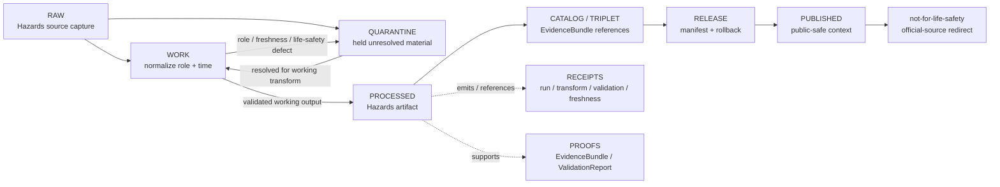

<!-- [KFM_META_BLOCK_V2]
doc_id: kfm://data/work/hazards/readme
title: Hazards WORK README
type: data-work-domain-index-readme
version: v0.1.0
status: draft
owners:
  - <hazards-domain-steward>
  - <hazards-source-steward>
  - <source-role-steward>
  - <freshness-steward>
  - <rights-reviewer>
  - <sensitivity-reviewer>
  - <pipeline-steward>
  - <release-steward>
created: 2026-06-29
updated: 2026-06-29
policy_label: restricted-review
truth_posture: cite-or-abstain
lifecycle_phase: work
responsibility_root: data/
domain: hazards
artifact_family: hazards-working-normalization-lane
sensitivity_posture: fail-closed; no-public-path; not-an-alert-system; life-safety-boundary-required; source-role-preservation-required; freshness-required; release-blocked
related:
  - ../README.md
  - ../../README.md
  - ../../raw/hazards/README.md
  - ../../raw/hazards/fema/README.md
  - ../../raw/hazards/firms/README.md
  - ../../raw/hazards/nfhl/README.md
  - ../../quarantine/hazards/README.md
  - ../../quarantine/hazards/source_role_collapse/README.md
  - ../../processed/hazards/README.md
  - ../../catalog/domain/hazards/README.md
  - ../../published/layers/hazards/README.md
  - ../../proofs/README.md
  - ../../receipts/README.md
  - ../../registry/sources/hazards/README.md
  - ../../../docs/domains/hazards/README.md
  - ../../../docs/domains/hazards/ARCHITECTURE.md
  - ../../../docs/domains/hazards/DATA_LIFECYCLE.md
  - ../../../docs/domains/hazards/PUBLICATION_AND_BOUNDARY.md
  - ../../../docs/domains/hazards/PRESERVATION_MATRIX.md
  - ../../../docs/domains/hazards/SOURCE_REGISTRY.md
  - ../../../docs/domains/hazards/SOURCE_ROLE_MATRIX.md
  - ../../../docs/domains/hazards/SOURCES.md
  - ../../../docs/architecture/source-roles.md
  - ../../../docs/architecture/source-role-anti-collapse.md
  - ../../../release/manifests/README.md
tags:
  - kfm
  - data
  - work
  - hazards
  - source-role
  - freshness
  - not-for-life-safety
  - warnings
  - advisories
  - forecasts
  - regulatory-context
  - remote-sensing-detection
  - modeled-derivative
  - life-safety-boundary
  - no-public-path
  - evidence-first
notes:
  - "This README replaces the greenfield stub at `data/work/hazards/README.md`."
  - "WORK is a governed intermediate lifecycle lane between RAW/QUARANTINE and PROCESSED; it is not proof, catalog, registry, policy, release, public API/UI output, public map/tile output, emergency alerting, operational warning authority, evacuation guidance, driving-safety guidance, engineering certification, or generated-answer authority."
  - "Hazards WORK must preserve source role, knowledge character, rights, sensitivity posture, freshness, issue/expiry/validity state, temporal semantics, evidence linkage, validation state, correction path, and rollback context before any downstream move."
  - "KFM Hazards is not a life-safety alerting system. Operational warning/advisory/watch context must remain official-source context with issue/expiry/freshness and official-source redirection before any public-safe release."
  - "README/path presence confirms documentation or path evidence only; it does not prove payloads, schemas, validators, receipts, access controls, CI enforcement, source descriptors, connector activation, or release readiness."
[/KFM_META_BLOCK_V2] -->

<a id="top"></a>

# Hazards WORK

Governed working lane for Hazards normalization, source-role reconciliation, freshness and temporal-state handling, geometry repair, warning/advisory/watch context review, validation preparation, and downstream-ready shaping before processed artifacts, catalog records, triplets, releases, public layers, PMTiles, reports, stories, or public-safe derivatives exist.

<p>
  
  
  
  
  
  
</p>

**Quick links:** [Scope](#scope) · [Repo fit](#repo-fit) · [Lifecycle boundary](#lifecycle-boundary) · [Confirmed child lanes](#confirmed-child-lanes) · [Proposed work lanes](#proposed-work-lanes) · [Accepted inputs](#accepted-inputs) · [Exclusions](#exclusions) · [Hazards working rules](#hazards-working-rules) · [Directory map](#directory-map) · [Exit gates](#exit-gates) · [Forbidden shortcuts](#forbidden-shortcuts) · [Required checks](#required-checks-before-use) · [Status notes](#status-notes)

> [!CAUTION]
> `data/work/hazards/` is a no-public-path working lane. It is not public, not processed truth, not catalog truth, not proof, not receipt authority, not source registry authority, not rights authority, not policy authority, not release authority, not emergency alert authority, not life-safety instruction, not regulatory determination, not observed-hazard truth, not modeled-risk truth, not public map/API/UI output, and not an AI-answer source. Public clients, normal UI surfaces, map layers, PMTiles, reports, stories, graph/vector indexes, search indexes, and generated answers must not read this lane directly.

---

## Scope

`data/work/hazards/` holds in-progress Hazards material after RAW source admission or quarantine return, while stewards and pipelines prepare it for normalization, validation, source-role reconciliation, knowledge-character separation, rights review, freshness/expiry handling, temporal-state repair, geometry/support review, redaction/generalization, aggregation, model/uncertainty preparation, catalog readiness, or processed-stage promotion.

WORK exists for **controlled transformation and review preparation**. It may contain intermediate tables, vectors, rasters, geometry-repair drafts, temporal matching outputs, issue/expiry normalization drafts, stale-state tests, source-role review notes, regulatory-context normalization drafts, remote-sensing detection disposition drafts, modeled-derivative QA, exposure-summary drafts, resilience-summary drafts, hazard-timeline drafts, source-quality notes, and run-local sidecars when those artifacts are not yet validated processed objects, catalog records, proofs, receipts, release decisions, published products, emergency alerts, or public-safe claims.

Hazards material is especially sensitive to **knowledge-character collapse** and **freshness mistakes**. A regulatory flood layer is not an observed flood. A remote-sensing hotspot is not confirmed ground truth. A model output is not a direct observation. An administrative declaration is not an observed event timeline by itself. An operational warning, advisory, or watch is official-source context only; KFM must never become alert authority.

---

## Repo fit

| Field | Value |
|---|---|
| Path | `data/work/hazards/` |
| Responsibility root | `data/` |
| Lifecycle phase | `work/` |
| Domain lane | `hazards` |
| Artifact role | Working normalization, source-role review, freshness/expiry review, temporal-state repair, geometry/support repair, QA, and validation-preparation lane |
| Public access posture | No public path; no normal UI; no governed-public API exposure |
| Upstream | `data/raw/hazards/` after source admission, or `data/quarantine/hazards/` after governed hold resolution |
| Downstream | `data/quarantine/hazards/` for unresolved holds, or `data/processed/hazards/` after work-stage gates close |
| Release authority | `release/`, not this directory |
| Proof authority | `data/proofs/`, not this directory |
| Receipt authority | `data/receipts/`, not this directory |
| Registry authority | `data/registry/`, not this directory |
| Policy authority | `policy/`, not this directory |
| Default failure posture | `HOLD`, `QUARANTINE`, `DENY`, `RESTRICT`, or `ABSTAIN` when source role, knowledge character, life-safety boundary, rights, sensitivity, source family, freshness, issue/expiry/validity, evidence, review, correction, rollback, access basis, or release support is insufficient |

---

## Lifecycle boundary

```text
RAW -> WORK / QUARANTINE -> PROCESSED -> CATALOG / TRIPLET -> PUBLISHED
```



WORK may support later processing, restricted review, public-safe context preparation, model/uncertainty handling, and evidence assembly, but it does not bypass quarantine, processed validation, proof construction, source-role review, freshness review, rights review, policy review, release, correction, rollback, official-source redirection, or the not-for-life-safety boundary.

---

## Confirmed child lanes

No `data/work/hazards/` child README lanes were confirmed during this edit. This parent README is confirmed as authored, but child workstream routing remains proposed until child README paths are created and verified.

| Child lane | Status | Boundary summary |
|---|---|---|
| `<none confirmed>` | **UNKNOWN** | Do not infer payloads, SourceDescriptors, connectors, validators, fixtures, receipts, access controls, CI checks, review completion, or release readiness from this parent README. |

---

## Proposed work lanes

The work lanes below are planning targets implied by RAW, QUARANTINE, PROCESSED, and Hazards doctrine patterns. Treat them as **PROPOSED / NEEDS VERIFICATION** until README paths, payload policy, schemas, validators, fixtures, receipts, and CI enforcement are verified.

| Proposed lane | Purpose | Hard boundary |
|---|---|---|
| `source_role_review/` | Working separation of observed, regulatory, modeled, aggregate, administrative, candidate, synthetic, and operational-context roles. | Role review is not proof, release, or public authority. |
| `freshness/` | Working issue/expiry/retrieval/validity/stale-state review for operational or time-sensitive context. | Expired context must not be surfaced as current state. |
| `events/` | Working event candidate normalization and historical-event reconciliation. | Event candidates are not emergency instructions or live warnings. |
| `warnings/` | Working warning/watch context handling. | KFM never becomes alert authority; official-source redirect required for release. |
| `advisories/` | Working advisory context handling. | Advisory context is not life-safety guidance. |
| `regulatory_context/` | Working regulatory hazard-context normalization, including flood/regulatory layers. | Regulatory context is not observed event truth or model output. |
| `remote_sensing/` | Working detection disposition for FIRMS-style or other remote-sensing candidates. | Detection is not confirmed ground truth by itself. |
| `modeled_derivatives/` | Working modeled hazard products and uncertainty support. | Model output is not direct observation. |
| `exposure/` | Working exposure/impact-area context and precision review. | Exposure summaries can reveal sensitive assets and require review. |
| `timelines/` | Working hazard timeline reconstruction. | Timelines require source-role and temporal-state discipline. |

---

## Accepted inputs

Accepted material is limited to intermediate, non-public working artifacts such as:

- source-normalization drafts derived from admitted Hazards RAW captures;
- working tables, vectors, rasters, geometry drafts, source API response derivatives, temporal alignment outputs, issue/expiry normalization drafts, freshness/stale-state tests, and QA artifacts;
- source-role review notes for observed, regulatory, modeled, aggregate, administrative, candidate, synthetic, operational-context, warning, advisory, watch, and generated-carrier material;
- knowledge-character separation outputs for historical event, operational warning/advisory/watch context, administrative declaration, regulatory context, scientific observation, remote-sensing detection, modeled derivative, exposure summary, resilience summary, and timeline material;
- rights-review preparation notes, source-license interpretation notes, citation checks, upstream-source-chain notes, allowed-use caveats, and source-role inheritance notes that are not authoritative registry or policy records;
- redaction, generalization, aggregation, precision-control, representation, withholding, and delayed-publication preparation artifacts that still need receipts and review before downstream use;
- candidate hazard-event, observation, warning, advisory, declaration, flood, wildfire, smoke, drought, earthquake, heat/cold, exposure, resilience, and timeline artifacts that remain clearly labeled as working/candidate class;
- source-role, knowledge-character, rights, sensitivity, freshness, issue time, expiry time, valid time, observed time, retrieval time, release time, geometry/support, evidence, citation, attribution, review, and validation notes used to decide whether material returns to quarantine or proceeds to processed;
- run-local manifests, logs, checksums, and sidecars used to understand a working transform when they are not authoritative receipts, proofs, registries, schemas, policy rules, or release records;
- README or index sidecars that explain local work state without becoming public, proof, catalog, registry, policy, access authority, release authority, alert authority, life-safety authority, regulatory authority, or generated-answer authority.

> [!IMPORTANT]
> Working artifacts must keep source role and knowledge character visible. Observed, regulatory, modeled, aggregate, administrative, candidate, synthetic, operational-context, warning/advisory/watch, and generated carrier records must not be flattened into the same authority class for convenience.

---

## Exclusions

| Do not place here | Correct authority home |
|---|---|
| Immutable Hazards source capture, source-native files, source rasters/vectors, source API responses, agency/steward exports, source logs, original warning/advisory/watch messages, source identifiers, and source-native timestamps | `data/raw/hazards/` |
| Source-role collapse, stale-as-current context, life-safety boundary failure, rights unknown, sensitivity unresolved, evidence open, temporal role defect, schema/geometry/source-version defect, malformed, disputed, unsafe, or not-yet-reviewed material | `data/quarantine/hazards/` |
| Source-role collapse quarantine material | `data/quarantine/hazards/source_role_collapse/` |
| Validated normalized Hazards outputs | `data/processed/hazards/` |
| Public-safe published layers, PMTiles, reports, stories, API payloads, downloads, or public artifacts | `data/published/` only after release gates close |
| Catalog records, STAC/DCAT/PROV records, triplets, graph records, or EvidenceBundle state | `data/catalog/`, `data/triplets/`, or proof lanes |
| EvidenceBundle, ProofPack, validation report, or claim-proof authority | `data/proofs/` |
| Final `RunReceipt`, `TransformReceipt`, `ValidationReceipt`, `FreshnessReceipt`, `SourceRoleReviewReceipt`, `RedactionReceipt`, `AggregationReceipt`, `ReviewRecord`, `PolicyDecision`, correction receipt, or release receipt records | `data/receipts/` or accepted review/receipt lanes |
| SourceDescriptor, source activation, source registry, rights registry, freshness registry, sensitivity registry, or access registry records | `data/registry/` or accepted registry lanes |
| Release manifests, correction notices, withdrawal notices, signatures, rollback cards, release decisions, or release candidates | `release/` |
| Schemas, contracts, validators, tests, packages, pipelines, pipeline specs, app/UI/API code, or policy rules | `schemas/`, `contracts/`, `tools/`, `tests/`, `pipelines/`, `pipeline_specs/`, `apps/`, `policy/` |
| Official emergency alerts, watches, warnings, advisories, evacuation instructions, driving-safety instructions, emergency response instructions, engineering certification, or life-safety guidance | The issuing authority; KFM must redirect or abstain |
| Hydrology, Atmosphere, Settlements/Infrastructure, Roads/Rail, Geology, Soil, Agriculture, Fauna, Archaeology, or People/Land canonical truth | Owning domain lanes, not Hazards WORK |
| Public API/UI/tile payloads, direct downloads, Focus Mode answers, public map layers, route-safety advice, evacuation advice, emergency alerts, or life-safety guidance | Governed public/release/authority surfaces only; otherwise abstain or deny |
| Secrets, credentials, access tokens, private agreement terms, exact transform seeds, restricted offsets, redaction bypass details, sensitive infrastructure join keys, or exposure-enabling implementation details | Do not store in this README or ordinary working Markdown |

---

## Hazards working rules

| Rule | Handling |
|---|---|
| Keep WORK non-public | Nothing here is a public surface, public-candidate artifact, alert feed, map tile, PMTiles output, or normal UI/API source. |
| Preserve source role | Observed, regulatory, modeled, aggregate, administrative, candidate, synthetic, operational-context, and generated records stay distinct. |
| Preserve knowledge character | Historical event, warning/advisory/watch context, declaration, regulatory context, observation, remote-sensing detection, modeled derivative, exposure summary, resilience summary, and timeline material stay distinct. |
| Preserve freshness and time state | Source time, observed time, valid time, issue time, expiry time, retrieval time, release time, stale state, and correction time remain explicit. |
| Keep life-safety boundary visible | KFM is not an alert system and must never issue emergency instructions. Public-safe release requires official-source redirect where applicable. |
| Do not promote stale-as-current | Expired or stale operational context must become historical/stale context, return to quarantine, or be denied as current state. |
| Keep cross-domain truth separate | Hydrology, Atmosphere, Infrastructure, Roads/Rail, Geology, Soil, Agriculture, Fauna, Archaeology, and People/Land can be referenced through governed joins, but Hazards does not own their canonical truth. |
| Keep sensitive joins visible | Joins to critical infrastructure, dams, roads, private land, living-person data, archaeology, rare species, or sensitive facilities fail closed until reviewed. |
| Do not launder quarantine | Material cannot leave quarantine through WORK unless the hold reason is explicitly resolved and recorded. |
| Do not launder into public | WORK cannot become public or published material without governed review, receipts, release, correction, rollback, and not-for-life-safety controls. |
| Separate review from transformation | A temporal repair, source-role review, freshness test, or geometry repair does not equal reviewer approval, policy decision, receipt closure, release approval, or public permission. |
| Preserve rollback context | Working outputs intended for downstream use should keep enough run and source context to support correction, withdrawal, and rollback later. |

---

## Directory map

```text
data/work/hazards/
├── README.md
├── <future-workstream-or-source-family>/
│   └── <run_id_or_batch_id>/
│       ├── work_manifest.json
│       ├── input_refs.json
│       ├── transform_notes.md
│       ├── source_role_review.notes.md
│       ├── freshness_review.notes.md
│       ├── qa_notes.md
│       ├── checksums.sha256
│       └── README.md
└── index.local.json
```

`index.local.json` is optional and must remain WORK-local. It is not a public index, catalog record, release manifest, source registry, review record, graph edge source, layer/story/report pointer, search index, vector index, map source, tile source, alert feed, emergency guidance source, stale/current-state authority, or retrieval source for generated answers.

> [!NOTE]
> The directory map confirms the parent README path only. Future workstream folders are proposed patterns and do not prove payloads, schemas, validators, fixtures, workflows, receipts, access controls, or CI checks exist.

---

## Exit gates

| Exit route | Minimum requirement |
|---|---|
| Stay WORK | Normalization, QA, source-role reconciliation, knowledge-character separation, rights review, freshness/expiry handling, temporal-state repair, geometry/support review, evidence-bundle preparation, validation preparation, or correction planning remains incomplete. |
| Quarantine | Source role, knowledge character, life-safety boundary, rights, sensitivity, freshness, issue/expiry/validity, source family, schema, citation, digest, policy, review, evidence, correction, or rollback state is unresolved enough that work should stop. |
| Reject / return | Steward review says the material is misfiled, unsupported, not retainable, or outside the Hazards work lane. |
| Promote to PROCESSED | Working artifact has sufficient lineage, source-role preservation, knowledge-character separation, freshness/expiry closure, rights posture, validation support, review state where required, correction path, rollback context, and downstream-ready metadata. |
| Prepare public-safe derivative | Only a transformed derivative, not unresolved source or time-sensitive operational material, may move toward public-safe processed/catalog/published paths after validation, review, policy, receipt, correction, rollback, not-for-life-safety disclaimer, and official-source redirect requirements are satisfied. |
| Support catalog/release later | Only after later PROCESSED, CATALOG/TRIPLET, proof, receipt, review, policy, release, correction, and rollback gates close. |

Operational warning/advisory/watch material additionally requires issue time, expiry time, source identity, freshness state, stale-state behavior, and a visible not-for-life-safety boundary before any public-safe context surface.

---

## Forbidden shortcuts

```text
data/work/hazards/
→ data/catalog/
→ data/published/
→ public API / MapLibre / PMTiles / report / story / graph / vector index / generated answer
```

is forbidden unless the appropriate governed lifecycle transitions have actually happened and left inspectable evidence.

```text
data/work/hazards/
→ data/processed/hazards/
```

is also forbidden for source-role collapse, stale-as-current context, life-safety boundary failure, rights unknown, sensitivity unresolved, evidence open, temporal-role defects, schema/geometry/source-version defects, and unresolved freshness/source-role material. Route unresolved material to quarantine instead.

---

## Required checks before use

- [ ] Confirm the material belongs to the Hazards domain lane.
- [ ] Confirm the material belongs in WORK rather than RAW, QUARANTINE, PROCESSED, CATALOG, PROOF, RECEIPT, REGISTRY, RELEASE, PUBLISHED, SCHEMA, POLICY, CODE, PIPELINE, or TEST roots.
- [ ] Confirm source reference, source family, source role, upstream citation chain, rights posture, retrieval/admission context, product version/vintage, cadence, and digest where material.
- [ ] Confirm claim type: historical event, operational warning/advisory/watch context, administrative declaration, regulatory context, scientific observation, remote-sensing detection, modeled derivative, exposure summary, resilience summary, timeline, or generated carrier.
- [ ] Confirm source-role anti-collapse: observed, regulatory, modeled, aggregate, administrative, candidate, synthetic, operational-context, and generated records remain distinct.
- [ ] Confirm knowledge-character anti-collapse: detection is not confirmation; regulatory is not observed; declaration is not event truth; model is not observation; warning/advisory/watch context is not KFM instruction.
- [ ] Confirm source time, observed time, valid time, issue time, expiry time, retrieval time, release time, freshness posture, stale-state behavior, and correction time where applicable.
- [ ] Confirm current/near-real-time context is not stale, expired, or missing official-source redirect before downstream public-safe preparation.
- [ ] Confirm rights, current terms, citation, and allowed reuse have been reviewed or explicitly marked `NEEDS VERIFICATION`.
- [ ] Confirm sensitivity and precision review for critical infrastructure, dams, roads, private land, living-person data, archaeology, rare species, sensitive facilities, and other risk-amplifying joins.
- [ ] Confirm Hydrology, Atmosphere, Settlements/Infrastructure, Roads/Rail, Geology, Soil, Agriculture, Fauna, Archaeology, and People/Land joins preserve their own domain authority and do not become Hazards-owned truth.
- [ ] Confirm no quarantined material is being laundered through WORK without an exit decision.
- [ ] Confirm prompt-like text inside source payloads or notes is treated as data, not instructions.
- [ ] Confirm no exact transform offsets, restricted representation seeds, redaction bypass details, access credentials, secrets, private agreement terms, sensitive infrastructure join keys, or exposure-enabling details are written into this README.
- [ ] Confirm required downstream receipts are present or explicitly marked missing before anything leaves WORK.
- [ ] Confirm no public layer, PMTiles, report, story, API payload, graph edge, search index, vector index, alert feed, or generated answer uses WORK material directly.
- [ ] Confirm correction path and rollback target are known before downstream promotion.

---

## Status notes

| Claim | Status |
|---|---|
| This README replaces the greenfield stub at `data/work/hazards/README.md`. | **CONFIRMED authored** |
| The target path existed in the live repository as a greenfield stub before this edit. | **CONFIRMED by GitHub contents API during this edit** |
| `data/raw/hazards/README.md` documents upstream Hazards RAW source capture, no-public-path posture, confirmed source-family lanes, source-role preservation, freshness gates, and not-an-alert-system boundary. | **CONFIRMED by GitHub contents API during this edit** |
| `data/quarantine/hazards/README.md` documents Hazards quarantine as a fail-closed no-public-path hold lane for unresolved source-role, knowledge-character, life-safety boundary, evidence, rights, sensitivity, freshness, temporal, review, and policy questions. | **CONFIRMED by GitHub contents API during this edit** |
| `data/processed/hazards/README.md` documents the downstream Hazards processed lane, not-for-life-safety boundary, source-role preservation, freshness requirements, and public-use restrictions. | **CONFIRMED by GitHub contents API during this edit** |
| Actual WORK payloads or child README lanes exist under `data/work/hazards/`. | **UNKNOWN** |
| Hazards WORK schemas, validators, fixtures, CI checks, receipts, access controls, review workflow, and release linkage are fully implemented. | **NEEDS VERIFICATION** |
| This README is proof, release, catalog, registry, policy, emergency alert authority, life-safety instruction, regulatory determination, observed-hazard truth, modeled-risk truth, public artifact authority, or AI authority. | **DENY** |

---

## Related files

- [`../README.md`](../README.md)
- [`../../README.md`](../../README.md)
- [`../../raw/hazards/README.md`](../../raw/hazards/README.md)
- [`../../raw/hazards/fema/README.md`](../../raw/hazards/fema/README.md)
- [`../../raw/hazards/firms/README.md`](../../raw/hazards/firms/README.md)
- [`../../raw/hazards/nfhl/README.md`](../../raw/hazards/nfhl/README.md)
- [`../../quarantine/hazards/README.md`](../../quarantine/hazards/README.md)
- [`../../quarantine/hazards/source_role_collapse/README.md`](../../quarantine/hazards/source_role_collapse/README.md)
- [`../../processed/hazards/README.md`](../../processed/hazards/README.md)
- [`../../catalog/domain/hazards/README.md`](../../catalog/domain/hazards/README.md)
- [`../../published/layers/hazards/README.md`](../../published/layers/hazards/README.md)
- [`../../proofs/README.md`](../../proofs/README.md)
- [`../../receipts/README.md`](../../receipts/README.md)
- [`../../registry/sources/hazards/README.md`](../../registry/sources/hazards/README.md)
- [`../../../docs/domains/hazards/README.md`](../../../docs/domains/hazards/README.md)
- [`../../../docs/domains/hazards/ARCHITECTURE.md`](../../../docs/domains/hazards/ARCHITECTURE.md)
- [`../../../docs/domains/hazards/DATA_LIFECYCLE.md`](../../../docs/domains/hazards/DATA_LIFECYCLE.md)
- [`../../../docs/domains/hazards/PUBLICATION_AND_BOUNDARY.md`](../../../docs/domains/hazards/PUBLICATION_AND_BOUNDARY.md)
- [`../../../docs/domains/hazards/PRESERVATION_MATRIX.md`](../../../docs/domains/hazards/PRESERVATION_MATRIX.md)
- [`../../../docs/domains/hazards/SOURCE_REGISTRY.md`](../../../docs/domains/hazards/SOURCE_REGISTRY.md)
- [`../../../docs/domains/hazards/SOURCE_ROLE_MATRIX.md`](../../../docs/domains/hazards/SOURCE_ROLE_MATRIX.md)
- [`../../../docs/domains/hazards/SOURCES.md`](../../../docs/domains/hazards/SOURCES.md)
- [`../../../release/manifests/README.md`](../../../release/manifests/README.md)

---

## Maintenance checklist

- [ ] Replace placeholder owners with confirmed steward roles.
- [ ] Confirm whether Hazards WORK child lanes exist and add them to the directory map only after verification.
- [ ] Confirm Hazards WORK schemas, validators, and fixture expectations.
- [ ] Confirm required receipt family names and storage homes for WORK-to-PROCESSED promotion.
- [ ] Confirm source-role review, knowledge-character separation, freshness/expiry handling, temporal-state handling, rights review, precision/sensitivity review, evidence-bundle closure, and validation linkage.
- [ ] Confirm all relative links after adjacent docs stabilize.
- [ ] Confirm rollback target for this README expansion in the commit or release notes.

[Back to top](#top)
