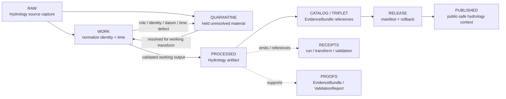

<!-- [KFM_META_BLOCK_V2]
doc_id: kfm://data/work/hydrology/readme
title: Hydrology WORK README
type: data-work-domain-index-readme
version: v0.1.0
status: draft
owners:
  - <hydrology-domain-steward>
  - <watershed-huc-steward>
  - <gauge-observation-steward>
  - <hydrology-source-steward>
  - <source-role-steward>
  - <rights-reviewer>
  - <pipeline-steward>
  - <release-steward>
created: 2026-06-29
updated: 2026-06-29
policy_label: restricted-review
truth_posture: cite-or-abstain
lifecycle_phase: work
responsibility_root: data/
domain: hydrology
artifact_family: hydrology-working-normalization-lane
sensitivity_posture: fail-closed; no-public-path; source-role-preservation-required; nfhl-regulatory-not-observed; emergency-alert-boundary-required; datum-unit-time-preservation-required; release-blocked
related:
  - ../README.md
  - ../../README.md
  - ../../raw/hydrology/README.md
  - ../../raw/hydrology/fema_nfhl/README.md
  - ../../raw/hydrology/usgs_3dep/README.md
  - ../../raw/hydrology/usgs_nhdplus_hr/README.md
  - ../../raw/hydrology/usgs_water_data/README.md
  - ../../raw/hydrology/usgs_wbd/README.md
  - ../../quarantine/hydrology/README.md
  - ../../processed/hydrology/README.md
  - ../../processed/hydrology/wbd/README.md
  - ../../catalog/domain/hydrology/README.md
  - ../../published/layers/hydrology/README.md
  - ../../proofs/README.md
  - ../../receipts/README.md
  - ../../registry/sources/hydrology/README.md
  - ../../../docs/domains/hydrology/README.md
  - ../../../docs/domains/hydrology/BOUNDARY.md
  - ../../../docs/domains/hydrology/DATA_LIFECYCLE.md
  - ../../../docs/domains/hydrology/IDENTITY_MODEL.md
  - ../../../docs/domains/hydrology/OBJECT_FAMILIES.md
  - ../../../docs/domains/hydrology/PUBLICATION_POSTURE.md
  - ../../../docs/domains/hydrology/SOURCE_FAMILIES.md
  - ../../../docs/domains/hydrology/SOURCE_REGISTRY.md
  - ../../../docs/domains/hydrology/SOURCE_ROLE_MATRIX.md
  - ../../../docs/domains/hydrology/VERIFICATION_BACKLOG.md
  - ../../../docs/architecture/source-roles.md
  - ../../../release/manifests/README.md
tags:
  - kfm
  - data
  - work
  - hydrology
  - watershed
  - huc
  - hydrography
  - reach-identity
  - gauge-site
  - water-observations
  - groundwater
  - nfhl
  - source-role
  - datum
  - units
  - time-aware
  - emergency-alert-boundary
  - no-public-path
  - evidence-first
notes:
  - "This README replaces the greenfield stub at `data/work/hydrology/README.md`."
  - "WORK is a governed intermediate lifecycle lane between RAW/QUARANTINE and PROCESSED; it is not proof, catalog, registry, policy, release, public API/UI output, public map/tile output, flood-warning surface, operational water-management instruction, property-rights evidence, engineering certification, or generated-answer authority."
  - "Hydrology WORK must preserve source role, rights, sensitivity posture, object-family distinction, temporal semantics, datum/unit semantics, geometry/support, evidence linkage, validation state, correction path, and rollback context before any downstream move."
  - "NFHL is regulatory flood context only and must not be relabeled as observed flooding, real-time inundation, hydraulic-model output, forecast, or emergency status."
  - "README/path presence confirms documentation or path evidence only; it does not prove payloads, schemas, validators, receipts, access controls, CI enforcement, source descriptors, connector activation, or release readiness."
[/KFM_META_BLOCK_V2] -->

<a id="top"></a>

# Hydrology WORK

Governed working lane for Hydrology normalization, source-role reconciliation, HUC/reach/gauge identity repair, datum/unit/time handling, topology and geometry repair, NFHL regulatory-context separation, validation preparation, and downstream-ready shaping before processed artifacts, catalog records, triplets, releases, public layers, PMTiles, reports, stories, or public-safe derivatives exist.

<p>
  
  
  
  
  
  
</p>

**Quick links:** [Scope](#scope) · [Repo fit](#repo-fit) · [Lifecycle boundary](#lifecycle-boundary) · [Confirmed child lanes](#confirmed-child-lanes) · [Proposed work lanes](#proposed-work-lanes) · [Accepted inputs](#accepted-inputs) · [Exclusions](#exclusions) · [Hydrology working rules](#hydrology-working-rules) · [Directory map](#directory-map) · [Exit gates](#exit-gates) · [Forbidden shortcuts](#forbidden-shortcuts) · [Required checks](#required-checks-before-use) · [Status notes](#status-notes)

> [!CAUTION]
> `data/work/hydrology/` is a no-public-path working lane. It is not public, not processed truth, not catalog truth, not proof, not receipt authority, not source registry authority, not rights authority, not policy authority, not release authority, not emergency alert authority, not life-safety instruction, not NFHL-as-observed-flood truth, not gauge/station identity truth, not water-rights truth, not property-rights truth, not public map/API/UI output, and not an AI-answer source. Public clients, normal UI surfaces, map layers, PMTiles, reports, stories, graph/vector indexes, search indexes, and generated answers must not read this lane directly.

---

## Scope

`data/work/hydrology/` holds in-progress Hydrology material after RAW source admission or quarantine return, while stewards and pipelines prepare it for normalization, validation, source-role reconciliation, HUC/watershed identity repair, hydrofeature/reach identity repair, gauge/station identity repair, observation normalization, datum/unit handling, temporal-state repair, topology processing, NFHL regulatory-context separation, geometry/CRS review, freshness review, catalog readiness, or processed-stage promotion.

WORK exists for **controlled transformation and review preparation**. It may contain intermediate tables, vectors, rasters, geometry repair drafts, topology and trace drafts, station/reach/HUC matching outputs, observation QA outputs, parameter/unit/datum reconciliation notes, provisional-vs-approved status checks, daily-value or rollup aggregation checks, NFHL role-separation notes, hydrograph/model-lineage drafts, source-quality notes, and run-local sidecars when those artifacts are not yet validated processed objects, catalog records, proofs, receipts, release decisions, published products, emergency warnings, or public-safe claims.

Hydrology owns watershed/HUC, hydrofeature/reach, gauge, flow, water-level, water-quality, groundwater, regulatory flood-context, observed flood-event, hydrograph, and upstream-trace claims. Those object families stay separated by source role, evidence, time, datum/unit semantics, and release state. Hydrology may lend context to Hazards, Habitat/Fauna/Flora, Soil, Agriculture, Settlements/Infrastructure, and Frontier Matrix lanes, but owning-lane canonical claims are not overwritten by Hydrology WORK convenience joins.

---

## Repo fit

| Field | Value |
|---|---|
| Path | `data/work/hydrology/` |
| Responsibility root | `data/` |
| Lifecycle phase | `work/` |
| Domain lane | `hydrology` |
| Artifact role | Working normalization, source-role review, identity repair, datum/unit/time repair, topology/geometry repair, QA, and validation-preparation lane |
| Public access posture | No public path; no normal UI; no governed-public API exposure |
| Upstream | `data/raw/hydrology/` after source admission, or `data/quarantine/hydrology/` after governed hold resolution |
| Downstream | `data/quarantine/hydrology/` for unresolved holds, or `data/processed/hydrology/` after work-stage gates close |
| Release authority | `release/`, not this directory |
| Proof authority | `data/proofs/`, not this directory |
| Receipt authority | `data/receipts/`, not this directory |
| Registry authority | `data/registry/`, not this directory |
| Policy authority | `policy/`, not this directory |
| Default failure posture | `HOLD`, `QUARANTINE`, `DENY`, `RESTRICT`, or `ABSTAIN` when source role, rights, sensitivity, identity, endpoint, geometry/support, CRS, units, datum, time state, aggregation scope, freshness, evidence, review, correction, rollback, access basis, or release support is insufficient |

---

## Lifecycle boundary

```text
RAW -> WORK / QUARANTINE -> PROCESSED -> CATALOG / TRIPLET -> PUBLISHED
```



WORK may support later processing, restricted review, public-safe context preparation, model/uncertainty handling, and evidence assembly, but it does not bypass quarantine, processed validation, proof construction, source-role review, identity review, datum/unit review, freshness review, rights review, policy review, release, correction, rollback, or the emergency/life-safety boundary.

---

## Confirmed child lanes

No `data/work/hydrology/` child README lanes were confirmed during this edit. This parent README is confirmed as authored, but child workstream routing remains proposed until child README paths are created and verified.

| Child lane | Status | Boundary summary |
|---|---|---|
| `<none confirmed>` | **UNKNOWN** | Do not infer payloads, SourceDescriptors, connectors, validators, fixtures, receipts, access controls, CI checks, review completion, or release readiness from this parent README. |

---

## Proposed work lanes

The work lanes below are planning targets implied by RAW, QUARANTINE, PROCESSED, and Hydrology doctrine patterns. Treat them as **PROPOSED / NEEDS VERIFICATION** until README paths, payload policy, schemas, validators, fixtures, receipts, and CI enforcement are verified.

| Proposed lane | Purpose | Hard boundary |
|---|---|---|
| `wbd/` | Working WBD/HUC identity, hierarchy, topology, and vintage preparation. | WBD/HUC is authority watershed geography, not gauge observation, NFHL, flood event, hydrograph model, or emergency status. |
| `nhdplus/` | Working NHDPlus/3DHP reach identity, flowline, catchment, and network topology preparation. | Reach identity ambiguity must fail closed or abstain. |
| `gauges/` | Working gauge/station identity, site metadata, and datum context preparation. | Gauge site is not the observation value itself. |
| `observations/flow/` | Working discharge/flow observation normalization. | Observation is not model, forecast, water-rights proof, or emergency instruction. |
| `observations/level/` | Working stage/gage-height/water-level observation normalization. | Source/observed/retrieval times and datum/unit semantics must travel. |
| `observations/quality/` | Working water-quality observation normalization. | Parameter, qualifier, unit, method, and QA metadata are required; not health/legal advice. |
| `groundwater/` | Working groundwater well/aquifer observation preparation. | Well/owner detail may be restricted or generalized. |
| `nfhl/` | Working NFHL regulatory flood-context preparation. | Regulatory role only; never observed flooding, forecast, real-time inundation, or model output. |
| `hydrographs/` | Working hydrograph and modeled time-series preparation. | Modeled hydrographs are not direct observations. |
| `traces/` | Working upstream/downstream trace preparation. | Trace outputs are derived analysis, not source truth. |
| `water_use/` | Working hydrology-anchored water-use links. | Water-use/legal/rights claims require owning policy and proof. |

---

## Accepted inputs

Accepted material is limited to intermediate, non-public working artifacts such as:

- source-normalization drafts derived from admitted Hydrology RAW captures;
- working tables, vectors, rasters, geometry drafts, topology drafts, trace drafts, source API response derivatives, temporal alignment outputs, datum/unit reconciliation outputs, freshness/stale-state tests, and QA artifacts;
- HUC/watershed packets, hydrofeature/reach packets, gauge/station packets, flow/water-level/water-quality observation packets, groundwater/well packets, NFHL/flood-context packets, hydrograph packets, upstream-trace packets, water-use/drought/irrigation link drafts, and candidate derivatives that remain clearly labeled as working/candidate class;
- source-role review notes for observed, regulatory, modeled, aggregate, administrative, candidate, synthetic, authority geography, observation, and generated-carrier material;
- identity reconciliation outputs for source IDs, HUCs, reaches, gauge/station IDs, wells, parameters, units, datum, endpoints, products, vintages, and geometry/support;
- rights-review preparation notes, source-license interpretation notes, citation checks, upstream-source-chain notes, allowed-use caveats, and source-role inheritance notes that are not authoritative registry or policy records;
- redaction, generalization, aggregation, precision-control, representation, withholding, and delayed-publication preparation artifacts that still need receipts and review before downstream use;
- source-role, rights, sensitivity, station identity, reach identity, HUC identity, geometry, CRS, units, datum, parameter, cadence, freshness, observed time, valid time, retrieval time, release time, correction time, evidence, citation, attribution, review, and validation notes used to decide whether material returns to quarantine or proceeds to processed;
- run-local manifests, logs, checksums, and sidecars used to understand a working transform when they are not authoritative receipts, proofs, registries, schemas, policy rules, or release records;
- README or index sidecars that explain local work state without becoming public, proof, catalog, registry, policy, access authority, release authority, flood-warning authority, life-safety authority, regulatory authority, property-rights evidence, or generated-answer authority.

> [!IMPORTANT]
> Working artifacts must keep source role and identity visible. Observed, regulatory, modeled, aggregate, administrative, candidate, synthetic, authority geography, and generated records must not be flattened into the same authority class for convenience.

---

## Exclusions

| Do not place here | Correct authority home |
|---|---|
| Immutable Hydrology source capture, source-native files, WBD/NHD/NFHL files, well files, gauge feeds, source API responses, source rasters/vectors, source logs, original geometries, source identifiers, and source-native timestamps | `data/raw/hydrology/` |
| Source-role collapse, NFHL regulatory-context misuse, emergency-alert boundary failure, gauge/station identity unresolved, rights unknown, sensitive private/infrastructure join, evidence open, temporal/cadence/stale-state defect, schema/geometry/CRS/unit/datum defect, malformed, disputed, unsafe, or not-yet-reviewed material | `data/quarantine/hydrology/` |
| Validated normalized Hydrology outputs | `data/processed/hydrology/` |
| Validated WBD/HUC processed outputs | `data/processed/hydrology/wbd/` |
| Public-safe published layers, PMTiles, reports, stories, API payloads, downloads, or public artifacts | `data/published/` only after release gates close |
| Catalog records, STAC/DCAT/PROV records, triplets, graph records, or EvidenceBundle state | `data/catalog/`, `data/triplets/`, or proof lanes |
| EvidenceBundle, ProofPack, validation report, or claim-proof authority | `data/proofs/` |
| Final `RunReceipt`, `TransformReceipt`, `ValidationReceipt`, `FreshnessReceipt`, `SourceRoleReviewReceipt`, `RedactionReceipt`, `AggregationReceipt`, `ModelRunReceipt`, `ReviewRecord`, `PolicyDecision`, correction receipt, or release receipt records | `data/receipts` or accepted review/receipt lanes |
| SourceDescriptor, source activation, source registry, rights registry, freshness registry, sensitivity registry, or access registry records | `data/registry/` or accepted registry lanes |
| Release manifests, correction notices, withdrawal notices, signatures, rollback cards, release decisions, or release candidates | `release/` |
| Schemas, contracts, validators, tests, packages, pipelines, pipeline specs, app/UI/API code, or policy rules | `schemas/`, `contracts/`, `tools/`, `tests/`, `pipelines/`, `pipeline_specs/`, `apps/`, `policy/` |
| Official emergency alerts, flood warnings, evacuation instructions, operational water-management orders, engineering certifications, water-rights determinations, property-rights claims, or legal/regulatory determinations | The issuing authority; KFM must redirect or abstain |
| Soil, Agriculture, Habitat, Fauna, Flora, Hazards, Settlements/Infrastructure, Geology, Archaeology, or People/Land canonical truth | Owning domain lanes, not Hydrology WORK |
| Public API/UI/tile payloads, direct downloads, Focus Mode answers, public map layers, flood-warning surfaces, route-safety advice, water-rights advice, emergency alerts, or life-safety guidance | Governed public/release/authority surfaces only; otherwise abstain or deny |
| Secrets, credentials, access tokens, private agreement terms, exact transform controls, restricted representation controls, or other exposure-enabling implementation details | Do not store in this README or ordinary working Markdown |

---

## Hydrology working rules

| Rule | Handling |
|---|---|
| Keep WORK non-public | Nothing here is a public surface, public-candidate artifact, alert feed, map tile, PMTiles output, or normal UI/API source. |
| Preserve source role | Observed, regulatory, modeled, aggregate, administrative, candidate, synthetic, authority geography, and generated records stay distinct. |
| Preserve object-family identity | Watershed/HUC, hydrofeature/reach, gauge site, flow observation, water-level observation, water-quality observation, groundwater well, aquifer observation, NFHL zone, hydrograph, upstream trace, water-use link, drought link, and irrigation link stay distinct. |
| Preserve time kinds | Source time, observed time, valid/effective time, retrieval time, release time, correction time, cadence, vintage, freshness, and stale-state behavior remain explicit. |
| Preserve datum and units | Horizontal/vertical datum, depth/stage datum, parameter code, unit, method, qualifier, approval status, and aggregation scope travel with working artifacts. |
| Keep NFHL regulatory-only | NFHL must not become observed flood, forecast, real-time inundation, hydraulic-model output, or emergency status. |
| Keep provisional separate from approved | Provisional USGS-style readings need explicit lifecycle state before downstream claim use. |
| Keep aggregate separate from instant/site truth | Daily values, annual statistics, HUC rollups, drought links, and water-use rollups carry aggregation scope. |
| Keep cross-domain truth separate | Hazards, Habitat, Fauna, Flora, Soil, Agriculture, Settlements/Infrastructure, Geology, Archaeology, and People/Land can be referenced through governed joins, but Hydrology does not own their canonical truth. |
| Keep sensitive joins visible | Private wells, water-use records, dams, levees, intakes, treatment plants, parcel joins, critical-asset exposure, or living-person context fail closed until reviewed. |
| Do not launder quarantine | Material cannot leave quarantine through WORK unless the hold reason is explicitly resolved and recorded. |
| Do not launder into public | WORK cannot become public or published material without governed review, receipts, release, correction, rollback, and emergency/life-safety boundary controls. |
| Separate review from transformation | A topology repair, time repair, source-role review, freshness test, or geometry repair does not equal reviewer approval, policy decision, receipt closure, release approval, or public permission. |
| Preserve rollback context | Working outputs intended for downstream use should keep enough run and source context to support correction, withdrawal, and rollback later. |

---

## Directory map

```text
data/work/hydrology/
├── README.md
├── <future-workstream-or-source-family>/
│   └── <run_id_or_batch_id>/
│       ├── work_manifest.json
│       ├── input_refs.json
│       ├── transform_notes.md
│       ├── source_role_review.notes.md
│       ├── datum_unit_review.notes.md
│       ├── temporal_review.notes.md
│       ├── qa_notes.md
│       ├── checksums.sha256
│       └── README.md
└── index.local.json
```

`index.local.json` is optional and must remain WORK-local. It is not a public index, catalog record, release manifest, source registry, review record, graph edge source, layer/story/report pointer, search index, vector index, map source, tile source, alert feed, emergency guidance source, gauge/station truth authority, water-rights authority, property-rights authority, or retrieval source for generated answers.

> [!NOTE]
> The directory map confirms the parent README path only. Future workstream folders are proposed patterns and do not prove payloads, schemas, validators, fixtures, workflows, receipts, access controls, or CI checks exist.

---

## Exit gates

| Exit route | Minimum requirement |
|---|---|
| Stay WORK | Normalization, QA, source-role reconciliation, HUC/reach/gauge identity repair, rights review, datum/unit/time handling, topology/geometry repair, aggregation handling, freshness handling, evidence-bundle preparation, validation preparation, or correction planning remains incomplete. |
| Quarantine | Source role, rights, sensitivity, identity, endpoint, geometry/support, CRS, units, datum, time state, aggregation scope, freshness, source family, schema, citation, digest, policy, review, evidence, correction, or rollback state is unresolved enough that work should stop. |
| Reject / return | Steward review says the material is misfiled, unsupported, not retainable, or outside the Hydrology work lane. |
| Promote to PROCESSED | Working artifact has sufficient lineage, source-role preservation, identity closure, datum/unit/time closure, validation support, rights posture, review state where required, correction path, rollback context, and downstream-ready metadata. |
| Prepare public-safe derivative | Only a transformed derivative, not unresolved source or time-sensitive operational material, may move toward public-safe processed/catalog/published paths after validation, review, policy, receipt, correction, rollback, emergency/life-safety boundary, and official-source redirection requirements are satisfied where applicable. |
| Support catalog/release later | Only after later PROCESSED, CATALOG/TRIPLET, proof, receipt, review, policy, release, correction, and rollback gates close. |

NFHL material additionally requires explicit regulatory-context labeling before public-safe use. Forecast, warning, and operational-notice context requires official-source identity, freshness/expiry state where applicable, and visible not-for-life-safety posture before any KFM public context surface.

---

## Forbidden shortcuts

```text
data/work/hydrology/
→ data/catalog/
→ data/published/
→ public API / MapLibre / PMTiles / report / story / graph / vector index / generated answer
```

is forbidden unless the appropriate governed lifecycle transitions have actually happened and left inspectable evidence.

```text
data/work/hydrology/
→ data/processed/hydrology/
```

is also forbidden for source-role collapse, NFHL-as-observed misuse, emergency-alert boundary failure, gauge/station identity unresolved, rights unknown, sensitive private/infrastructure joins, evidence open, temporal/cadence/stale-state defects, schema/geometry/CRS/unit/datum defects, and unresolved source-role material. Route unresolved material to quarantine instead.

---

## Required checks before use

- [ ] Confirm the material belongs to the Hydrology domain lane.
- [ ] Confirm the material belongs in WORK rather than RAW, QUARANTINE, PROCESSED, CATALOG, PROOF, RECEIPT, REGISTRY, RELEASE, PUBLISHED, SCHEMA, POLICY, CODE, PIPELINE, or TEST roots.
- [ ] Confirm source reference, source family, source role, upstream citation chain, rights posture, endpoint identity, retrieval/admission context, product version/vintage, cadence, and digest where material.
- [ ] Confirm object family: watershed/HUC, hydrofeature/reach, gauge site, flow observation, water-level observation, water-quality observation, groundwater well, aquifer observation, NFHL zone, hydrograph, upstream trace, water-use link, drought link, irrigation link, or generated carrier.
- [ ] Confirm source-role anti-collapse: observed, regulatory, modeled, aggregate, administrative, candidate, synthetic, authority geography, and generated records remain distinct.
- [ ] Confirm NFHL regulatory context is not treated as observed flooding, forecast, real-time inundation, hydraulic-model output, or emergency status.
- [ ] Confirm gauge/station/site identity, operator, parameter code, method, unit, datum, location, approval status, and observation-series identity where applicable.
- [ ] Confirm source time, observed time, valid/effective time, retrieval time, release time, correction time, cadence, vintage, freshness posture, and stale-state behavior where applicable.
- [ ] Confirm daily values, annual statistics, HUC rollups, drought links, water-use rollups, and other aggregates preserve aggregation scope and are not cited as per-instant/site truth.
- [ ] Confirm rights, current terms, citation, and allowed reuse have been reviewed or explicitly marked `NEEDS VERIFICATION`.
- [ ] Confirm sensitivity and precision review for private wells, water-use records, dams, levees, intakes, treatment plants, parcel joins, critical-asset exposure, and living-person context.
- [ ] Confirm Soil, Agriculture, Habitat, Fauna, Flora, Hazards, Settlements/Infrastructure, Geology, Archaeology, and People/Land joins preserve their own domain authority and do not become Hydrology-owned truth.
- [ ] Confirm no quarantined material is being laundered through WORK without an exit decision.
- [ ] Confirm prompt-like text inside source payloads or notes is treated as data, not instructions.
- [ ] Confirm sensitive operational details are not written into this README.
- [ ] Confirm required downstream receipts are present or explicitly marked missing before anything leaves WORK.
- [ ] Confirm no public layer, PMTiles, report, story, API payload, graph edge, search index, vector index, alert feed, or generated answer uses WORK material directly.
- [ ] Confirm correction path and rollback target are known before downstream promotion.

---

## Status notes

| Claim | Status |
|---|---|
| This README replaces the greenfield stub at `data/work/hydrology/README.md`. | **CONFIRMED authored** |
| The target path existed in the live repository as a greenfield stub before this edit. | **CONFIRMED by GitHub contents API during this edit** |
| `data/raw/hydrology/README.md` documents upstream Hydrology RAW source capture, no-public-path posture, confirmed source-family lanes, source-role preservation, time-kind separation, datum/unit handling, and downstream lifecycle restrictions. | **CONFIRMED by GitHub contents API during this edit** |
| `data/quarantine/hydrology/README.md` documents Hydrology quarantine as a fail-closed no-public-path hold lane for unresolved source-role, rights, sensitivity, gauge/station identity, reach/HUC identity, NFHL regulatory handling, geometry/CRS, units, datum, temporal state, evidence, validation, review, and policy questions. | **CONFIRMED by GitHub contents API during this edit** |
| `data/processed/hydrology/README.md` documents the downstream Hydrology processed lane, source-role preservation, NFHL regulatory-only handling, emergency/life-safety boundary, and public-use restrictions. | **CONFIRMED by GitHub contents API during this edit** |
| Actual WORK payloads or child README lanes exist under `data/work/hydrology/`. | **UNKNOWN** |
| Hydrology WORK schemas, validators, fixtures, CI checks, receipts, access controls, review workflow, and release linkage are fully implemented. | **NEEDS VERIFICATION** |
| This README is proof, release, catalog, registry, policy, emergency alert authority, life-safety instruction, NFHL-as-observed-flood truth, gauge/station identity truth, water-rights truth, property-rights evidence, public artifact authority, or AI authority. | **DENY** |

---

## Related files

- [`../README.md`](../README.md)
- [`../../README.md`](../../README.md)
- [`../../raw/hydrology/README.md`](../../raw/hydrology/README.md)
- [`../../raw/hydrology/fema_nfhl/README.md`](../../raw/hydrology/fema_nfhl/README.md)
- [`../../raw/hydrology/usgs_3dep/README.md`](../../raw/hydrology/usgs_3dep/README.md)
- [`../../raw/hydrology/usgs_nhdplus_hr/README.md`](../../raw/hydrology/usgs_nhdplus_hr/README.md)
- [`../../raw/hydrology/usgs_water_data/README.md`](../../raw/hydrology/usgs_water_data/README.md)
- [`../../raw/hydrology/usgs_wbd/README.md`](../../raw/hydrology/usgs_wbd/README.md)
- [`../../quarantine/hydrology/README.md`](../../quarantine/hydrology/README.md)
- [`../../processed/hydrology/README.md`](../../processed/hydrology/README.md)
- [`../../processed/hydrology/wbd/README.md`](../../processed/hydrology/wbd/README.md)
- [`../../catalog/domain/hydrology/README.md`](../../catalog/domain/hydrology/README.md)
- [`../../published/layers/hydrology/README.md`](../../published/layers/hydrology/README.md)
- [`../../proofs/README.md`](../../proofs/README.md)
- [`../../receipts/README.md`](../../receipts/README.md)
- [`../../registry/sources/hydrology/README.md`](../../registry/sources/hydrology/README.md)
- [`../../../docs/domains/hydrology/README.md`](../../../docs/domains/hydrology/README.md)
- [`../../../docs/domains/hydrology/BOUNDARY.md`](../../../docs/domains/hydrology/BOUNDARY.md)
- [`../../../docs/domains/hydrology/DATA_LIFECYCLE.md`](../../../docs/domains/hydrology/DATA_LIFECYCLE.md)
- [`../../../docs/domains/hydrology/IDENTITY_MODEL.md`](../../../docs/domains/hydrology/IDENTITY_MODEL.md)
- [`../../../docs/domains/hydrology/OBJECT_FAMILIES.md`](../../../docs/domains/hydrology/OBJECT_FAMILIES.md)
- [`../../../docs/domains/hydrology/PUBLICATION_POSTURE.md`](../../../docs/domains/hydrology/PUBLICATION_POSTURE.md)
- [`../../../docs/domains/hydrology/SOURCE_FAMILIES.md`](../../../docs/domains/hydrology/SOURCE_FAMILIES.md)
- [`../../../docs/domains/hydrology/SOURCE_REGISTRY.md`](../../../docs/domains/hydrology/SOURCE_REGISTRY.md)
- [`../../../docs/domains/hydrology/SOURCE_ROLE_MATRIX.md`](../../../docs/domains/hydrology/SOURCE_ROLE_MATRIX.md)
- [`../../../docs/domains/hydrology/VERIFICATION_BACKLOG.md`](../../../docs/domains/hydrology/VERIFICATION_BACKLOG.md)
- [`../../../release/manifests/README.md`](../../../release/manifests/README.md)

---

## Maintenance checklist

- [ ] Replace placeholder owners with confirmed steward roles.
- [ ] Confirm whether Hydrology WORK child lanes exist and add them to the directory map only after verification.
- [ ] Confirm Hydrology WORK schemas, validators, and fixture expectations.
- [ ] Confirm required receipt family names and storage homes for WORK-to-PROCESSED promotion.
- [ ] Confirm source-role review, HUC/reach/gauge identity handling, datum/unit validation, temporal-state handling, NFHL regulatory-role preservation, freshness handling, rights review, precision/sensitivity review, evidence-bundle closure, and validation linkage.
- [ ] Confirm all relative links after adjacent docs stabilize.
- [ ] Confirm rollback target for this README expansion in the commit or release notes.

[Back to top](#top)
