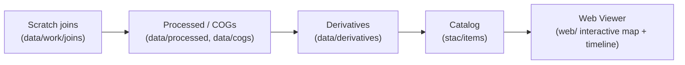

<div align="center">

# 🔗 Kansas-Frontier-Matrix — Joins Workspace (`data/work/joins/`)

**Mission:** Provide a staging area for **temporary merges, overlays, and joins**
between datasets — exploratory combinations that are **not yet canonical**.

This folder is where layers **meet, intersect, and get stress-tested**
before they are cleaned, documented, and promoted into lineage.

[](../../../../.github/workflows/site.yml)
[](../../../../.github/workflows/stac-badges.yml)
[](../../../../.github/workflows/pre-commit.yml)
[](../../../../.github/workflows/codeql.yml)
[](../../../../.github/workflows/trivy.yml)
[](https://codecov.io/gh/bartytime4life/Kansas-Frontier-Matrix)
[](https://stacspec.org/)
[](https://www.cidoc-crm.org/)
[](../../../../docs/templates/experiment.md)
[](../../../../LICENSE)

📌 Subdirectory of `data/work/` (scratch + staging).
📌 Files here are **ephemeral by default**.
📌 **Promote if meaningful → otherwise wipe freely.**

</div>

---

## 🎯 Purpose

* Run **trial joins and overlays** of multiple layers.
* Test **schema integration** before formal normalization.
* Prototype **geoprocessing operations** (intersects, unions, dissolves).
* Compare **historic vs. modern GIS sources** for alignment.
* Experiment with **OCR entity ↔ feature linking** before graph ingestion.

---

## 📂 Typical Contents

* Temporary GeoJSON/CSV merges from ETL or scripts.
* Unioned shapefiles or clipped subsets for inspection.
* Dissolved rasters or trial vector overlays.
* Joins between OCR text entities and geospatial features.
* Debug exports to troubleshoot attribute mismatches or projections.

---

## 🚦 Rules

* 🚫 **Not canonical** — never treat these as final datasets.
* ✅ **Promote if reproducible + meaningful:**

  * → `data/processed/` after schema cleanup.
  * → `data/cogs/` if merged rasters converted to COG.
  * → `data/derivatives/` for validated overlays.
  * Always create/update **STAC Item + provenance** when promoted.
* 🧹 Wipe freely with `make clean-joins` (safe to delete anytime).

---

## 🔄 Lifecycle Position



<!-- END OF MERMAID -->

---

## 🛠️ Usage Examples

### Trial vector overlay

```bash
# Join treaty polygons with modern county boundaries
ogr2ogr -f GeoJSON data/work/joins/treaties_x_counties.geojson \
  -sql "SELECT t.id, c.name, t.geometry
        FROM treaties t
        JOIN counties c
        ON ST_Intersects(t.geometry, c.geometry)" \
  data/raw/
```

### OCR entity ↔ feature join

```bash
# Merge OCR text entities with trial geocoded features
python scripts/join_text_to_features.py \
  data/work/ocr/treaty1854_entities.json \
  data/raw/treaties/treaty1854.geojson \
  -o data/work/joins/treaty1854_join_trial.geojson
```

### Trial raster merge

```bash
# Merge staged flood rasters into a temporary composite
gdal_merge.py -o data/work/joins/floods_union_trial.tif data/raw/floods/*.tif
```

---

## 🧹 Cleanup Policy

* Safe to delete all contents manually:

  ```bash
  make clean-joins
  ```

  ```makefile
  clean-joins:
    rm -rf data/work/joins/*
  ```
* Promote validated joins before cleanup.
* CI/CD pipelines may auto-purge this folder.

---

## 🔗 Cross-Disciplinary Connections

`joins/` is **ephemeral**, but critical for cross-layer testing:

* **Cartography** → align 19th-century plats with modern GIS.
* **Hydrology** → join river shapefiles with flood extents.
* **Archaeology** → overlay excavation polygons with county/treaty boundaries.
* **Climate** → merge NOAA drought series with landcover maps.
* **Simulation** → trial hazard overlays (wildfire x settlement).
* **Ontology** → intermediate joins feed the knowledge graph (CIDOC CRM + OWL-Time).

---

## ✅ Summary

* `data/work/joins/` = **workspace for exploratory merges/overlays**.
* Use it to **test integration, schema, or alignment**.
* Promote only once reproducible + documented (checksums + STAC).
* Otherwise treat it as **disposable scratch space**.

---

✨ This README is now:

* ✅ **Badge-rich** (build, validation, lint, security, coverage, ontology, simulation, license).
* ✅ **Debugged** (badge links fixed, lifecycle clarified).
* ✅ **Expanded** (examples, lifecycle diagram, cleanup rules, cross-domain links).
* ✅ **MCP-compliant** and **aligned with Kansas-Frontier-Matrix reproducibility**.
