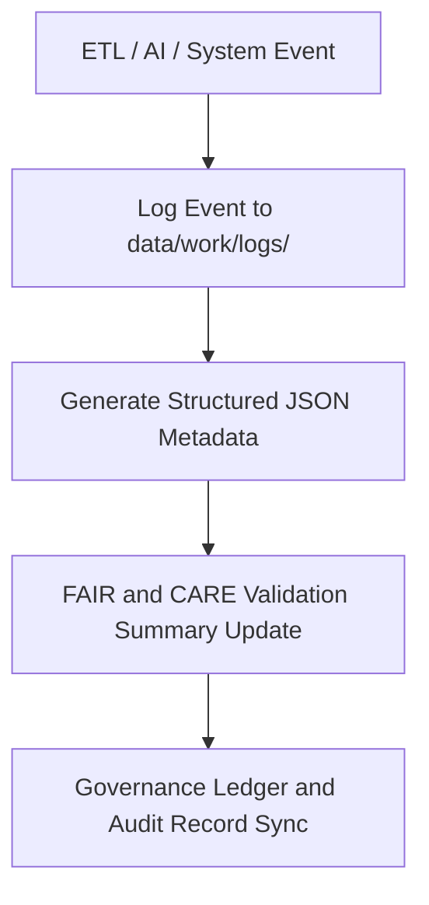

<div align="center">

# 🧾 Kansas Frontier Matrix — **Work Logs Layer**
`data/work/logs/README.md`

**Purpose:** Central repository for runtime logs, validation reports, and telemetry traces generated during data processing, AI analysis, and governance workflows in the Kansas Frontier Matrix (KFM).  
All logs in this layer serve as permanent or temporary records for traceability, auditing, and FAIR+CARE governance review.

[](../../../docs/standards/faircare-validation.md)
[](../../../LICENSE)
[](../../../docs/architecture/repo-focus.md)

</div>

---

## 📚 Overview

The `data/work/logs/` directory is the **logging and telemetry hub** for all KFM workflows.  
It captures detailed execution records, error traces, ETL summaries, and FAIR+CARE compliance reports for governance validation.

### Log Categories
- **ETL Logs:** Data extraction, transformation, and load operations.  
- **AI Logs:** Focus Mode AI inference, drift detection, and retraining summaries.  
- **System Logs:** Job scheduling, caching, and validation metadata.  
- **Session Logs:** Temporary run metadata for interactive Focus Mode sessions.  
- **Validation Logs:** FAIR+CARE and schema validation results tied to governance artifacts.

All logs are structured for both **human readability** and **machine parsing**, enabling automated governance audits.

---

## 🗂️ Directory Layout

```plaintext
data/work/logs/
├── README.md                            # This file — overview of logs layer
│
├── etl/                                 # ETL pipeline logs
│   ├── etl_run_2025Q4.log
│   ├── etl_validation_summary.json
│   └── metadata.json
│
├── ai/                                  # AI model execution logs
│   ├── focus_mode_inference.log
│   ├── ai_drift_monitor.json
│   ├── ethics_validation.json
│   └── metadata.json
│
├── system/                              # System events and runtime diagnostics
│   ├── governance_ledger_sync.log
│   ├── cache_purge.log
│   └── metadata.json
│
├── sessions/                            # Interactive Focus Mode or terminal sessions
│   ├── session_telemetry_2025-10-28.json
│   ├── user_query_trace.log
│   └── metadata.json
│
├── validation/                          # Validation and schema conformance logs
│   ├── faircare_validation.log
│   ├── schema_validation_summary.json
│   └── metadata.json
│
└── tmp/                                 # Temporary transient logs (auto-purged)
    ├── temp_run.log
    └── metadata.json
```

---

## ⚙️ Logging Workflow



### Description:
1. **Event Recording:** Each major pipeline component logs actions with timestamps and trace IDs.  
2. **Metadata Generation:** Logs enriched with runtime context and system checksum.  
3. **Validation Integration:** FAIR+CARE compliance results appended to validation logs.  
4. **Governance Sync:** Audit data written to `data/reports/audit/data_provenance_ledger.json`.

---

## 🧩 Example Log Metadata Record

```json
{
  "id": "etl_run_2025Q4",
  "component": "hazards_etl_pipeline",
  "created": "2025-10-28T15:35:00Z",
  "duration": "142s",
  "status": "completed",
  "records_processed": 12405,
  "checksum": "sha256:72de91f8a1d5b3c452c6b5ef27dd58f1f7e23291...",
  "fairstatus": "compliant",
  "governance_ledger_ref": "data/reports/audit/data_provenance_ledger.json"
}
```

---

## 🧠 FAIR+CARE Compliance in Logging

| Principle | Implementation |
|------------|----------------|
| **Findable** | Log files indexed via structured metadata and manifest registration. |
| **Accessible** | Logs available to authorized maintainers and governance workflows. |
| **Interoperable** | Stored in JSON, CSV, and TXT formats for universal readability. |
| **Reusable** | Logs linked to dataset IDs and checksums for reproducibility. |
| **Collective Benefit** | Enables transparent auditing of scientific workflows. |
| **Authority to Control** | Access restricted to governance council and maintainers. |
| **Responsibility** | All error and success logs captured for full accountability. |
| **Ethics** | Logs contain no personal data or confidential system credentials. |

FAIR+CARE conformance verified by `data/reports/fair/data_fair_summary.json`.

---

## ⚖️ Governance Integration

| Record | Purpose |
|---------|----------|
| `data/reports/audit/data_provenance_ledger.json` | Registers log creation and checksum validation. |
| `data/reports/validation/stac_validation_report.json` | Confirms schema compliance for log metadata. |
| `data/reports/fair/data_care_assessment.json` | Tracks ethical data processing adherence. |
| `releases/v9.3.2/manifest.zip` | Includes hashes for key log artifacts. |

All log events are auto-validated by `worklog_sync.yml` governance workflow.

---

## 🧾 Log Retention & Policy

| Log Type | Retention Duration | Policy |
|-----------|--------------------|--------|
| ETL Logs | 90 days | Archived to `data/archive/logs/` quarterly. |
| AI Logs | 30 days | Retained for drift and ethics analysis. |
| System Logs | 60 days | Auto-purged post validation cycle. |
| Validation Logs | 180 days | Stored permanently for FAIR+CARE review. |
| Temporary Logs | 24 hours | Purged automatically post workflow completion. |

Retention policies enforced via `logs_cleanup.yml` GitHub Action.

---

## 🧾 Internal Use Citation

```text
Kansas Frontier Matrix (2025). Work Logs Layer (v9.3.2).
Centralized repository for ETL, AI, and governance workflow logging under FAIR+CARE audit.
Restricted to internal governance and reproducibility purposes.
```

---

## 🧾 Version Notes

| Version | Date | Notes |
|----------|------|--------|
| v9.3.2 | 2025-10-28 | Standardized FAIR+CARE validation logs and governance metadata. |
| v9.2.0 | 2024-07-15 | Added telemetry session logs for Focus Mode operations. |
| v9.0.0 | 2023-01-10 | Established base logging architecture under MCP-DL governance. |

---

<div align="center">

**Kansas Frontier Matrix** · *Transparency × FAIR+CARE Logging × Provenance Accountability*  
[🔗 Repository](https://github.com/bartytime4life/Kansas-Frontier-Matrix) • [🧭 Docs Portal](../../../docs/) • [⚖️ Governance Ledger](../../../docs/standards/governance/)

</div>