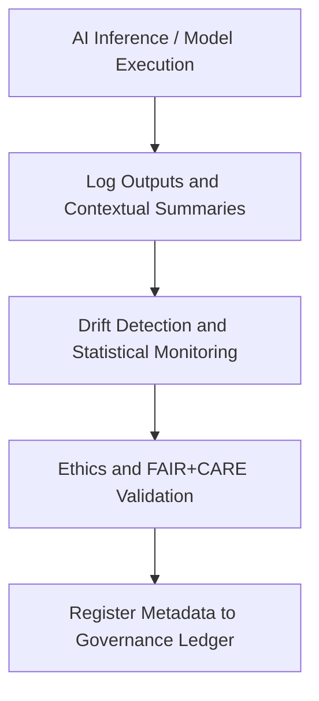

<div align="center">

# 🤖 Kansas Frontier Matrix — **AI Logs**
`data/work/logs/ai/README.md`

**Purpose:** Captures all AI-related runtime logs, Focus Mode outputs, drift detection reports, and explainability summaries generated within Kansas Frontier Matrix (KFM).  
These logs provide a transparent and auditable record of model performance, ethical compliance, and AI behavior under FAIR+CARE governance.

[](../../../../docs/standards/faircare-validation.md)
[](../../../../LICENSE)
[](../../../../docs/architecture/repo-focus.md)

</div>

---

## 📚 Overview

The `data/work/logs/ai/` directory records all AI and machine learning-related logging activities within the KFM platform, including:

- **Model Inference Logs:** Outputs from Focus Mode semantic reasoning and contextual summaries.  
- **Drift Detection Reports:** Statistical tracking of model performance and temporal bias.  
- **Explainability Reports:** SHAP, LIME, and attention-weight analysis for transparency.  
- **Governance Validation:** FAIR+CARE ethical validation and human oversight documentation.  
- **AI Lifecycle Metadata:** Model version, checksum, and validation context tracking.

These logs form a core component of KFM’s **AI Governance Framework**, ensuring transparency, reproducibility, and trust in all automated analyses.

---

## 🗂️ Directory Layout

```plaintext
data/work/logs/ai/
├── README.md                              # This file — overview of AI logs
│
├── focus_mode_inference.log               # Inference session summaries from Focus Mode
├── ai_drift_monitor.json                  # Model drift metrics and statistical diagnostics
├── explainability_report.json             # SHAP/LIME explainability outputs
├── ethics_validation.json                 # FAIR+CARE ethical audit summary
└── metadata.json                          # Model version, runtime, and governance linkage
```

---

## ⚙️ AI Logging Workflow



### Description:
1. **Execution:** AI models perform Focus Mode inference or predictive analysis.  
2. **Logging:** Outputs (text, embeddings, explanations) recorded under standardized formats.  
3. **Monitoring:** Drift detection scripts compare distributions across temporal runs.  
4. **Ethics Validation:** Reports generated for compliance with FAIR+CARE standards.  
5. **Governance Sync:** Metadata entries written to `data/reports/audit/ai_hazards_ledger.json`.

---

## 🧩 Example Metadata Record

```json
{
  "id": "ai_focus_mode_run_2025Q4",
  "model": "gpt-5-geo-hybrid-v3.2",
  "runtime_context": "focus_mode_session_2025-10-28",
  "created": "2025-10-28T15:22:00Z",
  "records_processed": 234,
  "drift_detected": false,
  "ethics_score": 100,
  "checksum": "sha256:6a0f1cd2a4a72dfcfb79b173c17b5c20eacb332d...",
  "governance_tags": ["AI", "FAIR+CARE", "FocusMode"],
  "governance_ref": "data/reports/audit/ai_hazards_ledger.json"
}
```

---

## 🧠 FAIR+CARE AI Governance

| Principle | Implementation |
|------------|----------------|
| **Findable** | Each log includes model name, version, timestamp, and session ID. |
| **Accessible** | Internal FAIR+CARE Council and maintainers can access all AI logs. |
| **Interoperable** | Logs stored in open formats (JSON, CSV, TXT). |
| **Reusable** | Provenance metadata ensures full auditability and reproducibility. |
| **Collective Benefit** | Enables ethical transparency in automated hazard and climate analyses. |
| **Authority to Control** | AI Governance Council authorizes and audits each model use. |
| **Responsibility** | Drift and explainability reports ensure accountability. |
| **Ethics** | Logs contain no personal or private data; reviewed by FAIR+CARE Ethics Board. |

FAIR+CARE audit results consolidated in:  
`data/reports/fair/data_care_assessment.json` and `data/reports/audit/ai_hazards_ledger.json`.

---

## ⚙️ AI Drift Monitoring

Drift metrics track changes in model behavior across runs.

| Metric | Description | Example Value |
|---------|--------------|----------------|
| `feature_distribution_drift` | KL divergence between input feature distributions | `0.0023` |
| `embedding_cosine_shift` | Cosine distance change in embedding space | `0.0134` |
| `summary_bias_delta` | Semantic bias delta between sessions | `0.0045` |
| `drift_detected` | Boolean indicating drift threshold exceeded | `false` |

If drift is detected, automatic retraining triggers are logged under `data/work/logs/ai_drift_monitor.json`.

---

## ⚖️ Explainability & Ethics Auditing

AI explainability and ethical validations ensure responsible model transparency.

| File | Description |
|------|-------------|
| `explainability_report.json` | Model explainability outputs (SHAP/LIME/attention maps). |
| `ethics_validation.json` | FAIR+CARE ethical compliance assessment for AI outputs. |
| `ai_drift_monitor.json` | Statistical model drift and retraining triggers. |

> 🧩 **Note:** All explainability and ethics reports are reviewed quarterly by the FAIR+CARE Council.

---

## 🔍 Governance & Provenance Integration

| Record | Description |
|---------|-------------|
| `metadata.json` | Captures model version, runtime context, and checksums. |
| `data/reports/audit/ai_hazards_ledger.json` | Governance ledger for AI runs and validations. |
| `data/reports/fair/data_care_assessment.json` | AI ethics and governance compliance results. |
| `releases/v9.3.2/focus-telemetry.json` | Focus Mode AI telemetry dataset. |

All AI logs are cryptographically hashed and cross-referenced with governance records for reproducibility.

---

## 🧾 Log Retention Policy

| Log Type | Retention | Notes |
|-----------|------------|-------|
| Inference Logs | 30 days | Retained for model reproducibility and QA. |
| Drift Detection | 90 days | Used for trend analysis and retraining governance. |
| Explainability | 180 days | Stored permanently for FAIR+CARE review. |
| Ethics Validation | 365 days | Retained for full AI governance cycle. |

Policies enforced via `ai_log_cleanup.yml` GitHub Action.

---

## 🧾 Internal Use Citation

```text
Kansas Frontier Matrix (2025). AI Logs (v9.3.2).
Comprehensive record of AI inference, drift detection, and ethical validation logs under FAIR+CARE governance.
Restricted to internal reproducibility and governance workflows.
```

---

## 🧾 Version Notes

| Version | Date | Notes |
|----------|------|--------|
| v9.3.2 | 2025-10-28 | Enhanced explainability and drift tracking with checksum governance. |
| v9.2.0 | 2024-07-15 | Added Focus Mode ethics validation and telemetry integration. |
| v9.0.0 | 2023-01-10 | Established AI logging structure under MCP-DL v6.0. |

---

<div align="center">

**Kansas Frontier Matrix** · *AI Transparency × Ethical Governance × FAIR+CARE Accountability*  
[🔗 Repository](https://github.com/bartytime4life/Kansas-Frontier-Matrix) • [🧭 Docs Portal](../../../../docs/) • [⚖️ Governance Ledger](../../../../docs/standards/governance/)

</div>