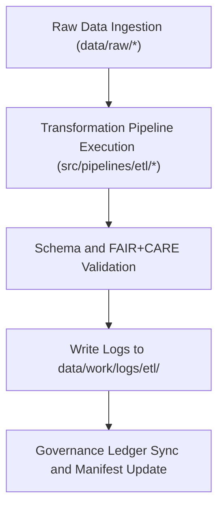

<div align="center">

# ⚙️ Kansas Frontier Matrix — **ETL Logs**
`data/work/logs/etl/README.md`

**Purpose:** Captures structured logs, transformation reports, and validation summaries from all ETL (Extract, Transform, Load) pipelines within the Kansas Frontier Matrix (KFM).  
These logs provide reproducibility, transparency, and FAIR+CARE-compliant accountability for every data processing operation.

[](../../../../docs/standards/faircare-validation.md)
[](../../../../LICENSE)
[](../../../../docs/architecture/repo-focus.md)

</div>

---

## 📚 Overview

The `data/work/logs/etl/` directory contains runtime logs and transformation records generated by KFM’s **ETL pipelines**.  
Each log provides step-by-step documentation of data ingestion, normalization, validation, and export operations — ensuring full lineage visibility and governance compliance.

### ETL Logging Objectives:
- Record every data transformation stage for reproducibility.  
- Log validation errors, schema mismatches, and correction details.  
- Capture FAIR+CARE metadata propagation across pipeline steps.  
- Synchronize with governance ledger and checksum manifest after each run.

All ETL logs are machine-readable, JSON-structured, and integrated into the KFM audit system.

---

## 🗂️ Directory Layout

```plaintext
data/work/logs/etl/
├── README.md                              # This file — ETL logging documentation
│
├── etl_run_2025Q4.log                     # Human-readable execution summary
├── etl_validation_summary.json             # Validation and schema conformance report
├── etl_performance_metrics.json            # Performance and throughput statistics
├── metadata.json                           # Runtime context and governance metadata
└── transformation_steps.log                # Detailed transformation and normalization trace
```

---

## ⚙️ ETL Logging Workflow



### Process Steps:
1. **Ingestion:** Raw data fetched from external sources (NOAA, USGS, FEMA, etc.).  
2. **Transformation:** Normalization, spatial harmonization, and metadata enrichment.  
3. **Validation:** Schema, checksum, and FAIR+CARE ethical compliance checks.  
4. **Logging:** Outputs written to structured logs for provenance auditing.  
5. **Governance:** Log summaries linked to `data/reports/audit/data_provenance_ledger.json`.

---

## 🧩 Example ETL Log Metadata Record

```json
{
  "id": "etl_run_hazards_v9.3.2",
  "pipeline": "src/pipelines/etl/hazards_pipeline.py",
  "created": "2025-10-28T15:12:00Z",
  "duration": "00:03:47",
  "status": "success",
  "source_datasets": [
    "data/raw/noaa/storm_events/storm_events_2025.csv",
    "data/raw/fema/flood_zones/kansas_flood_zones_2025.geojson"
  ],
  "records_processed": 24321,
  "validation_issues": 2,
  "checksum": "sha256:7a42e9a54ffb7a33b9e86efb12ed33db314f998a...",
  "governance_ledger_ref": "data/reports/audit/data_provenance_ledger.json",
  "fairstatus": "compliant"
}
```

---

## 🧠 FAIR+CARE Governance in ETL

| Principle | Implementation |
|------------|----------------|
| **Findable** | Each ETL run uniquely identified and logged with dataset references. |
| **Accessible** | Logs available to internal governance council and automation workflows. |
| **Interoperable** | JSON and CSV log formats ensure broad compatibility. |
| **Reusable** | Logs retain provenance and schema tracebacks for reproducibility. |
| **Collective Benefit** | Enables ethical, transparent scientific workflows. |
| **Authority to Control** | Maintainers can trace, review, and verify each ETL operation. |
| **Responsibility** | Validation results recorded for FAIR+CARE compliance. |
| **Ethics** | Logs contain no sensitive data — technical metadata only. |

Governance audits reference:  
`data/reports/fair/data_care_assessment.json` and `data/reports/audit/data_provenance_ledger.json`.

---

## ⚙️ Key Log Types

| Log File | Description | Format |
|-----------|--------------|--------|
| `etl_run_*.log` | Execution trace for ETL sessions (success/failure, duration, errors). | Plain text |
| `etl_validation_summary.json` | Schema and FAIR+CARE validation outcomes. | JSON |
| `etl_performance_metrics.json` | Throughput, memory, and runtime metrics for performance analysis. | JSON |
| `transformation_steps.log` | Stepwise normalization and data cleaning operations. | Plain text |
| `metadata.json` | Provenance metadata linking ETL logs to governance ledger. | JSON |

---

## ⚖️ Governance & Provenance Integration

| Record | Description |
|---------|-------------|
| `metadata.json` | Records pipeline name, checksum, and runtime context. |
| `data/reports/audit/data_provenance_ledger.json` | Master record for ETL lineage and checksum validation. |
| `data/reports/validation/stac_validation_report.json` | Validation and schema review report. |
| `releases/v9.3.2/manifest.zip` | Global checksum registry for reproducible ETL artifacts. |

---

## 🧾 ETL Log Retention Policy

| Log Type | Retention Duration | Policy |
|-----------|--------------------|--------|
| ETL Execution Logs | 90 days | Archived quarterly to `data/archive/logs/etl/`. |
| Validation Reports | 180 days | Retained permanently for FAIR+CARE review. |
| Performance Metrics | 60 days | Purged after governance audit verification. |
| Transformation Logs | 30 days | Cleared upon next successful ETL run. |

Retention automated by `etl_logs_cleanup.yml` GitHub Action.

---

## 🧾 Internal Use Citation

```text
Kansas Frontier Matrix (2025). ETL Logs (v9.3.2).
Comprehensive record of ETL workflow execution, schema validation, and FAIR+CARE governance under MCP-DL v6.3.
Restricted to internal reproducibility and audit purposes.
```

---

## 🧾 Version Notes

| Version | Date | Notes |
|----------|------|--------|
| v9.3.2 | 2025-10-28 | Introduced unified performance and FAIR+CARE validation logging. |
| v9.2.0 | 2024-07-15 | Added transformation step-by-step trace logging. |
| v9.0.0 | 2023-01-10 | Established ETL logging system under FAIR+CARE governance. |

---

<div align="center">

**Kansas Frontier Matrix** · *ETL Transparency × FAIR+CARE Accountability × Provenance Audit Integrity*  
[🔗 Repository](https://github.com/bartytime4life/Kansas-Frontier-Matrix) • [🧭 Docs Portal](../../../../docs/) • [⚖️ Governance Ledger](../../../../docs/standards/governance/)

</div>