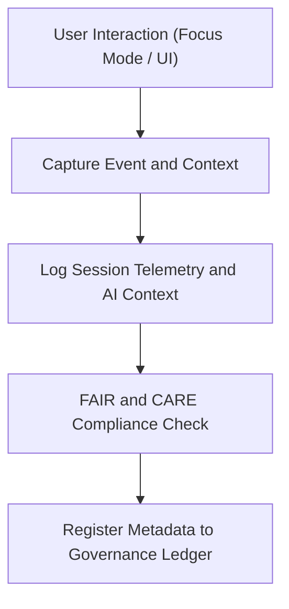

<div align="center">

# 🧑‍💻 Kansas Frontier Matrix — **Session Logs**
`data/work/logs/sessions/README.md`

**Purpose:** Tracks interactive sessions, Focus Mode events, and real-time user interactions executed within Kansas Frontier Matrix (KFM).  
Session logs ensure reproducibility of user actions, contextual queries, and AI-assisted insights under FAIR+CARE governance and audit control.

[](../../../../docs/standards/faircare-validation.md)
[](../../../../LICENSE)
[](../../../../docs/architecture/repo-focus.md)

</div>

---

## 📚 Overview

The `data/work/logs/sessions/` directory records all **interactive and AI-assisted session logs**, including:
- User interactions within Focus Mode and Exploration Mode.  
- AI-generated responses and contextual summaries.  
- Session telemetry and governance context for audit tracking.  
- FAIR+CARE user accountability and transparency metadata.  

Each session log represents a discrete time-bounded record that links human actions, AI insights, and resulting outputs for full reproducibility and ethical review.

---

## 🗂️ Directory Layout

```plaintext
data/work/logs/sessions/
├── README.md                            # This file — documentation for session logs
│
├── session_telemetry_2025-10-28.json    # Focus Mode and user interaction trace
├── user_query_trace.log                 # Chronological record of user queries and responses
├── ai_context_snapshot.json             # AI state and context data captured mid-session
└── metadata.json                        # Session-level provenance and governance information
```

---

## ⚙️ Session Logging Workflow



### Description:
1. **Capture:** Session begins upon user entry into Focus Mode or KFM web interface.  
2. **Telemetry:** Real-time user and AI actions captured with timestamps and context.  
3. **Ethics Review:** FAIR+CARE filters verify privacy and compliance boundaries.  
4. **Governance:** Session metadata and hashes logged to `data/reports/audit/data_provenance_ledger.json`.

---

## 🧩 Example Session Metadata Record

```json
{
  "session_id": "focus_session_2025-10-28T15:30:00Z",
  "user_role": "analyst",
  "mode": "Focus Mode",
  "duration_minutes": 42,
  "events_logged": 182,
  "ai_model": "gpt-5-geo-hybrid-v3.2",
  "checksum": "sha256:ce02ad4e89d7b1f4b3cf42c2d4319a42a35f9910...",
  "created": "2025-10-28T16:12:00Z",
  "ethics_review_status": "compliant",
  "governance_ledger_ref": "data/reports/audit/data_provenance_ledger.json"
}
```

---

## 🧠 FAIR+CARE Governance in Session Logging

| Principle | Implementation |
|------------|----------------|
| **Findable** | Each session log contains unique session ID, timestamps, and context tags. |
| **Accessible** | Logs available to FAIR+CARE governance reviewers (non-public). |
| **Interoperable** | Logs stored as JSON and plain text for universal parsing. |
| **Reusable** | Metadata ensures reproducibility of AI-assisted workflows. |
| **Collective Benefit** | Improves transparency of human–AI interaction processes. |
| **Authority to Control** | FAIR+CARE Council oversees retention and access controls. |
| **Responsibility** | Logs reviewed for ethical compliance and reproducibility. |
| **Ethics** | Contains no personal data; anonymized for governance integrity. |

Governance audits reference:  
`data/reports/fair/data_care_assessment.json` and `data/reports/audit/data_provenance_ledger.json`.

---

## ⚙️ Session Telemetry Schema

| Field | Description | Example |
|--------|--------------|----------|
| `timestamp` | Time of logged interaction | `2025-10-28T15:33:22Z` |
| `action_type` | User or AI event type | `user_query`, `ai_response`, `map_interaction` |
| `content` | Text or context payload of event | `"Show me tornado paths for 1999"` |
| `latency_ms` | Processing duration | `843` |
| `source_component` | System module that generated the log | `FocusMode-UI`, `AI-Engine` |
| `result_checksum` | Hash of AI output or response | `sha256:...` |

All session telemetry validated for schema conformance under `data/reports/validation/schema_validation_summary.json`.

---

## ⚖️ Governance & Provenance Integration

| Record | Description |
|---------|-------------|
| `metadata.json` | Session-level runtime, duration, and provenance metadata. |
| `data/reports/audit/data_provenance_ledger.json` | Logs session hashes and FAIR+CARE status. |
| `data/reports/validation/schema_validation_summary.json` | Schema compliance verification for session telemetry. |
| `releases/v9.3.2/manifest.zip` | Contains global checksum references for all sessions. |

---

## 🧾 Session Retention Policy

| Log Type | Retention | Policy |
|-----------|------------|--------|
| Session Telemetry | 30 days | Purged after review or upon user request. |
| Query Traces | 14 days | Retained for performance audit only. |
| AI Context Snapshots | 7 days | Automatically regenerated each model version. |
| Governance Metadata | 365 days | Permanent archival in audit ledger. |

Retention automation handled via `session_logs_cleanup.yml` GitHub Action.

---

## 🧾 Internal Use Citation

```text
Kansas Frontier Matrix (2025). Session Logs (v9.3.2).
Comprehensive record of Focus Mode and interactive session telemetry under FAIR+CARE governance.
Restricted to internal audit and reproducibility analysis.
```

---

## 🧾 Version Notes

| Version | Date | Notes |
|----------|------|--------|
| v9.3.2 | 2025-10-28 | Introduced checksum and governance linkage for session telemetry. |
| v9.2.0 | 2024-07-15 | Added AI context snapshot and real-time trace schema. |
| v9.0.0 | 2023-01-10 | Established base session logging architecture for Focus Mode. |

---

<div align="center">

**Kansas Frontier Matrix** · *Human–AI Interaction × FAIR+CARE Governance × Provenance Transparency*  
[🔗 Repository](https://github.com/bartytime4life/Kansas-Frontier-Matrix) • [🧭 Docs Portal](../../../../docs/) • [⚖️ Governance Ledger](../../../../docs/standards/governance/)

</div>