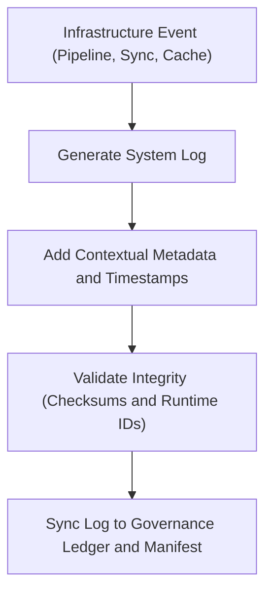

<div align="center">

# 🖥️ Kansas Frontier Matrix — **System Logs**
`data/work/logs/system/README.md`

**Purpose:** Stores internal system event logs, automation traces, and governance synchronization records generated during Kansas Frontier Matrix (KFM) operations.  
These logs ensure infrastructure observability, reproducibility, and compliance under FAIR+CARE and MCP-DL v6.3 governance standards.

[](../../../../docs/standards/faircare-validation.md)
[](../../../../LICENSE)
[](../../../../docs/architecture/repo-focus.md)

</div>

---

## 📚 Overview

The `data/work/logs/system/` directory contains logs documenting KFM’s **infrastructure automation, data synchronization, and governance ledger operations**.  
These logs serve as an auditable backbone for platform health monitoring, validation workflows, and FAIR+CARE lifecycle compliance.

### System Log Coverage:
- **Governance Ledger Sync:** Records provenance synchronization and checksum validation events.  
- **Cache Maintenance:** Monitors automatic cache refresh and purge cycles.  
- **Workflow Automation:** Captures GitHub Action and CI/CD pipeline events.  
- **Integrity Validation:** Tracks system state comparisons, checksum mismatches, and resolution steps.  
- **Resource Usage:** Logs runtime resource allocation and cleanup.  

All system logs follow standardized JSON/line-delimited formatting for seamless ingestion into governance dashboards.

---

## 🗂️ Directory Layout

```plaintext
data/work/logs/system/
├── README.md                              # This file — overview of system logs
│
├── governance_ledger_sync.log             # Records ledger update operations and checksum validation
├── cache_purge.log                        # Cache cleanup and maintenance activity log
├── workflow_automation.log                # CI/CD and scheduled workflow execution trace
├── system_health.json                     # System performance metrics and uptime summaries
└── metadata.json                          # Runtime context and governance references
```

---

## ⚙️ System Logging Workflow



### Process Description:
1. **Event Trigger:** System event (cache refresh, ledger update, or CI/CD action) initiates logging.  
2. **Logging:** Event output stored in standardized JSON or text log formats.  
3. **Validation:** Checksums generated and validated against manifest registry.  
4. **Governance:** Metadata written to `data/reports/audit/data_provenance_ledger.json`.  

---

## 🧩 Example System Metadata Record

```json
{
  "id": "system_ledger_sync_2025Q4",
  "component": "governance_sync",
  "created": "2025-10-28T15:00:00Z",
  "duration": "00:01:22",
  "status": "success",
  "operations": [
    "validated 8 checksum records",
    "updated FAIR+CARE compliance flags"
  ],
  "checksum": "sha256:d72c9f8132c7a5f9b930bb5e13a40a5411ad89c7...",
  "fairstatus": "compliant",
  "governance_ref": "data/reports/audit/data_provenance_ledger.json"
}
```

---

## 🧠 FAIR+CARE Compliance in System Logging

| Principle | Implementation |
|------------|----------------|
| **Findable** | Each log entry includes timestamp, component, and reference ID. |
| **Accessible** | Logs available internally to governance council and automation auditors. |
| **Interoperable** | Stored in open JSON and text formats for cross-platform analysis. |
| **Reusable** | Logs maintain provenance and integrity for reproducibility. |
| **Collective Benefit** | Supports transparent governance, validation, and automation. |
| **Authority to Control** | Governance system administrators manage access. |
| **Responsibility** | Logs confirm system operation and data integrity adherence. |
| **Ethics** | Contains no user data or sensitive infrastructure details. |

FAIR+CARE audit alignment verified in:  
`data/reports/fair/data_care_assessment.json` and `data/reports/audit/data_provenance_ledger.json`.

---

## ⚙️ System Log Types

| File | Description | Format |
|------|--------------|--------|
| `governance_ledger_sync.log` | Governance synchronization and checksum verification log. | Text |
| `cache_purge.log` | Cache refresh, purge, and invalidation activity summary. | Text |
| `workflow_automation.log` | Workflow execution trace from GitHub Actions and automation. | Text |
| `system_health.json` | System resource monitoring and uptime statistics. | JSON |
| `metadata.json` | System runtime context and governance linkage. | JSON |

---

## ⚖️ Governance & Provenance Integration

| Record | Description |
|---------|-------------|
| `metadata.json` | Context and runtime provenance for system events. |
| `data/reports/audit/data_provenance_ledger.json` | Master ledger recording all system and governance operations. |
| `data/reports/validation/schema_validation_summary.json` | Schema validation and structural consistency results. |
| `releases/v9.3.2/manifest.zip` | Global checksum registry linking to log file hashes. |

System logs directly support governance reporting and integrity validation across the entire KFM platform.

---

## 🧾 System Log Retention Policy

| Log Type | Retention Duration | Notes |
|-----------|--------------------|--------|
| Governance Ledger Sync | 365 days | Permanent archival for provenance continuity. |
| Cache Purge Logs | 30 days | Purged after each system maintenance cycle. |
| Workflow Automation | 90 days | Retained for build and CI/CD reproducibility. |
| System Health Reports | 180 days | Aggregated quarterly into performance dashboard. |

Retention policies enforced by `system_log_cleanup.yml` automation.

---

## 🧾 Internal Use Citation

```text
Kansas Frontier Matrix (2025). System Logs (v9.3.2).
Governance, cache, and workflow event logs ensuring FAIR+CARE system observability and reproducible infrastructure auditing.
Restricted to internal governance and validation use.
```

---

## 🧾 Version Notes

| Version | Date | Notes |
|----------|------|--------|
| v9.3.2 | 2025-10-28 | Enhanced governance synchronization and cache purge traceability. |
| v9.2.0 | 2024-07-15 | Added workflow automation logs for CI/CD transparency. |
| v9.0.0 | 2023-01-10 | Established core system logging architecture for FAIR+CARE compliance. |

---

<div align="center">

**Kansas Frontier Matrix** · *System Reliability × FAIR+CARE Governance × Provenance Integrity*  
[🔗 Repository](https://github.com/bartytime4life/Kansas-Frontier-Matrix) • [🧭 Docs Portal](../../../../docs/) • [⚖️ Governance Ledger](../../../../docs/standards/governance/)

</div>