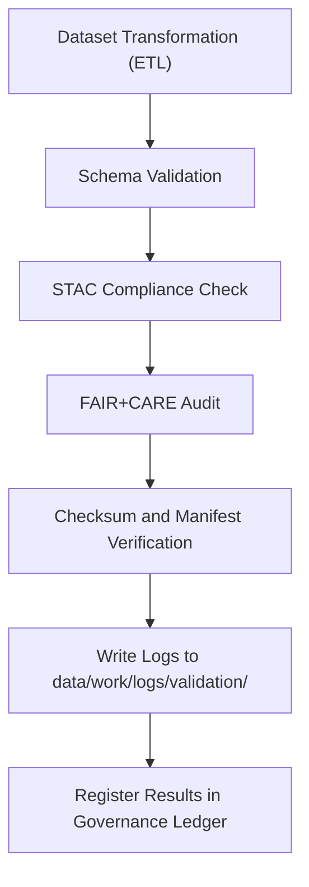

<div align="center">

# ✅ Kansas Frontier Matrix — **Validation Logs**
`data/work/logs/validation/README.md`

**Purpose:** Stores detailed validation, QA, and schema conformance logs produced during Kansas Frontier Matrix (KFM) data workflows.  
These logs ensure dataset integrity, FAIR+CARE compliance, and transparent documentation of all data quality assurance activities.

[](../../../../docs/standards/faircare-validation.md)
[](../../../../LICENSE)
[](../../../../docs/architecture/repo-focus.md)

</div>

---

## 📚 Overview

The `data/work/logs/validation/` directory contains logs, reports, and summaries generated during automated and manual validation workflows.  
Each log captures the results of schema testing, STAC compliance checks, checksum verification, and FAIR+CARE audits.

Validation logs link datasets to their corresponding governance metadata, ensuring full **lineage accountability and reproducibility** across all ETL and archival processes.

---

## 🗂️ Directory Layout

```plaintext
data/work/logs/validation/
├── README.md                                 # This file — documentation of validation logs
│
├── faircare_validation.log                   # Results of FAIR+CARE compliance audits
├── schema_validation_summary.json            # Schema validation outcomes and field-level checks
├── stac_validation_report.json               # STAC metadata validation results
├── data_integrity_check.log                  # Checksum and file integrity verification
└── metadata.json                             # Runtime provenance and governance linkage
```

---

## ⚙️ Validation Workflow



### Description:
1. **Schema Validation:** Ensures conformance to dataset-specific JSON schemas.  
2. **STAC Compliance:** Validates metadata using `stac-validator` for spatial/temporal completeness.  
3. **FAIR+CARE Review:** Ethical, accessibility, and transparency verification.  
4. **Checksum Audit:** Confirms integrity across pipeline artifacts and releases.  
5. **Governance Registration:** Results logged into `data/reports/audit/data_provenance_ledger.json`.

---

## 🧩 Example Metadata Record

```json
{
  "id": "validation_hazards_v9.3.2",
  "dataset_ref": "data/archive/hazards/hazards_v9.3.2/",
  "created": "2025-10-28T15:20:00Z",
  "validator": "@kfm-data-lab",
  "schema_compliance": "passed",
  "stac_compliance": "passed",
  "faircare_score": 98.7,
  "checksum_verified": true,
  "issues_found": 0,
  "fairstatus": "compliant",
  "governance_ledger_ref": "data/reports/audit/data_provenance_ledger.json"
}
```

---

## 🧠 FAIR+CARE Validation Criteria

| Validation Type | Description | Tool / Method | Output |
|------------------|--------------|----------------|---------|
| **Schema Validation** | Verifies schema field integrity and type conformance. | `jsonschema-cli` | `schema_validation_summary.json` |
| **STAC Compliance** | Validates STAC metadata and link completeness. | `stac-validator` | `stac_validation_report.json` |
| **Checksum Integrity** | Ensures checksum matches across files and manifest. | SHA-256 hash diff | `data_integrity_check.log` |
| **FAIR+CARE Audit** | Evaluates ethical, accessibility, and governance compliance. | `faircare-validator` | `faircare_validation.log` |

All validation tools follow MCP-DL v6.3 interoperability and open data standards.

---

## ⚙️ Validation Example Summary

```json
{
  "schema": {"status": "passed", "fields_checked": 123, "warnings": 0},
  "stac": {"status": "passed", "missing_links": 0, "metadata_complete": true},
  "faircare": {"score": 98.7, "status": "compliant"},
  "checksum": {"verified": true, "files_checked": 17}
}
```

---

## ⚖️ Governance & Provenance Integration

| Record | Description |
|---------|-------------|
| `metadata.json` | Captures validation runtime metadata and governance linkage. |
| `data/reports/audit/data_provenance_ledger.json` | Logs validation results for each dataset. |
| `data/reports/fair/data_care_assessment.json` | Records FAIR+CARE metrics and governance outcomes. |
| `releases/v9.3.2/manifest.zip` | Contains checksum and validation hash registry. |

Governance synchronization performed automatically by `validation_sync.yml` workflow.

---

## 🧠 FAIR+CARE Compliance in Validation Layer

| Principle | Implementation |
|------------|----------------|
| **Findable** | All validation logs indexed by dataset ID and STAC reference. |
| **Accessible** | FAIR+CARE Council and maintainers can review validation results. |
| **Interoperable** | Logs use open formats (JSON, CSV, TXT) for reuse across tools. |
| **Reusable** | Validation summaries reference schemas, reports, and governance logs. |
| **Collective Benefit** | Ensures reliable, ethical data reuse across disciplines. |
| **Authority to Control** | FAIR+CARE Council validates audit compliance. |
| **Responsibility** | Validators document results in public audit records. |
| **Ethics** | Validation results are transparent and free of sensitive information. |

---

## 🧾 Retention Policy

| Validation Log Type | Retention Duration | Policy |
|----------------------|--------------------|--------|
| Schema Validation Logs | 180 days | Retained for long-term audit reference. |
| FAIR+CARE Logs | 365 days | Stored permanently for ethical compliance tracking. |
| Checksum Verification Logs | 90 days | Purged after manifest confirmation. |
| STAC Reports | 180 days | Archived in `data/reports/validation/`. |

Automation and cleanup handled by `validation_log_cleanup.yml` workflow.

---

## 🧾 Internal Use Citation

```text
Kansas Frontier Matrix (2025). Validation Logs (v9.3.2).
Comprehensive repository of schema, FAIR+CARE, and STAC validation results ensuring data quality and governance integrity under MCP-DL v6.3.
Restricted to internal audit and reproducibility review.
```

---

## 🧾 Version Notes

| Version | Date | Notes |
|----------|------|--------|
| v9.3.2 | 2025-10-28 | Added FAIR+CARE audit results and governance synchronization metadata. |
| v9.2.0 | 2024-07-15 | Integrated automated checksum and STAC validation. |
| v9.0.0 | 2023-01-10 | Established validation logging structure under FAIR+CARE. |

---

<div align="center">

**Kansas Frontier Matrix** · *Data Quality × FAIR+CARE Governance × Transparent Validation*  
[🔗 Repository](https://github.com/bartytime4life/Kansas-Frontier-Matrix) • [🧭 Docs Portal](../../../../docs/) • [⚖️ Governance Ledger](../../../../docs/standards/governance/)

</div>