<div align="center">

# 📑 Kansas-Frontier-Matrix — OCR Workspace (`data/work/ocr/`)

**Mission:** Provide a staging area for **raw OCR text outputs**
from scanned maps, treaties, newspapers, and historical documents.

This folder captures **machine-extracted text** before cleanup,
normalization, enrichment, and promotion into canonical directories.

[](../../../../.github/workflows/site.yml)
[](../../../../.github/workflows/stac-badges.yml)
[](../../../../.github/workflows/pre-commit.yml)
[](../../../../.github/workflows/codeql.yml)
[](../../../../.github/workflows/trivy.yml)
[](https://codecov.io/gh/bartytime4life/Kansas-Frontier-Matrix)
[](https://stacspec.org/)
[](https://www.cidoc-crm.org/)
[](../../../../docs/templates/experiment.md)
[](../../../../LICENSE)

📌 Subdirectory of `data/work/` (scratch + staging).
📌 Files here are **ephemeral by default**.
📌 Promote cleaned text to `data/processed/` or curated datasets in `data/sources/`.

</div>

---

## 🎯 Purpose

* Hold **raw OCR text dumps** (pre-cleaning).
* Stage **trial OCR runs** before normalization.
* Support **NLP/ETL pipelines** (entity extraction, geocoding, semantic linking).
* Prevent clutter in canonical `data/processed/` directories.

---

## 📂 Typical Contents

* `.txt` files from Tesseract or other OCR engines.
* JSON outputs with OCR bounding boxes and metadata.
* Sidecar logs from OCR runs (confidence, language models, error traces).
* Trial OCR exports from historical scans (treaties, plats, topo maps, newspapers).

---

## 🚦 Rules

* 🚫 **Not canonical** — raw OCR here should not be cited, published, or cataloged.
* ✅ **Promote if valuable:**

  * → `data/processed/` for cleaned, normalized text.
  * → `data/sources/` for curated historical transcription datasets.
  * Always update **provenance + STAC Item** when promoting.
* 🧹 **Safe to delete anytime** — regenerate with OCR pipelines.

---

## 🔄 Lifecycle Position

```mermaid
flowchart LR
  A["OCR raw text\n(data/work/ocr)"] --> B["Processed text\n(data/processed/)"]
  B --> C["Knowledge extraction\n(NLP / entities → Neo4j)"]
  C --> D["Catalog\n(stac/items)"]
  D --> E["Web Viewer\n(web/ interactive map + timeline)"]
```



<!-- END OF MERMAID -->

---

## 🛠️ Usage Examples

### OCR from treaty scan

```bash
# Extract raw text from a treaty PDF
tesseract data/raw/docs/treaty_osage_1825.pdf \
  data/work/ocr/treaty_osage_1825 -l eng
```

### Batch OCR run

```bash
# Run OCR on all scanned TIFFs in a folder
for f in data/raw/scans/*.tif; do
  out="data/work/ocr/$(basename "$f" .tif).txt"
  tesseract "$f" "$out" -l eng
done
```

### OCR with bounding boxes

```bash
# Output hOCR (HTML with word positions)
tesseract data/raw/maps/plat_1878.tif data/work/ocr/plat_1878 -l eng hocr
```

---

## 🧹 Cleanup Policy

* Clear OCR workspace manually:

  ```bash
  make clean-ocr
  ```

  ```makefile
  clean-ocr:
    rm -rf data/work/ocr/*
  ```
* Promote cleaned outputs before cleanup.
* CI/CD pipelines may automatically purge this folder.

---

## 🔗 Cross-Disciplinary Connections

OCR workspace is **transient**, but supports:

* **Cartography** → extract place names from scanned plats & topo maps.
* **Treaty research** → convert 19th-century treaty scans into machine-readable text.
* **Newspapers** → OCR of historical Kansas press for event detection.
* **Archaeology** → transcribe site reports into searchable knowledge.
* **Climate history** → digitize old weather reports, drought records, or flood bulletins.
* **Ontology integration** → OCR outputs feed into **CIDOC CRM** (documents, events, people, places).

---

## ✅ Summary

* `data/work/ocr/` = **raw OCR staging area**.
* Use it for **machine-extracted text dumps**.
* **Promote only after cleaning, provenance tracking, and STAC registration.**
* Everything else can be regenerated → wipe freely.
