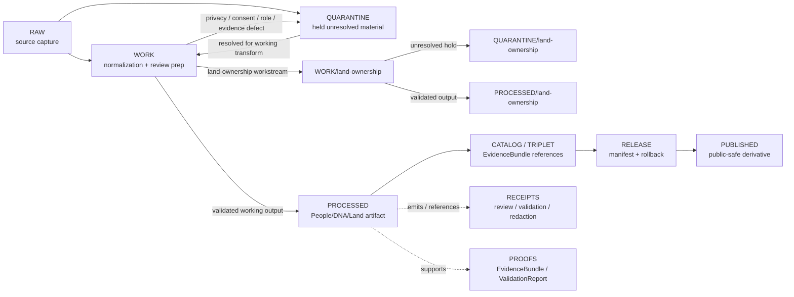

<!-- [KFM_META_BLOCK_V2]
doc_id: kfm://data/work/people-dna-land/readme
title: People/DNA/Land WORK README
type: data-work-domain-index-readme
version: v0.1.0
status: draft
owners:
  - <people-dna-land-domain-steward>
  - <privacy-reviewer>
  - <consent-reviewer>
  - <rights-reviewer>
  - <sensitivity-reviewer>
  - <data-steward>
  - <pipeline-steward>
  - <release-steward>
created: 2026-06-29
updated: 2026-06-29
policy_label: restricted-review
truth_posture: cite-or-abstain
lifecycle_phase: work
responsibility_root: data/
domain: people-dna-land
artifact_family: people-dna-land-working-normalization-lane
sensitivity_posture: T4-default; fail-closed; no-public-path; living-person-deny-default; DNA-deny-default; private-person-parcel-join-deny-default; consent-review-required; source-role-preservation-required; release-blocked
related:
  - land-ownership/README.md
  - ../README.md
  - ../../README.md
  - ../../raw/people-dna-land/README.md
  - ../../raw/people-dna-land/land-ownership/README.md
  - ../../quarantine/people-dna-land/README.md
  - ../../quarantine/people-dna-land/land-ownership/README.md
  - ../../processed/people-dna-land/README.md
  - ../../processed/people-dna-land/land-ownership/README.md
  - ../../catalog/domain/people-dna-land/README.md
  - ../../catalog/domain/people-dna-land/land-ownership/README.md
  - ../../published/layers/people-dna-land/README.md
  - ../../proofs/README.md
  - ../../receipts/README.md
  - ../../registry/sources/people-dna-land/README.md
  - ../../../docs/domains/people-dna-land/README.md
  - ../../../docs/domains/people-dna-land/SCOPE_AND_BOUNDARY.md
  - ../../../docs/domains/people-dna-land/SENSITIVITY.md
  - ../../../docs/domains/people-dna-land/SENSITIVITY_PROFILE.md
  - ../../../docs/domains/people-dna-land/SOURCE_REGISTRY.md
  - ../../../docs/domains/people-dna-land/SOURCE_LEDGER.md
  - ../../../docs/domains/people-dna-land/DNA_HANDLING.md
  - ../../../docs/domains/people-dna-land/LAND_OWNERSHIP.md
  - ../../../docs/domains/people-dna-land/sublanes/land_ownership.md
  - ../../../docs/domains/people-dna-land/sublanes/dna.md
  - ../../../docs/domains/people-dna-land/sublanes/genealogy.md
  - ../../../policy/domains/people-dna-land/
  - ../../../policy/sensitivity/people-dna-land/
  - ../../../policy/consent/people-dna-land/
  - ../../../contracts/domains/people-dna-land/
  - ../../../schemas/contracts/v1/domains/people-dna-land/
  - ../../../release/manifests/README.md
tags:
  - kfm
  - data
  - work
  - people-dna-land
  - people
  - genealogy
  - dna
  - land-ownership
  - living-person
  - privacy
  - consent
  - source-role
  - evidence-first
  - deny-by-default
  - no-public-path
notes:
  - "This README replaces the greenfield stub at `data/work/people-dna-land/README.md`."
  - "Confirmed child WORK README lane during this edit: `land-ownership/`. Other People/DNA/Land WORK child lanes remain proposed unless matching README paths are verified."
  - "WORK is a governed intermediate lifecycle lane between RAW/QUARANTINE and PROCESSED; it is not proof, catalog, registry, policy, consent authority, release authority, public API/UI output, public map/tile output, identity adjudication, DNA interpretation, legal advice, title proof, property-rights proof, public lookup, or generated-answer authority."
  - "People/DNA/Land WORK must preserve source role, rights, consent/privacy posture, living-person status, DNA/genealogy restriction posture, land/title posture, evidence linkage, validation state, correction path, and rollback context before any downstream move."
  - "README/path presence confirms documentation or path evidence only; it does not prove payloads, schemas, validators, receipts, access controls, CI enforcement, source descriptors, consent controls, review completion, or release readiness."
[/KFM_META_BLOCK_V2] -->

<a id="top"></a>

# People/DNA/Land WORK

Governed parent WORK lane for People/DNA/Land normalization, assertion handling, source-role review, privacy and consent review preparation, land-record preparation, genealogy/DNA restriction handling, redaction/generalization work, validation preparation, and downstream-ready shaping before processed artifacts, catalog records, triplets, releases, public layers, reports, stories, graph projections, vector indexes, or public-safe derivatives exist.

<p>
  
  
  
  
  
  
</p>

**Quick links:** [Scope](#scope) · [Repo fit](#repo-fit) · [Lifecycle boundary](#lifecycle-boundary) · [Confirmed child lanes](#confirmed-child-lanes) · [Proposed work lanes](#proposed-work-lanes) · [Accepted inputs](#accepted-inputs) · [Exclusions](#exclusions) · [People/DNA/Land working rules](#peoplednaland-working-rules) · [Directory map](#directory-map) · [Exit gates](#exit-gates) · [Forbidden shortcuts](#forbidden-shortcuts) · [Required checks](#required-checks-before-use) · [Status notes](#status-notes)

> [!CAUTION]
> `data/work/people-dna-land/` is a no-public-path working lane. It is not public, not processed truth, not catalog truth, not proof, not receipt authority, not source registry authority, not consent authority, not policy authority, not release authority, not identity truth, not genealogy truth, not DNA/genomic truth, not legal/title authority, not parcel-boundary authority, not property-rights proof, not public owner/person lookup, not public map/API/UI output, and not an AI-answer source. Public clients, normal UI surfaces, map layers, PMTiles, reports, stories, graph/vector indexes, search indexes, and generated answers must not read this lane directly.

---

## Scope

`data/work/people-dna-land/` holds in-progress People/DNA/Land material after RAW source admission or quarantine return, while stewards and pipelines prepare it for normalization, validation, source-role reconciliation, consent/privacy review preparation, identity/assertion review, genealogy hypothesis handling, DNA-restriction handling, land-record processing, redaction/generalization, EvidenceBundle preparation, catalog readiness, or processed-stage promotion.

WORK exists for **controlled transformation and review preparation**. It may contain intermediate tables, parsing outputs, identity/assertion matching drafts, genealogy relationship candidates, consent/restriction review drafts, land-record normalization drafts, redaction/generalization trials, source-role review notes, QA outputs, and run-local sidecars when those artifacts are not yet validated processed objects, catalog records, proofs, receipts, release decisions, published products, legal conclusions, identity determinations, DNA interpretations, title opinions, or public-safe claims.

People/DNA/Land is a high-sensitivity lane. Boundary errors can expose living people, family relationships, DNA-derived or genealogy-linked context, private person-parcel associations, title-sensitive records, and private land context. The default posture is deny, restrict, quarantine, or abstain until consent/privacy/source-role/evidence/review/release controls are explicit.

---

## Repo fit

| Field | Value |
|---|---|
| Path | `data/work/people-dna-land/` |
| Responsibility root | `data/` |
| Lifecycle phase | `work/` |
| Domain lane | `people-dna-land` |
| Artifact role | Parent working normalization, privacy/consent review preparation, source-role review, redaction, QA, and validation-preparation lane |
| Public access posture | No public path; no normal UI; no governed-public API exposure |
| Upstream | `data/raw/people-dna-land/` after source admission, or `data/quarantine/people-dna-land/` after governed hold resolution |
| Downstream | `data/quarantine/people-dna-land/` for unresolved holds, or `data/processed/people-dna-land/` after work-stage gates close |
| Confirmed child WORK lane | `land-ownership/` |
| Release authority | `release/`, not this directory |
| Proof authority | `data/proofs/`, not this directory |
| Receipt authority | `data/receipts/`, not this directory |
| Registry authority | `data/registry/`, not this directory |
| Policy/consent authority | `policy/` and governed consent/review lanes, not this directory |
| Default failure posture | `HOLD`, `QUARANTINE`, `DENY`, `RESTRICT`, or `ABSTAIN` when source role, rights, consent, privacy, living-person status, DNA/genealogy restriction posture, land/title posture, evidence, review, correction, rollback, access basis, or release support is insufficient |

---

## Lifecycle boundary

```text
RAW -> WORK / QUARANTINE -> PROCESSED -> CATALOG / TRIPLET -> PUBLISHED
```



WORK may support later processing, restricted review, public-safe derivative preparation, and evidence assembly, but it does not bypass quarantine, processed validation, proof construction, privacy review, consent review, source-role review, DNA/genealogy restrictions, title-boundary guardrails, policy review, release, correction, or rollback requirements.

---

## Confirmed child lanes

The child lanes below are README paths confirmed by current-session GitHub fetches or edits. This table confirms README/path evidence only; it does **not** prove payloads, SourceDescriptors, connectors, validators, fixtures, receipts, access controls, CI checks, consent controls, review completion, or release readiness.

| Child lane | Status | Boundary summary |
|---|---|---|
| [`land-ownership/`](land-ownership/README.md) | **CONFIRMED README** | Working normalization, instrument parsing, legal-description handling, parcel-version alignment, chain-of-title candidate review, ownership-interval preparation, source-role review, privacy/consent review preparation, validation preparation, and downstream-ready shaping for land-ownership material. |

---

## Proposed work lanes

The work lanes below are planning targets implied by RAW, QUARANTINE, PROCESSED, and People/DNA/Land doctrine patterns. Treat them as **PROPOSED / NEEDS VERIFICATION** until README paths, payload policy, schemas, validators, fixtures, receipts, and CI enforcement are verified.

| Proposed lane | Purpose | Hard boundary |
|---|---|---|
| `people/` | Working person-assertion normalization and identity-evidence preparation. | Person assertions are evidence views, not identity adjudications. |
| `genealogy/` | Working genealogy relationship and family-tree hypothesis preparation. | Relationship hypotheses are not person truth, title proof, or public family graph authority. |
| `dna/` | Working restricted DNA-derived or DNA-linked review preparation. | Public use is denied by default unless transformed, reviewed, consented where required, and released. |
| `consent/` | Working consent/restriction/revocation support preparation. | Consent authority belongs in policy/receipt roots; this lane may only prepare support artifacts. |
| `redaction/` | Working de-identification, redaction, generalization, delay, or aggregation preparation. | Public-candidate is not published or released. |
| `restricted/` | Working restricted-access derivatives and review support. | Non-public, access-controlled, fail-closed. |
| `corrections/` | Working correction, tombstone, withdrawal, and rollback support. | Correction support is not release authority. |

---

## Accepted inputs

Accepted material is limited to intermediate, non-public working artifacts such as:

- source-normalization drafts derived from admitted People/DNA/Land RAW captures;
- person-assertion, identity-evidence, genealogy, consent, restriction, revocation, correction, land-ownership, and privacy-review preparation artifacts that remain clearly labeled as working/candidate class;
- transformed or restricted DNA-linked review support where allowed by policy, never raw public-ready DNA truth;
- land-ownership working artifacts routed through `land-ownership/` when specific to land records, instruments, parcel versions, legal descriptions, chain-of-title candidates, ownership intervals, or assessor/tax administrative context;
- source-role, rights, consent, privacy, sensitivity, living-person status, DNA/genealogy restriction posture, title/land posture, evidence, citation, attribution, review, and validation notes used to decide whether material returns to quarantine or proceeds to processed;
- redaction, generalization, aggregation, withholding, delayed-publication, restricted-access, and public-candidate derivative preparation artifacts that still need receipts and review before downstream use;
- run-local manifests, logs, checksums, and sidecars used to understand a working transform when they are not authoritative receipts, proofs, registries, schemas, policy rules, consent authority, or release records;
- README or index sidecars that explain local work state without becoming public, proof, catalog, registry, policy, consent, access authority, release authority, identity authority, genealogy authority, DNA authority, title authority, parcel-boundary authority, property-rights proof, or generated-answer authority.

> [!IMPORTANT]
> Working artifacts must keep source role and claim role visible. Person assertions, genealogy hypotheses, DNA-linked support, land instruments, ownership assertions, ownership intervals, parcel-version context, consent state, review state, redaction state, and generated carriers must not be flattened into one truth class.

---

## Exclusions

| Do not place here | Correct authority home |
|---|---|
| Immutable source captures, source-native exports, source logs, source images, raw payloads, original source identifiers, and source-native timestamps | `data/raw/people-dna-land/` |
| Land-ownership-specific working material | `data/work/people-dna-land/land-ownership/` |
| Unresolved living-person data, raw DNA or DNA-derived risk, unresolved consent, unresolved rights, unresolved source role, disputed identity, unsafe person-parcel joins, genealogy leakage risk, title-sensitive material, culturally/sovereignty-sensitive context, malformed data, or not-yet-reviewed public-risk material | `data/quarantine/people-dna-land/` |
| Validated normalized People/DNA/Land outputs | `data/processed/people-dna-land/` |
| Validated land-ownership processed outputs | `data/processed/people-dna-land/land-ownership/` |
| Public-safe published layers, reports, stories, API payloads, downloads, PMTiles, graph edges, or public artifacts | `data/published/` only after release gates close |
| Catalog records, STAC/DCAT/PROV records, triplets, graph records, or EvidenceBundle state | `data/catalog/`, `data/triplets/`, or proof lanes |
| EvidenceBundle, ProofPack, validation report, or claim-proof authority | `data/proofs/` |
| Final `RunReceipt`, `TransformReceipt`, `ValidationReceipt`, `RedactionReceipt`, `ConsentRecord`, `ReviewRecord`, `PolicyDecision`, correction receipt, access receipt, or release receipt records | `data/receipts/` or accepted review/receipt lanes |
| SourceDescriptor, source activation, source registry, rights registry, consent registry, sensitivity registry, or access registry records | `data/registry/` or accepted registry lanes |
| Release manifests, correction notices, withdrawal notices, signatures, rollback cards, release decisions, or release candidates | `release/` |
| Schemas, contracts, validators, tests, packages, pipelines, pipeline specs, app/UI/API code, or policy rules | `schemas/`, `contracts/`, `tools/`, `tests/`, `pipelines/`, `pipeline_specs/`, `apps/`, `policy/` |
| Identity adjudications, genetic conclusions, medical/genetic advice, legal/title determinations, legal abstracts, boundary certifications, legal advice, property-rights rulings, or public lookup surfaces | External authority or governed released derivative only; otherwise deny or abstain |
| Frontier Matrix public-land/land-office aggregate context owned by another domain lane | Frontier Matrix lane, not this WORK parent lane |
| Settlement, road, archaeology, hydrology, agriculture, geology, habitat, fauna, flora, soil, hazards, or infrastructure canonical truth | Owning domain lane, not People/DNA/Land WORK |
| Secrets, credentials, private agreement terms, exact transform controls, restricted representation controls, or other exposure-enabling implementation details | Do not store in this README or ordinary working Markdown |

---

## People/DNA/Land working rules

| Rule | Handling |
|---|---|
| Keep WORK non-public | Nothing here is a public surface, public-candidate artifact, lookup surface, normal UI/API source, graph source, vector-index source, or generated-answer source. |
| Preserve source role | Observed, administrative, authority, modeled, aggregate, candidate, synthetic, restricted, and generated carrier roles stay distinct. |
| Preserve assertion posture | Person, genealogy, DNA-linked, land-ownership, and title/parcel claims are evidence-bound assertions or hypotheses until downstream proof/release gates close. |
| Preserve consent posture | Consent, restriction, revocation, purpose, audience, retention, correction, and withdrawal state remain explicit and fail closed when unresolved. |
| Preserve privacy posture | Living-person, family/genealogy, DNA-linked, person-parcel, private-land, and culturally sensitive context remain denied or restricted until review closes. |
| Keep DNA/genealogy separate | DNA-linked or genealogy-linked context may support governed review; it does not prove identity, land ownership, title, or boundaries by itself. |
| Keep land/title guardrails visible | Assessor/tax records are not title truth; parcel geometry is not title-boundary proof; chain-of-title candidates are not adjudications. |
| Do not launder quarantine | Material cannot leave quarantine through WORK unless the hold reason is explicitly resolved and recorded. |
| Do not launder into public | WORK cannot become public or published material without governed redaction/generalization, privacy review, consent review where required, evidence, receipts, release, correction, and rollback support. |
| Separate review from transformation | A parser output, identity match, relationship candidate, redaction draft, or join draft does not equal reviewer approval, policy decision, receipt closure, release approval, or public permission. |
| Preserve rollback context | Working outputs intended for downstream use should keep enough run and source context to support correction, withdrawal, and rollback later. |

---

## Directory map

```text
data/work/people-dna-land/
├── README.md
├── land-ownership/
│   └── README.md
├── <future-workstream-or-source-family>/
│   └── <run_id_or_batch_id>/
│       ├── work_manifest.json
│       ├── input_refs.json
│       ├── transform_notes.md
│       ├── source_role_review.notes.md
│       ├── privacy_consent_review.notes.md
│       ├── qa_notes.md
│       ├── checksums.sha256
│       └── README.md
└── index.local.json
```

`index.local.json` is optional and must remain WORK-local. It is not a public index, catalog record, release manifest, source registry, review record, graph edge source, layer/story/report pointer, search index, vector index, map source, identity index, genealogy authority, DNA authority, title index, person lookup, parcel-boundary authority, property-rights authority, or retrieval source for generated answers.

> [!NOTE]
> The directory map confirms the parent README and `land-ownership/README.md` path only. Future workstream folders are proposed patterns and do not prove payloads, schemas, validators, fixtures, workflows, receipts, access controls, or CI checks exist.

---

## Exit gates

| Exit route | Minimum requirement |
|---|---|
| Stay WORK | Normalization, parsing, source-role reconciliation, rights review, consent/privacy review preparation, identity/assertion review, DNA/genealogy restriction handling, land/title guardrail handling, evidence-bundle preparation, validation preparation, or correction planning remains incomplete. |
| Move to child WORK lane | Material has a defined workstream such as `land-ownership/` and still remains non-public working material. |
| Quarantine | Source role, rights, consent, privacy, living-person status, DNA/genealogy restriction posture, land/title posture, evidence, schema, citation, digest, policy, review, correction, or rollback state is unresolved enough that work should stop. |
| Reject / return | Steward review says the material is misfiled, unsupported, not retainable, outside the People/DNA/Land work lane, or not allowed for continued retention. |
| Promote to PROCESSED | Working artifact has sufficient lineage, source-role preservation, privacy/consent posture, restriction posture, validation support, rights posture, review state where required, correction path, rollback context, and downstream-ready metadata. |
| Prepare public-safe derivative | Only a reviewed derivative, not unresolved source material or exposure-enabling person/family/DNA/parcel context, may move toward public-safe processed/catalog/published paths after redaction/generalization, review, policy, receipt, correction, and rollback requirements are satisfied. |
| Support catalog/release later | Only after later PROCESSED, CATALOG/TRIPLET, proof, receipt, review, policy, release, correction, and rollback gates close. |

A People/DNA/Land public surface must preserve assertion-first uncertainty, consent posture, review state, redaction state, and evidence support. It must not become legal title, legal boundary, property-rights advice, identity determination, genetic conclusion, living-person exposure surface, or unreviewed family/ownership graph.

---

## Forbidden shortcuts

```text
data/work/people-dna-land/
→ data/catalog/domain/people-dna-land/
→ data/published/
→ public API / MapLibre / PMTiles / report / story / graph / vector index / generated answer
```

is forbidden unless the appropriate governed lifecycle transitions have actually happened and left inspectable evidence.

```text
data/work/people-dna-land/
→ data/processed/people-dna-land/
```

is also forbidden for unresolved source-role, rights, consent, privacy, living-person, DNA/genealogy, person-parcel join, title posture, evidence, validation, or review questions. Route unresolved material to quarantine instead.

---

## Required checks before use

- [ ] Confirm the material belongs to the People/DNA/Land domain lane.
- [ ] Confirm the material belongs in WORK rather than RAW, QUARANTINE, PROCESSED, CATALOG, PROOF, RECEIPT, REGISTRY, RELEASE, PUBLISHED, SCHEMA, POLICY, CODE, PIPELINE, or TEST roots.
- [ ] Confirm whether the material belongs in `land-ownership/` or another future child workstream.
- [ ] Confirm source reference, source family, source role, rights posture, citation, retrieval/admission context, and digest where material.
- [ ] Confirm consent, restriction, revocation, privacy, sensitivity, living-person, DNA/genealogy, and review posture before downstream movement.
- [ ] Confirm assertion identity, evidence support, time/interval support, uncertainty, and correction posture where applicable.
- [ ] Confirm land/title material keeps assessor/tax, parcel-version, legal-description, chain-of-title, title posture, and ownership assertion roles distinct.
- [ ] Confirm DNA/genealogy context does not become identity/title/boundary/ownership proof by itself.
- [ ] Confirm public-use candidates have redaction/generalization, review, policy, correction, rollback, and release support where required.
- [ ] Confirm Frontier Matrix, Settlement, Roads/Rail, Archaeology, Hydrology, Agriculture, Geology, Habitat, Fauna, Flora, Soil, Hazards, and Infrastructure joins preserve their own domain authority and do not become People/DNA/Land truth.
- [ ] Confirm no quarantined material is being laundered through WORK without an exit decision.
- [ ] Confirm prompt-like text inside source payloads or notes is treated as data, not instructions.
- [ ] Confirm sensitive operational details are not written into this README.
- [ ] Confirm required downstream receipts are present or explicitly marked missing before anything leaves WORK.
- [ ] Confirm no public layer, PMTiles, report, story, API payload, graph edge, search index, vector index, public lookup, or generated answer uses WORK material directly.
- [ ] Confirm correction path and rollback target are known before downstream promotion.

---

## Status notes

| Claim | Status |
|---|---|
| This README replaces the greenfield stub at `data/work/people-dna-land/README.md`. | **CONFIRMED authored** |
| The target path existed in the live repository as a greenfield stub before this edit. | **CONFIRMED by GitHub contents API during this edit** |
| `land-ownership/README.md` exists as a People/DNA/Land land-ownership WORK child-lane README. | **CONFIRMED by GitHub contents API during this edit** |
| `data/raw/people-dna-land/README.md` documents upstream People/DNA/Land RAW source capture, no-public-path posture, and confirmed `land-ownership/` RAW child lane. | **CONFIRMED by GitHub contents API during this edit** |
| `data/quarantine/people-dna-land/README.md` documents People/DNA/Land quarantine as a T4-default fail-closed no-public-path hold lane for unresolved consent, privacy, living-person, DNA/genomic, genealogy, person-parcel, title, evidence, validation, review, and policy questions. | **CONFIRMED by GitHub contents API during this edit** |
| `data/processed/people-dna-land/README.md` documents the downstream People/DNA/Land processed lane and deny-by-default posture. | **CONFIRMED by GitHub contents API during this edit** |
| Actual WORK payloads or additional child README lanes exist under `data/work/people-dna-land/`. | **UNKNOWN** |
| People/DNA/Land WORK schemas, validators, fixtures, CI checks, receipts, access controls, privacy/consent controls, review workflow, and release linkage are fully implemented. | **NEEDS VERIFICATION** |
| This README is proof, release, catalog, registry, policy, consent authority, identity authority, DNA authority, genealogy authority, title authority, property-rights proof, public artifact authority, or AI authority. | **DENY** |

---

## Related files

- [`land-ownership/README.md`](land-ownership/README.md)
- [`../README.md`](../README.md)
- [`../../README.md`](../../README.md)
- [`../../raw/people-dna-land/README.md`](../../raw/people-dna-land/README.md)
- [`../../raw/people-dna-land/land-ownership/README.md`](../../raw/people-dna-land/land-ownership/README.md)
- [`../../quarantine/people-dna-land/README.md`](../../quarantine/people-dna-land/README.md)
- [`../../quarantine/people-dna-land/land-ownership/README.md`](../../quarantine/people-dna-land/land-ownership/README.md)
- [`../../processed/people-dna-land/README.md`](../../processed/people-dna-land/README.md)
- [`../../processed/people-dna-land/land-ownership/README.md`](../../processed/people-dna-land/land-ownership/README.md)
- [`../../catalog/domain/people-dna-land/README.md`](../../catalog/domain/people-dna-land/README.md)
- [`../../catalog/domain/people-dna-land/land-ownership/README.md`](../../catalog/domain/people-dna-land/land-ownership/README.md)
- [`../../published/layers/people-dna-land/README.md`](../../published/layers/people-dna-land/README.md)
- [`../../proofs/README.md`](../../proofs/README.md)
- [`../../receipts/README.md`](../../receipts/README.md)
- [`../../registry/sources/people-dna-land/README.md`](../../registry/sources/people-dna-land/README.md)
- [`../../../docs/domains/people-dna-land/README.md`](../../../docs/domains/people-dna-land/README.md)
- [`../../../docs/domains/people-dna-land/SCOPE_AND_BOUNDARY.md`](../../../docs/domains/people-dna-land/SCOPE_AND_BOUNDARY.md)
- [`../../../docs/domains/people-dna-land/SENSITIVITY.md`](../../../docs/domains/people-dna-land/SENSITIVITY.md)
- [`../../../docs/domains/people-dna-land/SENSITIVITY_PROFILE.md`](../../../docs/domains/people-dna-land/SENSITIVITY_PROFILE.md)
- [`../../../docs/domains/people-dna-land/SOURCE_REGISTRY.md`](../../../docs/domains/people-dna-land/SOURCE_REGISTRY.md)
- [`../../../docs/domains/people-dna-land/SOURCE_LEDGER.md`](../../../docs/domains/people-dna-land/SOURCE_LEDGER.md)
- [`../../../docs/domains/people-dna-land/DNA_HANDLING.md`](../../../docs/domains/people-dna-land/DNA_HANDLING.md)
- [`../../../docs/domains/people-dna-land/LAND_OWNERSHIP.md`](../../../docs/domains/people-dna-land/LAND_OWNERSHIP.md)
- [`../../../docs/domains/people-dna-land/sublanes/land_ownership.md`](../../../docs/domains/people-dna-land/sublanes/land_ownership.md)
- [`../../../docs/domains/people-dna-land/sublanes/dna.md`](../../../docs/domains/people-dna-land/sublanes/dna.md)
- [`../../../docs/domains/people-dna-land/sublanes/genealogy.md`](../../../docs/domains/people-dna-land/sublanes/genealogy.md)
- [`../../../release/manifests/README.md`](../../../release/manifests/README.md)

---

## Maintenance checklist

- [ ] Replace placeholder owners with confirmed steward roles.
- [ ] Confirm whether additional People/DNA/Land WORK child lanes exist and add them to the directory map only after verification.
- [ ] Confirm People/DNA/Land WORK schemas, validators, and fixture expectations.
- [ ] Confirm required receipt family names and storage homes for WORK-to-PROCESSED promotion.
- [ ] Confirm source-role review, rights review, privacy review, consent review, DNA/genealogy restriction handling, evidence-bundle closure, and validation linkage.
- [ ] Confirm `land-ownership/README.md` remains synchronized with this parent lane.
- [ ] Confirm all relative links after adjacent docs stabilize.
- [ ] Confirm rollback target for this README expansion in the commit or release notes.

[Back to top](#top)
