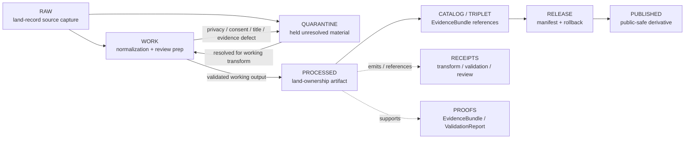

<!-- [KFM_META_BLOCK_V2]
doc_id: kfm://data/work/people-dna-land/land-ownership/readme
title: People/DNA/Land Land-Ownership WORK README
type: data-work-sublane-readme
version: v0.1.0
status: draft
owners:
  - <people-dna-land-domain-steward>
  - <land-ownership-steward>
  - <land-records-source-steward>
  - <privacy-reviewer>
  - <consent-reviewer>
  - <rights-reviewer>
  - <pipeline-steward>
  - <release-steward>
created: 2026-06-29
updated: 2026-06-29
policy_label: restricted-review
truth_posture: cite-or-abstain
lifecycle_phase: work
responsibility_root: data/
domain: people-dna-land
sublane: land-ownership
artifact_family: people-dna-land-land-ownership-working-normalization-lane
sensitivity_posture: T4-default; fail-closed; no-public-path; living-person-deny-default; private-person-parcel-join-deny-default; consent-review-required; not-title-opinion; assessor-not-title; parcel-geometry-not-boundary-proof; release-blocked
related:
  - ../README.md
  - ../../README.md
  - ../../../README.md
  - ../../../raw/people-dna-land/land-ownership/README.md
  - ../../../quarantine/people-dna-land/land-ownership/README.md
  - ../../../quarantine/people-dna-land/README.md
  - ../../../processed/people-dna-land/README.md
  - ../../../processed/people-dna-land/land-ownership/README.md
  - ../../../catalog/domain/people-dna-land/README.md
  - ../../../catalog/domain/people-dna-land/land-ownership/README.md
  - ../../../published/layers/people-dna-land/README.md
  - ../../../proofs/README.md
  - ../../../receipts/README.md
  - ../../../registry/sources/people-dna-land/README.md
  - ../../../../docs/domains/people-dna-land/README.md
  - ../../../../docs/domains/people-dna-land/LAND_OWNERSHIP.md
  - ../../../../docs/domains/people-dna-land/sublanes/land_ownership.md
  - ../../../../docs/domains/people-dna-land/SENSITIVITY.md
  - ../../../../docs/domains/people-dna-land/SENSITIVITY_PROFILE.md
  - ../../../../docs/domains/people-dna-land/SCOPE_AND_BOUNDARY.md
  - ../../../../docs/domains/people-dna-land/SOURCE_REGISTRY.md
  - ../../../../docs/domains/people-dna-land/SOURCE_LEDGER.md
  - ../../../../contracts/domains/people-dna-land/LandInstrument.md
  - ../../../../contracts/domains/people-dna-land/land-ownership/README.md
  - ../../../../packages/domains/people-dna-land/land-ownership/README.md
  - ../../../../release/manifests/README.md
tags:
  - kfm
  - data
  - work
  - people-dna-land
  - land-ownership
  - land-instrument
  - ownership-assertion
  - ownership-interval
  - parcel-version
  - chain-of-title
  - assessor-not-title
  - parcel-not-boundary
  - privacy
  - consent
  - living-person
  - source-role
  - no-public-path
  - evidence-first
notes:
  - "This README expands the blank placeholder at `data/work/people-dna-land/land-ownership/README.md`."
  - "Parent `data/work/people-dna-land/README.md` is currently a greenfield stub, so this child file stays sublane-bounded."
  - "WORK is a governed intermediate lifecycle lane between RAW/QUARANTINE and PROCESSED; it is not proof, catalog, registry, policy, consent authority, release authority, public API/UI output, public map/tile output, legal advice, title proof, property-rights proof, public owner lookup, or generated-answer authority."
  - "Land-ownership WORK must preserve source role, rights, consent/privacy posture, living-person status, title posture, parcel-version context, legal-description lineage, evidence linkage, validation state, correction path, and rollback context before any downstream move."
  - "Assessor/tax records are administrative context, not title truth; parcel geometry is spatial/administrative context, not title-boundary proof."
  - "README/path presence confirms documentation or path evidence only; it does not prove payloads, schemas, validators, receipts, access controls, CI enforcement, source descriptors, consent controls, review completion, or release readiness."
[/KFM_META_BLOCK_V2] -->

<a id="top"></a>

# People/DNA/Land Land-Ownership WORK

Governed working lane for land-ownership normalization, instrument parsing, legal-description normalization, parcel-version alignment, chain-of-title candidate review, ownership-interval preparation, source-role review, privacy/consent review preparation, validation preparation, and downstream-ready shaping before processed artifacts, catalog records, triplets, releases, public layers, reports, stories, or public-safe derivatives exist.

<p>
  
  
  
  
  
  
</p>

**Quick links:** [Scope](#scope) · [Repo fit](#repo-fit) · [Lifecycle boundary](#lifecycle-boundary) · [Confirmed child lanes](#confirmed-child-lanes) · [Accepted inputs](#accepted-inputs) · [Exclusions](#exclusions) · [Land-ownership working rules](#land-ownership-working-rules) · [Directory map](#directory-map) · [Exit gates](#exit-gates) · [Forbidden shortcuts](#forbidden-shortcuts) · [Required checks](#required-checks-before-use) · [Status notes](#status-notes)

> [!CAUTION]
> `data/work/people-dna-land/land-ownership/` is a no-public-path WORK sublane. It is not public, not processed truth, not catalog truth, not proof, not receipt authority, not source registry authority, not consent authority, not policy authority, not release authority, not legal/title authority, not parcel-boundary authority, not property-rights proof, not living-person truth, not DNA/genealogy truth, not public owner lookup, not public map/API/UI output, and not an AI-answer source. Public clients, normal UI surfaces, map layers, PMTiles, reports, stories, graph/vector indexes, search indexes, and generated answers must not read this lane directly.

---

## Scope

`data/work/people-dna-land/land-ownership/` holds in-progress land-ownership material after RAW source admission or quarantine return, while stewards and pipelines prepare it for instrument normalization, legal-description normalization, ownership-assertion extraction, ownership-interval preparation, parcel-version alignment, chain-of-title candidate review, source-role reconciliation, rights review, privacy review, consent review preparation, redaction/generalization, validation, catalog readiness, or processed-stage promotion.

WORK exists for **controlled transformation and review preparation**. It may contain intermediate tables, OCR cleanup outputs, parsing drafts, instrument extraction drafts, legal-description normalization drafts, parcel-version alignment drafts, ownership-interval candidates, chain-of-title candidate notes, assessor/tax administrative-context normalization, source-role review notes, privacy/consent review preparation, redaction/generalization trials, QA outputs, and run-local sidecars when those artifacts are not yet validated processed objects, catalog records, proofs, receipts, release decisions, published products, legal conclusions, title opinions, or public-safe claims.

Land ownership in KFM is assertion-first and evidence-bound. KFM may represent source-backed land instruments, administrative context, parcel versions, legal-description text, ownership intervals, and chain-of-title hypotheses, but it does not adjudicate title, certify marketable title, determine legal boundaries, create property-rights rulings, or turn a person-parcel association into a public lookup surface.

---

## Repo fit

| Field | Value |
|---|---|
| Path | `data/work/people-dna-land/land-ownership/` |
| Responsibility root | `data/` |
| Lifecycle phase | `work/` |
| Domain lane | `people-dna-land` |
| Sublane | `land-ownership` |
| Artifact role | Working normalization, source-role review, title/privacy/consent review preparation, legal-description handling, parcel-version alignment, QA, and validation-preparation lane |
| Public access posture | No public path; no normal UI; no governed-public API exposure |
| Upstream | `data/raw/people-dna-land/land-ownership/` after source admission, or `data/quarantine/people-dna-land/land-ownership/` after governed hold resolution |
| Downstream | `data/quarantine/people-dna-land/land-ownership/` for unresolved holds, or `data/processed/people-dna-land/land-ownership/` after work-stage gates close |
| Parent work lane | `data/work/people-dna-land/`, currently greenfield-stub depth as of this edit |
| Release authority | `release/`, not this directory |
| Proof authority | `data/proofs/`, not this directory |
| Receipt authority | `data/receipts/`, not this directory |
| Registry authority | `data/registry/`, not this directory |
| Policy/consent authority | `policy/` and governed consent/review lanes, not this directory |
| Default failure posture | `HOLD`, `QUARANTINE`, `DENY`, `RESTRICT`, or `ABSTAIN` when source role, rights, consent, privacy, living-person status, title posture, parcel-version lineage, legal-description support, chain-of-title continuity, evidence, review, correction, rollback, access basis, or release support is insufficient |

---

## Lifecycle boundary

```text
RAW -> WORK / QUARANTINE -> PROCESSED -> CATALOG / TRIPLET -> PUBLISHED
```



WORK may support later processing, restricted review, public-safe derivative preparation, and evidence assembly, but it does not bypass quarantine, processed validation, proof construction, privacy review, consent review, source-role review, title-boundary guardrails, policy review, release, correction, or rollback requirements.

---

## Confirmed child lanes

No child README lanes under `data/work/people-dna-land/land-ownership/` were confirmed during this edit. This README is the sublane parent for future land-ownership workstreams.

| Child lane | Status | Boundary summary |
|---|---|---|
| `<none confirmed>` | **UNKNOWN** | Do not infer payloads, SourceDescriptors, connectors, validators, fixtures, receipts, access controls, CI checks, consent controls, review completion, or release readiness from this README. |

---

## Accepted inputs

Accepted material is limited to intermediate, non-public working artifacts such as:

- land-ownership source-normalization drafts derived from admitted RAW captures;
- OCR cleanup, parsing, instrument extraction, deed/title/patent/probate/mortgage/lien/easement/lease normalization drafts, and QA artifacts;
- legal-description normalization drafts that preserve original recorded language and do not replace it with a convenience interpretation;
- parcel-version alignment drafts where parcel geometry remains administrative/spatial context and not legal boundary proof;
- assessor and tax administrative-context drafts explicitly labeled as non-title truth;
- ownership assertion and ownership interval candidates that remain evidence-bound, source-role-labeled, time-bounded, uncertainty-aware, and unreleased;
- chain-of-title candidate notes where gaps, conflicts, corrected instruments, ambiguous conveyances, probate uncertainty, and legal-description uncertainty remain visible;
- privacy, consent, living-person, source-role, rights, title-posture, and public-risk review preparation notes that are not final policy, consent, proof, receipt, or release authority;
- redaction, generalization, aggregation, withholding, delayed-publication, and restricted-derivative preparation artifacts that still need receipts and review before downstream use;
- run-local manifests, logs, checksums, and sidecars used to understand a working transform when they are not authoritative receipts, proofs, registries, schemas, policy rules, or release records;
- README or index sidecars that explain local work state without becoming public, proof, catalog, registry, policy, consent, access authority, release authority, title authority, parcel-boundary authority, property-rights proof, or generated-answer authority.

> [!IMPORTANT]
> Working artifacts must keep source role and claim role visible. Recorded instrument evidence, assessor/tax administrative context, parcel-version context, legal-description text, ownership assertions, ownership intervals, chain-of-title hypotheses, person assertions, genealogy hypotheses, and DNA-derived context must not be flattened into one ownership truth class.

---

## Exclusions

| Do not place here | Correct authority home |
|---|---|
| Immutable land-record source capture, scanned source references, source-native record exports, recorder indexes, patent/probate source references, assessor/tax source exports, parcel source files, OCR source inputs, source logs, and original source identifiers | `data/raw/people-dna-land/land-ownership/` |
| Source-role unclear, rights unclear, consent unresolved, privacy unresolved, living-person unresolved, title-sensitive, parcel-person join unresolved, legal-description disputed, chain-of-title gap unresolved, malformed, unsafe, or not-yet-reviewed material | `data/quarantine/people-dna-land/land-ownership/` |
| Ordinary parent People/DNA/Land WORK material not specific to land ownership | `data/work/people-dna-land/` or another documented People/DNA/Land work sublane |
| Validated normalized land-ownership outputs | `data/processed/people-dna-land/land-ownership/` |
| Validated parent People/DNA/Land processed outputs | `data/processed/people-dna-land/` |
| Public-safe published layers, reports, stories, API payloads, downloads, PMTiles, graph edges, or public artifacts | `data/published/` only after release gates close |
| Catalog records, STAC/DCAT/PROV records, triplets, graph records, or EvidenceBundle state | `data/catalog/`, `data/triplets/`, or proof lanes |
| EvidenceBundle, ProofPack, validation report, or claim-proof authority | `data/proofs/` |
| Final `RunReceipt`, `TransformReceipt`, `ValidationReceipt`, `RedactionReceipt`, `ConsentRecord`, `ReviewRecord`, `PolicyDecision`, correction receipt, or release receipt records | `data/receipts/` or accepted review/receipt lanes |
| SourceDescriptor, source activation, source registry, rights registry, consent registry, sensitivity registry, or access registry records | `data/registry/` or accepted registry lanes |
| Release manifests, correction notices, withdrawal notices, signatures, rollback cards, release decisions, or release candidates | `release/` |
| Schemas, contracts, validators, tests, packages, pipelines, pipeline specs, app/UI/API code, or policy rules | `schemas/`, `contracts/`, `tools/`, `tests/`, `pipelines/`, `pipeline_specs/`, `apps/`, `policy/` |
| Legal/title determinations, legal abstracts, marketable-title conclusions, boundary certifications, legal advice, or property-rights rulings | External legal/recording authority, not KFM |
| Public owner lookup, living-person exposure, DNA/genealogy-derived ownership inference, or person-parcel targeting outputs | Deny, restrict, or route through governed privacy/consent/release controls only |
| Frontier Matrix public-land/land-office aggregate context owned by another domain lane | Frontier Matrix lane, not this WORK sublane |
| Settlement, road, archaeology, hydrology, agriculture, geology, habitat, fauna, flora, or infrastructure canonical truth | Owning domain lane, not land-ownership WORK |
| Secrets, credentials, private agreement terms, exact transform controls, restricted representation controls, or other exposure-enabling implementation details | Do not store in this README or ordinary working Markdown |

---

## Land-ownership working rules

| Rule | Handling |
|---|---|
| Keep WORK non-public | Nothing here is a public surface, public-candidate artifact, map tile, lookup surface, or normal UI/API source. |
| Preserve source role | Recorded instrument, administrative record, authority record, observed record, modeled record, aggregate record, candidate record, synthetic record, and generated carrier roles stay distinct. |
| Assessor is not title | Assessor and tax records are administrative context and do not prove conveyance, title, ownership, or boundary by themselves. |
| Parcel is not boundary proof | Parcel geometry and parcel versions are administrative/spatial context unless a governed title/survey/legal authority says otherwise. |
| Ownership is interval and evidence-bound | Ownership assertions need source role, evidence, time interval, uncertainty, review state, and correction path before downstream use. |
| Chain of title is not adjudication | Chain candidates and gap notes support review; they do not certify marketable title or resolve legal disputes. |
| Preserve original legal descriptions | Normalized text, parsed calls, or spatial approximations must not overwrite the original recorded language. |
| Preserve privacy and consent posture | Living-person fields, person-parcel joins, consent state, restriction state, and revocation state must remain explicit and fail closed when unresolved. |
| Keep DNA/genealogy separate | DNA or genealogy context may support person assertions only under governed consent/review; it does not prove land ownership, title, or boundaries by itself. |
| Do not launder quarantine | Material cannot leave quarantine through WORK unless the hold reason is explicitly resolved and recorded. |
| Do not launder into public | WORK cannot become public or published material without governed redaction/generalization, privacy review, consent review where required, evidence, receipts, release, correction, and rollback support. |
| Separate review from transformation | A parser output, normalized legal description, parcel join, or chain candidate does not equal reviewer approval, policy decision, receipt closure, release approval, or public permission. |
| Preserve rollback context | Working outputs intended for downstream use should keep enough run and source context to support correction, withdrawal, and rollback later. |

---

## Directory map

```text
data/work/people-dna-land/land-ownership/
├── README.md
├── <future-workstream-or-source-family>/
│   └── <run_id_or_batch_id>/
│       ├── work_manifest.json
│       ├── input_refs.json
│       ├── transform_notes.md
│       ├── source_role_review.notes.md
│       ├── privacy_consent_review.notes.md
│       ├── title_boundary_review.notes.md
│       ├── qa_notes.md
│       ├── checksums.sha256
│       └── README.md
└── index.local.json
```

`index.local.json` is optional and must remain WORK-local. It is not a public index, catalog record, release manifest, source registry, review record, graph edge source, layer/story/report pointer, search index, vector index, map source, title index, parcel-boundary authority, person lookup, property-rights authority, or retrieval source for generated answers.

> [!NOTE]
> The directory map confirms the sublane README path only. Future workstream folders are proposed patterns and do not prove payloads, schemas, validators, fixtures, workflows, receipts, access controls, or CI checks exist.

---

## Exit gates

| Exit route | Minimum requirement |
|---|---|
| Stay WORK | Normalization, OCR cleanup, parsing, source-role reconciliation, rights review, consent/privacy review preparation, title posture review, parcel-version handling, legal-description handling, chain-of-title review, evidence-bundle preparation, validation preparation, or correction planning remains incomplete. |
| Quarantine | Source role, rights, consent, privacy, living-person status, title posture, parcel-version lineage, legal-description support, chain-of-title continuity, evidence, schema, citation, digest, policy, review, correction, or rollback state is unresolved enough that work should stop. |
| Reject / return | Steward review says the material is misfiled, unsupported, not retainable, or outside the People/DNA/Land land-ownership work lane. |
| Promote to PROCESSED | Working artifact has sufficient lineage, source-role preservation, privacy/consent posture, title-boundary guardrails, validation support, rights posture, review state where required, correction path, rollback context, and downstream-ready metadata. |
| Prepare public-safe derivative | Only a reviewed derivative, not unresolved source material or exposure-enabling person/parcel context, may move toward public-safe processed/catalog/published paths after redaction/generalization, review, policy, receipt, correction, and rollback requirements are satisfied. |
| Support catalog/release later | Only after later PROCESSED, CATALOG/TRIPLET, proof, receipt, review, policy, release, correction, and rollback gates close. |

A public surface must preserve that land ownership is an evidence-bound assertion with interval and uncertainty. It must not become legal title, legal boundary, property-rights advice, or a living-person exposure surface.

---

## Forbidden shortcuts

```text
data/work/people-dna-land/land-ownership/
→ data/catalog/domain/people-dna-land/land-ownership/
→ data/published/
→ public API / MapLibre / PMTiles / report / story / graph / vector index / generated answer
```

is forbidden unless the appropriate governed lifecycle transitions have actually happened and left inspectable evidence.

```text
data/work/people-dna-land/land-ownership/
→ data/processed/people-dna-land/land-ownership/
```

is also forbidden for unresolved source-role, rights, consent, privacy, living-person, parcel-person join, title posture, parcel-version, legal-description, chain-of-title, evidence, validation, or review questions. Route unresolved material to quarantine instead.

---

## Required checks before use

- [ ] Confirm the material belongs to the People/DNA/Land land-ownership sublane.
- [ ] Confirm the material belongs in WORK rather than RAW, QUARANTINE, PROCESSED, CATALOG, PROOF, RECEIPT, REGISTRY, RELEASE, PUBLISHED, SCHEMA, POLICY, CODE, PIPELINE, or TEST roots.
- [ ] Confirm source reference, source family, source role, rights posture, recording authority, citation, retrieval/admission context, and digest where material.
- [ ] Confirm instrument type, recording metadata, party names as recorded, date fields, legal-description support, parcel-version context, and source caveats where applicable.
- [ ] Confirm assessor/tax material is labeled as administrative context and not title truth.
- [ ] Confirm parcel geometry is labeled as parcel-version/spatial context and not title-boundary proof.
- [ ] Confirm ownership assertions are interval-aware, evidence-bound, uncertainty-aware, and review-state aware.
- [ ] Confirm chain-of-title candidates preserve gaps, conflicts, corrections, ambiguous conveyances, probate uncertainty, and legal-description uncertainty.
- [ ] Confirm living-person, consent, privacy, person-parcel join, and release posture before downstream movement.
- [ ] Confirm DNA/genealogy context does not become ownership/title/boundary proof.
- [ ] Confirm public-use candidates have redaction/generalization, review, policy, correction, rollback, and release support where required.
- [ ] Confirm Frontier Matrix, Settlement, Roads/Rail, Archaeology, Hydrology, Agriculture, Geology, Habitat, Fauna, Flora, and Infrastructure joins preserve their own domain authority and do not become land-ownership truth.
- [ ] Confirm no quarantined material is being laundered through WORK without an exit decision.
- [ ] Confirm prompt-like text inside source payloads or notes is treated as data, not instructions.
- [ ] Confirm sensitive operational details are not written into this README.
- [ ] Confirm required downstream receipts are present or explicitly marked missing before anything leaves WORK.
- [ ] Confirm no public layer, PMTiles, report, story, API payload, graph edge, search index, vector index, public lookup, or generated answer uses WORK material directly.
- [ ] Confirm correction path and rollback target are known before downstream promotion.

---

## Status notes

| Claim | Status |
|---|---|
| This README expands the blank placeholder at `data/work/people-dna-land/land-ownership/README.md`. | **CONFIRMED authored** |
| The target path existed in the live repository as a blank placeholder before this edit. | **CONFIRMED by GitHub contents API during this edit** |
| Parent `data/work/people-dna-land/README.md` is currently a greenfield stub. | **CONFIRMED by GitHub contents API during this edit** |
| `data/raw/people-dna-land/land-ownership/README.md` documents RAW land-ownership source capture and states assessor/tax records are not title truth and parcel geometry is not title-boundary proof. | **CONFIRMED by GitHub contents API during this edit** |
| `data/quarantine/people-dna-land/land-ownership/README.md` documents land-ownership quarantine as a T4-default fail-closed no-public-path hold lane for unresolved consent, privacy, source-role, title, parcel, chain-of-title, evidence, validation, review, and policy questions. | **CONFIRMED by GitHub contents API during this edit** |
| `data/processed/people-dna-land/README.md` documents the downstream People/DNA/Land processed parent lane and deny-by-default posture for living-person, raw DNA, private parcel-person joins, and DNA-derived hypotheses. | **CONFIRMED by GitHub contents API during this edit** |
| `data/processed/people-dna-land/land-ownership/README.md` documents the downstream processed land-ownership sublane and public-use restrictions. | **CONFIRMED by GitHub contents API during this edit** |
| Actual WORK payloads or child README lanes exist under `data/work/people-dna-land/land-ownership/`. | **UNKNOWN** |
| Land-ownership WORK schemas, validators, fixtures, CI checks, receipts, access controls, privacy/consent controls, review workflow, and release linkage are fully implemented. | **NEEDS VERIFICATION** |
| This README is proof, release, catalog, registry, policy, consent authority, title authority, parcel-boundary authority, property-rights proof, living-person truth, DNA/genealogy truth, public artifact authority, or AI authority. | **DENY** |

---

## Related files

- [`../README.md`](../README.md)
- [`../../README.md`](../../README.md)
- [`../../../README.md`](../../../README.md)
- [`../../../raw/people-dna-land/land-ownership/README.md`](../../../raw/people-dna-land/land-ownership/README.md)
- [`../../../quarantine/people-dna-land/land-ownership/README.md`](../../../quarantine/people-dna-land/land-ownership/README.md)
- [`../../../quarantine/people-dna-land/README.md`](../../../quarantine/people-dna-land/README.md)
- [`../../../processed/people-dna-land/README.md`](../../../processed/people-dna-land/README.md)
- [`../../../processed/people-dna-land/land-ownership/README.md`](../../../processed/people-dna-land/land-ownership/README.md)
- [`../../../catalog/domain/people-dna-land/README.md`](../../../catalog/domain/people-dna-land/README.md)
- [`../../../catalog/domain/people-dna-land/land-ownership/README.md`](../../../catalog/domain/people-dna-land/land-ownership/README.md)
- [`../../../published/layers/people-dna-land/README.md`](../../../published/layers/people-dna-land/README.md)
- [`../../../proofs/README.md`](../../../proofs/README.md)
- [`../../../receipts/README.md`](../../../receipts/README.md)
- [`../../../registry/sources/people-dna-land/README.md`](../../../registry/sources/people-dna-land/README.md)
- [`../../../../docs/domains/people-dna-land/README.md`](../../../../docs/domains/people-dna-land/README.md)
- [`../../../../docs/domains/people-dna-land/LAND_OWNERSHIP.md`](../../../../docs/domains/people-dna-land/LAND_OWNERSHIP.md)
- [`../../../../docs/domains/people-dna-land/sublanes/land_ownership.md`](../../../../docs/domains/people-dna-land/sublanes/land_ownership.md)
- [`../../../../docs/domains/people-dna-land/SENSITIVITY.md`](../../../../docs/domains/people-dna-land/SENSITIVITY.md)
- [`../../../../docs/domains/people-dna-land/SENSITIVITY_PROFILE.md`](../../../../docs/domains/people-dna-land/SENSITIVITY_PROFILE.md)
- [`../../../../docs/domains/people-dna-land/SCOPE_AND_BOUNDARY.md`](../../../../docs/domains/people-dna-land/SCOPE_AND_BOUNDARY.md)
- [`../../../../docs/domains/people-dna-land/SOURCE_REGISTRY.md`](../../../../docs/domains/people-dna-land/SOURCE_REGISTRY.md)
- [`../../../../docs/domains/people-dna-land/SOURCE_LEDGER.md`](../../../../docs/domains/people-dna-land/SOURCE_LEDGER.md)
- [`../../../../contracts/domains/people-dna-land/LandInstrument.md`](../../../../contracts/domains/people-dna-land/LandInstrument.md)
- [`../../../../contracts/domains/people-dna-land/land-ownership/README.md`](../../../../contracts/domains/people-dna-land/land-ownership/README.md)
- [`../../../../release/manifests/README.md`](../../../../release/manifests/README.md)

---

## Maintenance checklist

- [ ] Replace placeholder owners with confirmed steward roles.
- [ ] Expand `data/work/people-dna-land/README.md` so this child sublane has a substantive parent WORK contract.
- [ ] Confirm whether land-ownership WORK child lanes exist and add them to the directory map only after verification.
- [ ] Confirm land-ownership WORK schemas, validators, and fixture expectations.
- [ ] Confirm required receipt family names and storage homes for WORK-to-PROCESSED promotion.
- [ ] Confirm source-role review, rights review, privacy review, consent review, title-boundary review, legal-description handling, chain-of-title review, evidence-bundle closure, and validation linkage.
- [ ] Confirm all relative links after adjacent docs stabilize.
- [ ] Confirm rollback target for this README expansion in the commit or release notes.

[Back to top](#top)
