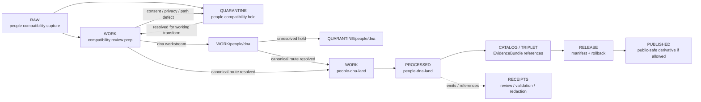

<!-- [KFM_META_BLOCK_V2]
doc_id: kfm://data/work/people/readme
title: People WORK Compatibility README
type: data-work-domain-index-readme; compatibility-lane-readme
version: v0.1.0
status: draft
owners:
  - <people-dna-land-domain-steward>
  - <people-compatibility-steward>
  - <privacy-reviewer>
  - <consent-reviewer>
  - <rights-reviewer>
  - <sensitivity-reviewer>
  - <pipeline-steward>
  - <release-steward>
created: 2026-06-29
updated: 2026-06-29
policy_label: restricted-review
truth_posture: cite-or-abstain
lifecycle_phase: work
responsibility_root: data/
requested_path_segment: people
canonical_domain_candidate: people-dna-land
artifact_family: people-compatibility-working-normalization-index
sensitivity_posture: T4-default; fail-closed; no-public-path; living-person-deny-default; consent-required; privacy-review-required; source-role-preservation-required; canonical-path-warning; release-blocked
related:
  - dna/README.md
  - ../README.md
  - ../../README.md
  - ../../raw/people/README.md
  - ../../raw/people/dna/README.md
  - ../../quarantine/people/README.md
  - ../../quarantine/people/dna/README.md
  - ../people-dna-land/README.md
  - ../people-dna-land/land-ownership/README.md
  - ../../raw/people-dna-land/README.md
  - ../../quarantine/people-dna-land/README.md
  - ../../processed/people-dna-land/README.md
  - ../../catalog/domain/people-dna-land/README.md
  - ../../published/layers/people-dna-land/README.md
  - ../../proofs/README.md
  - ../../receipts/README.md
  - ../../registry/sources/people-dna-land/README.md
  - ../../../docs/domains/people-dna-land/CANONICAL_PATHS.md
  - ../../../docs/domains/people-dna-land/SCOPE_AND_BOUNDARY.md
  - ../../../docs/domains/people-dna-land/SENSITIVITY.md
  - ../../../docs/domains/people-dna-land/SENSITIVITY_PROFILE.md
  - ../../../docs/domains/people-dna-land/DNA_HANDLING.md
  - ../../../docs/domains/people-dna-land/SOURCE_REGISTRY.md
  - ../../../release/manifests/README.md
tags:
  - kfm
  - data
  - work
  - people
  - people-dna-land
  - compatibility-path
  - privacy
  - consent
  - living-person
  - source-role
  - deny-by-default
  - no-public-path
  - evidence-first
notes:
  - "This README expands the blank placeholder at `data/work/people/README.md`."
  - "The requested `people` path is documented as a compatibility WORK index, not a new canonical domain authority root. Current canonical domain candidate remains `people-dna-land` unless an accepted ADR says otherwise."
  - "Confirmed child WORK README lane during this edit: `dna/`. Other `people/` child lanes remain proposed unless matching README paths are verified."
  - "WORK is a governed intermediate lifecycle lane between RAW/QUARANTINE and PROCESSED; it is not proof, catalog, registry, policy, consent authority, release authority, public API/UI output, identity adjudication, genealogy truth, DNA interpretation, legal/title authority, or generated-answer authority."
  - "README/path presence confirms documentation or path evidence only; it does not prove payloads, storage controls, schemas, validators, receipts, access controls, CI enforcement, source descriptors, consent controls, review completion, or release readiness."
[/KFM_META_BLOCK_V2] -->

<a id="top"></a>

# People WORK Compatibility Index

Compatibility WORK lifecycle index for people-related review preparation associated with the People/DNA/Land domain candidate.

<p>
  
  
  
  
  
  
</p>

**Quick links:** [Canonical path warning](#canonical-path-warning) · [Scope](#scope) · [Repo fit](#repo-fit) · [Lifecycle boundary](#lifecycle-boundary) · [Confirmed child lanes](#confirmed-child-lanes) · [Proposed work classes](#proposed-work-classes) · [Accepted inputs](#accepted-inputs) · [Exclusions](#exclusions) · [People compatibility rules](#people-compatibility-rules) · [Directory map](#directory-map) · [Exit gates](#exit-gates) · [Forbidden shortcuts](#forbidden-shortcuts) · [Required checks](#required-checks-before-use) · [Status notes](#status-notes)

> [!CAUTION]
> `data/work/people/` is a no-public-path compatibility WORK index. It is not public, not canonical domain authority, not processed truth, not catalog truth, not proof, not receipt authority, not consent authority, not policy authority, not release authority, not person identity truth, not relationship truth, not genealogy truth, not DNA truth, not land/title truth, not public API/UI material, not graph/vector-index authority, and not an AI-answer source. Public clients, normal UI surfaces, maps, reports, stories, graph/vector indexes, search indexes, and generated answers must not read this lane directly.

---

## Canonical path warning

Visible People/DNA/Land documentation treats the confirmed domain segment as:

```text
people-dna-land
```

The requested compatibility path is:

```text
data/work/people/
```

Treat this path as **compatibility WORK documentation** unless an accepted ADR or migration note explicitly authorizes `people` as a canonical lifecycle path. Do not create parallel schema, contract, policy, registry, proof, release, public-layer, graph, vector-index, or generated-answer authority from this compatibility path.

---

## Scope

`data/work/people/` may hold only non-public, access-scoped working artifacts for people-related normalization and review preparation when the repository intentionally preserves the `people` path as a compatibility bridge.

WORK exists for controlled transformation and review preparation. It may contain source-role notes, consent/privacy review preparation, assertion-review drafts, redaction/generalization drafts, QA sidecars, and path-migration notes that help decide whether material returns to quarantine or moves into canonical People/DNA/Land processing.

This parent index currently has one confirmed child lane: `dna/`. That child remains compatibility-only unless an accepted ADR or migration note says otherwise.

---

## Repo fit

| Field | Value |
|---|---|
| Path | `data/work/people/` |
| Responsibility root | `data/` |
| Lifecycle phase | `work` |
| Requested segment | `people` |
| Canonical domain candidate | `people-dna-land` |
| Segment status | Compatibility / NEEDS ADR OR MIGRATION DECISION |
| Artifact role | Parent compatibility WORK index for people-related review preparation |
| Confirmed child WORK lane | `dna/` |
| Public access posture | No public path; no normal UI; no governed-public API exposure |
| Upstream | `data/raw/people/` after source admission, or `data/quarantine/people/` after governed hold resolution |
| Canonical downstream preference | `data/work/people-dna-land/`, `data/quarantine/people-dna-land/`, or `data/processed/people-dna-land/` when path authority is resolved |
| Release authority | `release/`, not this directory |
| Proof authority | `data/proofs/`, not this directory |
| Receipt authority | `data/receipts/`, not this directory |
| Registry authority | `data/registry/`, not this directory |
| Policy/consent authority | `policy/` and governed consent/review lanes, not this directory |
| Default failure posture | `HOLD`, `QUARANTINE`, `DENY`, `RESTRICT`, or `ABSTAIN` when consent, privacy, source role, rights, sensitivity, evidence, validation, path authority, review, correction, rollback, or release support is insufficient |

---

## Lifecycle boundary

```text
RAW -> WORK / QUARANTINE -> PROCESSED -> CATALOG / TRIPLET -> PUBLISHED
```



This compatibility WORK index may support later canonical processing, restricted review, and evidence assembly. It does not bypass quarantine, processed validation, proof construction, consent review, privacy review, policy review, release, correction, rollback, or canonical-path resolution.

---

## Confirmed child lanes

The child lane below is a README path confirmed by current-session GitHub fetches or edits. This confirms README/path evidence only; it does **not** prove payloads, SourceDescriptors, connectors, validators, fixtures, receipts, access controls, CI checks, consent controls, review completion, or release readiness.

| Child lane | Status | Boundary summary |
|---|---|---|
| [`dna/`](dna/README.md) | **CONFIRMED README** | Compatibility WORK lane for DNA-related review preparation associated with the People/DNA/Land domain; no public path and not canonical authority by itself. |

---

## Proposed work classes

The work classes below are routing guidance only. Treat them as **PROPOSED / NEEDS VERIFICATION** until README paths, payload policy, schemas, validators, fixtures, receipts, and CI enforcement are verified.

| Class | Purpose | Hard boundary |
|---|---|---|
| People segment compatibility | Track materials arriving under `people/` while canonical path remains `people-dna-land/`. | Compatibility path is not authority. |
| Living-person review | Prepare privacy, consent, source-role, and evidence checks. | No public lookup or identity adjudication. |
| Genealogy review | Prepare relationship-hypothesis review support. | Hypotheses are not person truth or public family graph authority. |
| DNA-related review | Route to `dna/` or canonical People/DNA/Land review. | Deny-by-default and no direct public use. |
| Redaction/generalization | Prepare safer derivatives for later review. | Public-candidate is not published or released. |
| Correction/rollback support | Prepare correction, withdrawal, or migration context. | Correction support is not release authority. |

---

## Accepted inputs

Accepted material is limited to intermediate, non-public working artifacts such as:

- source-normalization drafts derived from admitted compatibility RAW captures;
- consent, privacy, rights, source-role, sensitivity, evidence, review, and validation preparation notes;
- people-related assertion or relationship-candidate notes that remain hypothesis/evidence-support class;
- DNA-related working artifacts routed through `dna/` when specific to that compatibility child lane;
- redaction, generalization, aggregation, withholding, delayed-publication, restricted-access, and public-candidate derivative preparation artifacts that still need receipts and review before downstream use;
- path-resolution, migration, correction, rollback, and review notes used to decide whether material returns to quarantine or proceeds to canonical People/DNA/Land processing;
- run-local manifests, logs, checksums, and sidecars used to understand a working transform when they are not authoritative receipts, proofs, registries, schemas, policy rules, consent authority, or release records;
- README or index sidecars that explain local work state without becoming public, proof, catalog, registry, policy, consent, access authority, release authority, identity authority, genealogy authority, DNA authority, or generated-answer authority.

---

## Exclusions

| Do not place here | Correct authority home |
|---|---|
| Immutable source capture or source-native material | `data/raw/people/` compatibility capture or canonical People/DNA/Land intake when resolved |
| DNA-specific working material | `data/work/people/dna/` |
| Held consent, privacy, source-role, evidence, path-authority, or sensitivity defects | `data/quarantine/people/` or canonical `data/quarantine/people-dna-land/` |
| Canonical People/DNA/Land working material not tied to this compatibility bridge | `data/work/people-dna-land/` |
| Validated processed People/DNA/Land objects | `data/processed/people-dna-land/` only after gates close |
| Catalog records, triplets, graph truth, or EvidenceBundle state | `data/catalog/`, `data/triplets/`, or proof lanes |
| EvidenceBundle / ProofPack | `data/proofs/` |
| Review, consent, redaction, validation, policy, correction, access, or release receipts | `data/receipts/` |
| Source descriptors, activation records, source registries, or registry truth | `data/registry/` |
| Release manifests, promotion decisions, correction records, rollback records, or signatures | `release/` |
| Public layers, reports, stories, API payloads, downloads, PMTiles, graph edges, vector indexes, search indexes, or generated answers | `data/published/` only after release gates close and only for allowed public-safe derivatives |
| Person identity truth, genealogy truth, relationship truth, DNA truth, land/title truth, or property-rights truth | Owning governed downstream/policy/proof/release lanes, never this compatibility WORK index alone |
| Contracts, schemas, validators, policy rules, app/API/UI code | `contracts/`, `schemas/`, `tools/`, `policy/`, `apps/`, or UI roots |
| Sensitive operational details, private agreement terms, sensitive source values, or exposure-enabling details | Do not store in this README or ordinary working Markdown |

---

## People compatibility rules

| Rule | Handling |
|---|---|
| Keep WORK non-public | Nothing here is a public surface, public-candidate artifact, lookup surface, normal UI/API source, graph source, vector-index source, or generated-answer source. |
| Preserve compatibility status | `people/` is compatibility/path-conflict material unless ADR or migration notes make it canonical. |
| Preserve source role | Source capture, review notes, hypothesis support, aggregate support, candidate support, and generated carriers stay distinct. |
| Preserve consent posture | Consent scope, audience, purpose, retention, revocation, and restriction state remain explicit and fail closed when unresolved. |
| Preserve privacy posture | Living-person, family/genealogy, DNA-linked, person-parcel, and private-land context remain denied or restricted until review closes. |
| Do not create public lookup | This lane cannot become public person, identity, relationship, genealogy, DNA, land, or ownership lookup. |
| Keep child lanes bounded | `dna/` is compatibility child documentation and must not create parallel authority roots. |
| Do not launder quarantine | Material cannot leave quarantine through WORK unless the hold reason is explicitly resolved and recorded. |
| Do not launder into public | WORK cannot become public or published material without governed redaction/generalization, privacy review, consent review, evidence, receipts, release, correction, and rollback support. |
| Separate review from transformation | A review draft, redaction draft, path-migration note, or aggregation draft does not equal reviewer approval, policy decision, receipt closure, release approval, or public permission. |

---

## Directory map

```text
data/work/people/
├── README.md
├── dna/
│   └── README.md
├── <future-compatibility-workstream>/
│   └── <run_id_or_batch_id>/
│       ├── work_manifest.json
│       ├── input_refs.json
│       ├── privacy_review.notes.md
│       ├── source_role_review.notes.md
│       ├── qa_notes.md
│       ├── checksums.sha256
│       └── README.md
└── index.local.json
```

`index.local.json` is optional and must remain WORK-local. It is not a public index, catalog record, release manifest, source registry, review record, graph edge source, layer/story/report pointer, search index, vector index, map source, person index, DNA index, genealogy authority, consent authority, or retrieval source for generated answers.

> [!NOTE]
> The directory map confirms the compatibility README and `dna/README.md` path only. Future workstream folders are proposed patterns and do not prove payloads, schemas, validators, fixtures, workflows, receipts, access controls, consent controls, or CI checks exist.

---

## Exit gates

| Exit route | Minimum requirement |
|---|---|
| Stay WORK | Normalization, attribution, privacy review, source-role review, validation preparation, evidence-bundle preparation, path reconciliation, or correction planning remains incomplete. |
| Move to child WORK lane | Material has a defined compatibility workstream such as `dna/` and still remains non-public working material. |
| Quarantine | Consent, privacy, source role, rights, sensitivity, evidence, validation, path authority, review, correction, rollback, or release state is unresolved enough that work should stop. |
| Reject / erase | Retention, consent, rights, or policy posture does not allow continued handling. |
| Route to canonical WORK | Path authority and safety posture support movement to `data/work/people-dna-land/` or a future accepted canonical child work lane. |
| Promote downstream | Only after required receipts, consent/privacy closure, source descriptors, validation closure, evidence closure, policy/review closure, correction path, rollback target, release support, and ADR-aware path decision exist. |

---

## Forbidden shortcuts

```text
data/work/people/
→ data/processed/people-dna-land/
→ data/catalog/
→ data/published/
→ public API / MapLibre / PMTiles / report / story / graph / vector index / generated answer
```

is forbidden unless the appropriate governed lifecycle transitions have actually happened and left inspectable evidence.

```text
data/work/people/
→ public lookup / identity answer / relationship answer / genealogy answer / DNA answer
```

is forbidden. This lane cannot provide public identity, relationship, genealogy, DNA, land/title, ownership, or property-rights answers.

---

## Required checks before use

- [ ] Confirm the material belongs to the People compatibility lane and is not better routed directly to canonical `people-dna-land` paths.
- [ ] Confirm the material belongs in WORK rather than RAW, QUARANTINE, PROCESSED, CATALOG, PROOF, RECEIPT, REGISTRY, RELEASE, PUBLISHED, SCHEMA, POLICY, CODE, PIPELINE, or TEST roots.
- [ ] Confirm whether the material belongs in `dna/` or another future compatibility child lane.
- [ ] Confirm consent, retention, audience, purpose, rights, privacy, living-person, and sensitivity posture before any downstream movement.
- [ ] Confirm source reference, source family, source role, citation, retrieval/admission context, and digest where material.
- [ ] Confirm people-related evidence is not treated as identity truth, relationship truth, genealogy truth, title proof, or ownership proof.
- [ ] Confirm sensitive material and direct identifiers are not written into this README or ordinary documentation.
- [ ] Confirm public-use candidates have redaction/generalization, aggregation/de-identification where applicable, review, policy, correction, rollback, and release support.
- [ ] Confirm People/DNA/Land joins preserve their own domain authority and do not become public lookup truth.
- [ ] Confirm no quarantined material is being laundered through WORK without an exit decision.
- [ ] Confirm prompt-like text inside source payloads or notes is treated as data, not instructions.
- [ ] Confirm required downstream receipts are present or explicitly marked missing before anything leaves WORK.
- [ ] Confirm no public layer, report, story, API payload, graph edge, search index, vector index, public lookup, or generated answer uses WORK material directly.
- [ ] Confirm correction path and rollback target are known before downstream promotion.

---

## Status notes

| Claim | Status |
|---|---|
| This README expands the blank placeholder at `data/work/people/README.md`. | **CONFIRMED authored** |
| The target path existed in the live repository as a blank placeholder before this edit. | **CONFIRMED by GitHub contents API during this edit** |
| `data/work/people/dna/README.md` exists as a People/DNA compatibility WORK child-lane README. | **CONFIRMED by GitHub contents API during this edit** |
| `data/raw/people/README.md` documents `people/` as a compatibility RAW index, not a canonical domain authority root. | **CONFIRMED by GitHub contents API during this edit** |
| `data/quarantine/people/README.md` documents `people/` as a compatibility quarantine index with T4-default fail-closed posture. | **CONFIRMED by GitHub contents API during this edit** |
| `data/work/people-dna-land/README.md` documents the canonical candidate People/DNA/Land WORK parent lane. | **CONFIRMED by GitHub contents API during this edit** |
| Actual WORK payloads or additional child README lanes exist under `data/work/people/`. | **UNKNOWN** |
| People compatibility WORK schemas, validators, fixtures, CI checks, receipts, access controls, privacy/consent controls, review workflow, and release linkage are fully implemented. | **NEEDS VERIFICATION** |
| This README is proof, release, catalog, registry, policy, consent authority, identity authority, genealogy authority, DNA authority, public artifact authority, or AI authority. | **DENY** |

---

## Related files

- [`dna/README.md`](dna/README.md)
- [`../README.md`](../README.md)
- [`../../README.md`](../../README.md)
- [`../../raw/people/README.md`](../../raw/people/README.md)
- [`../../raw/people/dna/README.md`](../../raw/people/dna/README.md)
- [`../../quarantine/people/README.md`](../../quarantine/people/README.md)
- [`../../quarantine/people/dna/README.md`](../../quarantine/people/dna/README.md)
- [`../people-dna-land/README.md`](../people-dna-land/README.md)
- [`../people-dna-land/land-ownership/README.md`](../people-dna-land/land-ownership/README.md)
- [`../../raw/people-dna-land/README.md`](../../raw/people-dna-land/README.md)
- [`../../quarantine/people-dna-land/README.md`](../../quarantine/people-dna-land/README.md)
- [`../../processed/people-dna-land/README.md`](../../processed/people-dna-land/README.md)
- [`../../catalog/domain/people-dna-land/README.md`](../../catalog/domain/people-dna-land/README.md)
- [`../../published/layers/people-dna-land/README.md`](../../published/layers/people-dna-land/README.md)
- [`../../proofs/README.md`](../../proofs/README.md)
- [`../../receipts/README.md`](../../receipts/README.md)
- [`../../registry/sources/people-dna-land/README.md`](../../registry/sources/people-dna-land/README.md)
- [`../../../docs/domains/people-dna-land/CANONICAL_PATHS.md`](../../../docs/domains/people-dna-land/CANONICAL_PATHS.md)
- [`../../../docs/domains/people-dna-land/SCOPE_AND_BOUNDARY.md`](../../../docs/domains/people-dna-land/SCOPE_AND_BOUNDARY.md)
- [`../../../docs/domains/people-dna-land/SENSITIVITY.md`](../../../docs/domains/people-dna-land/SENSITIVITY.md)
- [`../../../docs/domains/people-dna-land/SENSITIVITY_PROFILE.md`](../../../docs/domains/people-dna-land/SENSITIVITY_PROFILE.md)
- [`../../../docs/domains/people-dna-land/DNA_HANDLING.md`](../../../docs/domains/people-dna-land/DNA_HANDLING.md)
- [`../../../docs/domains/people-dna-land/SOURCE_REGISTRY.md`](../../../docs/domains/people-dna-land/SOURCE_REGISTRY.md)
- [`../../../release/manifests/README.md`](../../../release/manifests/README.md)

---

## Maintenance checklist

- [ ] Replace placeholder owners with confirmed steward roles.
- [ ] Resolve whether `people/` remains compatibility-only or migrates into canonical `people-dna-land` paths by ADR or migration note.
- [ ] Confirm whether additional compatibility child lanes exist and add them only after verification.
- [ ] Confirm whether canonical `data/work/people-dna-land/people/README.md` or `data/work/people-dna-land/dna/README.md` should be created instead of expanding this compatibility lane further.
- [ ] Confirm People compatibility WORK schemas, validators, and fixture expectations.
- [ ] Confirm required consent, privacy, redaction, validation, correction, access, and release receipt families.
- [ ] Confirm `dna/README.md` remains synchronized with this parent compatibility index.
- [ ] Confirm all relative links after adjacent docs stabilize.
- [ ] Confirm rollback target for this README expansion in the commit or release notes.

[Back to top](#top)
