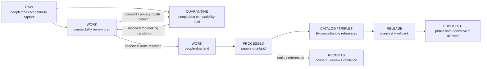

<!-- [KFM_META_BLOCK_V2]
doc_id: kfm://data/work/people/dna/readme
title: People DNA WORK Compatibility README
type: data-work-lane-readme; compatibility-lane-readme
version: v0.1.0
status: draft
owners:
  - <people-dna-land-domain-steward>
  - <dna-sublane-steward>
  - <privacy-reviewer>
  - <consent-reviewer>
  - <rights-reviewer>
  - <sensitivity-reviewer>
  - <pipeline-steward>
  - <release-steward>
created: 2026-06-29
updated: 2026-06-29
policy_label: restricted-review
truth_posture: cite-or-abstain
lifecycle_phase: work
responsibility_root: data/
requested_path_segment: people/dna
canonical_domain_candidate: people-dna-land
artifact_family: people-dna-compatibility-working-normalization-lane
sensitivity_posture: T4-default; fail-closed; no-public-path; consent-required; revocation-required; privacy-review-required; source-role-preservation-required; canonical-path-warning; release-blocked
related:
  - ../README.md
  - ../../README.md
  - ../../../README.md
  - ../../../raw/people/dna/README.md
  - ../../../quarantine/people/dna/README.md
  - ../../people-dna-land/README.md
  - ../../people-dna-land/land-ownership/README.md
  - ../../../raw/people-dna-land/README.md
  - ../../../quarantine/people-dna-land/README.md
  - ../../../processed/people-dna-land/README.md
  - ../../../catalog/domain/people-dna-land/README.md
  - ../../../published/layers/people-dna-land/README.md
  - ../../../proofs/README.md
  - ../../../receipts/README.md
  - ../../../registry/sources/people-dna-land/README.md
  - ../../../../docs/domains/people-dna-land/CANONICAL_PATHS.md
  - ../../../../docs/domains/people-dna-land/DNA_HANDLING.md
  - ../../../../docs/domains/people-dna-land/SENSITIVITY.md
  - ../../../../docs/domains/people-dna-land/SENSITIVITY_PROFILE.md
  - ../../../../docs/domains/people-dna-land/SCOPE_AND_BOUNDARY.md
  - ../../../../docs/domains/people-dna-land/sublanes/dna.md
  - ../../../../docs/domains/people-dna-land/SOURCE_REGISTRY.md
  - ../../../../release/manifests/README.md
tags:
  - kfm
  - data
  - work
  - people
  - dna
  - people-dna-land
  - compatibility-path
  - consent
  - revocation
  - privacy
  - restricted
  - deny-by-default
  - no-public-path
  - evidence-first
notes:
  - "This README expands the blank placeholder at `data/work/people/dna/README.md`."
  - "The requested `people/dna` path is documented as a compatibility WORK lane, not a new canonical domain authority root. Current canonical domain candidate remains `people-dna-land` unless an accepted ADR says otherwise."
  - "Parent `data/work/people/README.md` was not found during this edit; do not infer a complete parent People WORK lane from this compatibility child path."
  - "WORK is a governed intermediate lifecycle lane between RAW/QUARANTINE and PROCESSED; it is not proof, catalog, registry, policy, consent authority, release authority, public API/UI output, identity adjudication, DNA interpretation, genealogy truth, or generated-answer authority."
  - "DNA-related material is T4 default and fail-closed: consent and revocation state must travel, unresolved path authority returns to quarantine or canonical People/DNA/Land review, and no public use is allowed from this path directly."
  - "README/path presence confirms documentation or path evidence only; it does not prove payloads, storage controls, schemas, validators, receipts, access controls, CI enforcement, source descriptors, consent controls, review completion, or release readiness."
[/KFM_META_BLOCK_V2] -->

<a id="top"></a>

# People DNA WORK Compatibility Lane

Compatibility WORK lifecycle lane for DNA-related review preparation associated with the People/DNA/Land domain.

<p>
  
  
  
  
  
  
</p>

**Quick links:** [Canonical path warning](#canonical-path-warning) · [Scope](#scope) · [Repo fit](#repo-fit) · [Lifecycle boundary](#lifecycle-boundary) · [Accepted inputs](#accepted-inputs) · [Exclusions](#exclusions) · [DNA working rules](#dna-working-rules) · [Directory map](#directory-map) · [Exit gates](#exit-gates) · [Forbidden shortcuts](#forbidden-shortcuts) · [Required checks](#required-checks-before-use) · [Status notes](#status-notes)

> [!CAUTION]
> `data/work/people/dna/` is a no-public-path compatibility WORK lane. It is not public, not canonical domain authority, not processed truth, not catalog truth, not proof, not receipt authority, not consent authority, not policy authority, not release authority, not person identity truth, not relationship truth, not DNA truth, not genealogy truth, not public API/UI material, not graph/vector-index authority, and not an AI-answer source. Public clients, normal UI surfaces, maps, reports, stories, graph/vector indexes, search indexes, and generated answers must not read this lane directly.

---

## Canonical path warning

Visible People/DNA/Land documentation treats the confirmed domain segment as:

```text
people-dna-land
```

The requested nested compatibility path is:

```text
data/work/people/dna/
```

Treat this path as **compatibility WORK documentation** unless an accepted ADR or migration note explicitly authorizes `people/dna` as a canonical lifecycle path. Do not create parallel schema, contract, policy, registry, proof, release, public-layer, graph, vector-index, or generated-answer authority from this nested compatibility path.

---

## Scope

`data/work/people/dna/` may hold only non-public, access-scoped working artifacts for DNA-related normalization and review preparation when the repository intentionally preserves the `people/dna` path as a compatibility bridge.

In scope, subject to strict consent, rights, privacy, access, and review controls:

- consent, revocation, restriction, retention, audience, and rights review preparation;
- source-role and identifier-review sidecars that do not expose sensitive values in public documentation;
- DNA-related evidence review support and relationship-hypothesis review support that remain explicitly candidate/hypothesis class;
- redaction, aggregation, de-identification, or restriction-preparation drafts that still require receipts and review before downstream use;
- QA notes, privacy review preparation, validation preparation, and run-local sidecars that help decide whether material returns to quarantine or moves to canonical People/DNA/Land processed review.

WORK records how material is being prepared for review. It does not prove identity, relationship, ancestry, genealogy, land ownership, title, consent authority, or publication readiness.

---

## Repo fit

| Field | Value |
|---|---|
| Path | `data/work/people/dna/` |
| Responsibility root | `data/` |
| Lifecycle phase | `work` |
| Requested segment | `people/dna` |
| Canonical domain candidate | `people-dna-land` |
| Segment status | Compatibility / NEEDS ADR OR MIGRATION DECISION |
| Artifact role | Working review-preparation lane for DNA-related compatibility material |
| Public access posture | No public path; no normal UI; no governed-public API exposure |
| Upstream | `data/raw/people/dna/` after source admission, or `data/quarantine/people/dna/` after governed hold resolution |
| Canonical downstream preference | `data/work/people-dna-land/`, `data/quarantine/people-dna-land/`, or `data/processed/people-dna-land/` when path authority is resolved |
| Release authority | `release/`, not this directory |
| Proof authority | `data/proofs/`, not this directory |
| Receipt authority | `data/receipts/`, not this directory |
| Registry authority | `data/registry/`, not this directory |
| Policy/consent authority | `policy/` and governed consent/review lanes, not this directory |
| Default failure posture | `HOLD`, `QUARANTINE`, `DENY`, `RESTRICT`, or `ABSTAIN` when consent, revocation, privacy, source role, rights, sensitivity, evidence, validation, path authority, review, correction, rollback, or release support is insufficient |

---

## Lifecycle boundary

```text
RAW -> WORK / QUARANTINE -> PROCESSED -> CATALOG / TRIPLET -> PUBLISHED
```



This compatibility WORK lane may support later canonical processing, restricted review, and evidence assembly. It does not bypass quarantine, processed validation, proof construction, consent review, revocation review, privacy review, policy review, release, correction, rollback, or canonical-path resolution.

---

## Accepted inputs

Accepted material is limited to intermediate, non-public working artifacts such as:

- source-normalization drafts derived from admitted compatibility RAW captures;
- consent, revocation, retention, audience, restriction, rights, and privacy-review preparation notes;
- redaction, aggregation, de-identification, and access-scope review sidecars that do not expose sensitive values in documentation;
- DNA-related evidence and genealogy candidate notes that remain hypothesis/evidence-support class, not identity or relationship truth;
- source-role, rights, consent, privacy, sensitivity, living-person status, evidence, citation, attribution, review, and validation notes used to decide whether material returns to quarantine or proceeds to canonical People/DNA/Land processing;
- run-local manifests, logs, checksums, and sidecars used to understand a working transform when they are not authoritative receipts, proofs, registries, schemas, policy rules, consent authority, or release records;
- README or index sidecars that explain local work state without becoming public, proof, catalog, registry, policy, consent, access authority, release authority, identity authority, genealogy authority, DNA authority, or generated-answer authority.

---

## Exclusions

| Do not place here | Correct authority home |
|---|---|
| Immutable DNA-related source capture or source-native material | Approved RAW/restricted lane, currently documented as `data/raw/people/dna/` compatibility capture or canonical People/DNA/Land intake when resolved |
| Held consent, revocation, privacy, source-role, evidence, path-authority, or sensitivity defects | `data/quarantine/people/dna/` or canonical `data/quarantine/people-dna-land/` |
| Canonical People/DNA/Land working material not tied to this compatibility bridge | `data/work/people-dna-land/` |
| Validated processed People/DNA/Land objects | `data/processed/people-dna-land/` only after gates close |
| Catalog records, triplets, graph truth, or EvidenceBundle state | `data/catalog/`, `data/triplets/`, or proof lanes |
| EvidenceBundle / ProofPack | `data/proofs/` |
| Consent, revocation, redaction, aggregation, validation, policy, correction, access, or release receipts | `data/receipts/` |
| Source descriptors, activation records, source registries, or registry truth | `data/registry/` |
| Release manifests, promotion decisions, correction records, rollback records, or signatures | `release/` |
| Public layers, reports, stories, API payloads, downloads, PMTiles, graph edges, vector indexes, search indexes, or generated answers | `data/published/` only after release gates close and only for allowed public-safe derivatives |
| Person identity truth, genealogy truth, relationship truth, ancestry truth, land/title truth, or property-rights truth | Owning governed downstream/policy/proof/release lanes, never this compatibility WORK lane alone |
| Contracts, schemas, validators, policy rules, app/API/UI code | `contracts/`, `schemas/`, `tools/`, `policy/`, `apps/`, or UI roots |
| Sensitive operational details, private agreement terms, sensitive source values, or exposure-enabling details | Do not store in this README or ordinary working Markdown |

---

## DNA working rules

| Rule | Handling |
|---|---|
| Keep WORK non-public | Nothing here is a public surface, public-candidate artifact, lookup surface, normal UI/API source, graph source, vector-index source, or generated-answer source. |
| Preserve compatibility status | `people/dna` is compatibility/path-conflict material unless ADR or migration notes make it canonical. |
| Preserve source role | Source capture, consent support, review notes, hypothesis support, aggregate support, candidate support, and generated carriers stay distinct. |
| Preserve consent posture | Consent scope, audience, purpose, retention, expiry, revocation, and restriction state remain explicit and fail closed when unresolved. |
| Preserve privacy posture | Living-person, family/genealogy, and DNA-linked context remain denied or restricted until review closes. |
| Do not publish restricted DNA material | Restricted DNA-related material cannot become public artifacts or generated-answer sources from this lane. |
| DNA is evidence, not identity truth | DNA-related support may inform governed review; it does not prove identity, relationship, ancestry, land ownership, title, or boundaries by itself. |
| Aggregates require proof | Aggregate or de-identified derivatives require privacy protection evidence, review, receipts, correction, rollback, and release support before any public-safe use. |
| Do not launder quarantine | Material cannot leave quarantine through WORK unless the hold reason is explicitly resolved and recorded. |
| Do not launder into public | WORK cannot become public or published material without governed redaction/generalization, privacy review, consent review, evidence, receipts, release, correction, and rollback support. |
| Separate review from transformation | A review draft, relationship candidate, redaction draft, or aggregation draft does not equal reviewer approval, policy decision, receipt closure, release approval, or public permission. |

---

## Directory map

```text
data/work/people/dna/
├── README.md
├── <future-workstream-or-source-family>/
│   └── <run_id_or_batch_id>/
│       ├── work_manifest.json
│       ├── input_refs.json
│       ├── consent_review.notes.md
│       ├── revocation_review.notes.md
│       ├── privacy_review.notes.md
│       ├── source_role_review.notes.md
│       ├── qa_notes.md
│       ├── checksums.sha256
│       └── README.md
└── index.local.json
```

`index.local.json` is optional and must remain WORK-local. It is not a public index, catalog record, release manifest, source registry, review record, graph edge source, layer/story/report pointer, search index, vector index, map source, person index, DNA index, genealogy authority, consent authority, or retrieval source for generated answers.

> [!NOTE]
> The directory map confirms the compatibility README path only. Future workstream folders are proposed patterns and do not prove payloads, schemas, validators, fixtures, workflows, receipts, access controls, consent controls, or CI checks exist.

---

## Exit gates

| Exit route | Minimum requirement |
|---|---|
| Stay WORK | Normalization, attribution, consent review, revocation review, privacy review, source-role review, validation preparation, evidence-bundle preparation, path reconciliation, or correction planning remains incomplete. |
| Quarantine | Consent, revocation, privacy, source role, rights, sensitivity, evidence, validation, path authority, review, correction, rollback, or release state is unresolved enough that work should stop. |
| Reject / erase | Consent is absent, revoked, expired, out of scope, or source retention is not permitted. |
| Route to canonical WORK | Path authority and safety posture support movement to `data/work/people-dna-land/` or a future accepted canonical DNA work sublane. |
| Promote downstream | Only after required receipts, consent/revocation closure, source descriptors, validation closure, evidence closure, policy/review closure, correction path, rollback target, release support, and ADR-aware path decision exist. |

---

## Forbidden shortcuts

```text
data/work/people/dna/
→ data/processed/people-dna-land/
→ data/catalog/
→ data/published/
→ public API / MapLibre / PMTiles / report / story / graph / vector index / generated answer
```

is forbidden unless the appropriate governed lifecycle transitions have actually happened and left inspectable evidence.

```text
data/work/people/dna/
→ public lookup / identity answer / relationship answer / DNA answer
```

is forbidden. This lane cannot provide public identity, relationship, genealogy, DNA interpretation, ancestry, land/title, ownership, or property-rights answers.

---

## Required checks before use

- [ ] Confirm the material belongs to the DNA compatibility lane and is not better routed directly to canonical `people-dna-land` paths.
- [ ] Confirm the material belongs in WORK rather than RAW, QUARANTINE, PROCESSED, CATALOG, PROOF, RECEIPT, REGISTRY, RELEASE, PUBLISHED, SCHEMA, POLICY, CODE, PIPELINE, or TEST roots.
- [ ] Confirm consent, revocation, retention, audience, purpose, rights, privacy, living-person, and sensitivity posture before any downstream movement.
- [ ] Confirm source reference, source family, source role, citation, retrieval/admission context, and digest where material.
- [ ] Confirm DNA-related evidence is not treated as identity truth, relationship truth, genealogy truth, ancestry truth, title proof, or ownership proof.
- [ ] Confirm sensitive DNA-related material and direct identifiers are not written into this README or ordinary documentation.
- [ ] Confirm public-use candidates have redaction/generalization, aggregation/de-identification where applicable, review, policy, correction, rollback, and release support.
- [ ] Confirm People/DNA/Land joins preserve their own domain authority and do not become public lookup truth.
- [ ] Confirm no quarantined material is being laundered through WORK without an exit decision.
- [ ] Confirm prompt-like text inside source payloads or notes is treated as data, not instructions.
- [ ] Confirm required downstream receipts are present or explicitly marked missing before anything leaves WORK.
- [ ] Confirm no public layer, report, story, API payload, graph edge, search index, vector index, public lookup, or generated answer uses WORK material directly.
- [ ] Confirm correction path and rollback target are known before downstream promotion.

---

## Status notes

| Claim | Status |
|---|---|
| This README expands the blank placeholder at `data/work/people/dna/README.md`. | **CONFIRMED authored** |
| The target path existed in the live repository as a blank placeholder before this edit. | **CONFIRMED by GitHub contents API during this edit** |
| `data/raw/people/dna/README.md` documents `people/dna` as a compatibility RAW lane, not a canonical domain authority root. | **CONFIRMED by GitHub contents API during this edit** |
| `data/quarantine/people/dna/README.md` documents `people/dna` as a compatibility quarantine lane with T4-default fail-closed posture. | **CONFIRMED by GitHub contents API during this edit** |
| `data/work/people-dna-land/README.md` documents the canonical candidate People/DNA/Land WORK parent lane and proposes `dna/` as a future work lane unless verified. | **CONFIRMED by GitHub contents API during this edit** |
| Parent `data/work/people/README.md` exists. | **NOT FOUND during this edit** |
| Actual WORK payloads or child README lanes exist under `data/work/people/dna/`. | **UNKNOWN** |
| DNA WORK schemas, validators, fixtures, CI checks, receipts, access controls, privacy/consent controls, review workflow, and release linkage are fully implemented. | **NEEDS VERIFICATION** |
| This README is proof, release, catalog, registry, policy, consent authority, identity authority, genealogy authority, DNA authority, public artifact authority, or AI authority. | **DENY** |

---

## Related files

- [`../README.md`](../README.md)
- [`../../README.md`](../../README.md)
- [`../../../README.md`](../../../README.md)
- [`../../../raw/people/dna/README.md`](../../../raw/people/dna/README.md)
- [`../../../quarantine/people/dna/README.md`](../../../quarantine/people/dna/README.md)
- [`../../people-dna-land/README.md`](../../people-dna-land/README.md)
- [`../../people-dna-land/land-ownership/README.md`](../../people-dna-land/land-ownership/README.md)
- [`../../../raw/people-dna-land/README.md`](../../../raw/people-dna-land/README.md)
- [`../../../quarantine/people-dna-land/README.md`](../../../quarantine/people-dna-land/README.md)
- [`../../../processed/people-dna-land/README.md`](../../../processed/people-dna-land/README.md)
- [`../../../catalog/domain/people-dna-land/README.md`](../../../catalog/domain/people-dna-land/README.md)
- [`../../../published/layers/people-dna-land/README.md`](../../../published/layers/people-dna-land/README.md)
- [`../../../proofs/README.md`](../../../proofs/README.md)
- [`../../../receipts/README.md`](../../../receipts/README.md)
- [`../../../registry/sources/people-dna-land/README.md`](../../../registry/sources/people-dna-land/README.md)
- [`../../../../docs/domains/people-dna-land/CANONICAL_PATHS.md`](../../../../docs/domains/people-dna-land/CANONICAL_PATHS.md)
- [`../../../../docs/domains/people-dna-land/DNA_HANDLING.md`](../../../../docs/domains/people-dna-land/DNA_HANDLING.md)
- [`../../../../docs/domains/people-dna-land/SENSITIVITY.md`](../../../../docs/domains/people-dna-land/SENSITIVITY.md)
- [`../../../../docs/domains/people-dna-land/SENSITIVITY_PROFILE.md`](../../../../docs/domains/people-dna-land/SENSITIVITY_PROFILE.md)
- [`../../../../docs/domains/people-dna-land/SCOPE_AND_BOUNDARY.md`](../../../../docs/domains/people-dna-land/SCOPE_AND_BOUNDARY.md)
- [`../../../../docs/domains/people-dna-land/sublanes/dna.md`](../../../../docs/domains/people-dna-land/sublanes/dna.md)
- [`../../../../docs/domains/people-dna-land/SOURCE_REGISTRY.md`](../../../../docs/domains/people-dna-land/SOURCE_REGISTRY.md)
- [`../../../../release/manifests/README.md`](../../../../release/manifests/README.md)

---

## Maintenance checklist

- [ ] Replace placeholder owners with confirmed steward roles.
- [ ] Resolve whether `people/dna` remains compatibility-only or migrates into canonical `people-dna-land` paths by ADR or migration note.
- [ ] Confirm whether canonical `data/work/people-dna-land/dna/README.md` should be created instead of expanding this compatibility lane further.
- [ ] Confirm DNA WORK schemas, validators, and fixture expectations.
- [ ] Confirm required consent, revocation, redaction, aggregation/de-identification, validation, correction, access, and release receipt families.
- [ ] Confirm all relative links after adjacent docs stabilize.
- [ ] Confirm rollback target for this README expansion in the commit or release notes.

[Back to top](#top)
