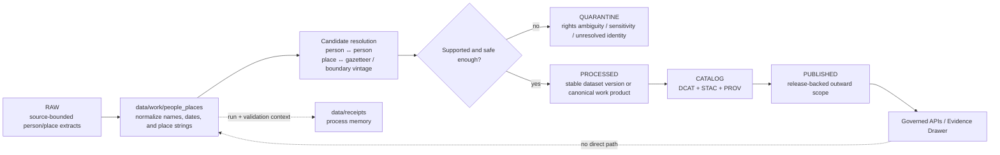

<!-- [KFM_META_BLOCK_V2]
doc_id: kfm://doc/NEEDS_VERIFICATION__people_places_work_readme
title: people_places
type: standard
version: v1
status: draft
owners: @bartytime4life
created: NEEDS_VERIFICATION__YYYY-MM-DD
updated: 2026-04-16
policy_label: NEEDS_VERIFICATION__internal_or_restricted
related: [
  ../README.md,
  ../../README.md,
  ../../raw/README.md,
  ../../quarantine/README.md,
  ../../processed/README.md,
  ../../catalog/README.md,
  ../../published/README.md,
  ../../receipts/README.md,
  ../../proofs/README.md,
  ../../registry/README.md,
  ../../../contracts/README.md,
  ../../../schemas/README.md,
  ../../../policy/README.md,
  ../../../tests/README.md,
  ../../../tests/policy/README.md,
  ../../../tests/policy/genealogy/README.md,
  ../../../.github/CODEOWNERS,
  ../../../.github/workflows/README.md
]
tags: [kfm, data, work, people, places, normalization, entity-resolution]
notes: [
  "Requested target path was supplied directly as data/work/people_places/README.md.",
  "Broader /data/ lifecycle doctrine and adjacent README surfaces are strongly evidenced in the supplied corpus.",
  "Exact mounted subtree, created date, and final policy label for this leaf still need active-branch verification."
]
[/KFM_META_BLOCK_V2] -->

<a id="top"></a>

# `people_places`

Deterministic work-lane for person and place normalization, candidate resolution, temporal place handling, and pre-publication sensitivity shaping in KFM.

> [!IMPORTANT]
> **Status:** experimental  
> **Doc state:** draft  
> **Owners:** `@bartytime4life`  
> **Path target:** `data/work/people_places/README.md`  
> **Repo fit:** child work-lane beneath [`../README.md`](../README.md); broader data boundary at [`../../README.md`](../../README.md); lifecycle neighbors in [`../../raw/README.md`](../../raw/README.md), [`../../quarantine/README.md`](../../quarantine/README.md), [`../../processed/README.md`](../../processed/README.md), [`../../catalog/README.md`](../../catalog/README.md), [`../../published/README.md`](../../published/README.md), [`../../receipts/README.md`](../../receipts/README.md), [`../../proofs/README.md`](../../proofs/README.md), and [`../../registry/README.md`](../../registry/README.md); shared control surfaces in [`../../../contracts/README.md`](../../../contracts/README.md), [`../../../schemas/README.md`](../../../schemas/README.md), [`../../../policy/README.md`](../../../policy/README.md), [`../../../tests/README.md`](../../../tests/README.md), [`../../../tests/policy/README.md`](../../../tests/policy/README.md), [`../../../tests/policy/genealogy/README.md`](../../../tests/policy/genealogy/README.md), [`../../../.github/CODEOWNERS`](../../../.github/CODEOWNERS), and [`../../../.github/workflows/README.md`](../../../.github/workflows/README.md)  
> **Quick jump:** [Scope](#scope) · [Repo fit](#repo-fit) · [Current evidence snapshot](#current-evidence-snapshot) · [Accepted inputs](#accepted-inputs) · [Exclusions](#exclusions) · [Directory tree](#directory-tree) · [Quickstart](#quickstart) · [Usage](#usage) · [Diagram](#diagram) · [Tables](#tables) · [Task list](#task-list--definition-of-done) · [FAQ](#faq) · [Appendix](#appendix)  
>      

> [!WARNING]
> This README is aligned to the **visible KFM doctrine and adjacent README pattern**.
>
> The broader `data/` lifecycle is well evidenced, but the exact mounted subtree for `data/work/people_places/` was **not** directly surfaced in this session. Treat leaf-local inventory, executable tooling, and merge-blocking enforcement as **NEEDS VERIFICATION** until the active checkout is inspected.

> [!TIP]
> Use this file to explain the **work-stage seam**:
>
> - what belongs here before canonical promotion,
> - how person/place transforms remain deterministic and reviewable,
> - where ambiguity and sensitivity are handled,
> - and which stronger surfaces still own schema, policy, proof, and release truth.
>
> Do not use this README to settle canonical schema, final identity truth, or public runtime behavior.

---

## Scope

`data/work/people_places/` is the work-stage seam for **person-oriented** and **place-oriented** transforms that are useful, reproducible, and reviewable, but not yet admissible as outward truth.

In KFM terms, this is the right lane for work such as:

- name, alias, and date normalization
- place-string cleanup and candidate gazetteer matching
- time-valid place handling across changing names, boundaries, or jurisdictions
- OCR or extraction intermediates that still require rule-based or human review
- candidate entity-resolution work that must remain explicit rather than silently merged
- redaction or generalization steps required before anything becomes publishable

This lane matters because KFM treats **people and settlement**, **historical place frames**, **service geographies**, **land tenure**, and **archives / newspapers / public memory** as structural operating domains rather than decorative content categories.

It is the right home for **review-bearing intermediate artifacts**. It is not the right home for final public claims.

[Back to top](#top)

---

## Repo fit

**Path:** `data/work/people_places/README.md`  
**Role in repo:** directory README for deterministic person/place work products, candidate-resolution staging, temporal place normalization, and replayable transform boundaries.

### Upstream, lateral, downstream, and control surfaces

| Direction | Surface | Why it matters | Status |
|---|---|---|---|
| Parent | [`../README.md`](../README.md) | `data/work/` should define the broader work-stage boundary this leaf inherits from. | **NEEDS VERIFICATION** |
| Upstream root | [`../../README.md`](../../README.md) | `data/` defines lifecycle role, intake posture, and the difference between repo-facing data surfaces and the trust membrane. | **CONFIRMED surface** |
| Lateral | [`../../raw/README.md`](../../raw/README.md) | Unmodified intake belongs in `RAW`, not here. | **CONFIRMED adjacent surface** |
| Lateral | [`../../quarantine/README.md`](../../quarantine/README.md) | Rights ambiguity, sensitivity ambiguity, and failed-validation material should move to quarantine instead of being treated as “almost processed.” | **CONFIRMED adjacent surface** |
| Lateral | [`../../processed/README.md`](../../processed/README.md) | Stable, publishable authority hardens there, not here. | **CONFIRMED adjacent surface** |
| Lateral | [`../../catalog/README.md`](../../catalog/README.md) | `DCAT + STAC + PROV` closure is a distinct downstream seam. | **CONFIRMED adjacent surface** |
| Lateral | [`../../receipts/README.md`](../../receipts/README.md) | Work-stage process memory and replay context should stay legible rather than disappearing into opaque transforms. | **CONFIRMED adjacent surface** |
| Lateral | [`../../proofs/README.md`](../../proofs/README.md) | Release manifests, proof packs, attestations, and correction trace are stronger release-bearing surfaces than this work leaf. | **CONFIRMED adjacent surface** |
| Lateral | [`../../published/README.md`](../../published/README.md) | Outward materialization is downstream of release closure, not a shortcut from `WORK`. | **CONFIRMED adjacent surface** |
| Lateral | [`../../registry/README.md`](../../registry/README.md) | Source admission and dataset identity should stay explicit before work-stage transforms begin. | **CONFIRMED adjacent surface** |
| Shared control | [`../../../contracts/README.md`](../../../contracts/README.md) | Human-readable trust-object meaning should remain outside this README. | **CONFIRMED** |
| Shared control | [`../../../schemas/README.md`](../../../schemas/README.md) | Canonical machine-shape authority should not drift into this leaf. | **CONFIRMED** |
| Shared control | [`../../../policy/README.md`](../../../policy/README.md) | Deny-by-default decisions, rights posture, and review obligations remain executable policy concerns. | **CONFIRMED** |
| Shared control | [`../../../tests/README.md`](../../../tests/README.md) | Work-stage behavior still needs fixtures, negative paths, and replay/correction proof. | **CONFIRMED** |
| Rights-sensitive proof seam | [`../../../tests/policy/README.md`](../../../tests/policy/README.md) | Person-sensitive and publication-sensitive policy behavior should be proved there rather than guessed here. | **CONFIRMED** |
| Narrow adjacent leaf | [`../../../tests/policy/genealogy/README.md`](../../../tests/policy/genealogy/README.md) | The visible genealogy leaf is evidence that people-related policy seams may require their own fail-closed proof surface. | **CONFIRMED leaf / bounded depth** |
| Gatehouse | [`../../../.github/CODEOWNERS`](../../../.github/CODEOWNERS) | Current public ownership of the broader `/data/` lane resolves here. | **CONFIRMED via adjacent docs** |
| Gatehouse | [`../../../.github/workflows/README.md`](../../../.github/workflows/README.md) | Workflow documentation exists, but current public visibility is README-oriented; exact YAML depth should not be overstated here. | **CONFIRMED README surface / UNKNOWN workflow depth** |
| Downstream | governed APIs and trust-visible shells | Public-facing surfaces should consume released, prepared artifacts rather than reading `WORK` directly. | **CONFIRMED doctrine / INFERRED lane consequence** |

### Repo-fit summary

| Question | Answer |
|---|---|
| What is `data/work/people_places/` for? | Deterministic, review-bearing transforms for person and place material before canonical processed authority exists. |
| What is it **not** for? | Not final identity truth, not public runtime state, not catalog closure, and not release proof. |
| What must stay explicit? | Original strings, candidate matches, confidence or review state, boundary/time semantics, and any redaction/generalization step. |
| What should happen to unresolved ambiguity? | Route it to quarantine or a narrower review-bearing surface instead of quietly carrying it forward. |

[Back to top](#top)

---

## Current evidence snapshot

This draft separates **current visible repo evidence** from **doctrine-aligned target shape**.

| Claim | Status | Why it matters here |
|---|---|---|
| The broader `data/` lifecycle surface is real and includes `work/`, `raw/`, `quarantine/`, `processed/`, `catalog/`, `published/`, `proofs/`, `receipts/`, and `registry/` in adjacent repo-facing docs. | **CONFIRMED** | This README should fit the existing lifecycle split instead of inventing a parallel one. |
| `data/receipts/README.md` and `data/published/README.md` already use the repo’s modern README pattern: meta block, impact block, quick jumps, evidence posture, tree snapshot, and inspection-first commands. | **CONFIRMED** | This leaf should feel native to neighboring `data/` docs. |
| Current public `/data/` ownership resolves to `@bartytime4life` in adjacent surfaced docs. | **CONFIRMED** | Owner can be grounded in the top block instead of guessed. |
| `tests/policy/genealogy/README.md` is a visible child family on current public `main`. | **CONFIRMED** | People-sensitive policy proof is not hypothetical in the surrounding doc surface. |
| The exact `data/work/people_places/` subtree, file inventory, helper callers, and enforcement wiring were not directly surfaced in this session. | **UNKNOWN / NEEDS VERIFICATION** | This README must not turn a requested path into fake mounted certainty. |
| KFM doctrine strongly supports a person/place work seam because the project is place-and-time driven, includes people-and-settlement as a major dimension, and requires cautious entity resolution and time-valid geography. | **CONFIRMED doctrine / INFERRED leaf fit** | The lane purpose is strong even where local implementation proof remains bounded. |

[Back to top](#top)

---

## Accepted inputs

Only material that still belongs to the **work stage** should land here.

| Accepted input | Why it belongs here | Typical seam |
|---|---|---|
| Source-bounded person-record extracts | Person-bearing rows or mentions often need normalization before they can be compared or reviewed safely. | `RAW → WORK` |
| Source-bounded place-record extracts | Place strings, legal descriptions, and boundary-linked identifiers often need parsing, normalization, and time-aware interpretation. | `RAW → WORK` |
| Name/date/place normalization outputs | Deterministic cleanup belongs in `WORK`, not in `PUBLISHED`. | work internals |
| Candidate person-resolution sets | Identity work is review-bearing and should remain explicit until promoted elsewhere. | work internals |
| Candidate place/gazetteer matches | Place linkage can be useful before it is final; candidate state is exactly what `WORK` is for. | work internals |
| Boundary-vintage or support crosswalks | KFM treats support and time-valid geography as meaning-bearing, not housekeeping. | work internals |
| OCR, extraction, and geoparsing intermediates | These are often valuable but still fallible, rights-bearing, or confidence-bearing. | `WORK ↔ QUARANTINE` |
| Redaction/generalization transforms | Sensitive or over-precise material may need work-stage shaping before anything can harden. | `WORK ↔ QUARANTINE` |
| Run/validation context by link or mirror | Replay, correction, and later review depend on stable join points into receipts. | `WORK ↔ receipts` |

### Input rules

1. Preserve the **original source expression** somewhere resolvable, even when a normalized field is added.
2. Treat place handling as **time-valid** whenever names, boundaries, or jurisdictions can drift.
3. Treat entity resolution as **candidate work first**; do not silently harden “best guess” identity into authority.
4. Keep sensitive or rights-unclear person/place material reviewable without letting it masquerade as ordinary work output.
5. Prefer deterministic transforms that can be re-run and inspected over ad hoc notebook-only cleanup.
6. Link forward to stronger surfaces instead of flattening receipts, policy decisions, or proof objects into work artifacts.

[Back to top](#top)

---

## Exclusions

| Does **not** belong here | Put it here instead | Why |
|---|---|---|
| Unmodified source-native payloads | [`../../raw/README.md`](../../raw/README.md) | `RAW` preserves exactly what arrived. |
| Rights-unclear, consent-unclear, or sensitivity-unclear material treated as “probably fine” | [`../../quarantine/README.md`](../../quarantine/README.md) | Quarantine is the normal hold state, not a pipeline failure. |
| Final canonical people/place dataset versions | [`../../processed/README.md`](../../processed/README.md) | Stable authority belongs in `PROCESSED`, not in `WORK`. |
| `DCAT + STAC + PROV` closure | [`../../catalog/README.md`](../../catalog/README.md) | Catalog closure is downstream release truth, not transform scratch. |
| Release manifests, proof packs, DSSE bundles, or attestation archives | [`../../proofs/README.md`](../../proofs/README.md) | Proof-bearing release objects remain separate from process memory and work transforms. |
| Already release-backed outward materialization | [`../../published/README.md`](../../published/README.md) | Publication is a governed state, not a side effect of normalization. |
| Executable policy law | [`../../../policy/README.md`](../../../policy/README.md) | Policy decides; this lane prepares reviewable artifacts. |
| Canonical trust-object schema definitions | [`../../../contracts/README.md`](../../../contracts/README.md) and [`../../../schemas/README.md`](../../../schemas/README.md) | This README must not become a second schema registry. |
| Direct UI/runtime reads | governed APIs and trust-visible runtime surfaces downstream of release | `WORK` is not a client contract. |
| Quiet final merge decisions hidden in prose | contracts, schemas, policy, and tests | Review-bearing identity work must stay machine-checkable or explicitly reviewable. |

[Back to top](#top)

---

## Directory tree

### Current directly verified context

The broader lifecycle context is visible in adjacent docs, but the exact child inventory for this leaf was not directly surfaced.

```text
data/
├── README.md
├── raw/README.md
├── work/README.md
├── quarantine/README.md
├── processed/README.md
├── catalog/README.md
├── published/README.md
├── receipts/README.md
├── proofs/README.md
└── registry/README.md
```

> [!NOTE]
> The tree above is a **current adjacent-surface map**, not proof of the mounted `people_places/` leaf contents.

### Requested target surface for this revision

```text
data/work/
└── people_places/
    └── README.md
```

> [!CAUTION]
> The target path above is the requested leaf for this document, not proof that the active checkout already contains a populated subtree.

### Doctrine-aligned starter shape (`PROPOSED`)

```text
data/work/people_places/
├── README.md
├── batches/            # source-bounded input slices or normalized batch partitions
├── normalized/         # deterministic name/date/place cleanup outputs
├── resolution/         # candidate person/place match sets and review-bearing joins
├── redaction/          # generalized or policy-shaped mirrors when needed
└── _lookup/            # small replay/review indexes only
```

### Placement rule

Treat the starter tree above as **illustrative, not mandatory**.

The important seam is this:

- deterministic transforms stay in `WORK`
- process memory stays linkable to `../../receipts/`
- unresolved material can still move to `../../quarantine/`
- final authority and outward release stay downstream

[Back to top](#top)

---

## Quickstart

### 1) Inspect the leaf exactly as it exists now

```bash
find data/work/people_places -maxdepth 4 -type f 2>/dev/null | sort || true
find data/work/people_places -maxdepth 4 -type d 2>/dev/null | sort || true
```

### 2) Re-open the parent and sibling lifecycle docs

```bash
for p in \
  data/README.md \
  data/work/README.md \
  data/raw/README.md \
  data/quarantine/README.md \
  data/processed/README.md \
  data/catalog/README.md \
  data/receipts/README.md \
  data/proofs/README.md \
  data/published/README.md \
  data/registry/README.md
do
  echo
  echo "== $p =="
  sed -n '1,220p' "$p" 2>/dev/null || true
done
```

### 3) Inspect adjacent person-sensitive policy surfaces

```bash
sed -n '1,260p' tests/policy/README.md 2>/dev/null || true
sed -n '1,260p' tests/policy/genealogy/README.md 2>/dev/null || true
```

### 4) Trace trust-bearing object names before inventing new ones

```bash
grep -RInE \
  'spec_hash|run_receipt|DecisionEnvelope|RuntimeResponseEnvelope|EvidenceBundle|CorrectionNotice|place_geoid|valid_from|valid_to|source_record_id|entity resolution|merge silently' \
  data contracts schemas policy tests docs apps packages 2>/dev/null || true
```

### 5) Inspect visible workflow-lane contents before claiming enforcement

```bash
find .github/workflows -maxdepth 3 -type f 2>/dev/null | sort || true
sed -n '1,260p' .github/workflows/README.md 2>/dev/null || true
```

### 6) Check whether the branch already has a narrower people/place family elsewhere

```bash
find . -type f \
  \( -path '*people*' -o -path '*places*' -o -path '*gazetteer*' -o -path '*genealogy*' \) \
  2>/dev/null | sort
```

> [!TIP]
> Inspection-first is safer than guessing whether this leaf already has fixtures, validators, or a parent convention that should be revised in place.

[Back to top](#top)

---

## Usage

### What `data/work/people_places/` is

`data/work/people_places/` is:

- a deterministic **normalization seam** for person/place material
- a **candidate-resolution seam** where ambiguity remains visible
- a review-bearing home for **time-valid place handling**
- a support surface for **redaction/generalization before processed authority**
- a bridge to **receipts**, **quarantine**, and later **processed/catalog** surfaces

### Working rules

1. Keep **original strings and source references** resolvable.
2. Normalize **names, dates, and places** in a reproducible way.
3. Keep **candidate merges and confidence/review state** explicit.
4. Never let this leaf become a quiet substitute for canonical entity truth.
5. Route unresolved rights, living-person risk, DNA-sensitive material, or over-precise locations to the appropriate quarantine or review seam.
6. Keep outputs useful to validators and reviewers, not for direct client consumption.
7. When a place can change over time, preserve the **time-valid mapping context** instead of flattening it to one timeless geometry.
8. Link forward to stronger objects by reference instead of inlining proof, policy, or release semantics here.

### What `data/work/people_places/` is not

This leaf is **not**:

- a final person registry
- a final gazetteer
- a public dossier surface
- a shortcut around policy review
- a release proof lane
- a client-facing runtime API contract
- a license to silently merge uncertain identity claims

### One honest working sequence

```text
source slice admitted
    ↓
name / date / place normalization
    ↓
candidate joins to place frames or person/entity records
    ↓
review-sensitive ambiguity or sensitivity split
    ├── unresolved / unsafe → QUARANTINE
    └── bounded / reproducible → handoff toward PROCESSED
    ↓
receipts, validation context, and later catalog linkage stay resolvable
```

[Back to top](#top)

---

## Diagram



Above: the work leaf sits between source-native intake and canonical processed authority. It can produce useful transforms and candidate joins, but it should not bypass quarantine, receipts, processed authority, or governed release surfaces.

[Back to top](#top)

---

## Tables

### Work-product boundary matrix

| Work product family | Why it belongs in `WORK` | Block if |
|---|---|---|
| Normalized person rows | Names, aliases, dates, and source expressions often need cleanup before comparison or review. | The artifact starts behaving like a final public roster. |
| Normalized place rows | Place strings, legal descriptions, and join keys often need deterministic cleanup and time-aware interpretation. | Time-varying place semantics are flattened away. |
| Candidate person-match sets | Identity work is review-bearing and should remain explicit. | A “best guess” candidate is silently promoted to canonical identity. |
| Candidate place/gazetteer matches | Candidate place linkage is useful before it is final. | Unsupported or low-confidence place links are treated as final truth. |
| Boundary-vintage crosswalks | Historical and administrative place frames can drift across time. | One timeless geometry is substituted for time-valid support. |
| Redaction/generalization outputs | Sensitive person/place material may need shaping before anything else can move forward. | Exact or sensitive detail leaks into ordinary work artifacts. |
| Small replay/review indexes | Work-stage review benefits from stable joins and compact lookups. | The index starts substituting for receipts, proofs, or canonical schemas. |

### People/place-specific risk matrix

| Risk | Why it matters | Safer behavior |
|---|---|---|
| Silent person merge | Identity resolution is review-bearing and easy to overclaim. | Keep match state explicit and route unresolved cases to review or quarantine. |
| Time-invalid geography | Counties, jurisdictions, service areas, and named places can change across vintages. | Preserve the date/boundary context instead of treating every place as timeless. |
| Living-person or consent-sensitive spillover | Some people-facing materials are not safely handled as ordinary historical transforms. | Fail closed, generalize, or quarantine rather than normalizing your way into exposure. |
| OCR or extraction overconfidence | Archives and documentary sources can look cleaner than they really are. | Preserve originals, extraction status, and review state. |
| Work-to-runtime shortcut | `WORK` artifacts are tempting to consume directly when they “look done.” | Keep apps and shells downstream of processed, cataloged, release-backed scope. |
| Exact-location leakage | A place string can resolve to a precision level the publication surface should not expose. | Apply redaction/generalization before downstream handoff. |

### Domain pressure that makes this leaf important

| Domain pressure | Why it matters for `people_places` work |
|---|---|
| People and settlement | KFM explicitly treats people and settlement as a core analytical dimension. |
| Historical boundaries and mobility | Historical place frames and movement flows require explicit time and support semantics. |
| Places, cities, and service areas | Service geography, jurisdiction, and operational reach are related but not identical. |
| Land tenure, plats, and deeds | Identity resolution, OCR, geoparsing, and temporal linking are review-bearing. |
| Archives, newspapers, and public memory | Narrative convenience must not erase provenance, rights, or sensitivity posture. |

[Back to top](#top)

---

## Task list / definition of done

Use this checklist before treating this leaf as branch-native.

- [ ] Confirm the target path actually exists on the active checkout.
- [ ] Re-open [`../README.md`](../README.md) and align any parent `work` terminology before merge.
- [ ] Replace `doc_id`, `created`, and `policy_label` placeholders with repo-backed values.
- [ ] Verify whether this leaf already has local fixtures, transforms, or lookup files that should appear in the directory tree.
- [ ] Add one **small valid example** of person/place normalization if the branch already contains it.
- [ ] Add one **negative-path example** showing ambiguity, sensitivity, or failed-resolution behavior.
- [ ] Keep any identity-resolution example explicitly **non-canonical** unless processed authority proves otherwise.
- [ ] Link one concrete receipt or validation example if the branch already emits one.
- [ ] Re-check all relative links from this leaf.
- [ ] Ensure no prose here silently outranks contracts, schemas, policy, tests, or release-bearing surfaces.

[Back to top](#top)

---

## FAQ

### Why combine people and places in one work lane?

Because KFM’s cross-source alignment pressure is shared here: names, dates, places, support, and time-valid interpretation often need to move together during normalization. That does **not** mean final canonical authority has to remain combined forever.

### Can this directory define final JSON keys or final schema names?

Not unless mounted contracts, schemas, or tests prove them. This README can describe the seam and safe behavior, but it should not smuggle placeholder fields into “implemented fact.”

### Is this leaf allowed to expose living-person or exact-location detail?

Not by default. If work here touches living-person, consent-sensitive, DNA-sensitive, or over-precise place material, route it to a review-bearing or quarantine seam instead of treating it like ordinary transform output.

### Can apps or shells read directly from this folder?

They should not treat `WORK` as a public contract. KFM doctrine consistently places governed APIs, evidence resolution, policy checks, and release-backed scope downstream of work-stage transforms.

### Why are some meta-block values still placeholders?

Because the exact mounted leaf was not directly surfaced in this session. The placeholders are deliberate review markers, not accidental omissions.

[Back to top](#top)

---

## Appendix

<details>
<summary><strong>Corpus-grounded constraints carried into this README</strong></summary>

```text
- KFM is a governed, evidence-linked system organized around place and time.
- The canonical truth path remains:
  source edge -> RAW -> WORK / QUARANTINE -> PROCESSED -> CATALOG -> PUBLISHED
- Promotion is a governed state transition, not a file move.
- People and settlement are a core analytical dimension.
- Historical boundaries / mobility, places / service areas, land tenure, and archives / public memory
  each carry distinct publication and interpretation burdens.
- Cross-source alignment requires geography normalization, shared time handling,
  and cautious entity resolution that never merges silently.
- Derived or work-stage artifacts must not quietly become public runtime truth.
```

</details>

<details>
<summary><strong>Likely surfaces to verify before merge</strong></summary>

```text
data/work/README.md
data/quarantine/README.md
data/processed/README.md
data/catalog/README.md
data/receipts/README.md
contracts/README.md
schemas/README.md
policy/README.md
tests/README.md
tests/policy/README.md
tests/policy/genealogy/README.md
.github/CODEOWNERS
.github/workflows/README.md
```

</details>

<details>
<summary><strong>Writing rule for this leaf</strong></summary>

Use this README to explain:

- what kind of work belongs here,
- what must stay explicit before promotion,
- and how ambiguity or sensitivity is routed safely.

Do not use this README to:

- substitute for canonical processed authority,
- hide missing policy review,
- or quietly widen publication claims beyond what downstream release objects can support.
```

</details>

[Back to top](#top)
