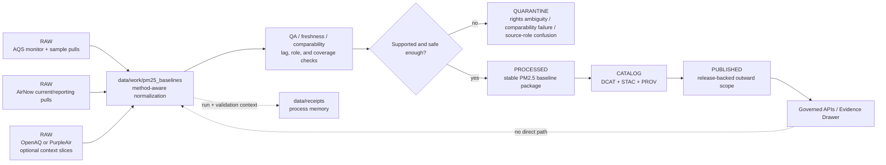

<!-- [KFM_META_BLOCK_V2]
doc_id: kfm://doc/NEEDS_VERIFICATION__pm25_baselines_work_readme
title: pm25_baselines
type: standard
version: v1
status: draft
owners: @bartytime4life
created: NEEDS_VERIFICATION__YYYY-MM-DD
updated: NEEDS_VERIFICATION__YYYY-MM-DD
policy_label: NEEDS_VERIFICATION__internal_or_restricted
related: [
  ../README.md,
  ../../README.md,
  ../../raw/README.md,
  ../../quarantine/README.md,
  ../../processed/README.md,
  ../../catalog/README.md,
  ../../published/README.md,
  ../../receipts/README.md,
  ../../proofs/README.md,
  ../../registry/README.md,
  ../../../contracts/README.md,
  ../../../schemas/README.md,
  ../../../policy/README.md,
  ../../../tests/README.md,
  ../../../tests/policy/README.md,
  ../../../.github/CODEOWNERS,
  ../../../.github/workflows/README.md
]
tags: [kfm, data, work, pm25, baselines, air-quality]
notes: [
  "Requested target path was supplied directly as data/work/pm25_baselines/README.md.",
  "Broader /data/ lifecycle doctrine and adjacent README surfaces are strongly evidenced in the supplied corpus.",
  "Exact mounted subtree, created date, and final policy label for this leaf still need active-branch verification."
]
[/KFM_META_BLOCK_V2] -->

<a id="top"></a>

# `pm25_baselines`

Deterministic work-lane for PM2.5 baseline pulls, method-aware normalization, and source-role-safe pre-release air-quality staging in KFM.

> [!IMPORTANT]
> **Status:** experimental  
> **Doc state:** draft  
> **Owners:** `@bartytime4life`  
> **Path target:** `data/work/pm25_baselines/README.md`  
> **Repo fit:** child work-lane beneath [`../README.md`](../README.md); broader data boundary at [`../../README.md`](../../README.md); lifecycle neighbors in [`../../raw/README.md`](../../raw/README.md), [`../../quarantine/README.md`](../../quarantine/README.md), [`../../processed/README.md`](../../processed/README.md), [`../../catalog/README.md`](../../catalog/README.md), [`../../published/README.md`](../../published/README.md), [`../../receipts/README.md`](../../receipts/README.md), [`../../proofs/README.md`](../../proofs/README.md), and [`../../registry/README.md`](../../registry/README.md); shared control surfaces in [`../../../contracts/README.md`](../../../contracts/README.md), [`../../../schemas/README.md`](../../../schemas/README.md), [`../../../policy/README.md`](../../../policy/README.md), [`../../../tests/README.md`](../../../tests/README.md), [`../../../tests/policy/README.md`](../../../tests/policy/README.md), [`../../../.github/CODEOWNERS`](../../../.github/CODEOWNERS), and [`../../../.github/workflows/README.md`](../../../.github/workflows/README.md)  
> **Quick jump:** [Scope](#scope) · [Repo fit](#repo-fit) · [Current evidence snapshot](#current-evidence-snapshot) · [Accepted inputs](#accepted-inputs) · [Exclusions](#exclusions) · [Directory tree](#directory-tree) · [Quickstart](#quickstart) · [Usage](#usage) · [Diagram](#diagram) · [Tables](#tables) · [Task list](#task-list--definition-of-done) · [FAQ](#faq) · [Appendix](#appendix)  
>      

> [!WARNING]
> This README is aligned to the **visible KFM doctrine** and the **adjacent README pattern**.  
> The broader `data/` lifecycle is well evidenced, but the exact mounted subtree for `data/work/pm25_baselines/` was **not** directly surfaced in this session. Treat leaf-local inventory, helper names, and merge-blocking enforcement as **NEEDS VERIFICATION** until the active checkout is inspected.

> [!TIP]
> Keep this leaf narrow and legible. In KFM, PM2.5 baseline work should start with **explicit source-role separation** and **reviewable baseline assembly**, not with a blurred “one atmospheric truth” table.

---

## Scope

`data/work/pm25_baselines/` is the work-stage seam for **PM2.5 baseline assembly** that is useful, reproducible, and reviewable, but not yet admissible as outward truth.

In KFM terms, this is the right lane for work such as:

- EPA **AQS** monitor metadata, hourly samples, and daily summaries used as the regulatory archive anchor
- **AirNow** current-condition overlays and reporting-oriented joins that remain visibly distinct from AQS
- provider-tagged **OpenAQ** discovery/network slices where mixed provenance stays explicit
- optional **PurpleAir** or other low-cost sensor comparison slices when variants and corrections are clearly documented
- PM2.5 grouping joins for county, watershed, or other public-safe spatial rollups
- freshness, comparability, and QA staging before anything hardens into `PROCESSED`
- reviewable transform notes, request context, and handoff intent while the work is still fresh

This leaf matters because KFM’s air/climate lane is useful **and** epistemically mixed. A current AQS record, an AirNow reporting view, an OpenAQ aggregate measurement, a corrected PurpleAir estimate, and any later modeled or anomaly-derived surface do **not** carry the same weight. This work lane exists to preserve that distinction instead of smoothing it away.

[Back to top](#top)

---

## Repo fit

**Path:** `data/work/pm25_baselines/README.md`  
**Role in repo:** directory README for deterministic PM2.5 baseline work products, method-aware normalization, source-role separation, and replayable pre-release handoff boundaries.

### Upstream, lateral, downstream, and control surfaces

| Direction | Surface | Why it matters | Status |
|---|---|---|---|
| Parent | [`../README.md`](../README.md) | `data/work/` defines the broader work-stage boundary this leaf inherits from. | **CONFIRMED adjacent surface** |
| Upstream root | [`../../README.md`](../../README.md) | `data/` defines lifecycle role, intake posture, and the distinction between repo-facing data surfaces and the trust membrane. | **CONFIRMED adjacent surface** |
| Lateral | [`../../raw/README.md`](../../raw/README.md) | Source-native captures belong in `RAW`, not here. | **CONFIRMED adjacent surface** |
| Lateral | [`../../quarantine/README.md`](../../quarantine/README.md) | Rights ambiguity, comparability failure, or unresolved sensitivity should move there instead of being treated as “almost processed.” | **CONFIRMED adjacent surface** |
| Lateral | [`../../processed/README.md`](../../processed/README.md) | Stable PM2.5 baseline authority hardens there, not here. | **CONFIRMED adjacent surface** |
| Lateral | [`../../catalog/README.md`](../../catalog/README.md) | `DCAT + STAC + PROV` closure is downstream release truth, not transform scratch. | **CONFIRMED adjacent surface** |
| Lateral | [`../../receipts/README.md`](../../receipts/README.md) | Centrally queryable process memory should stay resolvable there rather than disappearing into ad hoc work folders. | **CONFIRMED adjacent surface** |
| Lateral | [`../../proofs/README.md`](../../proofs/README.md) | Release manifests, proof packs, attestations, and rollback evidence belong there, not in `WORK`. | **CONFIRMED adjacent surface** |
| Lateral | [`../../published/README.md`](../../published/README.md) | Publication is a governed state, not a side effect of normalization. | **CONFIRMED adjacent surface** |
| Lateral | [`../../registry/README.md`](../../registry/README.md) | Source admission and dataset identity should stay explicit before work-stage transforms begin. | **CONFIRMED adjacent surface** |
| Shared control | [`../../../contracts/README.md`](../../../contracts/README.md) | Human-readable trust-object meaning should remain outside this leaf. | **CONFIRMED** |
| Shared control | [`../../../schemas/README.md`](../../../schemas/README.md) | Canonical machine-shape authority should not drift into this README. | **CONFIRMED** |
| Shared control | [`../../../policy/README.md`](../../../policy/README.md) | Deny-by-default law, review obligations, and source-role posture remain executable policy concerns. | **CONFIRMED** |
| Shared control | [`../../../tests/README.md`](../../../tests/README.md) | Work-stage behavior still needs fixtures, negative paths, and replay/correction proof. | **CONFIRMED** |
| Rights-sensitive proof seam | [`../../../tests/policy/README.md`](../../../tests/policy/README.md) | PM2.5 publication posture and mixed-source handling should be proved there rather than guessed here. | **CONFIRMED path / INFERRED role** |
| Workflow boundary | [`../../../.github/workflows/README.md`](../../../.github/workflows/README.md) | Workflow orchestration may validate or publish downstream artifacts, but this leaf should not pretend that YAML is already proven. | **CONFIRMED path / NEEDS VERIFICATION on actual callers** |

[Back to top](#top)

---

## Current evidence snapshot

| Evidence item | Status | How this README uses it |
|---|---|---|
| `data/work/` is documented as a repeatable, non-public staging zone in the KFM truth path | **CONFIRMED** | Grounds this leaf as a work-stage seam, not a publication surface |
| Current public `data/work/` view is README-only | **CONFIRMED** | Prevents overclaiming mounted subtree depth for this child lane |
| The broader `data/` lifecycle already distinguishes `RAW`, `WORK`, `QUARANTINE`, `PROCESSED`, `CATALOG`, `RECEIPTS`, `PROOFS`, and `PUBLISHED` | **CONFIRMED** | Grounds upstream/downstream links and boundary language |
| A recent child-leaf README pattern exists for `data/work/people_places/README.md` | **INFERRED pattern source** | Provides the closest repo-native structure and presentation rhythm for this README |
| PM2.5 baseline design material explicitly distinguishes AQS from AirNow and recommends reproducible baseline assembly | **CONFIRMED source packet** | Grounds the AQS/AirNow role split and the baseline-first posture |
| PM2.5 harmonization material explicitly distinguishes AQS, OpenAQ, and PurpleAir and warns against flattening provenance | **CONFIRMED source packet** | Grounds the source-role matrix and accepted-input rules |
| KFM air/climate doctrine treats this lane as useful but later, mixed, and burdened by knowledge-character labeling | **CONFIRMED doctrine** | Grounds the narrow, non-overclaiming scope of this leaf |
| Exact mounted `data/work/pm25_baselines/` inventory, helper scripts, fixtures, and workflow callers | **UNKNOWN / NEEDS VERIFICATION** | Kept visibly bounded throughout this README |

[Back to top](#top)

---

## Accepted inputs

The following belong here when they are part of a **repeatable, reviewable, non-public** PM2.5 baseline path.

### Accepted input classes

| Input class | Why it belongs here |
|---|---|
| AQS monitor metadata | Needed to ground station identity, parameter coverage, method codes, operating dates, and QA context for PM2.5 baselines |
| AQS PM2.5 hourly or daily slices | Regulatory archive anchor for PM2.5 baseline work, especially for parameter code `88101` |
| AirNow current-condition slices | Useful as reporting/current overlay context when kept explicitly distinct from AQS |
| OpenAQ slices with provider/license metadata | Useful as discovery/network context when heterogeneous provenance is preserved |
| PurpleAir raw or corrected comparison slices | Useful for density and neighborhood context only when the chosen variant and correction path remain explicit |
| Spatial grouping references | County, watershed, or other public-safe grouping layers used to aggregate monitor context without pretending the grouping is itself PM2.5 truth |
| Freshness and request metadata | Retrieval timestamps, source URLs, `ETag`, `Last-Modified`, and similar process-memory fields needed for replay and delta-aware polling |
| QA and comparability notes | Method mismatch warnings, lag notes, missing-header notes, and reviewable transform comments that explain what happened before handoff |

### Input rules

1. Keep **AQS**, **AirNow**, **OpenAQ**, and **PurpleAir** visibly distinct.
2. Preserve **method**, **monitor**, and **POC** identity when source material supports them.
3. Keep retrieval context reviewable: source URL, time window, and freshness validators should remain easy to inspect.
4. Treat current/reporting, regulatory/archive, discovery-layer, and low-cost/community feeds as **different source roles**, not formatting variants.
5. Keep the first pass baseline-first. Do not let this leaf quietly become a speculative fusion or anomaly lane.

[Back to top](#top)

---

## Exclusions

| Does **not** belong here | Put it here instead | Why |
|---|---|---|
| Immutable upstream captures | [`../../raw/README.md`](../../raw/README.md) | Intake must remain source-native and append-friendly |
| Blocked, ambiguous, or review-held material | [`../../quarantine/README.md`](../../quarantine/README.md) | Work is not the fail-closed holding lane |
| Stable processed baseline packs | [`../../processed/README.md`](../../processed/README.md) | `WORK` is pre-release staging, not the stable processed zone |
| Outward `DCAT + STAC + PROV` closure | [`../../catalog/README.md`](../../catalog/README.md) | Catalog closure is downstream release truth |
| Centrally queryable receipts | [`../../receipts/README.md`](../../receipts/README.md) | Process memory should stay easy to resolve during replay, correction, and audit |
| Release manifests, proof packs, attestations, rollback evidence | [`../../proofs/README.md`](../../proofs/README.md) | Release proof is a separate trust surface |
| Materialized published scope | [`../../published/README.md`](../../published/README.md) | Publication is a governed state, not a convenience copy out of work |
| Source-registration entries or identity schemas | [`../../registry/README.md`](../../registry/README.md) | Onboarding and dataset identity should stay explicit and diffable |
| Unlabeled atmospheric “one truth” tables | redesign here first | This leaf should preserve source-role meaning instead of flattening it |
| Regulatory-grade claims derived from AirNow, OpenAQ, or PurpleAir alone | quarantine or later reviewed processed scope | Their roles differ from AQS and should not be silently upgraded |
| Policy bundles, contract schemas, or runtime code | [`../../../policy/README.md`](../../../policy/README.md) · [`../../../contracts/README.md`](../../../contracts/README.md) · [`../../../schemas/README.md`](../../../schemas/README.md) | Preserve lane boundaries instead of hiding control-plane assets in staging |

> [!WARNING]
> “It looks close enough to a PM2.5 baseline” is **not** enough. If the artifact weakens reproducibility, obscures source role, or tempts direct UI/runtime consumption, it does not belong here in unmanaged form.

[Back to top](#top)

---

## Directory tree

### Current directly verified context

The broader lifecycle context is visible in adjacent docs, but the exact child inventory for this leaf was **not** directly surfaced.

```text
data/
├── README.md
├── raw/README.md
├── work/README.md
├── quarantine/README.md
├── processed/README.md
├── catalog/README.md
├── published/README.md
├── receipts/README.md
├── proofs/README.md
└── registry/README.md
```

> [!NOTE]
> The tree above is a **current adjacent-surface map**, not proof of the mounted `pm25_baselines/` leaf contents.

### Requested target surface for this revision

```text
data/work/
└── pm25_baselines/
    └── README.md
```

> [!CAUTION]
> The target path above is the requested leaf for this document, not proof that the active checkout already contains a populated subtree.

### Doctrine-aligned starter shape (`PROPOSED`)

```text
data/work/pm25_baselines/
├── README.md
├── pulls/                # source-bounded AQS / AirNow / optional network slices
├── normalized/           # method-aware station and series cleanup
├── overlays/             # county / watershed / reporting-context joins
├── qa/                   # freshness, comparability, and coverage checks
└── _lookup/              # small replay/review indexes only
```

### Placement rule

Treat the starter tree above as **illustrative, not mandatory**.

The important seam is this:

- deterministic transforms stay in `WORK`
- process memory stays linkable to `../../receipts/`
- unresolved comparability, rights, or source-role ambiguity can still move to `../../quarantine/`
- final authority and outward release stay downstream

[Back to top](#top)

---

## Quickstart

### 1) Inspect the leaf exactly as it exists now

```bash
find data/work/pm25_baselines -maxdepth 4 -type f 2>/dev/null | sort || true
find data/work/pm25_baselines -maxdepth 4 -type d 2>/dev/null | sort || true
```

### 2) Re-open the parent and sibling lifecycle docs

```bash
for p in \
  data/README.md \
  data/work/README.md \
  data/raw/README.md \
  data/quarantine/README.md \
  data/processed/README.md \
  data/catalog/README.md \
  data/receipts/README.md \
  data/proofs/README.md \
  data/published/README.md \
  data/registry/README.md
do
  echo
  echo "== $p =="
  sed -n '1,220p' "$p" 2>/dev/null || true
done
```

### 3) Trace trust-bearing and air-lane terms before inventing new ones

```bash
grep -RInE \
  'AQS|AirNow|OpenAQ|PurpleAir|PM2\.?5|88101|spec_hash|run_receipt|DecisionEnvelope|RuntimeResponseEnvelope|EvidenceBundle|CorrectionNotice' \
  data contracts schemas policy tests docs apps packages 2>/dev/null || true
```

### 4) Inspect visible workflow-lane contents before claiming enforcement

```bash
find .github/workflows -maxdepth 3 -type f 2>/dev/null | sort || true
sed -n '1,260p' .github/workflows/README.md 2>/dev/null || true
```

### 5) Create a starter run area

```bash
RUN_ID="2026-04-17-example-001"
mkdir -p "data/work/pm25_baselines/${RUN_ID}"/{pulls,normalized,overlays,qa}
```

### 6) Record source-role intent before adding data

```bash
cat > "data/work/pm25_baselines/${RUN_ID}/NOTES.md" <<'EOF'
# Working note

- Regulatory archive anchor: AQS
- Reporting/current overlay: AirNow
- Optional aggregator context: OpenAQ
- Optional low-cost context: PurpleAir
- Intended handoff: data/processed/<pm25-baseline-pack>/
- Public exposure: blocked
- Review status: draft
EOF
```

### 7) Escalate unsafe material explicitly

```bash
# Illustrative only — verify local handling rules before adopting verbatim.
CASE_ID="q-$(date -u +%Y%m%d)-pm25-baselines-001"
mkdir -p "data/quarantine/${CASE_ID}"
```

[Back to top](#top)

---

## Usage

### What `data/work/pm25_baselines/` is

`data/work/pm25_baselines/` is:

- a deterministic **PM2.5 baseline assembly seam**
- a **method-aware normalization seam**
- a **source-role separation seam** where AQS, AirNow, OpenAQ, and PurpleAir remain visibly different
- a review-bearing home for **freshness, lag, comparability, and coverage warnings**
- a support surface for **public-safe aggregation before processed authority**
- a bridge to **receipts**, **quarantine**, and later **processed/catalog** surfaces

### Working rules

1. Keep **AQS** visibly distinct as the regulatory/archive anchor.
2. Keep **AirNow** visibly distinct as a current/reporting overlay rather than a regulatory substitute.
3. Keep **OpenAQ** visibly distinct as a provider-tagged aggregator/discovery layer unless underlying source validation narrows its role.
4. Keep **PurpleAir** visibly distinct as a low-cost/community layer; do not treat raw readings as regulatory-grade baseline truth.
5. Preserve **method**, **monitor**, and **POC** identity when source material provides them.
6. Preserve freshness and request context: retrieval time, source URL, and validators like `ETag` or `Last-Modified` should stay easy to inspect.
7. Route unresolved comparability, licensing, or source-role ambiguity to **quarantine** instead of letting it ride forward by convenience.
8. Keep outputs useful to validators and reviewers, not for direct client consumption.
9. Link forward to stronger objects by reference instead of inlining proof, policy, or release semantics here.

### What `data/work/pm25_baselines/` is not

This leaf is **not**:

- a final public PM2.5 feed
- a regulatory-grade release surface by itself
- a shortcut that turns AirNow into AQS
- a license to flatten AQS, AirNow, OpenAQ, and PurpleAir into one table
- a release-proof lane
- a client-facing runtime API contract
- a catch-all atmosphere lane for modeled fills, anomalies, smoke masks, and EO derivatives without explicit role labels

### One honest working sequence

```text
source slice admitted
    ↓
station / method / parameter normalization
    ↓
role-separated baseline assembly
    ├── AQS archive anchor
    ├── AirNow reporting overlay
    ├── OpenAQ provider-tagged network context
    └── PurpleAir raw/corrected comparison context
    ↓
freshness / comparability / coverage review
    ├── unresolved / unsafe → QUARANTINE
    └── bounded / reproducible → handoff toward PROCESSED
    ↓
receipts, validation context, and later catalog linkage stay resolvable
```

[Back to top](#top)

---

## Diagram



Above: this leaf is where PM2.5 baseline material becomes more explainable, not where it becomes outward truth.

[Back to top](#top)

---

## Tables

### Source-role matrix

| Source family | Typical role in this leaf | Must stay explicit | Block if |
|---|---|---|---|
| **AQS** | Regulatory/archive anchor for PM2.5 baselines, monitor metadata, and QA-bearing history | method, monitor, POC, parameter, QA/qualifier context | a downstream step quietly treats reporting or low-cost layers as equivalent |
| **AirNow** | Current/reporting overlay for operational context and live joins | preliminary/reporting status, update cadence, non-regulatory role | it is silently promoted into regulatory-grade baseline truth |
| **OpenAQ** | Provider-tagged network/discovery layer with heterogeneous provenance | provider, license, source network, non-automatic regulatory status | mixed-provenance measurements are flattened into authoritative baseline rows |
| **PurpleAir** | Optional low-cost context layer, raw or corrected, for density and neighborhood gradients | chosen variant, correction path, uncertainty, non-regulatory role | raw values are compared as though they were FRM/FEM-equivalent |
| **County / HUC / other grouping context** | Spatial rollup support for bounded summaries | grouping semantics, join basis, public-safe aggregation role | the grouping is mistaken for source authority or monitor identity |

### Work-product boundary matrix

| Work product family | Why it belongs in `WORK` | Block if |
|---|---|---|
| AQS station-year pull slices | They still need normalization, QA interpretation, and handoff intent before processed authority. | The file starts functioning as a final release pack. |
| AirNow current overlay snapshots | Useful for live comparison and lag-aware context while still remaining clearly reporting-oriented. | The overlay is treated as the baseline itself. |
| OpenAQ provider-tagged extracts | Useful for network/discovery context when provenance stays explicit. | Provider/source role disappears in normalization. |
| PurpleAir raw/corrected comparison slices | Useful for context and cross-checking when variant and correction path remain explicit. | Uncorrected data are treated as regulatory truth. |
| County / watershed grouped PM2.5 summaries | Useful for bounded, public-safe context before release. | Grouping logic hides method mismatch or source-role confusion. |
| Freshness and comparability warnings | Work-stage review is exactly where lag, stale status, or method discontinuity should stay visible. | Warnings are discarded before handoff. |
| Transform notes and request metadata | They preserve replayability and explainability while the work is fresh. | Source URL, time window, or validators can no longer be reconstructed. |

### `PROPOSED` output-family shorthand

<details>
<summary><strong>Recommended names for later discussion, not current mounted fact</strong></summary>

| Family | Intended meaning | Posture |
|---|---|---|
| `pm25_source` | AQS-sourced regulatory/archive baseline family | safest first-wave target |
| `pm25_reporting_overlay` | AirNow current/reporting overlay family | useful, but not regulatory authority |
| `pm25_network` | OpenAQ-sourced network family with provider/license tagging | only if provenance stays explicit |
| `pm25_lowcost_raw` | Raw low-cost sensor family | comparison only |
| `pm25_lowcost_corrected` | Corrected low-cost family with documented calibration path | still non-regulatory unless explicitly reclassified downstream |
| `pm25_fused_best` | Review-bearing fused estimate family | **PROPOSED only**; do not imply checked-in use |

</details>

[Back to top](#top)

---

## Task list / definition of done

Use this as the review checklist for this README and the first honest thin slice around it.

- [x] KFM Meta Block V2 included with placeholders where evidence is incomplete
- [x] README-like minimums included: title, one-line purpose, repo fit, accepted inputs, exclusions
- [x] top-of-file impact block included with status, owners, badges, and quick jumps
- [x] broader `data/` lifecycle boundaries kept explicit
- [x] exact mounted `pm25_baselines/` subtree kept visibly bounded
- [x] AQS / AirNow / OpenAQ / PurpleAir role distinctions made explicit
- [x] direct publish and direct runtime reads clearly rejected
- [x] starter tree marked **PROPOSED**, not presented as checked-in fact
- [x] quickstart favors inspection-first over assumption
- [x] diagram and tables added to keep the file scannable and review-friendly

### Next sensible expansions

- [ ] verify whether the active branch already contains this leaf or a nearby air-quality sibling
- [ ] verify whether a narrower owner rule exists beyond public `/data/` coverage
- [ ] add a lane-local schema link only after the canonical schema home is confirmed
- [ ] add a validator or fixture pointer only after the checked-out branch proves it
- [ ] add one small PM2.5 example fixture showing explicit source-role tags and lag notes
- [ ] add one negative-path example where a mixed-source baseline is held or quarantined
- [ ] add a downstream processed handoff example once the active branch confirms naming

[Back to top](#top)

---

## FAQ

### Is this a public PM2.5 feed?

No. This is a **work-stage** lane. It is for reproducible transforms, reviewable source-role separation, and handoff preparation before any stable processed or published scope exists.

### Can AirNow replace AQS here?

No. AirNow is useful current/reporting context, but it is not a silent substitute for the AQS regulatory/archive role.

### Can OpenAQ measurements be treated as regulatory-grade here?

Not automatically. This leaf should keep OpenAQ explicitly provider-tagged and provenance-aware unless a downstream validation path narrows its role.

### Should PurpleAir readings live here?

They can, but only with visible variant/correction handling and a clearly non-regulatory posture unless later review explicitly states otherwise.

### Where should receipts go?

If receipts need to stay centrally queryable across runs, audits, or corrections, use [`../../receipts/README.md`](../../receipts/README.md). Keep only local, run-specific context in the work run itself unless branch conventions say otherwise.

### Where should proof packs and attestations go?

Use [`../../proofs/README.md`](../../proofs/README.md) for release-significant evidence. This leaf is not the release-evidence home.

### Can normal UI or API surfaces read from here?

Not as a normal governed path. Any preview behavior still has to respect the trust membrane and should not normalize direct reads from `WORK`.

[Back to top](#top)

---

## Appendix

<details>
<summary><strong>Bounded truth posture for this leaf</strong></summary>

| Claim class | Posture |
|---|---|
| Broader `data/` lifecycle and `data/work/` role | **CONFIRMED** |
| PM2.5 source-role distinctions | **CONFIRMED** |
| Exact `pm25_baselines/` subtree contents | **UNKNOWN** |
| Leaf-local helper inventory | **NEEDS VERIFICATION** |
| Suggested starter folders and output-family names | **PROPOSED** |

</details>

<details>
<summary><strong>Short maintainer rule</strong></summary>

If you only remember one thing from this file, make it this:

**Keep PM2.5 baseline work reproducible, source-role-explicit, and pre-release.  
Do not let `WORK` quietly turn reporting, regulatory, network, and low-cost layers into one atmospheric truth surface.**

</details>

[Back to top](#top)
