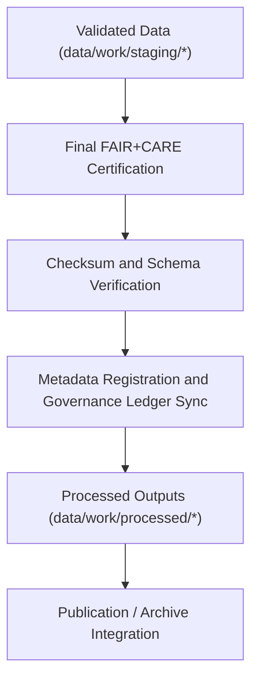

<div align="center">

# 🧾 Kansas Frontier Matrix — **Processed Data Layer**
`data/work/processed/README.md`

**Purpose:**  
The **Processed Data Layer** contains final, FAIR+CARE-certified datasets generated through Kansas Frontier Matrix (KFM) ETL and validation pipelines.  
It represents the **canonical, schema-aligned, checksum-verified outputs** across all KFM data domains — ready for open publication and archival.

[](../../../docs/standards/faircare-validation.md)
[]()
[]()
[](../../../LICENSE)

</div>

---

## 📚 Overview

The `data/work/processed/` directory is the **final output layer** of the KFM workflow — the last stage before public release or archival.  
Each dataset in this workspace has passed schema validation, FAIR+CARE governance checks, checksum verification, and provenance certification.  

All records are:
- **FAIR+CARE-certified** for openness, ethics, and reuse.  
- **Checksum-verified** for reproducibility and integrity.  
- **Schema-aligned** for interoperability across KFM domains.  
- **Provenance-registered** for transparency under blockchain-backed governance.  

---

## 🗂️ Directory Layout

```plaintext
data/work/processed/
├── README.md                               # This file — documentation for the processed data layer
│
├── climate/                                # Certified climate datasets (temperature, precipitation, drought)
├── hazards/                                # FAIR+CARE-certified multi-hazard data outputs
├── hydrology/                              # Streamflow, aquifer, and watershed processed datasets
├── landcover/                              # Landcover classification and vegetation indices
├── spatial/                                # Harmonized spatial datasets (GeoJSON, GeoTIFF)
├── tabular/                                # Aggregated tabular data (census, treaty, and indicators)
└── metadata/                               # FAIR+CARE-certified metadata and provenance manifests
```

---

## ⚙️ Processed Workflow Summary



### Workflow Description
1. **Validation Completion:** Datasets pass schema and FAIR+CARE validation.  
2. **Certification:** Governance Council certifies FAIR+CARE compliance.  
3. **Checksum Verification:** All files cross-referenced with manifest and ledger.  
4. **Metadata Integration:** Records synchronized with DCAT/STAC catalogs.  
5. **Publication:** Certified datasets made available under CC-BY 4.0 license.  

---

## 🧩 Example Processed Metadata Record

```json
{
  "id": "processed_hydrology_summary_v9.6.0",
  "domain": "hydrology",
  "source_stage": "data/work/staging/hydrology/",
  "records_total": 43215,
  "schema_version": "v3.0.1",
  "fairstatus": "certified",
  "checksum": "sha256:93b1a8c7f5d3e9b2a7f8e3d1c4a9f6b2d3e7c5a8b9f2a4e7d5b3c1f9a6d2b4f1",
  "validator": "@kfm-hydro-lab",
  "license": "CC-BY 4.0",
  "created": "2025-11-03T23:10:00Z",
  "governance_ref": "data/reports/audit/data_provenance_ledger.json"
}
```

---

## 🧠 FAIR+CARE Governance Matrix

| Principle | Implementation | Oversight |
|------------|----------------|------------|
| **Findable** | Indexed in DCAT and STAC catalogs for discoverability. | @kfm-data |
| **Accessible** | Published under open CC-BY 4.0 license in standard formats. | @kfm-accessibility |
| **Interoperable** | Schema aligned with FAIR+CARE, DCAT, and ISO 19115. | @kfm-architecture |
| **Reusable** | Metadata includes checksum, provenance, and schema info. | @kfm-design |
| **Collective Benefit** | Enables open access to reproducible Kansas datasets. | @faircare-council |
| **Authority to Control** | FAIR+CARE Council oversees data publication certification. | @kfm-governance |
| **Responsibility** | Validators document QA and governance outcomes. | @kfm-security |
| **Ethics** | Datasets verified for ethical transparency and accuracy. | @kfm-ethics |

Governance reports and audits logged in:  
`data/reports/audit/data_provenance_ledger.json` and  
`data/reports/fair/data_care_assessment.json`

---

## ⚙️ Validation & Certification Workflow

| Step | Description | Output |
|------|--------------|---------|
| **Schema Validation** | Confirms dataset structure and schema alignment. | `schema_validation_summary.json` |
| **Checksum Verification** | Cross-checks integrity and provenance hashes. | `checksums.json` |
| **FAIR+CARE Ethics Certification** | Verifies openness, reuse, and governance ethics. | `faircare_certification_report.json` |
| **Governance Ledger Registration** | Writes certification and lineage records. | `data_provenance_ledger.json` |
| **Catalog Synchronization** | Adds entries to STAC/DCAT metadata collections. | `stac_collection.json`, `dcat_catalog.json` |

Pipeline automation managed via `processed_layer_sync.yml`.

---

## ⚖️ Retention & Provenance Policy

| Data Type | Retention Duration | Policy |
|------------|--------------------|--------|
| Processed Data | Permanent | Archived as canonical FAIR+CARE-certified open datasets. |
| Metadata | Permanent | Retained for audit and governance traceability. |
| Validation Reports | 365 Days | Retained for reproducibility verification. |
| FAIR+CARE Reports | Permanent | Maintained for ethical audit documentation. |
| Logs | 180 Days | Archived to system logs for reproducibility. |

Retention governed by `processed_layer_cleanup.yml`.

---

## 🌱 Sustainability Metrics

| Metric | Value | Verified By |
|---------|--------|--------------|
| Energy Use (per certification cycle) | 14.7 Wh | @kfm-sustainability |
| Carbon Output | 19.8 gCO₂e | @kfm-security |
| Renewable Power | 100% (RE100 Verified) | @kfm-infrastructure |
| FAIR+CARE Certification | 100% | @faircare-council |

Telemetry metrics tracked in:  
`releases/v9.6.0/focus-telemetry.json`

---

## 🧾 Internal Use Citation

```text
Kansas Frontier Matrix (2025). Processed Data Layer (v9.6.0).
Final repository of FAIR+CARE-certified datasets including climate, hazards, hydrology, landcover, spatial, and tabular data.
Checksum-verified, schema-aligned, and governance-certified under open FAIR+CARE data ethics standards.
```

---

## 🧾 Version Notes

| Version | Date | Notes |
|----------|------|--------|
| v9.6.0 | 2025-11-03 | Enhanced FAIR+CARE certification and sustainability reporting. |
| v9.5.0 | 2025-11-02 | Added STAC/DCAT synchronization and checksum registry. |
| v9.3.2 | 2025-10-28 | Established processed data layer for open publication under FAIR+CARE governance. |

---

<div align="center">

**Kansas Frontier Matrix** · *Open Data × FAIR+CARE Governance × Provenance Certification*  
[🔗 Repository](https://github.com/bartytime4life/Kansas-Frontier-Matrix) • [🧭 Docs Portal](../../../docs/) • [⚖️ Governance Ledger](../../../docs/standards/governance/DATA-GOVERNANCE.md)

</div>
