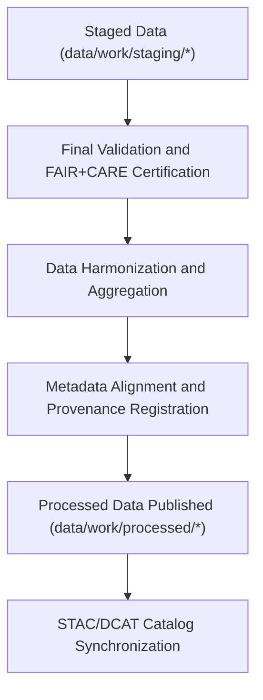

<div align="center">

# 🧾 Kansas Frontier Matrix — **Processed Data Layer**
`data/work/processed/README.md`

**Purpose:** Final repository for validated, schema-aligned, and FAIR+CARE-certified datasets within the Kansas Frontier Matrix (KFM).  
This layer contains canonical, production-grade data products derived from validated staging workflows—ready for distribution, archival, and catalog indexing.

[](../../docs/standards/faircare-validation.md)
[](../../LICENSE)
[](../../docs/architecture/repo-focus.md)

</div>

---

## 📚 Overview

The `data/work/processed/` directory contains **finalized datasets** produced by the Kansas Frontier Matrix (KFM) ETL and FAIR+CARE governance workflows.  
Each dataset within this layer is fully validated, reproducible, and ethically certified—forming the trusted foundation for KFM’s data publications, analytical models, and interactive web interfaces.

### Core Responsibilities:
- Host **FAIR+CARE-compliant, production-ready** datasets.  
- Maintain dataset lineage, checksum verification, and provenance logs.  
- Provide ready-to-publish data for catalogs, archives, and dashboards.  
- Serve as the canonical source for open-access KFM derivatives.  

All files here have completed the full lifecycle: *Raw → TMP → Staging → Processed.*

---

## 🗂️ Directory Layout

```plaintext
data/work/processed/
├── README.md                             # This file — overview of processed data layer
│
├── climate/                              # Final climate datasets (NOAA, NIDIS, CPC harmonized)
│   ├── climate_summary_v9.3.2.parquet
│   ├── drought_monitor_annual.csv
│   └── metadata.json
│
├── hazards/                              # Finalized hazard datasets (floods, tornadoes, drought risk)
│   ├── hazards_composite_v9.3.2.geojson
│   ├── hazard_intensity_index.csv
│   └── metadata.json
│
├── hydrology/                            # Processed hydrology data (streamflow, watersheds, aquifers)
│   ├── hydrology_summary_v9.3.2.parquet
│   ├── groundwater_trends.csv
│   └── metadata.json
│
├── tabular/                              # Processed tabular datasets (aggregated indicators and statistics)
│   ├── environmental_indicators.csv
│   ├── treaties_aggregated.csv
│   └── metadata.json
│
├── spatial/                              # Processed spatial data for mapping and STAC/DCAT integration
│   ├── climate_boundaries.geojson
│   ├── landcover_classifications.parquet
│   ├── elevation_tileset.tif
│   └── metadata.json
│
└── metadata/                             # Processed metadata layer — FAIR+CARE-certified descriptors
    ├── stac_collection.json
    ├── provenance_manifest.json
    └── governance_certification.json
```

---

## ⚙️ Data Processing Workflow



### Workflow Steps:
1. **Validation:** Final audit for schema compliance and ethics approval.  
2. **Harmonization:** Aggregate and integrate staging outputs into unified data products.  
3. **Metadata Registration:** Generate governance and provenance metadata.  
4. **Certification:** Final FAIR+CARE certification granted before public release.  
5. **Publication:** Datasets synchronized with catalog systems (STAC/DCAT, JSON-LD).

---

## 🧩 Example Processed Metadata Record

```json
{
  "id": "processed_climate_summary_v9.3.2",
  "source_stage": "data/work/staging/climate/",
  "records_total": 124560,
  "schema_version": "v3.0.1",
  "validator": "@kfm-climate-lab",
  "created": "2025-10-28T16:20:00Z",
  "checksum": "sha256:d8b49c7fae4f1845c1acbdf875a61251a59a4a21...",
  "fairstatus": "certified",
  "catalog_refs": ["STAC 1.0.0", "DCAT 3.0"],
  "governance_ref": "data/reports/audit/data_provenance_ledger.json"
}
```

---

## 🧠 FAIR+CARE Governance in the Processed Layer

| Principle | Implementation |
|------------|----------------|
| **Findable** | Indexed in STAC/DCAT catalogs with globally unique IDs and schema metadata. |
| **Accessible** | Distributed under open CC-BY 4.0 license via KFM catalog endpoints. |
| **Interoperable** | Metadata aligned with STAC 1.0, DCAT 3.0, and schema.org. |
| **Reusable** | Fully documented datasets include provenance, schema, and validation reports. |
| **Collective Benefit** | Enables reproducible, ethical environmental research. |
| **Authority to Control** | FAIR+CARE Council certifies processed data before publication. |
| **Responsibility** | Data maintainers ensure integrity, ethics, and lineage. |
| **Ethics** | No personally identifiable or culturally sensitive data included. |

Certification records available in:  
`data/reports/fair/data_care_assessment.json`  
and `data/reports/audit/data_provenance_ledger.json`.

---

## ⚙️ Validation & QA Artifacts

| Report | Description | Output |
|---------|-------------|---------|
| `schema_validation_summary.json` | Confirms processed dataset schema conformance. | JSON |
| `faircare_certification_report.json` | Final FAIR+CARE ethics validation record. | JSON |
| `checksums.json` | Hash registry for data integrity and lineage. | JSON |
| `catalog_sync.log` | STAC/DCAT synchronization and publication log. | Text |

All validation and publishing actions automated via `processed_data_sync.yml`.

---

## ⚖️ Governance & Provenance Integration

| Record | Description |
|---------|-------------|
| `metadata.json` | Contains dataset-specific provenance and schema metadata. |
| `data/reports/audit/data_provenance_ledger.json` | Logs processed data lineage and ethics certification. |
| `data/reports/fair/data_care_assessment.json` | Annual FAIR+CARE compliance summary. |
| `releases/v9.3.2/manifest.zip` | Global checksum registry for processed data layer. |

Governance synchronization occurs automatically after each successful certification cycle.

---

## 🧾 Retention Policy

| Data Category | Retention Duration | Policy |
|----------------|--------------------|--------|
| Processed Data | Permanent | Archived as canonical, certified open data. |
| Validation Reports | 365 days | Retained for governance and re-audit. |
| Governance Logs | Permanent | Stored for reproducibility and legal compliance. |
| Metadata | Permanent | Maintained as part of FAIR+CARE certification. |

All retention policies align with FAIR+CARE and open-science data lifecycle standards.

---

## 🧾 Citation

```text
Kansas Frontier Matrix (2025). Processed Data Layer (v9.3.2).
Final repository of FAIR+CARE-certified datasets for Kansas climate, hazards, hydrology, and environmental analysis.
Licensed under CC-BY 4.0. All datasets validated and registered in the KFM Provenance Ledger.
```

---

## 🧾 Version Notes

| Version | Date | Notes |
|----------|------|--------|
| v9.3.2 | 2025-10-28 | Completed FAIR+CARE certification integration and STAC/DCAT alignment. |
| v9.2.0 | 2024-07-15 | Added provenance manifest and final validation schema registry. |
| v9.0.0 | 2023-01-10 | Established processed data layer for governance-certified datasets. |

---

<div align="center">

**Kansas Frontier Matrix** · *Open Data × FAIR+CARE Certification × Provenance Assurance*  
[🔗 Repository](https://github.com/bartytime4life/Kansas-Frontier-Matrix) • [🧭 Docs Portal](../../docs/) • [⚖️ Governance Ledger](../../docs/standards/governance/)

</div>