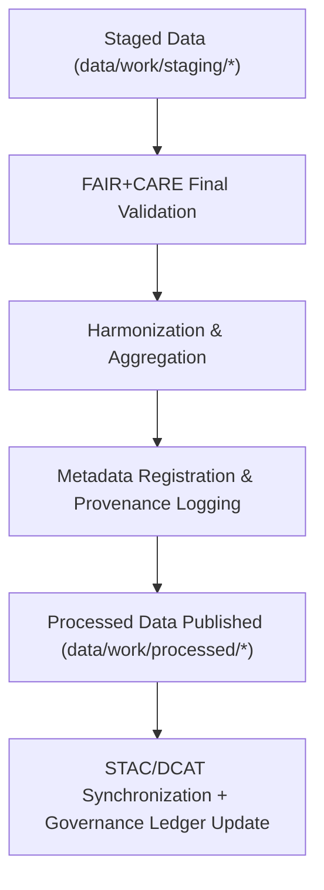

<div align="center">

# 🧾 Kansas Frontier Matrix — **Processed Data Layer**
`data/work/processed/README.md`

**Purpose:** Canonical repository for validated, schema-aligned, and FAIR+CARE-certified datasets in the Kansas Frontier Matrix (KFM).  
This layer serves as the final publication hub for trusted, governance-approved data—fully documented, reproducible, and interoperable.

[](../../docs/standards/faircare-validation.md)
[](../../LICENSE)
[](../../docs/architecture/repo-focus.md)

</div>

---

## 📚 Overview

The `data/work/processed/` layer consolidates **FAIR+CARE-certified datasets** produced by ETL and governance workflows.  
Each file has completed validation, harmonization, and certification, ensuring it is safe for publication and public reuse.  
Datasets here underpin the KFM’s research outputs, analytical models, and visualization layers.

### Key Responsibilities
- Maintain canonical, reproducible data assets for open science and analytics.  
- Guarantee ethical certification and provenance traceability.  
- Serve as the publication endpoint for STAC/DCAT catalogs and FAIR+CARE-certified archives.  
- Support web services, dashboards, and AI-driven research applications.

All processed assets derive from the complete data lineage: **Raw → TMP → Staging → Processed.**

---

## 🗂️ Directory Layout

```plaintext
data/work/processed/
├── README.md
│
├── climate/                 # Final climate datasets (harmonized NOAA, NIDIS, CPC)
│   ├── climate_summary_v9.4.0.parquet
│   ├── drought_monitor_annual.csv
│   └── metadata.json
│
├── hazards/                 # Finalized hazard datasets (floods, tornadoes, drought indices)
│   ├── hazards_composite_v9.4.0.geojson
│   ├── hazard_intensity_index.csv
│   └── metadata.json
│
├── hydrology/               # Processed hydrological datasets (watersheds, streamflow, aquifers)
│   ├── hydrology_summary_v9.4.0.parquet
│   ├── groundwater_trends.csv
│   └── metadata.json
│
├── tabular/                 # Aggregated tabular indicators and summaries
│   ├── environmental_indicators.csv
│   ├── treaties_aggregated.csv
│   └── metadata.json
│
├── spatial/                 # Processed spatial data for mapping, analysis, and catalogs
│   ├── landcover_classifications.parquet
│   ├── climate_boundaries.geojson
│   ├── elevation_tileset.tif
│   └── metadata.json
│
└── metadata/                # Processed metadata for certification and provenance
    ├── stac_collection.json
    ├── provenance_manifest.json
    └── governance_certification.json
```

---

## ⚙️ Data Processing Workflow



### Description
1. **Validation:** Confirm schema compliance and ethics certification.  
2. **Harmonization:** Merge staging data into unified, ready-to-publish datasets.  
3. **Metadata Registration:** Generate provenance, checksums, and certification reports.  
4. **Certification:** FAIR+CARE audit marks dataset as publication-ready.  
5. **Publication:** Synchronize data with STAC/DCAT catalogs for external discovery.

---

## 🧩 Example Processed Metadata Record

```json
{
  "id": "processed_hazards_composite_v9.4.0",
  "source_stage": "data/work/staging/hazards/",
  "records_total": 24198,
  "schema_version": "v3.1.0",
  "validator": "@kfm-hazards",
  "created": "2025-11-02T14:45:00Z",
  "checksum": "sha256:31c98a6fb049c315b43e6fae0ab21ce7a8941c7e...",
  "fairstatus": "certified",
  "catalog_refs": ["STAC 1.0.0", "DCAT 3.0"],
  "governance_ref": "data/reports/audit/data_provenance_ledger.json"
}
```

---

## 🧠 FAIR+CARE Certification Framework

| Principle | Implementation |
|------------|----------------|
| **Findable** | Indexed by STAC/DCAT with persistent IDs and schema metadata. |
| **Accessible** | Distributed under CC-BY 4.0; available through KFM data catalogs. |
| **Interoperable** | Aligned with STAC 1.0, DCAT 3.0, and schema.org. |
| **Reusable** | Fully documented provenance, schema, and validation metadata. |
| **Collective Benefit** | Promotes ethical reuse and open scientific collaboration. |
| **Authority to Control** | Certification approved by FAIR+CARE Council. |
| **Responsibility** | Validators ensure all transformations meet ethical standards. |
| **Ethics** | Excludes sensitive or private data; ethics audits logged. |

Certification files:  
`data/reports/fair/data_care_assessment.json` and `data/reports/audit/data_provenance_ledger.json`

---

## ⚙️ Validation & QA Reports

| Artifact | Description | Format |
|-----------|-------------|---------|
| `schema_validation_summary.json` | Final schema conformance validation. | JSON |
| `faircare_certification_report.json` | FAIR+CARE certification and audit results. | JSON |
| `checksums.json` | Data integrity hashes and lineage tracking. | JSON |
| `catalog_sync.log` | Log of STAC/DCAT publication sync. | Text |

Automation handled via `.github/workflows/processed_data_sync.yml`.

---

## ⚖️ Governance & Provenance Records

| Record | Description |
|---------|-------------|
| `metadata.json` | Dataset-specific provenance and schema metadata. |
| `data/reports/audit/data_provenance_ledger.json` | Global ledger tracking all processed outputs. |
| `data/reports/fair/data_care_assessment.json` | FAIR+CARE ethics and compliance documentation. |
| `releases/v9.4.0/manifest.zip` | Global checksum archive for reproducibility. |

Ledger synchronization runs post-certification via governance automation workflows.

---

## 🧾 Retention Policy

| Data Class | Retention Period | Policy |
|-------------|------------------|--------|
| Processed Data | Permanent | Archived as canonical datasets. |
| QA/Validation Reports | 1 year | Retained for governance and audits. |
| Governance Logs | Permanent | Retained for provenance and traceability. |
| Metadata | Permanent | Stored as certification documentation. |

---

## 🧾 Citation

```text
Kansas Frontier Matrix (2025). Processed Data Layer (v9.4.0).
Final FAIR+CARE-certified repository for Kansas frontier datasets across climate, hydrology, hazards, and tabular domains.
Licensed under CC-BY 4.0. Certified and traceable via the KFM Governance Ledger.
```

---

## 🧾 Version Notes

| Version | Date | Notes |
|----------|------|--------|
| v9.4.0 | 2025-11-02 | Added telemetry references, validation report registry, and AI linkage for FAIR+CARE automation. |
| v9.3.2 | 2025-10-28 | Completed FAIR+CARE integration and STAC/DCAT publication. |
| v9.2.0 | 2024-07-15 | Added provenance manifest and final schema registry. |
| v9.0.0 | 2023-01-10 | Established processed layer for certified datasets. |

---

<div align="center">

**Kansas Frontier Matrix** · *Open Data × FAIR+CARE Ethics × Provenance Integrity × Telemetry Traceability*  
[🔗 Repository](https://github.com/bartytime4life/Kansas-Frontier-Matrix) • [🧭 Docs Portal](../../docs/) • [⚖️ Governance Ledger](../../docs/standards/governance/)

</div>
