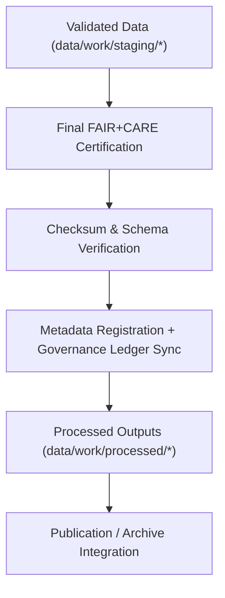

<div align="center">

# 🧾 Kansas Frontier Matrix — **Processed Data Layer**
`data/work/processed/README.md`

**Purpose:**  
The **Processed Data Layer** contains final, FAIR+CARE-certified datasets generated by KFM ETL and validation pipelines.  
It represents **canonical, schema-aligned, checksum-verified outputs** across all domains—ready for publication and archival.

[](../../../docs/architecture/README.md)
[](../../../docs/standards/faircare-validation.md)
[]()
[]()
[](../../../LICENSE)

</div>

---

## 📘 Overview

`data/work/processed/` is the **final output layer** prior to public release or archival.  
Each dataset here has passed **schema validation**, **FAIR+CARE governance checks**, **checksum verification**, and **provenance certification**.

All records are:
- **FAIR+CARE-certified** for openness, ethics, and reuse.  
- **Checksum-verified** for reproducibility and integrity.  
- **Schema-aligned** for interoperability.  
- **Provenance-registered** under blockchain-backed governance.

---

## 🗂️ Directory Layout

```plaintext
data/work/processed/
├── README.md
├── climate/            # Certified climate datasets (temperature, precipitation, drought)
├── hazards/            # FAIR+CARE-certified multi-hazard outputs
├── hydrology/          # Streamflow, aquifer, watershed processed datasets
├── landcover/          # Landcover classification & vegetation indices
├── spatial/            # Harmonized spatial datasets (GeoJSON, GeoTIFF)
├── tabular/            # Aggregated tabular data (census, treaty, indicators)
└── metadata/           # Certified metadata & provenance manifests
```

---

## ⚙️ Processed Workflow Summary



### Steps
1. **Validation Completion** — Datasets pass schema & FAIR+CARE checks.  
2. **Certification** — Governance Council certifies FAIR+CARE compliance.  
3. **Checksum Verification** — Files cross-referenced with manifest & ledger.  
4. **Metadata Integration** — Synchronized with **DCAT/STAC** catalogs.  
5. **Publication** — Certified datasets released under **CC-BY 4.0**.

---

## 🧩 Example Processed Metadata Record

```json
{
  "id": "processed_hydrology_summary_v9.7.0",
  "domain": "hydrology",
  "source_stage": "data/work/staging/hydrology/",
  "records_total": 43880,
  "schema_version": "v3.0.2",
  "fairstatus": "certified",
  "checksum_sha256": "sha256:93b1a8c7f5d3e9b2a7f8e3d1c4a9f6b2d3e7c5a8b9f2a4e7d5b3c1f9a6d2b4f1",
  "validator": "@kfm-hydro-lab",
  "license": "CC-BY 4.0",
  "created": "2025-11-06T23:10:00Z",
  "governance_ref": "data/reports/audit/data_provenance_ledger.json"
}
```

---

## 🧠 FAIR+CARE Governance Matrix

| Principle | Implementation | Oversight |
|-----------|----------------|-----------|
| **Findable** | Indexed in **DCAT/STAC** catalogs for discoverability. | `@kfm-data` |
| **Accessible** | Published under **CC-BY 4.0** in standard formats. | `@kfm-accessibility` |
| **Interoperable** | Aligns with **FAIR+CARE**, **DCAT**, and **ISO 19115**. | `@kfm-architecture` |
| **Reusable** | Includes checksum, provenance, and schema metadata. | `@kfm-design` |
| **Collective Benefit** | Enables open, reproducible Kansas datasets. | `@faircare-council` |
| **Authority to Control** | Council oversees certification and release. | `@kfm-governance` |
| **Responsibility** | Validators document QA and governance outcomes. | `@kfm-security` |
| **Ethics** | Verified for ethical transparency and accuracy. | `@kfm-ethics` |

**Governance logs:**  
`data/reports/audit/data_provenance_ledger.json` · `data/reports/fair/data_care_assessment.json`

---

## ⚙️ Validation & Certification Workflow

| Step | Description | Output |
|------|-------------|--------|
| **Schema Validation** | Structural & semantic checks. | `schema_validation_summary.json` |
| **Checksum Verification** | Integrity & provenance hashes. | `checksums.json` |
| **FAIR+CARE Certification** | Openness, reuse, and ethics verification. | `faircare_certification_report.json` |
| **Governance Registration** | Certification + lineage records. | `data_provenance_ledger.json` |
| **Catalog Sync** | Register in STAC/DCAT metadata. | `stac_collection.json` · `dcat_catalog.json` |

Automation: `processed_layer_sync.yml`.

---

## ♻️ Retention & Sustainability

| Data Type | Retention | Policy |
|-----------|----------:|--------|
| Processed Data | Permanent | Archived as canonical FAIR+CARE datasets. |
| Metadata | Permanent | Retained for audit & traceability. |
| Validation Reports | 365 Days | Kept for reproducibility checks. |
| FAIR+CARE Reports | Permanent | Maintained for ethics audit documentation. |
| Logs | 180 Days | Archived to system logs. |

**Telemetry:** `../../../releases/v9.7.0/focus-telemetry.json`

---

## 🧾 Internal Use Citation

```text
Kansas Frontier Matrix (2025). Processed Data Layer (v9.7.0).
Final FAIR+CARE-certified outputs across climate, hazards, hydrology, landcover, spatial, and tabular domains.
Checksum-verified, schema-aligned, and governance-certified for open publication and archival.
```

---

## 🕰️ Version History

| Version | Date       | Author          | Summary |
|--------:|------------|-----------------|---------|
| v9.7.0  | 2025-11-06 | `@kfm-processed`| Upgraded to v9.7.0; telemetry/schema refs aligned; DCAT/STAC sync clarified; badges hardened. |
| v9.6.0  | 2025-11-03 | `@kfm-processed`| Enhanced FAIR+CARE certification and sustainability reporting. |

---

<div align="center">

**Kansas Frontier Matrix**  
*Open Data × FAIR+CARE Governance × Provenance Certification*  
© 2025 Kansas Frontier Matrix — CC-BY 4.0 · Diamond⁹ Ω / Crown∞Ω Ultimate Certified  

[Back to Work Layer](../README.md) · [Governance Charter](../../../docs/standards/governance/DATA-GOVERNANCE.md)

</div>