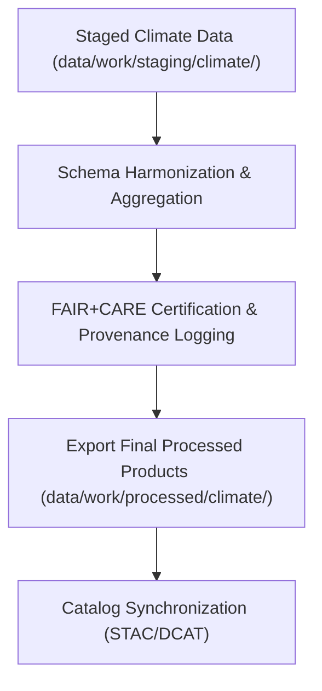

<div align="center">

# 🌎 Kansas Frontier Matrix — **Processed Climate Data**
`data/work/processed/climate/README.md`

**Purpose:** Repository of final, FAIR+CARE-certified climate datasets derived from NOAA, NIDIS, and related sources.  
These datasets represent harmonized, validated, and governance-registered climate products ready for public access, model integration, and historical analysis within the Kansas Frontier Matrix (KFM).

[](../../../../docs/standards/faircare-validation.md)
[](../../../../LICENSE)
[](../../../../docs/architecture/repo-focus.md)

</div>

---

## 📚 Overview

The `data/work/processed/climate/` directory contains **final climate datasets** that have passed all FAIR+CARE governance, schema validation, and checksum verification steps.  
Each dataset in this workspace is considered a canonical data product—ready for catalog publication, analytical modeling, and external data reuse.

### Core Responsibilities:
- Store production-grade climate datasets for distribution and archival.  
- Maintain provenance, lineage, and FAIR+CARE certification metadata.  
- Ensure interoperability with STAC, DCAT, and schema.org catalogs.  
- Provide transparent data access for climate, drought, and temperature analyses.  

All contents are open-access under a CC-BY 4.0 license, fully traceable through KFM’s provenance and ethics governance system.

---

## 🗂️ Directory Layout

```plaintext
data/work/processed/climate/
├── README.md                               # This file — overview of processed climate data layer
│
├── climate_summary_v9.3.2.parquet          # Aggregated climate summary (statewide multi-source composite)
├── drought_monitor_annual.csv              # Historical drought indices (USDM + NOAA harmonized)
├── temperature_anomalies_1900_2025.csv     # Century-scale temperature anomaly dataset for Kansas
└── metadata.json                           # Provenance and FAIR+CARE certification record
```

---

## ⚙️ Processing Workflow



### Workflow Steps:
1. **Harmonization:** Merge and aggregate staging datasets into consistent temporal and spatial structures.  
2. **Validation:** Run schema and FAIR+CARE audits for completeness and integrity.  
3. **Certification:** Assign checksum, ethics score, and governance ledger registration.  
4. **Publication:** Export as open data products under CC-BY 4.0 license.  
5. **Synchronization:** Register datasets in KFM’s STAC/DCAT catalog for discoverability.

---

## 🧩 Example Metadata Record

```json
{
  "id": "processed_climate_summary_v9.3.2",
  "schema_version": "v3.0.1",
  "source_stage": "data/work/staging/climate/",
  "records_total": 120540,
  "spatial_extent": [-102.05, 36.99, -94.61, 40.00],
  "temporal_extent": ["1900-01-01", "2025-12-31"],
  "checksum": "sha256:3c7dfca29ff1aa6738c96e5422dfdbeaaae11a4a...",
  "fairstatus": "certified",
  "validator": "@kfm-climate-lab",
  "license": "CC-BY 4.0",
  "governance_ref": "data/reports/audit/data_provenance_ledger.json"
}
```

---

## 🧠 FAIR+CARE Compliance Summary

| Principle | Implementation |
|------------|----------------|
| **Findable** | Indexed with unique dataset IDs and catalog metadata (STAC/DCAT). |
| **Accessible** | Published in open, machine-readable formats (CSV, Parquet). |
| **Interoperable** | Schema compliant with NOAA, USDM, and KFM metadata standards. |
| **Reusable** | Metadata includes provenance, schema, and license information. |
| **Collective Benefit** | Supports open environmental science and public climate literacy. |
| **Authority to Control** | FAIR+CARE Council verifies ethical compliance before publication. |
| **Responsibility** | Validators maintain audit and lineage metadata for all products. |
| **Ethics** | Verified public-domain datasets with equitable, transparent coverage. |

FAIR+CARE certification results recorded in:  
`data/reports/fair/data_care_assessment.json`  
and `data/reports/audit/data_provenance_ledger.json`.

---

## ⚙️ Validation & QA Reports

| Report | Description | Output |
|---------|-------------|---------|
| `schema_validation_summary.json` | Validates final schema conformity and integrity. | JSON |
| `faircare_certification_report.json` | FAIR+CARE ethics certification summary. | JSON |
| `checksums.json` | Records SHA-256 checksums for all processed files. | JSON |
| `catalog_sync.log` | Logs catalog publication events and status. | Text |

Automated QA handled by `processed_climate_sync.yml`.

---

## ⚖️ Governance & Provenance Integration

| Record | Description |
|---------|-------------|
| `metadata.json` | Captures schema, checksum, and certification metadata for each dataset. |
| `data/reports/audit/data_provenance_ledger.json` | Global ledger linking raw → staging → processed lineage. |
| `data/reports/fair/data_care_assessment.json` | FAIR+CARE ethics audit history. |
| `releases/v9.3.2/manifest.zip` | Central checksum registry for reproducibility verification. |

Governance synchronization occurs automatically post-certification cycle.

---

## 🧾 Retention & Publication Policy

| Data Type | Retention | Policy |
|------------|------------|--------|
| Processed Climate Data | Permanent | Stored as canonical public datasets under CC-BY 4.0. |
| Validation Reports | 365 days | Archived for reproducibility and FAIR+CARE verification. |
| Governance Metadata | Permanent | Retained in provenance and catalog records. |
| Catalog Sync Logs | 90 days | Archived for audit and monitoring. |

All lifecycle management operations handled by `processed_data_retention.yml`.

---

## 🧾 Citation

```text
Kansas Frontier Matrix (2025). Processed Climate Data (v9.3.2).
Final FAIR+CARE-certified climate datasets derived from NOAA and NIDIS sources for Kansas statewide analysis.
Available under CC-BY 4.0 via the Kansas Frontier Matrix data catalog.
```

---

## 🧾 Version Notes

| Version | Date | Notes |
|----------|------|--------|
| v9.3.2 | 2025-10-28 | Integrated final FAIR+CARE certification and catalog synchronization. |
| v9.2.0 | 2024-07-15 | Added drought and temperature anomaly composites. |
| v9.0.0 | 2023-01-10 | Established processed climate workspace for final open data products. |

---

<div align="center">

**Kansas Frontier Matrix** · *Open Climate Science × FAIR+CARE Ethics × Provenance Integrity*  
[🔗 Repository](https://github.com/bartytime4life/Kansas-Frontier-Matrix) • [🧭 Docs Portal](../../../../docs/) • [⚖️ Governance Ledger](../../../../docs/standards/governance/)

</div>