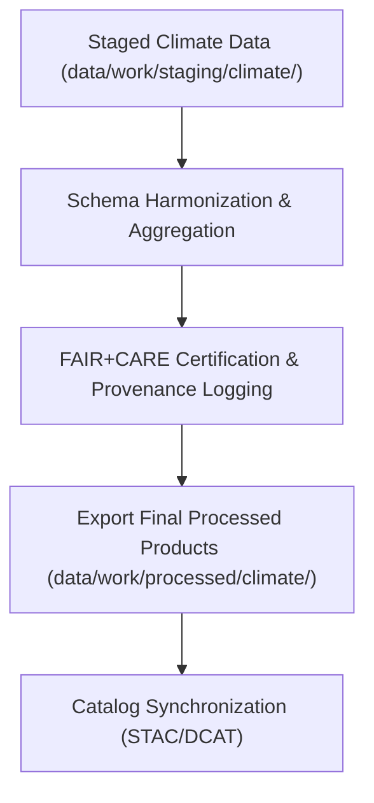

<div align="center">

# 🌎 Kansas Frontier Matrix — **Processed Climate Data**
`data/work/processed/climate/README.md`

**Purpose:** Repository of final, FAIR+CARE-certified climate datasets derived from NOAA, NIDIS, and related sources.  
These datasets represent harmonized, validated, and governance-registered climate products ready for public access, model integration, and historical analysis within the Kansas Frontier Matrix (KFM).

[](../../../../docs/standards/faircare-validation.md)
[](../../../../LICENSE)
[](../../../../docs/architecture/repo-focus.md)

</div>

---

## 📚 Overview

The `data/work/processed/climate/` directory contains **finalized climate datasets** that have passed all FAIR+CARE governance, schema validation, and checksum verification steps.  
Each dataset is a **canonical data product**—suitable for publication, integration into analytical models, and inclusion in open data catalogs.

### Core Responsibilities
- Maintain production-grade, reproducible climate datasets.  
- Preserve provenance, FAIR+CARE ethics certification, and data integrity.  
- Ensure interoperability with STAC 1.0, DCAT 3.0, and schema.org.  
- Provide open-access data for climate modeling and historical trend analysis.  

All contents are released under **CC-BY 4.0** and recorded in the **KFM Governance Ledger** for full traceability.

---

## 🗂️ Directory Layout

```plaintext
data/work/processed/climate/
├── README.md
│
├── climate_summary_v9.4.0.parquet        # Aggregated statewide climate summary
├── drought_monitor_annual.csv            # Harmonized drought index composites
├── temperature_anomalies_1900_2025.csv   # Long-term temperature anomaly dataset
└── metadata.json                         # Provenance and FAIR+CARE certification record
```

---

## ⚙️ Processing Workflow



### Workflow Description
1. **Harmonization:** Integrate multi-source climate data into unified spatiotemporal frames.  
2. **Validation:** Conduct schema compliance and FAIR+CARE governance audits.  
3. **Certification:** Register checksums, ethics, and provenance into ledger records.  
4. **Publication:** Export validated data products under open licenses.  
5. **Catalog Integration:** Synchronize assets with KFM’s STAC/DCAT catalog for discoverability.

---

## 🧩 Example Metadata Record

```json
{
  "id": "processed_climate_summary_v9.4.0",
  "schema_version": "v3.1.0",
  "source_stage": "data/work/staging/climate/",
  "records_total": 120540,
  "spatial_extent": [-102.05, 36.99, -94.61, 40.00],
  "temporal_extent": ["1900-01-01", "2025-12-31"],
  "checksum": "sha256:3c7dfca29ff1aa6738c96e5422dfdbeaaae11a4a...",
  "fairstatus": "certified",
  "validator": "@kfm-climate-lab",
  "license": "CC-BY 4.0",
  "telemetry_link": "releases/v9.4.0/focus-telemetry.json",
  "governance_ref": "data/reports/audit/data_provenance_ledger.json"
}
```

---

## 🧠 FAIR+CARE Compliance Framework

| Principle | Implementation |
|------------|----------------|
| **Findable** | Indexed in STAC/DCAT catalogs with globally unique identifiers. |
| **Accessible** | Distributed in open formats (CSV, Parquet, GeoJSON). |
| **Interoperable** | Schema aligned with NOAA, NIDIS, and KFM standards. |
| **Reusable** | Metadata includes provenance, schema, and licensing information. |
| **Collective Benefit** | Promotes equitable access to environmental insights. |
| **Authority to Control** | Reviewed and certified by FAIR+CARE Governance Council. |
| **Responsibility** | Validators ensure data quality and ethical compliance. |
| **Ethics** | All datasets are public-domain or open-licensed with transparent provenance. |

Certification logs are stored in:  
`data/reports/fair/data_care_assessment.json` and  
`data/reports/audit/data_provenance_ledger.json`.

---

## ⚙️ Validation & QA Reports

| Report | Description | Output |
|---------|-------------|---------|
| `schema_validation_summary.json` | Confirms schema alignment and validation integrity. | JSON |
| `faircare_certification_report.json` | Records final FAIR+CARE certification audit results. | JSON |
| `checksums.json` | Dataset-level SHA-256 integrity registry. | JSON |
| `catalog_sync.log` | STAC/DCAT publication synchronization report. | Text |

All QA tasks automated via `processed_climate_sync.yml`.

---

## ⚖️ Governance & Provenance Integration

| Record | Description |
|---------|-------------|
| `metadata.json` | Embedded provenance and schema metadata. |
| `data/reports/audit/data_provenance_ledger.json` | Tracks full lineage from raw to processed layers. |
| `data/reports/fair/data_care_assessment.json` | FAIR+CARE ethics and compliance summary. |
| `releases/v9.4.0/manifest.zip` | Global checksum archive for reproducibility verification. |

Governance synchronization is automated through CI/CD ledger integration.

---

## 🧾 Retention & Publication Policy

| Data Class | Retention Duration | Policy |
|-------------|--------------------|--------|
| Processed Climate Data | Permanent | Retained as canonical public datasets. |
| Validation Reports | 1 year | Retained for audit and reproducibility. |
| Governance Metadata | Permanent | Stored in provenance and certification catalogs. |
| Catalog Sync Logs | 90 days | Retained for monitoring and compliance. |

Lifecycle management handled via `processed_data_retention.yml`.

---

## 🧾 Citation

```text
Kansas Frontier Matrix (2025). Processed Climate Data (v9.4.0).
FAIR+CARE-certified climate datasets harmonized from NOAA and NIDIS archives for Kansas statewide analysis.
Licensed under CC-BY 4.0 and traceable through the Kansas Frontier Matrix Governance Ledger.
```

---

## 🧾 Version Notes

| Version | Date | Notes |
|----------|------|--------|
| v9.4.0 | 2025-11-02 | Added telemetry integration, validation report registry, and checksum automation. |
| v9.3.2 | 2025-10-28 | Completed FAIR+CARE certification and catalog synchronization. |
| v9.2.0 | 2024-07-15 | Introduced drought and temperature anomaly composites. |
| v9.0.0 | 2023-01-10 | Established climate workspace for open-data publication. |

---

<div align="center">

**Kansas Frontier Matrix** · *Open Climate Science × FAIR+CARE Ethics × Provenance Integrity × Telemetry Traceability*  
[🔗 Repository](https://github.com/bartytime4life/Kansas-Frontier-Matrix) • [🧭 Docs Portal](../../../../docs/) • [⚖️ Governance Ledger](../../../../docs/standards/governance/)

</div>
