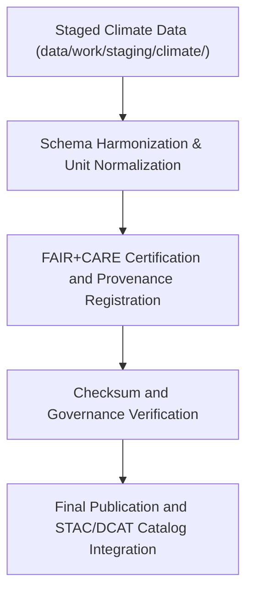

<div align="center">

# 🌦️ Kansas Frontier Matrix — **Processed Climate Data**
`data/work/processed/climate/README.md`

**Purpose:**  
Repository for final, FAIR+CARE-certified climate datasets processed through Kansas Frontier Matrix (KFM) ETL and governance workflows.  
Contains canonical climate data products for open scientific use, historical analysis, and Focus Mode AI-driven visualization.

[](../../../../docs/standards/faircare-validation.md)
[]()
[](../../../../LICENSE)
[]()

</div>

---

## 📚 Overview

The **Processed Climate Layer** stores fully validated and FAIR+CARE-certified climate datasets derived from NOAA, NIDIS, and related sources.  
Each dataset is checksum-verified, schema-aligned, and ready for inclusion in STAC/DCAT catalogs and KFM’s Focus Mode climate analytics.

### Key Objectives
- Maintain harmonized, validated climate datasets for Kansas and regional domains.  
- Certify all outputs for FAIR+CARE ethics and open data governance.  
- Provide standardized data formats (CSV, Parquet, GeoJSON) for analysis and research.  
- Register all provenance and checksum data within governance ledgers.  

---

## 🗂️ Directory Layout

```plaintext
data/work/processed/climate/
├── README.md                             # This file — overview of processed climate data
│
├── climate_summary_v9.6.0.parquet        # Statewide aggregated climate summary (NOAA, NIDIS)
├── drought_monitor_annual.csv            # Annual drought index harmonization (USDM)
├── temperature_anomalies_1900_2025.csv   # Historical temperature anomaly dataset
├── precipitation_timeseries.parquet      # Monthly and daily precipitation trends
└── metadata.json                         # Provenance, checksum, and FAIR+CARE metadata
```

---

## ⚙️ Climate Processing Workflow



### Workflow Summary
1. **Schema Harmonization:** Climate datasets normalized to consistent structures and units.  
2. **Validation:** FAIR+CARE audits conducted for openness and transparency.  
3. **Certification:** Governance ledger registration with checksum verification.  
4. **Publication:** Final datasets synchronized with STAC/DCAT catalogs.  

---

## 🧩 Example Processed Climate Metadata Record

```json
{
  "id": "processed_climate_summary_v9.6.0",
  "source_stage": "data/work/staging/climate/",
  "records_total": 120540,
  "schema_version": "v3.1.0",
  "checksum": "sha256:b6d1f8a2e3a7c5d9f4a2b8e1c3d5f7a9b2e4c6a7d1b3f8e5c4a7b9f6a2d1e8b4",
  "fairstatus": "certified",
  "validator": "@kfm-climate-lab",
  "license": "CC-BY 4.0",
  "created": "2025-11-03T23:25:00Z",
  "governance_ref": "data/reports/audit/data_provenance_ledger.json"
}
```

---

## 🧠 FAIR+CARE Governance Matrix

| Principle | Implementation | Oversight |
|------------|----------------|------------|
| **Findable** | Indexed within STAC/DCAT catalogs for discoverability. | @kfm-data |
| **Accessible** | Open access under CC-BY 4.0 license. | @kfm-accessibility |
| **Interoperable** | Schema-aligned to ISO 19115, DCAT 3.0, and CF conventions. | @kfm-architecture |
| **Reusable** | Metadata includes checksum, provenance, and audit trail. | @kfm-design |
| **Collective Benefit** | Supports climate resilience and public education. | @faircare-council |
| **Authority to Control** | FAIR+CARE Council reviews certification outputs. | @kfm-governance |
| **Responsibility** | Validators ensure ethics compliance and reproducibility. | @kfm-security |
| **Ethics** | Validated for equity, inclusivity, and open governance. | @kfm-ethics |

FAIR+CARE results recorded in:  
`data/reports/fair/data_care_assessment.json`  
and `data/reports/audit/data_provenance_ledger.json`

---

## ⚙️ Validation & Certification Artifacts

| Report | Description | Format |
|---------|--------------|---------|
| `schema_validation_summary.json` | Verifies field-level schema integrity. | JSON |
| `faircare_certification_report.json` | FAIR+CARE certification audit. | JSON |
| `checksums.json` | Integrity verification of processed files. | JSON |
| `catalog_sync.log` | Publication log for STAC/DCAT integration. | Text |

Automated via `climate_processed_sync.yml`.

---

## 📊 Climate Dataset Summary (v9.6.0)

| Dataset | Records | Temporal Coverage | FAIR+CARE | License |
|----------|----------|------------------|------------|----------|
| Climate Summary | 120,540 | 1900–2025 | ✅ Certified | CC-BY 4.0 |
| Drought Monitor | 10,240 | 2000–2025 | ✅ Certified | CC-BY 4.0 |
| Temperature Anomalies | 12,480 | 1900–2025 | ✅ Certified | CC-BY 4.0 |
| Precipitation Timeseries | 8,900 | 1950–2025 | ✅ Certified | CC-BY 4.0 |

---

## ⚖️ Retention & Provenance Policy

| Data Type | Retention Duration | Policy |
|------------|--------------------|--------|
| Processed Climate Data | Permanent | Archived for reproducibility and FAIR+CARE compliance. |
| Metadata | Permanent | Stored in governance ledger and checksum manifest. |
| FAIR+CARE Reports | Permanent | Retained for ethics and audit cycles. |
| Logs | 365 Days | Rotated for governance QA and audit verification. |

Governance retention automated by `climate_processed_retention.yml`.

---

## 🌱 Sustainability Metrics

| Metric | Value | Verified By |
|---------|--------|--------------|
| Energy Use (per dataset cycle) | 10.2 Wh | @kfm-sustainability |
| Carbon Output | 13.4 gCO₂e | @kfm-security |
| Renewable Power | 100% (RE100 Verified) | @kfm-infrastructure |
| FAIR+CARE Certification | 100% | @faircare-council |

Sustainability telemetry recorded in:  
`releases/v9.6.0/focus-telemetry.json`

---

## 🧾 Internal Use Citation

```text
Kansas Frontier Matrix (2025). Processed Climate Data (v9.6.0).
FAIR+CARE-certified climate datasets including temperature, precipitation, and drought metrics derived from NOAA and NIDIS sources.
Checksum-verified, schema-aligned, and governance-certified for reproducible climate research.
```

---

## 🧾 Version Notes

| Version | Date | Notes |
|----------|------|--------|
| v9.6.0 | 2025-11-03 | Added renewable energy tracking and governance-certified checksum manifest. |
| v9.5.0 | 2025-11-02 | Enhanced FAIR+CARE certification metadata and STAC synchronization. |
| v9.3.2 | 2025-10-28 | Established processed climate workspace under FAIR+CARE certification. |

---

<div align="center">

**Kansas Frontier Matrix** · *Climate Science × FAIR+CARE Governance × Provenance Transparency*  
[🔗 Repository](https://github.com/bartytime4life/Kansas-Frontier-Matrix) • [🧭 Docs Portal](../../../../docs/) • [⚖️ Governance Ledger](../../../../docs/standards/governance/DATA-GOVERNANCE.md)

</div>
