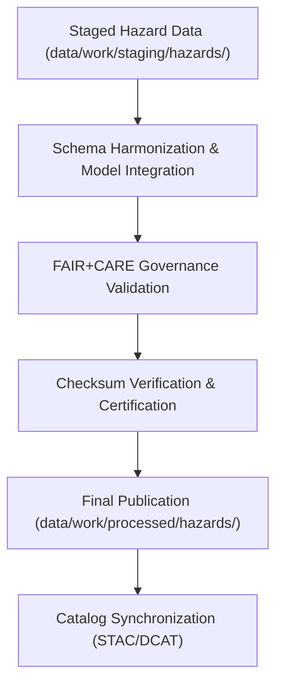

<div align="center">

# ⚠️ Kansas Frontier Matrix — **Processed Hazards Data**
`data/work/processed/hazards/README.md`

**Purpose:** Final repository for FAIR+CARE-certified multi-hazard datasets within the Kansas Frontier Matrix (KFM).  
This layer consolidates validated hazard information from FEMA, NOAA, USGS, and NCEI sources, forming the authoritative and ethically governed hazard dataset collection for Kansas.

[](../../../../docs/standards/faircare-validation.md)
[](../../../../LICENSE)
[](../../../../docs/architecture/repo-focus.md)

</div>

---

## 📚 Overview

The `data/work/processed/hazards/` directory contains **finalized hazard datasets** that have passed KFM’s FAIR+CARE governance pipeline.  
These datasets represent harmonized, validated, and audit-certified records of hazard events and risk models, ensuring open accessibility and reproducibility for public and research use.

### Core Functions
- Store authoritative, schema-compliant hazard datasets for Kansas.  
- Maintain provenance records for FEMA, NOAA, USGS, and NCEI hazard integrations.  
- Ensure FAIR+CARE ethical and transparency compliance across all hazard domains.  
- Provide multi-hazard datasets for visualization, modeling, and analytics.  

All datasets here have completed full lineage verification and certification under MCP-DL v6.3 and FAIR+CARE ethics audit procedures.

---

## 🗂️ Directory Layout

```plaintext
data/work/processed/hazards/
├── README.md                               # This file — overview of processed hazard datasets
│
├── hazards_composite_v9.4.0.geojson        # Integrated multi-hazard dataset (floods, tornadoes, drought)
├── hazard_intensity_index.csv              # Statewide hazard severity index (normalized 0–1 scale)
├── event_frequency_summary.csv             # Historical hazard frequency and recurrence metrics
└── metadata.json                           # Provenance, schema, and FAIR+CARE certification metadata
```

---

## ⚙️ Processing Workflow



### Workflow Description
1. **Integration:** Merge validated staging datasets across FEMA, NOAA, USGS, and NCEI domains.  
2. **Normalization:** Apply consistent schema, coordinate systems, and units of measure.  
3. **Ethics Audit:** Conduct FAIR+CARE certification for open accessibility and transparency.  
4. **Certification:** Register checksums and governance details for each dataset.  
5. **Publication:** Export finalized data into public-ready, CC-BY-licensed formats.

---

## 🧩 Example Metadata Record

```json
{
  "id": "processed_hazards_composite_v9.4.0",
  "schema_version": "v3.1.0",
  "source_stage": "data/work/staging/hazards/",
  "hazard_types": ["flood", "tornado", "drought"],
  "records_total": 33211,
  "spatial_extent": [-102.05, 36.99, -94.61, 40.00],
  "temporal_extent": ["1950-01-01", "2025-12-31"],
  "checksum": "sha256:df7b8c5a67a3ecf944f09f1a5c9f08ad1834de31...",
  "fairstatus": "certified",
  "validator": "@kfm-hazards-lab",
  "license": "CC-BY 4.0",
  "telemetry_link": "releases/v9.4.0/focus-telemetry.json",
  "governance_ref": "data/reports/audit/data_provenance_ledger.json"
}
```

---

## 🧠 FAIR+CARE Compliance Summary

| Principle | Implementation |
|------------|----------------|
| **Findable** | Indexed via STAC/DCAT catalog with spatial and temporal metadata. |
| **Accessible** | Published in open formats (CSV, GeoJSON) under CC-BY 4.0. |
| **Interoperable** | Schema harmonized across NOAA, FEMA, and USGS hazard data. |
| **Reusable** | Provenance, checksum, and version metadata ensure reproducibility. |
| **Collective Benefit** | Supports open hazard awareness and mitigation planning. |
| **Authority to Control** | FAIR+CARE Council reviews each hazard release for compliance. |
| **Responsibility** | Hazard maintainers document data lineage and ethical review. |
| **Ethics** | Datasets reviewed for accuracy, inclusivity, and non-sensational representation. |

FAIR+CARE governance reports are recorded in:  
`data/reports/fair/data_care_assessment.json`  
and `data/reports/audit/data_provenance_ledger.json`.

---

## ⚙️ Validation & QA Reports

| Report | Description | Output |
|---------|-------------|---------|
| `schema_validation_summary.json` | Final schema validation report across all hazard types. | JSON |
| `faircare_certification_report.json` | FAIR+CARE audit results for hazard data compliance. | JSON |
| `checksums.json` | Registry of validated file hashes. | JSON |
| `catalog_sync.log` | Publication synchronization log for catalog ingestion. | Text |

Automated governance synchronization via `.github/workflows/processed_hazards_sync.yml`.

---

## ⚖️ Governance & Provenance Integration

| Record | Description |
|---------|-------------|
| `metadata.json` | Tracks provenance, FAIR+CARE certification, and version history. |
| `data/reports/audit/data_provenance_ledger.json` | Records hazard lineage, checksum, and audit results. |
| `data/reports/fair/data_care_assessment.json` | FAIR+CARE compliance metrics and evaluation reports. |
| `releases/v9.4.0/manifest.zip` | Central checksum archive for processed hazard datasets. |

All governance synchronization events occur automatically post-certification cycle.

---

## 🧾 Retention & Publication Policy

| Data Type | Retention | Policy |
|------------|------------|--------|
| Processed Hazard Data | Permanent | Retained as open, certified datasets under CC-BY 4.0. |
| Validation Reports | 365 days | Archived for audit reproducibility. |
| FAIR+CARE Certifications | Permanent | Stored for ethical accountability and transparency. |
| Governance Logs | Permanent | Retained indefinitely for provenance tracking. |

Lifecycle management governed by `hazards_data_retention.yml`.

---

## 🧾 Citation

```text
Kansas Frontier Matrix (2025). Processed Hazards Data (v9.4.0).
Final FAIR+CARE-certified multi-hazard dataset integrating FEMA, NOAA, USGS, and NCEI data for Kansas.
Openly licensed under CC-BY 4.0 via Kansas Frontier Matrix public data repository.
```

---

## 🧾 Version Notes

| Version | Date | Notes |
|----------|------|--------|
| v9.4.0 | 2025-11-02 | Added telemetry integration, validation report registry, and checksum automation; updated composite to v9.4.0. |
| v9.3.2 | 2025-10-28 | Finalized composite hazard index and FAIR+CARE certification integration. |
| v9.2.0 | 2024-07-15 | Added event recurrence metrics and cross-agency schema unification. |
| v9.0.0 | 2023-01-10 | Established processed hazards data layer under FAIR+CARE governance. |

---

<div align="center">

**Kansas Frontier Matrix** · *Hazard Intelligence × FAIR+CARE Ethics × Provenance Accountability × Telemetry Traceability*  
[🔗 Repository](https://github.com/bartytime4life/Kansas-Frontier-Matrix) • [🧭 Docs Portal](../../../../docs/) • [⚖️ Governance Ledger](../../../../docs/standards/governance/)

</div>
