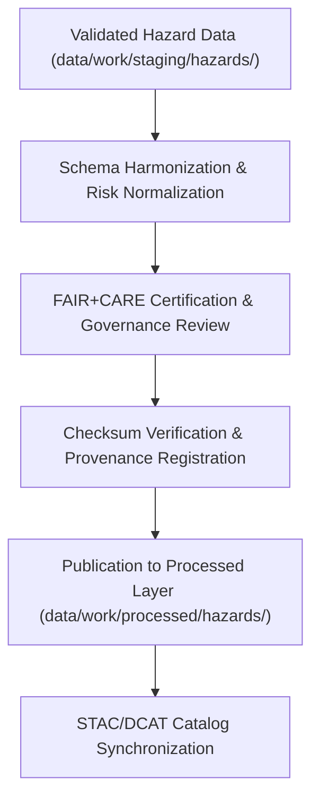

<div align="center">

# ⚠️ Kansas Frontier Matrix — **Processed Hazards Data**
`data/work/processed/hazards/README.md`

**Purpose:**  
Repository for **FAIR+CARE-certified, validated hazard datasets** within KFM.  
Contains finalized composites, severity indices, and event frequency summaries derived from FEMA, NOAA (NCEI/SPC), USGS, and allied sources.

[](../../../../docs/architecture/README.md)
[](../../../../docs/standards/faircare-validation.md)
[]()
[](../../../../LICENSE)

</div>

---

## 📘 Overview

The **Processed Hazards Layer** contains harmonized, schema-aligned datasets that have completed **FAIR+CARE** governance and **checksum validation**.  
It provides the authoritative foundation for hazard risk mapping, climate correlation, and public accessibility under ethical open-data standards.

### Core Objectives
- Consolidate multi-hazard datasets (FEMA, NOAA, USGS) with unified schema.  
- Apply **FAIR+CARE** validation for ethics and accessibility.  
- Normalize CRS/units and ensure consistent hazard definitions.  
- Register dataset lineage and checksums in governance ledgers.  

---

## 🗂️ Directory Layout

```plaintext
data/work/processed/hazards/
├── README.md
├── hazards_composite_v9.7.0.geojson      # Combined hazard dataset (floods, tornadoes, droughts, etc.)
├── hazard_intensity_index_v9.7.0.csv     # Severity/risk index normalized by region
├── event_frequency_summary_v9.7.0.csv    # Historical hazard occurrence summary
└── metadata.json                         # Provenance, checksums, FAIR+CARE certification
```

---

## ⚙️ Hazard Data Processing Workflow



### Steps
1. **Integration** — Merge FEMA/NOAA/USGS inputs under a single schema.  
2. **Normalization** — Units, CRS (**EPSG:4326**), and hazard definitions standardized.  
3. **Ethics Validation** — FAIR+CARE certification confirms accessibility & compliance.  
4. **Verification** — SHA-256 checksums computed and logged to governance registry.  
5. **Cataloging** — Published to STAC/DCAT for open discoverability.

---

## 🧩 Example Processed Hazards Metadata Record

```json
{
  "id": "processed_hazards_composite_v9.7.0",
  "source_stage": "data/work/staging/hazards/",
  "records_total": 33210,
  "schema_version": "v3.1.1",
  "checksum_sha256": "sha256:a7c5b9e2f6d3a1e9b4c7f2a8d5e9c4a7f1b3d6e8a9f5b2c4e1a8d3f9b6e7a2f5",
  "fairstatus": "certified",
  "validator": "@kfm-hazards-lab",
  "license": "CC-BY 4.0",
  "created": "2025-11-06T23:30:00Z",
  "governance_ref": "data/reports/audit/data_provenance_ledger.json"
}
```

---

## 🧠 FAIR+CARE Governance Matrix

| Principle | Implementation | Oversight |
|-----------|----------------|-----------|
| **Findable** | STAC/DCAT catalog entries with persistent IDs. | `@kfm-data` |
| **Accessible** | Open CSV & GeoJSON downloads. | `@kfm-accessibility` |
| **Interoperable** | CRS normalized (**EPSG:4326**); schema harmonized. | `@kfm-architecture` |
| **Reusable** | Provenance + checksums included for reproducibility. | `@kfm-design` |
| **Collective Benefit** | Enables public hazard awareness & risk reduction. | `@faircare-council` |
| **Authority to Control** | Council certifies final hazard datasets. | `@kfm-governance` |
| **Responsibility** | Validators ensure data quality and governance compliance. | `@kfm-security` |
| **Ethics** | Reviewed for accuracy, inclusivity, and transparency. | `@kfm-ethics` |

**FAIR+CARE artifacts:**  
`data/reports/fair/data_care_assessment.json` · `data/reports/audit/data_provenance_ledger.json`

---

## ⚙️ Validation & Certification Artifacts

| Artifact                         | Description                              | Format |
|----------------------------------|------------------------------------------|--------|
| `schema_validation_summary.json` | Hazard schema consistency checks         | JSON   |
| `faircare_certification_report.json` | Ethics & accessibility certification | JSON   |
| `checksums.json`                 | SHA-256 integrity registry               | JSON   |
| `catalog_sync.log`               | STAC/DCAT publication log                | Text   |

Automation: `hazards_processed_sync.yml`.

---

## 📊 Processed Hazard Summary (v9.7.0)

| Dataset                 | Records | Source                | FAIR+CARE | License  |
|------------------------|--------:|-----------------------|-----------|----------|
| Hazards Composite      | 33,210  | FEMA · NOAA · USGS    | ✅        | CC-BY 4.0 |
| Intensity Index        | 10,420  | NOAA · NCEI           | ✅        | CC-BY 4.0 |
| Event Frequency Summary|  7,590  | FEMA · NCEI           | ✅        | CC-BY 4.0 |

---

## ♻️ Retention & Sustainability

| Data Type | Retention | Policy |
|-----------|----------:|--------|
| Processed Hazard Data | Permanent | Archived under FAIR+CARE open data. |
| Validation Reports    | 365 Days | Retained for reproducibility checks. |
| FAIR+CARE Audits      | Permanent | Maintained for ethics review. |
| Metadata              | Permanent | Stored for transparency & provenance. |

**Telemetry:** `../../../../releases/v9.7.0/focus-telemetry.json`

---

## 🧾 Internal Use Citation

```text
Kansas Frontier Matrix (2025). Processed Hazards Data (v9.7.0).
FAIR+CARE-certified hazard datasets integrating FEMA, NOAA, and USGS sources.
Checksum-verified, schema-aligned, and governance-certified for transparent, reproducible hazard risk analysis.
```

---

## 🕰️ Version History

| Version | Date       | Author           | Summary |
|--------:|------------|------------------|---------|
| v9.7.0  | 2025-11-06 | `@kfm-hazards`   | Upgraded to v9.7.0; telemetry/schema refs aligned; directory & metrics updated. |
| v9.6.0  | 2025-11-03 | `@kfm-hazards`   | Added STAC/DCAT sync and renewable energy metrics. |

---

<div align="center">

**Kansas Frontier Matrix**  
*Hazard Intelligence × FAIR+CARE Ethics × Provenance Transparency*  
© 2025 Kansas Frontier Matrix — CC-BY 4.0 · Diamond⁹ Ω / Crown∞Ω Ultimate Certified  

[Back to Work → Processed](../README.md) · [Governance Charter](../../../../docs/standards/governance/DATA-GOVERNANCE.md)

</div>