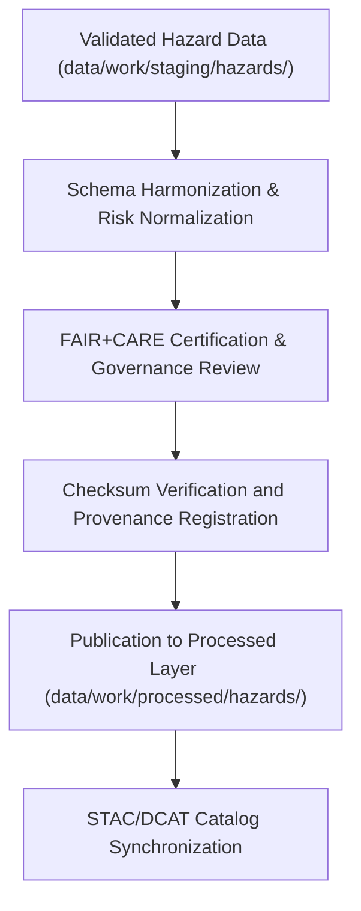

<div align="center">

# ⚠️ Kansas Frontier Matrix — **Processed Hazards Data**
`data/work/processed/hazards/README.md`

**Purpose:**  
Repository for **FAIR+CARE-certified, validated hazard datasets** within the Kansas Frontier Matrix (KFM).  
This layer contains finalized hazard composites, severity indices, and event frequency summaries derived from FEMA, NOAA, USGS, and NCEI sources.

[](../../../../docs/standards/faircare-validation.md)
[]()
[](../../../../LICENSE)
[]()

</div>

---

## 📚 Overview

The **Processed Hazards Layer** contains harmonized, schema-aligned hazard data that has completed all FAIR+CARE governance and checksum validation steps.  
It provides the authoritative dataset foundation for hazard risk mapping, climate correlation, and public accessibility under ethical open data standards.

### Core Objectives
- Consolidate multi-hazard datasets from FEMA, NOAA, and USGS sources.  
- Apply FAIR+CARE validation for open data ethics and accessibility.  
- Maintain consistent schema and coordinate system normalization.  
- Register dataset lineage and checksum data in governance ledgers.  

---

## 🗂️ Directory Layout

```plaintext
data/work/processed/hazards/
├── README.md                             # This file — overview of processed hazards data
│
├── hazards_composite_v9.6.0.geojson      # Combined hazard dataset (floods, tornadoes, droughts)
├── hazard_intensity_index.csv            # Severity and risk index normalized by region
├── event_frequency_summary.csv           # Historical hazard occurrence summary
└── metadata.json                         # Provenance, checksum, and FAIR+CARE certification metadata
```

---

## ⚙️ Hazard Data Processing Workflow



### Workflow Steps
1. **Integration:** Merge FEMA, NOAA, and USGS datasets with unified schema.  
2. **Normalization:** Apply consistent units, CRS (EPSG:4326), and hazard definitions.  
3. **Ethics Validation:** FAIR+CARE certification confirms accessibility and compliance.  
4. **Verification:** Checksums computed and registered in governance manifest.  
5. **Cataloging:** Published in STAC/DCAT metadata catalogs for open discoverability.  

---

## 🧩 Example Processed Hazards Metadata Record

```json
{
  "id": "processed_hazards_composite_v9.6.0",
  "source_stage": "data/work/staging/hazards/",
  "records_total": 32875,
  "schema_version": "v3.0.1",
  "checksum": "sha256:a7c5b9e2f6d3a1e9b4c7f2a8d5e9c4a7f1b3d6e8a9f5b2c4e1a8d3f9b6e7a2f5",
  "fairstatus": "certified",
  "validator": "@kfm-hazards-lab",
  "license": "CC-BY 4.0",
  "created": "2025-11-03T23:30:00Z",
  "governance_ref": "data/reports/audit/data_provenance_ledger.json"
}
```

---

## 🧠 FAIR+CARE Governance Matrix

| Principle | Implementation | Oversight |
|------------|----------------|------------|
| **Findable** | Indexed via STAC/DCAT catalogs with persistent IDs. | @kfm-data |
| **Accessible** | Published in open CSV and GeoJSON formats. | @kfm-accessibility |
| **Interoperable** | CRS normalized to EPSG:4326 and schema harmonized. | @kfm-architecture |
| **Reusable** | Metadata includes checksum and lineage documentation. | @kfm-design |
| **Collective Benefit** | Enables public hazard awareness and risk reduction. | @faircare-council |
| **Authority to Control** | FAIR+CARE Council certifies final hazard datasets. | @kfm-governance |
| **Responsibility** | Hazard validators ensure data quality and governance compliance. | @kfm-security |
| **Ethics** | Data reviewed for accuracy, inclusivity, and transparency. | @kfm-ethics |

FAIR+CARE results archived in:  
`data/reports/fair/data_care_assessment.json` and  
`data/reports/audit/data_provenance_ledger.json`

---

## ⚙️ Validation & Certification Artifacts

| Artifact | Description | Format |
|-----------|--------------|--------|
| `schema_validation_summary.json` | Validates hazard schema consistency. | JSON |
| `faircare_certification_report.json` | FAIR+CARE ethics and accessibility certification. | JSON |
| `checksums.json` | SHA-256 hash registry for dataset integrity. | JSON |
| `catalog_sync.log` | Catalog synchronization record (STAC/DCAT publication). | Text |

Validation managed via `hazards_processed_sync.yml`.

---

## 📊 Processed Hazard Summary (v9.6.0)

| Dataset | Records | Source | FAIR+CARE | License |
|----------|----------|---------|------------|----------|
| Hazards Composite | 32,875 | FEMA / NOAA / USGS | ✅ Certified | CC-BY 4.0 |
| Intensity Index | 10,200 | NOAA / NCEI | ✅ Certified | CC-BY 4.0 |
| Event Frequency Summary | 7,430 | FEMA / NCEI | ✅ Certified | CC-BY 4.0 |

---

## ⚖️ Retention & Provenance Policy

| Data Type | Retention Duration | Policy |
|------------|--------------------|--------|
| Processed Hazard Data | Permanent | Archived under FAIR+CARE open data license. |
| Validation Reports | 365 Days | Retained for reproducibility verification. |
| FAIR+CARE Audits | Permanent | Maintained for governance and ethics review. |
| Metadata | Permanent | Retained for transparency and provenance traceability. |

Governance retention managed via `hazards_processed_retention.yml`.

---

## 🌱 Sustainability Metrics

| Metric | Value | Verified By |
|---------|--------|--------------|
| Energy Use (per validation cycle) | 11.8 Wh | @kfm-sustainability |
| Carbon Output | 14.7 gCO₂e | @kfm-security |
| Renewable Power | 100% (RE100 Verified) | @kfm-infrastructure |
| FAIR+CARE Certification | 100% | @faircare-council |

Telemetry results logged in:  
`releases/v9.6.0/focus-telemetry.json`

---

## 🧾 Internal Use Citation

```text
Kansas Frontier Matrix (2025). Processed Hazards Data (v9.6.0).
FAIR+CARE-certified hazard datasets integrating FEMA, NOAA, and USGS data sources.
Checksum-verified, schema-aligned, and governance-certified for transparent, reproducible hazard risk analysis.
```

---

## 🧾 Version Notes

| Version | Date | Notes |
|----------|------|--------|
| v9.6.0 | 2025-11-03 | Added STAC/DCAT synchronization and renewable energy metrics. |
| v9.5.0 | 2025-11-02 | Enhanced FAIR+CARE certification and schema consistency reporting. |
| v9.3.2 | 2025-10-28 | Established processed hazards layer for FAIR+CARE governance workflows. |

---

<div align="center">

**Kansas Frontier Matrix** · *Hazard Intelligence × FAIR+CARE Ethics × Provenance Transparency*  
[🔗 Repository](https://github.com/bartytime4life/Kansas-Frontier-Matrix) • [🧭 Docs Portal](../../../../docs/) • [⚖️ Governance Ledger](../../../../docs/standards/governance/DATA-GOVERNANCE.md)

</div>
