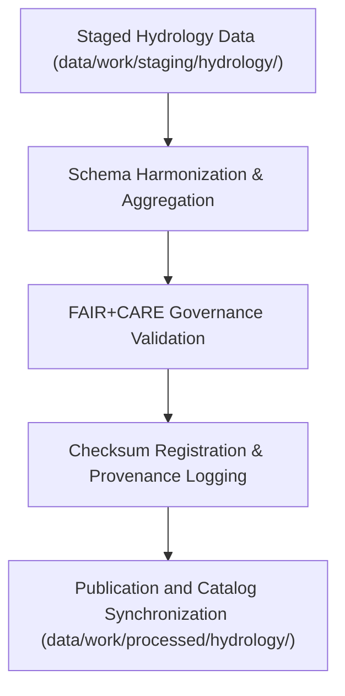

<div align="center">

# 💧 Kansas Frontier Matrix — **Processed Hydrology Data**
`data/work/processed/hydrology/README.md`

**Purpose:** Repository for FAIR+CARE-certified hydrological datasets including streamflow, aquifer, and watershed data processed within the Kansas Frontier Matrix (KFM).  
This layer consolidates validated and schema-aligned hydrologic information from USGS, NOAA, EPA, and state agencies for open access, transparency, and reproducibility.

[](../../../../docs/standards/faircare-validation.md)
[](../../../../LICENSE)
[](../../../../docs/architecture/repo-focus.md)

</div>

---

## 📚 Overview

The `data/work/processed/hydrology/` directory contains **final hydrological datasets** generated under FAIR+CARE governance and full MCP-DL v6.3 reproducibility standards.  
All datasets here are harmonized across federal and state sources, validated for schema and ethical compliance, and certified for open publication.

### Core Responsibilities
- Provide canonical hydrological data for Kansas, including streamflow, groundwater, and watersheds.  
- Preserve FAIR+CARE-certified provenance and integrity for open reuse.  
- Enable model-ready hydrologic data for climate, ecology, and infrastructure research.  
- Register validated datasets in STAC/DCAT catalogs for discoverability.  

All products are open under **CC-BY 4.0** and traceable via the **KFM Governance Ledger**.

---

## 🗂️ Directory Layout

```plaintext
data/work/processed/hydrology/
├── README.md
│
├── hydrology_summary_v9.4.0.parquet        # Aggregated statewide hydrologic summary
├── groundwater_trends.csv                  # Groundwater observation trends and anomalies
├── watershed_boundaries.geojson            # Certified watershed and subbasin boundaries
└── metadata.json                           # FAIR+CARE certification and provenance record
```

---

## ⚙️ Processing Workflow



### Workflow Description
1. **Harmonization:** Integrate multi-agency hydrologic datasets (USGS, NOAA, EPA).  
2. **Aggregation:** Generate derived summaries for basins, aquifers, and flow trends.  
3. **Validation:** Apply schema checks and FAIR+CARE audit for integrity and ethics.  
4. **Certification:** Log provenance, checksum, and governance certification.  
5. **Publication:** Distribute open datasets with metadata to KFM catalogs and APIs.

---

## 🧩 Example Metadata Record

```json
{
  "id": "processed_hydrology_summary_v9.4.0",
  "schema_version": "v3.1.0",
  "source_stage": "data/work/staging/hydrology/",
  "records_total": 43512,
  "spatial_extent": [-102.05, 36.99, -94.61, 40.00],
  "temporal_extent": ["1950-01-01", "2025-12-31"],
  "checksum": "sha256:3b79f25cd47b4ffbc58b92d9ae5b8ff9d1a8452b...",
  "fairstatus": "certified",
  "validator": "@kfm-hydro-lab",
  "license": "CC-BY 4.0",
  "telemetry_link": "releases/v9.4.0/focus-telemetry.json",
  "governance_ref": "data/reports/audit/data_provenance_ledger.json"
}
```

---

## 🧠 FAIR+CARE Compliance Framework

| Principle | Implementation |
|------------|----------------|
| **Findable** | Indexed in STAC/DCAT catalogs with complete metadata and schema descriptors. |
| **Accessible** | Distributed via open formats (CSV, Parquet, GeoJSON) and public APIs. |
| **Interoperable** | Schema harmonized across USGS, EPA, and NOAA standards. |
| **Reusable** | Provenance and checksum validation enable transparent reuse. |
| **Collective Benefit** | Supports sustainable water management and public research. |
| **Authority to Control** | FAIR+CARE Council certifies hydrological data releases. |
| **Responsibility** | Data maintainers ensure ethical sourcing and quality control. |
| **Ethics** | Excludes sensitive or private well data; fully anonymized hydrologic datasets. |

Certification results are logged in:  
`data/reports/fair/data_care_assessment.json`  
and `data/reports/audit/data_provenance_ledger.json`.

---

## ⚙️ Validation & QA Reports

| Report | Description | Output |
|---------|-------------|---------|
| `schema_validation_summary.json` | Schema validation across all hydrology datasets. | JSON |
| `faircare_certification_report.json` | FAIR+CARE audit summary for hydrology governance. | JSON |
| `checksums.json` | Hash registry for file-level data verification. | JSON |
| `catalog_sync.log` | STAC/DCAT publication synchronization log. | Text |

Automated QA and certification pipelines managed via `.github/workflows/processed_hydrology_sync.yml`.

---

## ⚖️ Governance & Provenance Integration

| Record | Description |
|---------|-------------|
| `metadata.json` | Contains schema metadata, checksum, and FAIR+CARE certification. |
| `data/reports/audit/data_provenance_ledger.json` | Tracks hydrology lineage and certification records. |
| `data/reports/fair/data_care_assessment.json` | FAIR+CARE compliance reports. |
| `releases/v9.4.0/manifest.zip` | Complete checksum archive for processed hydrology datasets. |

Governance synchronization is automatically performed post-certification through CI/CD pipelines.

---

## 🧾 Retention & Publication Policy

| Data Type | Retention Duration | Policy |
|------------|--------------------|--------|
| Processed Hydrology Data | Permanent | Archived as canonical, open CC-BY 4.0 datasets. |
| Validation Reports | 365 days | Retained for audit and reproducibility. |
| FAIR+CARE Reports | Permanent | Maintained for ethics governance. |
| Governance Metadata | Permanent | Stored in provenance registry for traceability. |

Retention management handled via `hydrology_data_retention.yml`.

---

## 🧾 Citation

```text
Kansas Frontier Matrix (2025). Processed Hydrology Data (v9.4.0).
FAIR+CARE-certified hydrology datasets including aquifers, streamflow, and watershed boundaries for Kansas.
Licensed under CC-BY 4.0. All datasets validated and registered in the KFM Provenance Ledger.
```

---

## 🧾 Version Notes

| Version | Date | Notes |
|----------|------|--------|
| v9.4.0 | 2025-11-02 | Added telemetry integration, updated FAIR+CARE workflow, and improved STAC/DCAT synchronization. |
| v9.3.2 | 2025-10-28 | Integrated FAIR+CARE governance alignment and catalog registration. |
| v9.2.0 | 2024-07-15 | Added groundwater and watershed harmonization modules. |
| v9.0.0 | 2023-01-10 | Established processed hydrology data layer under FAIR+CARE certification. |

---

<div align="center">

**Kansas Frontier Matrix** · *Hydrological Intelligence × FAIR+CARE Ethics × Provenance Integrity × Telemetry Traceability*  
[🔗 Repository](https://github.com/bartytime4life/Kansas-Frontier-Matrix) • [🧭 Docs Portal](../../../../docs/) • [⚖️ Governance Ledger](../../../../docs/standards/governance/)

</div>
