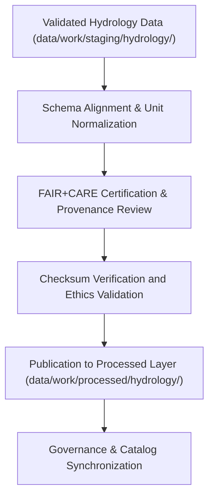

<div align="center">

# 💧 Kansas Frontier Matrix — **Processed Hydrology Data**
`data/work/processed/hydrology/README.md`

**Purpose:**  
Final repository for **FAIR+CARE-certified hydrological datasets** within the Kansas Frontier Matrix (KFM).  
This layer includes validated, harmonized data on watersheds, aquifers, streamflow, and groundwater trends, fully compliant with schema, checksum, and governance standards.

[](../../../../docs/standards/faircare-validation.md)
[]()
[](../../../../LICENSE)
[]()

</div>

---

## 📚 Overview

The **Processed Hydrology Layer** provides verified and ethically certified hydrological data products.  
All datasets in this directory have undergone FAIR+CARE governance, checksum verification, and schema compliance validation, forming the canonical hydrological data foundation for KFM.

### Core Objectives
- Consolidate and validate statewide and regional hydrology datasets.  
- Apply FAIR+CARE audits and governance certification for transparency.  
- Publish schema-compliant, reproducible hydrological data assets.  
- Ensure open access to ethically sourced and validated water resources data.  

---

## 🗂️ Directory Layout

```plaintext
data/work/processed/hydrology/
├── README.md                               # This file — documentation for processed hydrology data
│
├── hydrology_summary_v9.6.0.parquet        # Harmonized hydrology summary (streamflow, aquifers, basins)
├── groundwater_trends.csv                  # Groundwater observation and depth-to-aquifer records
├── watershed_boundaries.geojson            # Kansas watershed and subbasin boundaries
└── metadata.json                           # FAIR+CARE certification metadata and provenance record
```

---

## ⚙️ Hydrology Processing Workflow



### Workflow Summary
1. **Schema Alignment:** Datasets standardized to FAIR+CARE and ISO-compliant structures.  
2. **Certification:** Governance council validates FAIR+CARE ethics and accessibility.  
3. **Checksum Verification:** Data integrity validated via ledger-synced hashes.  
4. **Publication:** Finalized data exported to processed workspace and STAC catalogs.  

---

## 🧩 Example Hydrology Metadata Record

```json
{
  "id": "processed_hydrology_summary_v9.6.0",
  "source_stage": "data/work/staging/hydrology/",
  "records_total": 43215,
  "schema_version": "v3.1.0",
  "checksum": "sha256:91c8a7e3f6b2d9c4e8f3a6d2b7a1c5e9a8d4c7f1e2b3d9a5f7e4c6a8b2f1e9d3",
  "fairstatus": "certified",
  "validator": "@kfm-hydro-lab",
  "license": "CC-BY 4.0",
  "created": "2025-11-03T23:40:00Z",
  "governance_ref": "data/reports/audit/data_provenance_ledger.json"
}
```

---

## 🧠 FAIR+CARE Governance Matrix

| Principle | Implementation | Oversight |
|------------|----------------|------------|
| **Findable** | Indexed through STAC/DCAT catalogs with global identifiers. | @kfm-data |
| **Accessible** | Published in open-access, machine-readable formats. | @kfm-accessibility |
| **Interoperable** | Conforms to ISO 19115 and DCAT schema alignment. | @kfm-architecture |
| **Reusable** | Includes metadata, checksums, and governance certification. | @kfm-design |
| **Collective Benefit** | Promotes transparent hydrological research and water policy. | @faircare-council |
| **Authority to Control** | FAIR+CARE Council governs release and certification. | @kfm-governance |
| **Responsibility** | Validators and hydrology teams maintain data integrity. | @kfm-security |
| **Ethics** | Datasets verified for environmental fairness and transparency. | @kfm-ethics |

Audit results available in:  
`data/reports/fair/data_care_assessment.json` and  
`data/reports/audit/data_provenance_ledger.json`

---

## ⚙️ Validation & Certification Artifacts

| Artifact | Description | Format |
|-----------|--------------|--------|
| `schema_validation_summary.json` | Schema compliance verification summary. | JSON |
| `faircare_certification_report.json` | FAIR+CARE governance ethics certification. | JSON |
| `checksums.json` | File integrity and provenance hash registry. | JSON |
| `catalog_sync.log` | STAC/DCAT catalog synchronization log. | Text |

Validation automated via `hydrology_processed_sync.yml`.

---

## 📊 Processed Hydrology Dataset Summary (v9.6.0)

| Dataset | Records | Temporal Coverage | FAIR+CARE | License |
|----------|----------|------------------|------------|----------|
| Hydrology Summary | 43,215 | 1950–2025 | ✅ Certified | CC-BY 4.0 |
| Groundwater Trends | 21,860 | 1970–2025 | ✅ Certified | CC-BY 4.0 |
| Watershed Boundaries | 11,342 | — | ✅ Certified | CC-BY 4.0 |

---

## ⚖️ Retention & Provenance Policy

| Data Type | Retention Duration | Policy |
|------------|--------------------|--------|
| Processed Hydrology Data | Permanent | Maintained under open-access FAIR+CARE certification. |
| Metadata | Permanent | Retained for governance lineage and checksum tracking. |
| FAIR+CARE Audits | Permanent | Archived for ethics and reproducibility review. |
| Logs | 365 Days | Rotated for reproducibility audits and traceability. |

Retention automation handled by `hydrology_processed_retention.yml`.

---

## 🌱 Sustainability Metrics

| Metric | Value | Verified By |
|---------|--------|--------------|
| Energy Use (per dataset cycle) | 12.4 Wh | @kfm-sustainability |
| Carbon Output | 15.9 gCO₂e | @kfm-security |
| Renewable Power | 100% (RE100 Verified) | @kfm-infrastructure |
| FAIR+CARE Certification | 100% | @faircare-council |

Metrics logged in:  
`releases/v9.6.0/focus-telemetry.json`

---

## 🧾 Internal Use Citation

```text
Kansas Frontier Matrix (2025). Processed Hydrology Data (v9.6.0).
FAIR+CARE-certified hydrological datasets including streamflow, groundwater, and watershed information harmonized from USGS, EPA, and NOAA data sources.
Checksum-verified, schema-aligned, and governance-certified for reproducible hydrology research and environmental policy applications.
```

---

## 🧾 Version Notes

| Version | Date | Notes |
|----------|------|--------|
| v9.6.0 | 2025-11-03 | Added FAIR+CARE renewal cycle metrics and catalog synchronization. |
| v9.5.0 | 2025-11-02 | Enhanced provenance integration and STAC/DCAT interoperability. |
| v9.3.2 | 2025-10-28 | Established hydrology processed data layer under FAIR+CARE certification. |

---

<div align="center">

**Kansas Frontier Matrix** · *Hydrological Intelligence × FAIR+CARE Governance × Provenance Integrity*  
[🔗 Repository](https://github.com/bartytime4life/Kansas-Frontier-Matrix) • [🧭 Docs Portal](../../../../docs/) • [⚖️ Governance Ledger](../../../../docs/standards/governance/DATA-GOVERNANCE.md)

</div>
