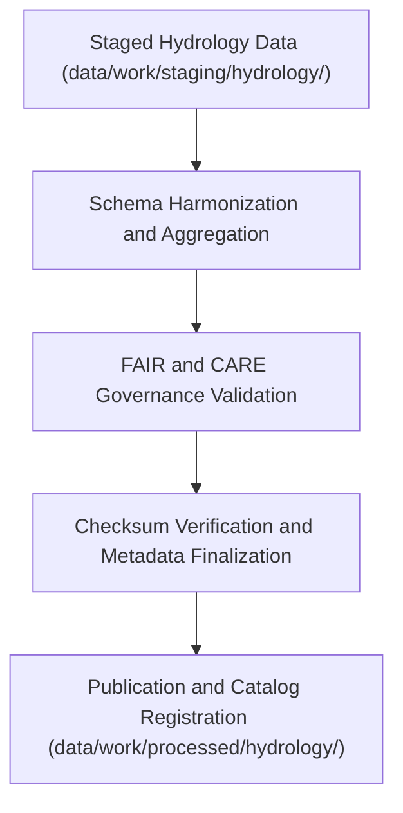

<div align="center">

# 💧 Kansas Frontier Matrix — **Processed Hydrology Data**
`data/work/processed/hydrology/README.md`

**Purpose:** Repository for FAIR+CARE-certified hydrological datasets including streamflow, aquifer, and watershed data processed within the Kansas Frontier Matrix (KFM).  
This layer consolidates validated and schema-aligned hydrologic information from USGS, NOAA, EPA, and state agencies for open access and scientific reproducibility.

[](../../../../docs/standards/faircare-validation.md)
[](../../../../LICENSE)
[](../../../../docs/architecture/repo-focus.md)

</div>

---

## 📚 Overview

The `data/work/processed/hydrology/` directory contains **final hydrological datasets** produced through KFM’s governance-certified ETL and validation pipelines.  
These datasets are harmonized across multiple agencies, schema-aligned with FAIR+CARE standards, and ready for distribution or modeling.

### Core Responsibilities:
- Maintain processed watershed, groundwater, and surface water datasets for Kansas.  
- Provide normalized, ethics-certified data for hydrologic modeling and analysis.  
- Preserve dataset lineage, checksums, and provenance for reproducibility.  
- Integrate hydrologic data with FAIR+CARE metadata frameworks and STAC/DCAT catalogs.  

All data in this workspace are final, validated, and open under CC-BY 4.0 licensing.

---

## 🗂️ Directory Layout

```plaintext
data/work/processed/hydrology/
├── README.md                              # This file — overview of processed hydrology datasets
│
├── hydrology_summary_v9.3.2.parquet       # Statewide hydrological summary (streamflow + basin aggregates)
├── groundwater_trends.csv                 # Groundwater observation trends and annual anomalies
├── watershed_boundaries.geojson           # Finalized watershed and subbasin boundaries
└── metadata.json                          # Provenance, schema, and FAIR+CARE certification metadata
```

---

## ⚙️ Processing Workflow



### Workflow Steps:
1. **Harmonization:** Combine groundwater, streamflow, and watershed datasets from staging.  
2. **Aggregation:** Compute statewide hydrological summaries and long-term trends.  
3. **Validation:** Apply FAIR+CARE audits and schema validation checks.  
4. **Certification:** Register provenance and checksum results to governance ledger.  
5. **Publication:** Export verified datasets in open, interoperable formats.

---

## 🧩 Example Metadata Record

```json
{
  "id": "processed_hydrology_summary_v9.3.2",
  "schema_version": "v3.0.1",
  "source_stage": "data/work/staging/hydrology/",
  "records_total": 43215,
  "spatial_extent": [-102.05, 36.99, -94.61, 40.00],
  "temporal_extent": ["1950-01-01", "2025-12-31"],
  "checksum": "sha256:3b79f25cd47b4ffbc58b92d9ae5b8ff9d1a8452b...",
  "fairstatus": "certified",
  "validator": "@kfm-hydro-lab",
  "license": "CC-BY 4.0",
  "governance_ref": "data/reports/audit/data_provenance_ledger.json"
}
```

---

## 🧠 FAIR+CARE Compliance Summary

| Principle | Implementation |
|------------|----------------|
| **Findable** | Indexed with STAC/DCAT catalog metadata and hydrology schema descriptors. |
| **Accessible** | Distributed in open CSV, GeoJSON, and Parquet formats. |
| **Interoperable** | Schema harmonized across USGS, EPA, and NOAA datasets. |
| **Reusable** | Metadata includes versioning, provenance, and checksum information. |
| **Collective Benefit** | Enables ethical and transparent hydrological research and management. |
| **Authority to Control** | FAIR+CARE Council ensures compliance with water data ethics. |
| **Responsibility** | Data maintainers document all validation and audit results. |
| **Ethics** | Datasets exclude sensitive geospatial information on private wells or restricted basins. |

Certification results stored in:  
`data/reports/fair/data_care_assessment.json`  
and `data/reports/audit/data_provenance_ledger.json`.

---

## ⚙️ Validation & QA Reports

| Report | Description | Output |
|---------|-------------|---------|
| `schema_validation_summary.json` | Final schema conformity and completeness report. | JSON |
| `faircare_certification_report.json` | FAIR+CARE ethics audit summary. | JSON |
| `checksums.json` | Registry of file-level SHA-256 checksums for reproducibility. | JSON |
| `catalog_sync.log` | Logs publication and STAC/DCAT synchronization events. | Text |

Automated validation and synchronization managed by `processed_hydrology_sync.yml`.

---

## ⚖️ Governance & Provenance Integration

| Record | Description |
|---------|-------------|
| `metadata.json` | Tracks dataset provenance, schema version, and FAIR+CARE audit. |
| `data/reports/audit/data_provenance_ledger.json` | Records hydrology dataset lineage and validation results. |
| `data/reports/fair/data_care_assessment.json` | FAIR+CARE compliance and certification archive. |
| `releases/v9.3.2/manifest.zip` | Global checksum registry for hydrology datasets. |

Governance synchronization automated during certification workflows.

---

## 🧾 Retention & Publication Policy

| Data Type | Retention | Policy |
|------------|------------|--------|
| Processed Hydrology Data | Permanent | Retained as certified open datasets under CC-BY 4.0. |
| FAIR+CARE Reports | Permanent | Maintained for long-term ethics accountability. |
| Validation Logs | 365 days | Archived for reproducibility and re-audit. |
| Governance Metadata | Permanent | Stored in the provenance ledger for traceability. |

Retention and archival managed via `hydrology_data_retention.yml`.

---

## 🧾 Citation

```text
Kansas Frontier Matrix (2025). Processed Hydrology Data (v9.3.2).
Final FAIR+CARE-certified hydrology datasets including streamflow, aquifers, and watershed summaries for Kansas.
Available under CC-BY 4.0 via the Kansas Frontier Matrix open data catalog.
```

---

## 🧾 Version Notes

| Version | Date | Notes |
|----------|------|--------|
| v9.3.2 | 2025-10-28 | Integrated FAIR+CARE governance alignment and catalog registration. |
| v9.2.0 | 2024-07-15 | Added groundwater and watershed harmonization modules. |
| v9.0.0 | 2023-01-10 | Established processed hydrology data layer under FAIR+CARE certification. |

---

<div align="center">

**Kansas Frontier Matrix** · *Hydrological Intelligence × FAIR+CARE Ethics × Provenance Accountability*  
[🔗 Repository](https://github.com/bartytime4life/Kansas-Frontier-Matrix) • [🧭 Docs Portal](../../../../docs/) • [⚖️ Governance Ledger](../../../../docs/standards/governance/)

</div>