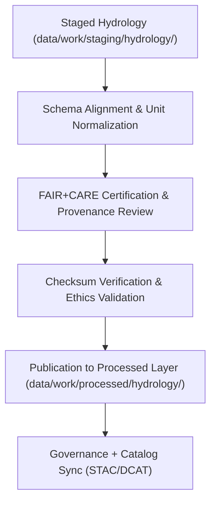

<div align="center">

# 💧 Kansas Frontier Matrix — **Processed Hydrology Data**
`data/work/processed/hydrology/README.md`

**Purpose:**  
Final repository for **FAIR+CARE-certified** hydrological datasets in KFM.  
Includes validated, harmonized data on watersheds, aquifers, streamflow, and groundwater trends—fully compliant with schema, checksum, and governance standards.

[](../../../../docs/architecture/README.md)
[](../../../../docs/standards/faircare-validation.md)
[]()
[](../../../../LICENSE)

</div>

---

## 📘 Overview

The **Processed Hydrology Layer** provides verified, ethically certified hydrological products.  
All datasets have undergone **FAIR+CARE governance**, **checksum verification**, and **schema compliance**—forming KFM’s canonical hydrological foundation.

### Core Objectives
- Consolidate & validate statewide/regional hydrology datasets.  
- Apply FAIR+CARE audits & governance certification for transparency.  
- Publish schema-compliant, reproducible water resource data assets.  
- Ensure open access to ethically sourced, validated data.  

---

## 🗂️ Directory Layout

```plaintext
data/work/processed/hydrology/
├── README.md
├── hydrology_summary_v9.7.0.parquet       # Harmonized hydrology indicators (streamflow, aquifers, basins)
├── groundwater_trends_v9.7.0.csv          # Observation wells & depth-to-aquifer timeseries
├── watershed_boundaries_v9.7.0.geojson    # Watershed & sub-basin boundaries
└── metadata.json                           # FAIR+CARE certification & provenance record
```

---

## ⚙️ Hydrology Processing Workflow



### Summary
1. **Align** — Standardize structures, units, and CRS.  
2. **Certify** — FAIR+CARE audits + governance approval.  
3. **Verify** — SHA-256 checksums & ledger registration.  
4. **Publish** — Export to processed layer and catalogs.

---

## 🧩 Example Hydrology Metadata Record

```json
{
  "id": "processed_hydrology_summary_v9.7.0",
  "source_stage": "data/work/staging/hydrology/",
  "records_total": 43880,
  "schema_version": "v3.1.1",
  "checksum_sha256": "sha256:91c8a7e3f6b2d9c4e8f3a6d2b7a1c5e9a8d4c7f1e2b3d9a5f7e4c6a8b2f1e9d3",
  "fairstatus": "certified",
  "validator": "@kfm-hydro-lab",
  "license": "CC-BY 4.0",
  "created": "2025-11-06T23:40:00Z",
  "governance_ref": "data/reports/audit/data_provenance_ledger.json"
}
```

---

## 🧠 FAIR+CARE Governance Matrix

| Principle | Implementation | Oversight |
|-----------|----------------|-----------|
| **Findable** | STAC/DCAT catalog entries w/ persistent IDs. | `@kfm-data` |
| **Accessible** | Open-access, machine-readable outputs. | `@kfm-accessibility` |
| **Interoperable** | ISO 19115 alignment; DCAT schema fields. | `@kfm-architecture` |
| **Reusable** | Provenance, checksums, & certification embedded. | `@kfm-design` |
| **Collective Benefit** | Supports sustainable policy & research. | `@faircare-council` |
| **Authority to Control** | Council governs release & certification. | `@kfm-governance` |
| **Responsibility** | Hydrology stewards maintain integrity. | `@kfm-security` |
| **Ethics** | Verified for environmental fairness & transparency. | `@kfm-ethics` |

**Audit references:**  
`data/reports/fair/data_care_assessment.json` · `data/reports/audit/data_provenance_ledger.json`

---

## ⚙️ Validation & Certification Artifacts

| Artifact                         | Description                               | Format |
|----------------------------------|-------------------------------------------|--------|
| `schema_validation_summary.json` | Schema compliance summary                  | JSON   |
| `faircare_certification_report.json` | Ethics/accessibility certification     | JSON   |
| `checksums.json`                 | Integrity + provenance hash registry       | JSON   |
| `catalog_sync.log`               | STAC/DCAT publication record               | Text   |

Automation: `hydrology_processed_sync.yml`.

---

## 📊 Processed Hydrology Dataset Summary (v9.7.0)

| Dataset                | Records | Temporal Coverage | FAIR+CARE | License  |
|-----------------------|--------:|-------------------|-----------|----------|
| Hydrology Summary     | 43,880  | 1950–2025         | ✅        | CC-BY 4.0 |
| Groundwater Trends    | 22,140  | 1970–2025         | ✅        | CC-BY 4.0 |
| Watershed Boundaries  | 11,482  | —                 | ✅        | CC-BY 4.0 |

---

## ♻️ Retention & Sustainability

| Data Type | Retention | Policy |
|-----------|----------:|--------|
| Processed Hydrology Data | Permanent | FAIR+CARE-certified open datasets. |
| Metadata                 | Permanent | Governance lineage & checksums.    |
| FAIR+CARE Audits         | Permanent | Ethics & reproducibility review.   |
| Logs                     | 365 Days  | Governance QA & traceability.      |

**Telemetry:** `../../../../releases/v9.7.0/focus-telemetry.json`

---

## 🧾 Internal Use Citation

```text
Kansas Frontier Matrix (2025). Processed Hydrology Data (v9.7.0).
FAIR+CARE-certified datasets (streamflow, groundwater, watersheds) harmonized from USGS, EPA, and NOAA.
Checksum-verified, schema-aligned, and governance-certified for reproducible hydrology research and policy.
```

---

## 🕰️ Version History

| Version | Date       | Author         | Summary |
|--------:|------------|----------------|---------|
| v9.7.0  | 2025-11-06 | `@kfm-hydro`   | Upgraded to v9.7.0; telemetry/schema refs aligned; directory & metrics updated. |
| v9.6.0  | 2025-11-03 | `@kfm-hydro`   | Added FAIR+CARE renewal metrics and catalog sync. |

---

<div align="center">

**Kansas Frontier Matrix**  
*Hydrological Intelligence × FAIR+CARE Governance × Provenance Integrity*  
© 2025 Kansas Frontier Matrix — CC-BY 4.0 · Diamond⁹ Ω / Crown∞Ω Ultimate Certified  

[Back to Work → Processed](../README.md) · [Governance Charter](../../../../docs/standards/governance/DATA-GOVERNANCE.md)

</div>