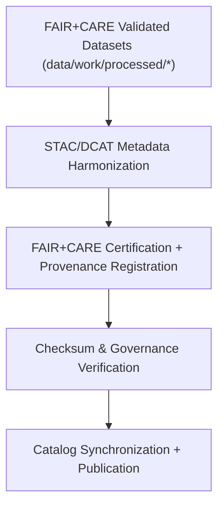

<div align="center">

# 🧾 Kansas Frontier Matrix — **Processed Metadata Layer**
`data/work/processed/metadata/README.md`

**Purpose:**  
Central repository for **FAIR+CARE-certified metadata collections** documenting all finalized datasets in KFM.  
Maintains validated, provenance-linked metadata aligned with **STAC**, **DCAT**, **PROV-O**, and **ISO 19115** for transparent, interoperable governance.

[](../../../../docs/architecture/README.md)
[](../../../../docs/standards/faircare-validation.md)
[]()
[]()
[](../../../../LICENSE)

</div>

---

## 📘 Overview

The **Processed Metadata Layer** provides authoritative metadata collections for **FAIR+CARE-validated** KFM datasets.  
Each record captures **provenance**, **schema lineage**, **ethics certification**, and **catalog registration**, ensuring global interoperability and traceability.

### Core Objectives
- Store final, validated metadata harmonized across STAC/DCAT/PROV-O.  
- Register FAIR+CARE certifications and checksum verifications.  
- Link metadata collections to processed outputs in `data/work/processed/*/`.  
- Publish catalog-ready metadata for open access.

---

## 🗂️ Directory Layout

```plaintext
data/work/processed/metadata/
├── README.md
├── stac_collection.json                  # STAC 1.0 collection manifest (processed datasets)
├── provenance_manifest.json              # PROV-O lineage + governance ledger mapping
├── governance_certification.json         # FAIR+CARE audit & ethics certification summary
├── metadata_summary.csv                  # Dataset → metadata index (human-readable)
└── metadata.json                         # Provenance + checksum record for metadata layer
```

---

## ⚙️ Metadata Processing Workflow



### Steps
1. **Extraction** — Generate metadata from processed datasets.  
2. **Harmonization** — Align with STAC/DCAT/PROV-O profiles.  
3. **Certification** — Record FAIR+CARE validation & council approval.  
4. **Verification** — Verify checksums & governance hashes.  
5. **Publication** — Link to STAC collections & governance ledgers.

---

## 🧩 Example Metadata Record

```json
{
  "id": "metadata_processed_hazards_v9.7.0",
  "dataset_ref": "data/work/processed/hazards/hazards_composite_v9.7.0.geojson",
  "schemas": ["STAC 1.0.0", "DCAT 3.0", "PROV-O"],
  "fairstatus": "certified",
  "checksum_sha256": "sha256:d8a4e1b3f7a9c6e2b3a7d8c4e5f2b9d3e4a1f6c8b7e2a9c5d3f4a7b6c9e5d1f3",
  "validator": "@kfm-metadata-lab",
  "license": "CC-BY 4.0",
  "created": "2025-11-06T23:45:00Z",
  "governance_ref": "data/reports/audit/data_provenance_ledger.json"
}
```

---

## 🧠 FAIR+CARE Metadata Governance Matrix

| Principle | Implementation | Oversight |
|-----------|----------------|-----------|
| **Findable** | STAC/DCAT indexing with dataset links & IDs. | `@kfm-data` |
| **Accessible** | JSON-LD & CSV exports for public use. | `@kfm-accessibility` |
| **Interoperable** | Conforms to STAC/DCAT/PROV-O & ISO 19115. | `@kfm-architecture` |
| **Reusable** | Provenance, checksums, & certification included. | `@kfm-design` |
| **Collective Benefit** | Ethical, transparent access to Kansas research data. | `@faircare-council` |
| **Authority to Control** | Council governs metadata certification. | `@kfm-governance` |
| **Responsibility** | Validators sustain consistency across collections. | `@kfm-security` |
| **Ethics** | Reviewed for inclusivity & cultural sensitivity. | `@kfm-ethics` |

**FAIR+CARE references:**  
`data/reports/fair/data_care_assessment.json` · `data/reports/audit/data_provenance_ledger.json`

---

## ⚙️ Validation & Certification Artifacts

| Artifact                    | Description                                   | Format |
|----------------------------|-----------------------------------------------|--------|
| `stac_collection.json`     | STAC collection for processed datasets.       | JSON   |
| `provenance_manifest.json` | PROV-O lineage + governance references.       | JSON   |
| `governance_certification.json` | FAIR+CARE ethics certification outcomes. | JSON   |
| `metadata_summary.csv`     | Index of dataset metadata (human-readable).   | CSV    |
| `metadata.json`            | Provenance + checksum record for the layer.   | JSON   |

Automation: `metadata_processed_sync.yml`.

---

## 📊 Processed Metadata Summary (v9.7.0)

| Dataset                 | Standards             | FAIR+CARE | License  |
|------------------------|-----------------------|-----------|----------|
| Hazards Composite      | STAC/DCAT/PROV-O      | ✅        | CC-BY 4.0 |
| Climate Summary        | STAC/DCAT             | ✅        | CC-BY 4.0 |
| Hydrology Summary      | DCAT/PROV-O           | ✅        | CC-BY 4.0 |
| Landcover Classification| STAC/DCAT            | ✅        | CC-BY 4.0 |
| Tabular Aggregates     | DCAT 3.0              | ✅        | CC-BY 4.0 |

---

## ♻️ Retention & Sustainability

| Data Type            | Retention | Policy |
|---------------------|----------:|--------|
| Processed Metadata  | Permanent | Authoritative catalog record. |
| FAIR+CARE Certs     | Permanent | Governance continuity.        |
| Provenance Records  | Permanent | Immutable & ledger-logged.    |
| Validation Reports  | 365 Days  | Reproducibility reviews.      |

**Telemetry:** `../../../../releases/v9.7.0/focus-telemetry.json`

---

## 🧾 Internal Use Citation

```text
Kansas Frontier Matrix (2025). Processed Metadata Layer (v9.7.0).
FAIR+CARE-certified metadata repository harmonizing STAC, DCAT, and PROV-O standards for all processed KFM datasets.
Checksum-verified, governance-certified, and openly accessible for reproducible research and ethical stewardship.
```

---

## 🕰️ Version History

| Version | Date       | Author             | Summary |
|--------:|------------|--------------------|---------|
| v9.7.0  | 2025-11-06 | `@kfm-metadata`    | Upgraded to v9.7.0; telemetry/schema refs aligned; examples & matrices refreshed. |
| v9.6.0  | 2025-11-03 | `@kfm-metadata`    | Added governance certification & PROV-O lineage mapping. |

---

<div align="center">

**Kansas Frontier Matrix**  
*Metadata Transparency × FAIR+CARE Ethics × Provenance Integrity*  
© 2025 Kansas Frontier Matrix — CC-BY 4.0 · Diamond⁹ Ω / Crown∞Ω Ultimate Certified  

[Back to Work → Processed](../README.md) · [Governance Charter](../../../../docs/standards/governance/DATA-GOVERNANCE.md)

</div>