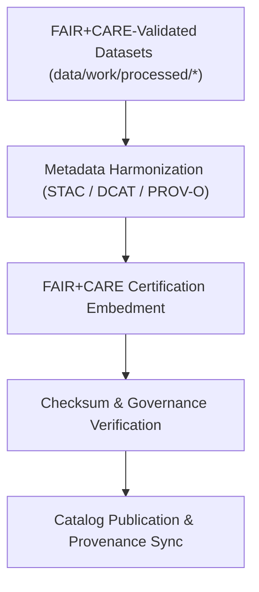

<div align="center">

# 🧾 Kansas Frontier Matrix — **Processed Metadata Layer**
`data/work/processed/metadata/README.md`

**Purpose:** Canonical repository for FAIR+CARE-certified metadata describing all finalized datasets in the Kansas Frontier Matrix (KFM).  
This layer preserves provenance, governance, and semantic linkages to ensure transparent catalog publication, ethical lifecycle tracking, and reproducibility.

[](../../../../docs/standards/faircare-validation.md)
[](../../../../LICENSE)
[](../../../../docs/architecture/repo-focus.md)

</div>

---

## 📚 Overview

The `data/work/processed/metadata/` directory is the **authoritative metadata hub** for all FAIR+CARE-audited KFM datasets.  
Each artifact captures provenance (PROV-O), catalog descriptors (STAC/DCAT), and governance records, enabling machine-actionable discovery and verifiable reuse.

### Core Functions
- Maintain unified, versioned metadata for every processed dataset.  
- Synchronize descriptors with public **STAC 1.0** / **DCAT 3.0** catalogs and schema.org profiles.  
- Store final FAIR+CARE governance results and ethics audit records.  
- Serve as the definitive reference for attribution, lineage, and certification.

All files are **CC-BY 4.0** and are updated via automated certification workflows.

---

## 🗂️ Directory Layout

```plaintext
data/work/processed/metadata/
├── README.md                           # This file — overview of processed metadata layer
│
├── stac_collection.json                # STAC 1.0 collection covering published processed datasets
├── provenance_manifest.json            # PROV-O lineage: raw → staging → processed, with checksums
├── governance_certification.json       # FAIR+CARE audit outcomes and certification ledger
└── metadata_summary.csv                # Human-readable index of datasets and metadata references
```

---

## ⚙️ Metadata Processing Workflow



### Workflow Description
1. **Harmonization:** Transform dataset-level descriptors into **STAC/DCAT/PROV-O** structures.  
2. **Certification:** Embed FAIR+CARE audit outcomes and ethics indicators.  
3. **Verification:** Link file checksums and lineage to the provenance ledger.  
4. **Publication:** Sync to KFM catalogs and documentation with immutable references.

---

## 🧩 Example Metadata Record

```json
{
  "id": "metadata_processed_hazards_v9.4.0",
  "dataset_ref": "data/work/processed/hazards/hazards_composite_v9.4.0.geojson",
  "schemas": ["STAC 1.0.0", "DCAT 3.0", "PROV-O"],
  "validator": "@kfm-metadata-lab",
  "checksum": "sha256:5a98c32d8e83a871c46f84d1f97ed18b32bfae9c...",
  "fairstatus": "certified",
  "license": "CC-BY 4.0",
  "created": "2025-11-02T15:10:00Z",
  "telemetry_link": "releases/v9.4.0/focus-telemetry.json",
  "governance_ref": "data/reports/audit/data_provenance_ledger.json"
}
```

---

## 🧠 FAIR+CARE Metadata Governance

| Principle | Implementation |
|---|---|
| **Findable** | STAC/DCAT catalog indexing with stable IDs and rich keywords. |
| **Accessible** | Open JSON/CSV artifacts under CC-BY 4.0; API and static access supported. |
| **Interoperable** | Conforms to **STAC 1.0**, **DCAT 3.0**, **schema.org**, and **PROV-O**. |
| **Reusable** | Includes versioning, provenance, and checksum lineage for verification. |
| **Collective Benefit** | Enables equitable access to validated Kansas datasets. |
| **Authority to Control** | FAIR+CARE Council certifies metadata prior to catalog release. |
| **Responsibility** | Metadata stewards record lifecycle changes and governance updates. |
| **Ethics** | Includes ethics statements and accessibility assurances. |

Audit/certification logs:  
`data/reports/audit/data_provenance_ledger.json` · `data/reports/fair/data_care_assessment.json`

---

## ⚙️ Metadata Files Overview

| File | Description | Format |
|---|---|---|
| `stac_collection.json` | Consolidated STAC collection covering all processed datasets. | JSON |
| `provenance_manifest.json` | Cross-dataset PROV-O lineage and checksum registry. | JSON |
| `governance_certification.json` | FAIR+CARE audit outcomes and certification status. | JSON |
| `metadata_summary.csv` | Index of datasets, IDs, and metadata pointers. | CSV |

---

## ⚖️ Governance & Provenance Integration

| Record | Description |
|---|---|
| `provenance_manifest.json` | Full lineage mapping with cross-domain relations. |
| `data/reports/audit/data_provenance_ledger.json` | Immutable ledger linking metadata to certification and checksums. |
| `data/reports/fair/data_care_assessment.json` | FAIR+CARE compliance summary for processed metadata. |
| `releases/v9.4.0/manifest.zip` | Global checksum archive for metadata artifacts. |

Metadata publishing is automated by **`metadata_processed_sync.yml`**.

---

## 🧾 Retention Policy

| Metadata Type | Retention | Policy |
|---|---|---|
| Processed Metadata | Permanent | Canonical reference for all KFM datasets. |
| FAIR+CARE Certifications | Permanent | Archived for ethics and reproducibility. |
| Provenance Records | Permanent | Stored for lineage verification. |
| Summary Index | Continuous | Regenerated each certification cycle. |

Retention governed by **`metadata_processed_retention.yml`**.

---

## 🧾 Citation

```text
Kansas Frontier Matrix (2025). Processed Metadata Layer (v9.4.0).
FAIR+CARE-certified metadata repository documenting provenance, schema, and governance lineage for all processed datasets.
Licensed under CC-BY 4.0 via the Kansas Frontier Matrix open catalog.
```

---

## 🧾 Version Notes

| Version | Date | Notes |
|---|---|---|
| v9.4.0 | 2025-11-02 | Added telemetry integration, validation report registry, and enhanced PROV-O linkage; upgraded to v9.4 release assets. |
| v9.3.2 | 2025-10-28 | Unified PROV-O and FAIR+CARE certification integration across processed datasets. |
| v9.2.0 | 2024-07-15 | Cross-schema synchronization for STAC/DCAT compliance. |
| v9.0.0 | 2023-01-10 | Established canonical metadata layer under FAIR+CARE governance. |

---

<div align="center">

**Kansas Frontier Matrix** · *Provenance Transparency × FAIR+CARE Ethics × Catalog Integrity × Telemetry Traceability*  
[🔗 Repository](https://github.com/bartytime4life/Kansas-Frontier-Matrix) • [🧭 Docs Portal](../../../../docs/) • [⚖️ Governance Ledger](../../../../docs/standards/governance/)

</div>
