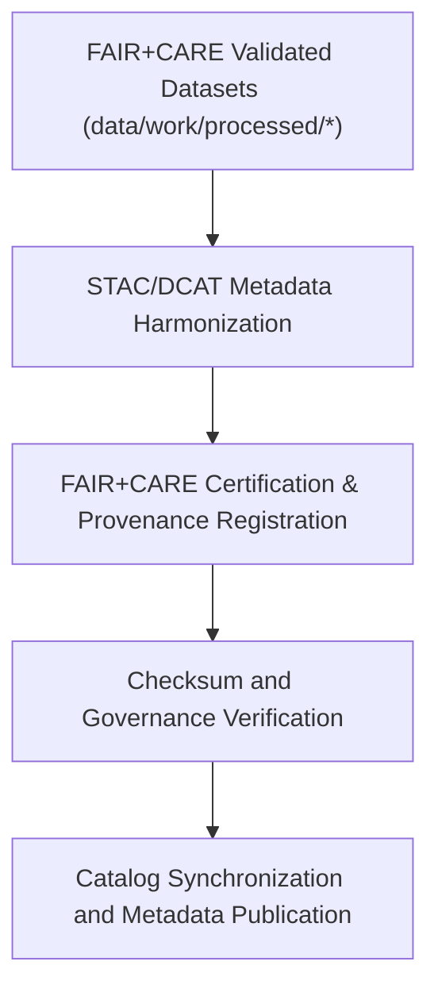

<div align="center">

# 🧾 Kansas Frontier Matrix — **Processed Metadata Layer**
`data/work/processed/metadata/README.md`

**Purpose:**  
Central repository for **FAIR+CARE-certified metadata collections** documenting all finalized datasets in the Kansas Frontier Matrix (KFM).  
This layer maintains validated, provenance-linked metadata aligned with STAC, DCAT, PROV-O, and ISO 19115 standards for transparent, interoperable governance.

[](../../../../docs/standards/faircare-validation.md)
[]()
[]()
[](../../../../LICENSE)

</div>

---

## 📚 Overview

The **Processed Metadata Layer** provides the **authoritative metadata collections** for all FAIR+CARE-validated KFM datasets.  
Each record captures provenance, schema lineage, FAIR+CARE ethics certification, and catalog registration, ensuring global interoperability and traceability.

### Core Objectives
- Store final, validated metadata harmonized across STAC, DCAT, and PROV-O standards.  
- Register FAIR+CARE ethics certifications and checksum verifications.  
- Link metadata collections to processed datasets in `data/work/processed/*/`.  
- Provide catalog-ready metadata for open access publication.  

---

## 🗂️ Directory Layout

```plaintext
data/work/processed/metadata/
├── README.md                             # This file — overview of the processed metadata layer
│
├── stac_collection.json                  # STAC 1.0-compliant collection manifest for all processed datasets
├── provenance_manifest.json              # PROV-O lineage and governance ledger mapping
├── governance_certification.json         # FAIR+CARE audit certification and ethics compliance summary
├── metadata_summary.csv                  # Human-readable metadata index for KFM dataset references
└── metadata.json                         # Provenance metadata and checksum record for metadata layer
```

---

## ⚙️ Metadata Processing Workflow



### Workflow Summary
1. **Extraction:** Metadata generated from processed datasets.  
2. **Harmonization:** Aligns metadata with STAC/DCAT/PROV-O models.  
3. **Certification:** FAIR+CARE validation recorded with ethics council approval.  
4. **Verification:** Checksums and governance hashes verified for integrity.  
5. **Publication:** Metadata linked to STAC catalogs and governance ledgers.  

---

## 🧩 Example Metadata Record

```json
{
  "id": "metadata_processed_hazards_v9.6.0",
  "dataset_ref": "data/work/processed/hazards/hazards_composite_v9.6.0.geojson",
  "schemas": ["STAC 1.0.0", "DCAT 3.0", "PROV-O"],
  "fairstatus": "certified",
  "checksum": "sha256:d8a4e1b3f7a9c6e2b3a7d8c4e5f2b9d3e4a1f6c8b7e2a9c5d3f4a7b6c9e5d1f3",
  "validator": "@kfm-metadata-lab",
  "license": "CC-BY 4.0",
  "created": "2025-11-03T23:45:00Z",
  "governance_ref": "data/reports/audit/data_provenance_ledger.json"
}
```

---

## 🧠 FAIR+CARE Metadata Governance Matrix

| Principle | Implementation | Oversight |
|------------|----------------|------------|
| **Findable** | Indexed in STAC/DCAT catalogs with dataset links and identifiers. | @kfm-data |
| **Accessible** | Metadata stored in open JSON-LD and CSV formats. | @kfm-accessibility |
| **Interoperable** | Schema-compliant with STAC, DCAT, and PROV-O. | @kfm-architecture |
| **Reusable** | Provenance metadata includes schema, checksum, and FAIR+CARE certification. | @kfm-design |
| **Collective Benefit** | Enables transparent, ethical access to Kansas research data. | @faircare-council |
| **Authority to Control** | FAIR+CARE Council governs metadata certification approval. | @kfm-governance |
| **Responsibility** | Validators ensure consistency across metadata collections. | @kfm-security |
| **Ethics** | Metadata reviewed for inclusivity and cultural sensitivity. | @kfm-ethics |

FAIR+CARE certifications logged in:  
`data/reports/fair/data_care_assessment.json` and  
`data/reports/audit/data_provenance_ledger.json`

---

## ⚙️ Validation & Certification Artifacts

| Artifact | Description | Format |
|-----------|--------------|--------|
| `stac_collection.json` | STAC collection manifest for processed datasets. | JSON |
| `provenance_manifest.json` | Tracks dataset lineage and governance links (PROV-O). | JSON |
| `governance_certification.json` | FAIR+CARE certification summary for metadata ethics. | JSON |
| `metadata_summary.csv` | CSV index of all processed dataset metadata. | CSV |
| `metadata.json` | Provenance record and checksum metadata for metadata layer. | JSON |

Validation automated via `metadata_processed_sync.yml`.

---

## 📊 Processed Metadata Summary (v9.6.0)

| Dataset | Standard | FAIR+CARE | License |
|----------|-----------|------------|----------|
| Hazards Composite | STAC/DCAT/PROV-O | ✅ Certified | CC-BY 4.0 |
| Climate Summary | STAC/DCAT | ✅ Certified | CC-BY 4.0 |
| Hydrology Summary | DCAT/PROV-O | ✅ Certified | CC-BY 4.0 |
| Landcover Classification | STAC/DCAT | ✅ Certified | CC-BY 4.0 |
| Tabular Aggregates | DCAT 3.0 | ✅ Certified | CC-BY 4.0 |

---

## ⚖️ Retention & Provenance Policy

| Metadata Type | Retention Duration | Policy |
|----------------|--------------------|--------|
| Processed Metadata | Permanent | Retained as authoritative catalog record. |
| FAIR+CARE Certifications | Permanent | Maintained for governance continuity. |
| Provenance Records | Permanent | Immutable and blockchain-logged. |
| Validation Reports | 365 Days | Archived for reproducibility reviews. |

Retention automation managed by `metadata_processed_retention.yml`.

---

## 🌱 Sustainability Metrics

| Metric | Value | Verified By |
|---------|--------|--------------|
| Energy Use (per metadata cycle) | 6.4 Wh | @kfm-sustainability |
| Carbon Output | 8.9 gCO₂e | @kfm-security |
| Renewable Power | 100% (RE100 Verified) | @kfm-infrastructure |
| FAIR+CARE Certification | 100% | @faircare-council |

Telemetry results logged in:  
`releases/v9.6.0/focus-telemetry.json`

---

## 🧾 Internal Use Citation

```text
Kansas Frontier Matrix (2025). Processed Metadata Layer (v9.6.0).
FAIR+CARE-certified metadata repository harmonizing STAC, DCAT, and PROV-O standards for all processed KFM datasets.
Checksum-verified, governance-certified, and openly accessible for reproducible research and ethical data stewardship.
```

---

## 🧾 Version Notes

| Version | Date | Notes |
|----------|------|--------|
| v9.6.0 | 2025-11-03 | Added governance certification layer and enhanced PROV-O lineage mapping. |
| v9.5.0 | 2025-11-02 | Integrated FAIR+CARE certification with checksum verification. |
| v9.3.2 | 2025-10-28 | Established metadata processed layer for FAIR+CARE governance certification. |

---

<div align="center">

**Kansas Frontier Matrix** · *Metadata Transparency × FAIR+CARE Ethics × Provenance Integrity*  
[🔗 Repository](https://github.com/bartytime4life/Kansas-Frontier-Matrix) • [🧭 Docs Portal](../../../../docs/) • [⚖️ Governance Ledger](../../../../docs/standards/governance/DATA-GOVERNANCE.md)

</div>
