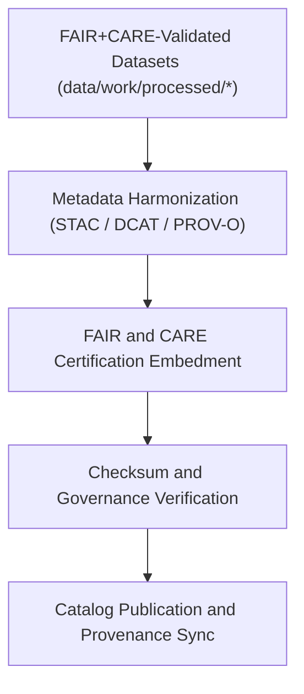

<div align="center">

# 🧾 Kansas Frontier Matrix — **Processed Metadata Layer**
`data/work/processed/metadata/README.md`

**Purpose:** Central repository for FAIR+CARE-certified metadata collections that document all finalized datasets within the Kansas Frontier Matrix (KFM).  
This layer maintains provenance, governance, and semantic linkage for all processed data, ensuring transparent catalog publication and ethical data lifecycle tracking.

[](../../../../docs/standards/faircare-validation.md)
[](../../../../LICENSE)
[](../../../../docs/architecture/repo-focus.md)

</div>

---

## 📚 Overview

The `data/work/processed/metadata/` directory serves as the **canonical metadata repository** for all validated and FAIR+CARE-audited KFM datasets.  
Each file captures provenance, schema lineage, and catalog registration data compliant with STAC 1.0, DCAT 3.0, and PROV-O metadata standards.

### Core Functions:
- Maintain a unified, certified metadata record for every KFM dataset.  
- Synchronize dataset descriptors with public STAC/DCAT catalogs.  
- Store final FAIR+CARE governance and ethics audit records.  
- Serve as the authoritative reference for reproducibility and attribution.  

All metadata files in this workspace are licensed under CC-BY 4.0 and updated automatically during each certification cycle.

---

## 🗂️ Directory Layout

```plaintext
data/work/processed/metadata/
├── README.md                              # This file — overview of processed metadata layer
│
├── stac_collection.json                   # STAC 1.0-compliant metadata collection describing processed datasets
├── provenance_manifest.json               # PROV-O lineage manifest linking raw → staging → processed transitions
├── governance_certification.json          # FAIR+CARE certification ledger and audit report
└── metadata_summary.csv                   # Human-readable metadata index across all processed datasets
```

---

## ⚙️ Metadata Processing Workflow



### Workflow Description:
1. **Harmonization:** Convert dataset-level metadata into STAC/DCAT-compliant structures.  
2. **Certification:** Embed FAIR+CARE audit results and ethics scores.  
3. **Checksum Verification:** Integrate hash and lineage tracking from provenance ledger.  
4. **Publication:** Synchronize with KFM’s data catalog and documentation repositories.

---

## 🧩 Example Metadata Record

```json
{
  "id": "metadata_processed_hazards_v9.3.2",
  "dataset_ref": "data/work/processed/hazards/hazards_composite_v9.3.2.geojson",
  "schemas": ["STAC 1.0.0", "DCAT 3.0", "PROV-O"],
  "validator": "@kfm-metadata-lab",
  "checksum": "sha256:5a98c32d8e83a871c46f84d1f97ed18b32bfae9c...",
  "fairstatus": "certified",
  "license": "CC-BY 4.0",
  "governance_ref": "data/reports/audit/data_provenance_ledger.json",
  "created": "2025-10-28T16:30:00Z"
}
```

---

## 🧠 FAIR+CARE Metadata Governance

| Principle | Implementation |
|------------|----------------|
| **Findable** | Metadata indexed in STAC/DCAT catalogs and searchable across domains. |
| **Accessible** | Open JSON and CSV formats accessible under CC-BY 4.0. |
| **Interoperable** | Conforms to STAC 1.0, DCAT 3.0, schema.org, and PROV-O standards. |
| **Reusable** | Provenance and versioning metadata ensure long-term reproducibility. |
| **Collective Benefit** | Promotes equitable access to validated Kansas datasets. |
| **Authority to Control** | FAIR+CARE Council validates metadata certification before catalog release. |
| **Responsibility** | Metadata maintainers track lifecycle changes and governance updates. |
| **Ethics** | Includes ethical governance reviews and accessibility assurances. |

All audit results and metadata certifications are logged in:  
`data/reports/audit/data_provenance_ledger.json` and  
`data/reports/fair/data_care_assessment.json`.

---

## ⚙️ Metadata Files Overview

| File | Description | Format |
|------|--------------|--------|
| `stac_collection.json` | Consolidated metadata collection of all processed datasets. | JSON |
| `provenance_manifest.json` | Tracks lineage and checksums across KFM data transformations. | JSON |
| `governance_certification.json` | FAIR+CARE audit report and governance certification ledger. | JSON |
| `metadata_summary.csv` | Human-readable index linking dataset names to metadata references. | CSV |

---

## ⚖️ Governance & Provenance Integration

| Record | Description |
|---------|-------------|
| `provenance_manifest.json` | Logs full lineage of datasets with cross-domain relationships. |
| `data/reports/audit/data_provenance_ledger.json` | Links processed metadata to governance and checksum audit. |
| `data/reports/fair/data_care_assessment.json` | Summarizes FAIR+CARE ethics compliance for processed metadata. |
| `releases/v9.3.2/manifest.zip` | Central registry of all metadata checksums and lineage hashes. |

Metadata updates and synchronization managed via `metadata_processed_sync.yml`.

---

## 🧾 Retention Policy

| Metadata Type | Retention Duration | Policy |
|----------------|--------------------|--------|
| Processed Metadata | Permanent | Retained as the canonical reference for all KFM datasets. |
| FAIR+CARE Certifications | Permanent | Archived for ethical governance and reproducibility. |
| Provenance Records | Permanent | Stored indefinitely for lineage verification. |
| Summary Index | Continuous | Regenerated with every certification cycle. |

Retention governed by `metadata_processed_retention.yml`.

---

## 🧾 Citation

```text
Kansas Frontier Matrix (2025). Processed Metadata Layer (v9.3.2).
Comprehensive FAIR+CARE-certified metadata repository documenting provenance, schema, and governance lineage for all processed datasets.
Licensed under CC-BY 4.0 via the Kansas Frontier Matrix open catalog.
```

---

## 🧾 Version Notes

| Version | Date | Notes |
|----------|------|--------|
| v9.3.2 | 2025-10-28 | Introduced unified PROV-O and FAIR+CARE certification integration for all processed datasets. |
| v9.2.0 | 2024-07-15 | Added cross-schema synchronization for STAC/DCAT compliance. |
| v9.0.0 | 2023-01-10 | Established canonical metadata layer under FAIR+CARE governance. |

---

<div align="center">

**Kansas Frontier Matrix** · *Provenance Transparency × FAIR+CARE Ethics × Catalog Integrity*  
[🔗 Repository](https://github.com/bartytime4life/Kansas-Frontier-Matrix) • [🧭 Docs Portal](../../../../docs/) • [⚖️ Governance Ledger](../../../../docs/standards/governance/)

</div>