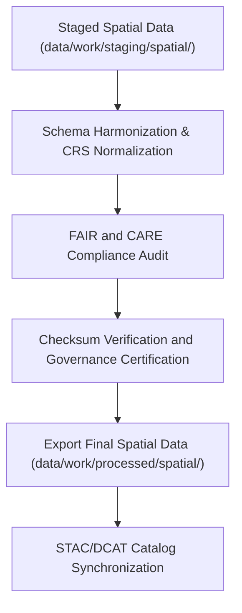

<div align="center">

# 🗺️ Kansas Frontier Matrix — **Processed Spatial Data**
`data/work/processed/spatial/README.md`

**Purpose:** Final FAIR+CARE-certified repository for spatial datasets produced by the Kansas Frontier Matrix (KFM).  
Contains harmonized, validated, and provenance-tracked spatial products ready for public access, scientific visualization, and catalog publication.

[](../../../../docs/standards/faircare-validation.md)
[](../../../../LICENSE)
[](../../../../docs/architecture/repo-focus.md)

</div>

---

## 📚 Overview

The `data/work/processed/spatial/` directory hosts **final spatial datasets** that have been validated, ethics-audited, and governance-certified under the FAIR+CARE framework.  
Each dataset is interoperable, catalog-linked, and schema-aligned with STAC 1.0, DCAT 3.0, and GeoJSON/GeoParquet standards for open geospatial data dissemination.

### Core Responsibilities:
- Store authoritative geospatial datasets including DEMs, boundaries, and thematic layers.  
- Guarantee spatial integrity, coordinate system normalization (EPSG:4326), and provenance.  
- Integrate with KFM’s STAC/DCAT catalog for public data discovery.  
- Ensure all spatial layers are ethically validated under FAIR+CARE governance.  

All data in this layer are open-access, CC-BY 4.0 licensed, and version-controlled.

---

## 🗂️ Directory Layout

```plaintext
data/work/processed/spatial/
├── README.md                              # This file — overview of processed spatial data
│
├── climate_boundaries.geojson             # Processed boundaries of climate analysis regions
├── landcover_classifications.parquet      # Harmonized landcover layer from multi-source raster datasets
├── elevation_tileset.tif                  # High-resolution DEM raster tiles for Kansas
└── metadata.json                          # Provenance, schema, and FAIR+CARE certification metadata
```

---

## ⚙️ Processing Workflow



### Workflow Description:
1. **Harmonization:** Integrate and standardize spatial datasets from staging, ensuring CRS normalization to EPSG:4326.  
2. **Validation:** Run FAIR+CARE spatial audits, geometry QA, and schema verification.  
3. **Certification:** Record provenance, lineage, and checksum for transparency.  
4. **Publication:** Export final datasets with standardized metadata and governance approval.  
5. **Catalog Integration:** Register spatial products in STAC/DCAT metadata catalogs for discoverability.

---

## 🧩 Example Metadata Record

```json
{
  "id": "processed_spatial_landcover_classifications_v9.3.2",
  "schema_version": "v3.0.1",
  "source_stage": "data/work/staging/spatial/",
  "records_total": 18523,
  "spatial_extent": [-102.05, 36.99, -94.61, 40.00],
  "temporal_extent": ["2018-01-01", "2025-12-31"],
  "crs": "EPSG:4326",
  "checksum": "sha256:6efc2a3c4f8bfcf985a65d49cf68f92e69c3c5a1...",
  "fairstatus": "certified",
  "validator": "@kfm-spatial-lab",
  "license": "CC-BY 4.0",
  "governance_ref": "data/reports/audit/data_provenance_ledger.json"
}
```

---

## 🧠 FAIR+CARE Compliance Overview

| Principle | Implementation |
|------------|----------------|
| **Findable** | Indexed through KFM STAC/DCAT catalogs and searchable via spatial IDs. |
| **Accessible** | Published in open GeoJSON, GeoTIFF, and Parquet formats. |
| **Interoperable** | CRS normalized (EPSG:4326) and aligned with STAC 1.0/GeoSPARQL. |
| **Reusable** | Metadata includes full provenance and ethical audit trails. |
| **Collective Benefit** | Facilitates open, reproducible geospatial research for Kansas. |
| **Authority to Control** | FAIR+CARE Council oversees release and ethics validation. |
| **Responsibility** | Validators maintain QA, schema, and governance trace logs. |
| **Ethics** | Data cleared of sensitive information or restricted-use geographies. |

All ethics and FAIR+CARE results recorded in:  
`data/reports/fair/data_care_assessment.json` and  
`data/reports/audit/data_provenance_ledger.json`.

---

## ⚙️ Validation & QA Reports

| Report | Description | Output |
|---------|-------------|---------|
| `geometry_validation_report.json` | Confirms geometry validity and topology integrity. | JSON |
| `stac_spatial_compliance.json` | STAC 1.0 metadata compliance summary. | JSON |
| `faircare_spatial_audit.json` | FAIR+CARE spatial ethics certification. | JSON |
| `checksum_registry.json` | Hash records for processed spatial artifacts. | JSON |

Automated validation managed via `processed_spatial_sync.yml`.

---

## ⚖️ Governance & Provenance Integration

| Record | Description |
|---------|-------------|
| `metadata.json` | Captures dataset provenance, schema version, CRS, and checksum. |
| `data/reports/audit/data_provenance_ledger.json` | Registers lineage and FAIR+CARE certification. |
| `data/reports/fair/data_care_assessment.json` | Ethics and governance compliance record. |
| `releases/v9.3.2/manifest.zip` | Stores global checksums for all processed spatial datasets. |

Governance synchronization automated through continuous integration pipelines.

---

## 🧾 Retention & Publication Policy

| Data Category | Retention | Policy |
|----------------|------------|--------|
| Processed Spatial Data | Permanent | Published as open-access under CC-BY 4.0. |
| Validation Reports | 365 days | Archived for QA reproducibility. |
| Governance Logs | Permanent | Stored indefinitely for provenance tracking. |
| Metadata | Permanent | Retained for catalog integrity and certification renewal. |

Retention and publication governed by `spatial_data_retention.yml`.

---

## 🧾 Citation

```text
Kansas Frontier Matrix (2025). Processed Spatial Data (v9.3.2).
FAIR+CARE-certified spatial datasets including landcover, elevation, and climate boundaries for Kansas.
Distributed under CC-BY 4.0 via the Kansas Frontier Matrix public data catalog.
```

---

## 🧾 Version Notes

| Version | Date | Notes |
|----------|------|--------|
| v9.3.2 | 2025-10-28 | Finalized FAIR+CARE spatial governance and catalog publication integration. |
| v9.2.0 | 2024-07-15 | Added STAC/DCAT synchronization and geometry validation checks. |
| v9.0.0 | 2023-01-10 | Established processed spatial layer for reproducible open geospatial datasets. |

---

<div align="center">

**Kansas Frontier Matrix** · *Geospatial Excellence × FAIR+CARE Governance × Provenance Assurance*  
[🔗 Repository](https://github.com/bartytime4life/Kansas-Frontier-Matrix) • [🧭 Docs Portal](../../../../docs/) • [⚖️ Governance Ledger](../../../../docs/standards/governance/)

</div>