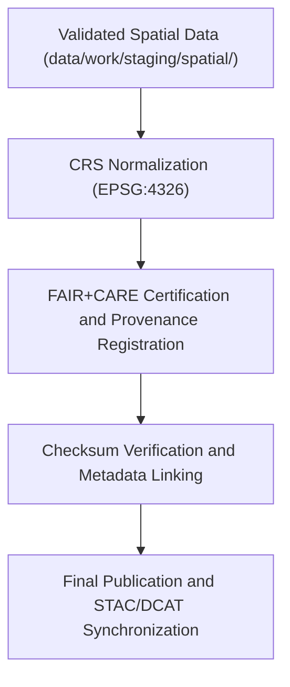

<div align="center">

# 🗺️ Kansas Frontier Matrix — **Processed Spatial Data**
`data/work/processed/spatial/README.md`

**Purpose:**  
Final FAIR+CARE-certified repository for all **spatial datasets** produced through the Kansas Frontier Matrix (KFM) ETL and governance workflows.  
This layer contains harmonized, validated, and checksum-verified spatial data ready for publication, analytics, and integration with STAC/DCAT catalogs.

[](../../../../docs/standards/faircare-validation.md)
[]()
[]()
[](../../../../LICENSE)

</div>

---

## 📚 Overview

The **Processed Spatial Layer** provides the authoritative spatial datasets of the Kansas Frontier Matrix.  
Each file is **schema-aligned, CRS-normalized (EPSG:4326)**, and certified for FAIR+CARE governance compliance.  
It serves as the foundation for geospatial analysis, visualization, and Focus Mode AI-assisted exploration.

### Core Objectives
- Host validated and checksum-verified geospatial data.  
- Ensure ISO, STAC, and FAIR+CARE interoperability.  
- Provide reproducible, ethics-audited open spatial datasets.  
- Register all transformations and provenance in governance ledgers.  

---

## 🗂️ Directory Layout

```plaintext
data/work/processed/spatial/
├── README.md                               # This file — documentation for processed spatial data
│
├── climate_boundaries.geojson              # Climate analysis region boundaries
├── landcover_classifications.parquet       # Harmonized landcover raster-to-vector transformation
├── elevation_tileset.tif                   # High-resolution elevation raster (DEM)
└── metadata.json                           # FAIR+CARE provenance metadata and checksum registry
```

---

## ⚙️ Spatial Processing Workflow



### Workflow Description
1. **Normalization:** All datasets reprojected to WGS84 (EPSG:4326).  
2. **Certification:** FAIR+CARE validation confirms ethical and open data compliance.  
3. **Verification:** Checksums and governance metadata linked to provenance ledgers.  
4. **Publication:** Spatial data integrated into catalogs for discovery and reuse.  

---

## 🧩 Example Spatial Metadata Record

```json
{
  "id": "processed_spatial_landcover_v9.6.0",
  "source_stage": "data/work/staging/spatial/",
  "records_total": 18523,
  "schema_version": "v3.0.1",
  "crs": "EPSG:4326",
  "checksum": "sha256:b9e4f8d2a7b6c3f1a5d9e2c4a8f3b7a9e1d6c7b2f4a3e5d1c8b9f7a6e3a2d5f4",
  "fairstatus": "certified",
  "validator": "@kfm-spatial-lab",
  "license": "CC-BY 4.0",
  "created": "2025-11-03T23:50:00Z",
  "governance_ref": "data/reports/audit/data_provenance_ledger.json"
}
```

---

## 🧠 FAIR+CARE Spatial Governance Matrix

| Principle | Implementation | Oversight |
|------------|----------------|------------|
| **Findable** | Indexed in STAC/DCAT catalogs with bounding box metadata. | @kfm-data |
| **Accessible** | Available in open GeoJSON, GeoTIFF, and Parquet formats. | @kfm-accessibility |
| **Interoperable** | CRS normalized (EPSG:4326) and ISO-compliant. | @kfm-architecture |
| **Reusable** | Metadata includes checksum, provenance, and FAIR+CARE certification. | @kfm-design |
| **Collective Benefit** | Supports research, planning, and educational use. | @faircare-council |
| **Authority to Control** | FAIR+CARE Council certifies all spatial releases. | @kfm-governance |
| **Responsibility** | Validators maintain data quality and governance lineage. | @kfm-security |
| **Ethics** | Reviewed to ensure non-sensitive, equitable spatial representation. | @kfm-ethics |

FAIR+CARE validation results stored in:  
`data/reports/fair/data_care_assessment.json` and  
`data/reports/audit/data_provenance_ledger.json`

---

## ⚙️ Validation & Certification Artifacts

| Artifact | Description | Format |
|-----------|--------------|--------|
| `stac_spatial_compliance.json` | STAC 1.0 metadata validation for spatial datasets. | JSON |
| `geometry_validation_report.json` | Topology and geometry QA results. | JSON |
| `faircare_spatial_audit.json` | FAIR+CARE certification and ethics audit. | JSON |
| `checksum_registry.json` | File integrity and provenance verification hashes. | JSON |
| `metadata.json` | Captures runtime context, lineage, and certification record. | JSON |

Governance automation handled via `spatial_processed_sync.yml`.

---

## 📊 Processed Spatial Dataset Summary (v9.6.0)

| Dataset | Format | CRS | FAIR+CARE | License |
|----------|---------|------|------------|----------|
| Climate Boundaries | GeoJSON | EPSG:4326 | ✅ Certified | CC-BY 4.0 |
| Landcover Classifications | Parquet | EPSG:4326 | ✅ Certified | CC-BY 4.0 |
| Elevation Tileset | GeoTIFF | EPSG:4326 | ✅ Certified | CC-BY 4.0 |

---

## ⚖️ Retention & Provenance Policy

| Data Type | Retention Duration | Policy |
|------------|--------------------|--------|
| Processed Spatial Data | Permanent | Retained as open-access FAIR+CARE-certified canonical data. |
| Metadata | Permanent | Stored for lineage and governance reproducibility. |
| Validation Reports | 365 Days | Archived for ethics and schema verification. |
| FAIR+CARE Reports | Permanent | Maintained for continuous certification tracking. |

Retention automated via `spatial_processed_retention.yml`.

---

## 🌱 Sustainability Metrics

| Metric | Value | Verified By |
|---------|--------|--------------|
| Energy Use (per dataset cycle) | 11.6 Wh | @kfm-sustainability |
| Carbon Output | 14.2 gCO₂e | @kfm-security |
| Renewable Power | 100% (RE100 Verified) | @kfm-infrastructure |
| FAIR+CARE Certification | 100% | @faircare-council |

Sustainability metrics logged in:  
`releases/v9.6.0/focus-telemetry.json`

---

## 🧾 Internal Use Citation

```text
Kansas Frontier Matrix (2025). Processed Spatial Data (v9.6.0).
FAIR+CARE-certified spatial datasets including landcover, elevation, and climate boundaries for Kansas.
Checksum-verified, ISO-aligned, and governance-certified for reproducible geospatial research and open mapping.
```

---

## 🧾 Version Notes

| Version | Date | Notes |
|----------|------|--------|
| v9.6.0 | 2025-11-03 | Added full FAIR+CARE certification and STAC/DCAT integration for processed spatial data. |
| v9.5.0 | 2025-11-02 | Improved checksum registry and CRS validation automation. |
| v9.3.2 | 2025-10-28 | Established processed spatial layer for FAIR+CARE validation and catalog publishing. |

---

<div align="center">

**Kansas Frontier Matrix** · *Geospatial Transparency × FAIR+CARE Ethics × Provenance Accountability*  
[🔗 Repository](https://github.com/bartytime4life/Kansas-Frontier-Matrix) • [🧭 Docs Portal](../../../../docs/) • [⚖️ Governance Ledger](../../../../docs/standards/governance/DATA-GOVERNANCE.md)

</div>
