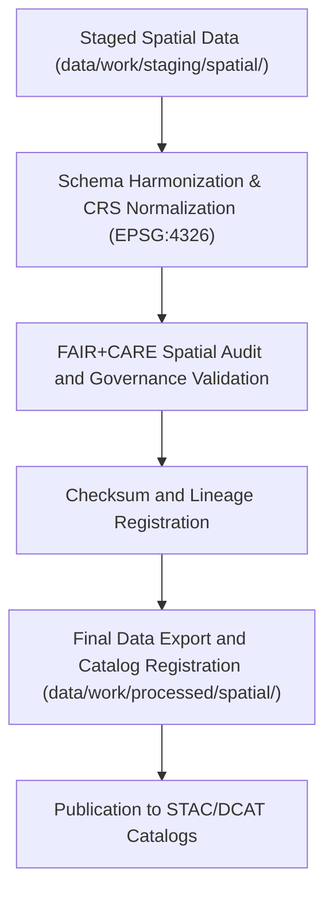

<div align="center">

# 🗺️ Kansas Frontier Matrix — **Processed Spatial Data**
`data/work/processed/spatial/README.md`

**Purpose:** FAIR+CARE-certified repository for final geospatial datasets created by the Kansas Frontier Matrix (KFM).  
Contains harmonized, validated, and provenance-verified spatial products suitable for public access, scientific visualization, and STAC/DCAT catalog publication.

[](../../../../docs/standards/faircare-validation.md)
[](../../../../LICENSE)
[](../../../../docs/architecture/repo-focus.md)

</div>

---

## 📚 Overview

The `data/work/processed/spatial/` directory houses **finalized spatial data assets** approved under FAIR+CARE governance.  
All datasets are CRS-normalized, audit-verified, and aligned with open geospatial standards (GeoJSON, GeoTIFF, Parquet, STAC 1.0, and DCAT 3.0).  
These files support mapping, modeling, visualization, and scientific integration across the Kansas Frontier Matrix platform.

### Core Responsibilities
- Maintain authoritative, ethics-certified geospatial datasets (boundaries, elevation, landcover, hydrology).  
- Guarantee accuracy, CRS normalization (EPSG:4326), and governance transparency.  
- Publish data in open interoperable formats for public and institutional reuse.  
- Ensure complete alignment with STAC/DCAT for cataloged open access.  

All artifacts are released under **CC-BY 4.0**, validated via checksum, and catalog-registered under the **KFM Provenance Ledger**.

---

## 🗂️ Directory Layout

```plaintext
data/work/processed/spatial/
├── README.md
│
├── climate_boundaries.geojson             # Processed boundaries of climate regions
├── landcover_classifications.parquet      # Harmonized landcover and vegetation index layers
├── elevation_tileset.tif                  # High-resolution DEM raster tileset (EPSG:4326)
└── metadata.json                          # Provenance, schema, and FAIR+CARE certification metadata
```

---

## ⚙️ Processing Workflow



### Workflow Description
1. **Harmonization:** Merge staging outputs and standardize CRS to WGS84 (EPSG:4326).  
2. **Validation:** Conduct spatial audits, topology validation, and FAIR+CARE ethics review.  
3. **Certification:** Log provenance, checksums, and audit results in governance records.  
4. **Publication:** Release data with machine-actionable metadata in open formats.  
5. **Catalog Registration:** Register datasets within KFM’s STAC/DCAT catalogs for discovery and access.

---

## 🧩 Example Metadata Record

```json
{
  "id": "processed_spatial_landcover_classifications_v9.4.0",
  "schema_version": "v3.1.0",
  "source_stage": "data/work/staging/spatial/",
  "records_total": 18523,
  "spatial_extent": [-102.05, 36.99, -94.61, 40.00],
  "temporal_extent": ["2018-01-01", "2025-12-31"],
  "crs": "EPSG:4326",
  "checksum": "sha256:6efc2a3c4f8bfcf985a65d49cf68f92e69c3c5a1...",
  "fairstatus": "certified",
  "validator": "@kfm-spatial-lab",
  "license": "CC-BY 4.0",
  "telemetry_link": "releases/v9.4.0/focus-telemetry.json",
  "governance_ref": "data/reports/audit/data_provenance_ledger.json"
}
```

---

## 🧠 FAIR+CARE Compliance Overview

| Principle | Implementation |
|------------|----------------|
| **Findable** | Indexed through STAC/DCAT with persistent spatial and temporal identifiers. |
| **Accessible** | Distributed as GeoJSON, GeoTIFF, and Parquet under open licenses. |
| **Interoperable** | CRS unified to EPSG:4326; aligned with STAC 1.0, DCAT 3.0, and GeoSPARQL. |
| **Reusable** | Each dataset includes provenance, schema, and FAIR+CARE certification metadata. |
| **Collective Benefit** | Enables open, transparent geospatial analysis of Kansas frontiers. |
| **Authority to Control** | Certified and approved by FAIR+CARE Governance Council. |
| **Responsibility** | Maintainers document QA, validation, and ethical certification. |
| **Ethics** | Excludes restricted geographies; complies with ethical representation of land and boundaries. |

Ethics and governance audits recorded in:  
`data/reports/fair/data_care_assessment.json` and  
`data/reports/audit/data_provenance_ledger.json`

---

## ⚙️ Validation & QA Reports

| Report | Description | Output |
|---------|-------------|---------|
| `geometry_validation_report.json` | Geometry and topology validation results. | JSON |
| `stac_spatial_compliance.json` | STAC 1.0 spatial metadata compliance summary. | JSON |
| `faircare_spatial_audit.json` | FAIR+CARE spatial ethics validation report. | JSON |
| `checksum_registry.json` | SHA-256 hash registry for data verification. | JSON |

Validation automation managed by `.github/workflows/processed_spatial_sync.yml`.

---

## ⚖️ Governance & Provenance Integration

| Record | Description |
|---------|-------------|
| `metadata.json` | Schema and provenance descriptor for each dataset. |
| `data/reports/audit/data_provenance_ledger.json` | Tracks spatial lineage and certification results. |
| `data/reports/fair/data_care_assessment.json` | FAIR+CARE ethics audit and compliance log. |
| `releases/v9.4.0/manifest.zip` | Global checksum archive for processed spatial datasets. |

Governance and catalog synchronization occur automatically post-certification cycle.

---

## 🧾 Retention & Publication Policy

| Data Type | Retention | Policy |
|------------|------------|--------|
| Processed Spatial Data | Permanent | Maintained as canonical open-access CC-BY 4.0 datasets. |
| Validation Reports | 365 days | Retained for reproducibility and governance audit. |
| Governance Metadata | Permanent | Stored for long-term provenance traceability. |
| Catalog Metadata | Continuous | Updated each quarterly release. |

Retention workflow handled via `spatial_data_retention.yml`.

---

## 🧾 Citation

```text
Kansas Frontier Matrix (2025). Processed Spatial Data (v9.4.0).
FAIR+CARE-certified spatial datasets for Kansas including landcover, elevation, and climate boundaries.
Released under CC-BY 4.0 and registered in the Kansas Frontier Matrix Provenance Ledger.
```

---

## 🧾 Version Notes

| Version | Date | Notes |
|----------|------|--------|
| v9.4.0 | 2025-11-02 | Added telemetry linkage, upgraded schema compliance, and updated STAC/DCAT integration. |
| v9.3.2 | 2025-10-28 | Finalized FAIR+CARE spatial governance and catalog publication integration. |
| v9.2.0 | 2024-07-15 | Introduced geometry validation and CRS normalization. |
| v9.0.0 | 2023-01-10 | Established processed spatial layer under FAIR+CARE governance. |

---

<div align="center">

**Kansas Frontier Matrix** · *Geospatial Intelligence × FAIR+CARE Ethics × Provenance Transparency × Telemetry Traceability*  
[🔗 Repository](https://github.com/bartytime4life/Kansas-Frontier-Matrix) • [🧭 Docs Portal](../../../../docs/) • [⚖️ Governance Ledger](../../../../docs/standards/governance/)

</div>
