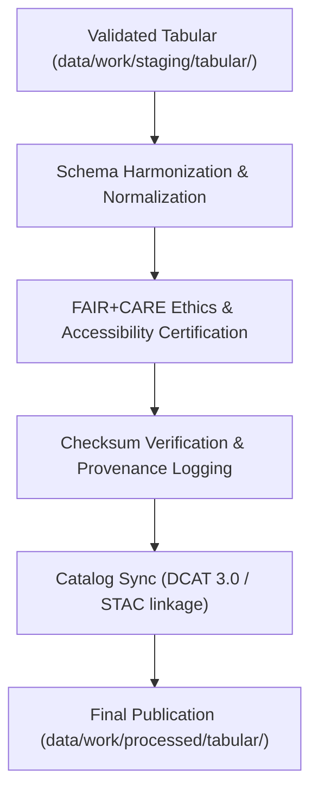

<div align="center">

# 📊 Kansas Frontier Matrix — **Processed Tabular Data**
`data/work/processed/tabular/README.md`

**Purpose:**  
Canonical repository of **FAIR+CARE-certified** tabular datasets produced by KFM pipelines.  
Datasets are final, schema-aligned, checksum-verified, and governance-certified for open research, AI analytics, and **Focus Mode** visualization.

[](../../../../docs/architecture/README.md)
[](../../../../docs/standards/faircare-validation.md)
[]()
[]()
[](../../../../LICENSE)

</div>

---

## 📘 Overview

The **Processed Tabular Layer** hosts final structured tables verified under **FAIR+CARE** governance.  
All datasets are **ethically certified**, **checksum-verified**, and **schema-compliant**—suitable for reuse, analysis, and publication under open-access standards.

### Core Objectives
- Publish validated tabular datasets with **DCAT** interoperability.  
- Maintain schema-aligned and checksum-audited tables.  
- Register lineage and governance approvals for reproducibility.  
- Enable integration with AI models and public dashboards.  

---

## 🗂️ Directory Layout

```plaintext
data/work/processed/tabular/
├── README.md
├── environmental_indicators_v9.7.0.csv     # Aggregated climate/hydrology/hazard indicators
├── treaties_aggregated_v9.7.0.csv          # Normalized treaty metadata crosswalks
├── socioeconomic_summary_v9.7.0.parquet    # Aggregated socioeconomic & demographic metrics
└── metadata.json                            # FAIR+CARE provenance, schema, checksum registry
```

---

## ⚙️ Tabular Processing Workflow



### Steps
1. **Normalization** — Align fields with **DCAT 3.0** & JSON Schema.  
2. **Certification** — FAIR+CARE validates ethical compliance & reuse readiness.  
3. **Verification** — Integrity cross-checked via manifest-linked checksums.  
4. **Publication** — Certified tables exported to processed layer.  
5. **Synchronization** — Registered in **DCAT/STAC** catalogs & governance ledgers.

---

## 🧩 Example Processed Tabular Metadata Record

```json
{
  "id": "processed_tabular_environmental_indicators_v9.7.0",
  "source_stage": "data/work/staging/tabular/",
  "records_total": 56310,
  "schema_version": "v3.1.1",
  "checksum_sha256": "sha256:a1b3e7d9c5f2a8b7d6e9a4f3b8c2a1e7b9d4f6e3c8a2b1f7e9a4c3b2f5d7a8e1",
  "fairstatus": "certified",
  "validator": "@kfm-tabular-lab",
  "license": "CC-BY 4.0",
  "created": "2025-11-06T23:55:00Z",
  "governance_ref": "data/reports/audit/data_provenance_ledger.json"
}
```

---

## 🧠 FAIR+CARE Governance Matrix

| Principle | Implementation | Oversight |
|-----------|----------------|-----------|
| **Findable** | DCAT catalog entries + governance linkages. | `@kfm-data` |
| **Accessible** | Open CSV/Parquet; public retrieval instructions. | `@kfm-accessibility` |
| **Interoperable** | JSON Schema + **DCAT 3.0** fields captured. | `@kfm-architecture` |
| **Reusable** | Provenance, license, schema, and checksums included. | `@kfm-design` |
| **Collective Benefit** | Enables open access to structured Kansas datasets. | `@faircare-council` |
| **Authority to Control** | Council certifies schema promotion & release. | `@kfm-governance` |
| **Responsibility** | Stewards record schema changes & audit results. | `@kfm-security` |
| **Ethics** | Reviewed for equity, privacy, and cultural sensitivity. | `@kfm-ethics` |

**Governance artifacts:**  
`data/reports/fair/data_care_assessment.json` · `data/reports/audit/data_provenance_ledger.json`

---

## ⚙️ Validation & Certification Artifacts

| Artifact                         | Description                                | Format |
|----------------------------------|--------------------------------------------|--------|
| `schema_validation_summary.json` | Field/structure integrity audit            | JSON   |
| `faircare_certification_report.json` | FAIR+CARE audit & certification        | JSON   |
| `checksums.json`                 | SHA-256 integrity registry                  | JSON   |
| `catalog_sync.log`               | Governance publication synchronization log | Text   |

Automation: `tabular_processed_sync.yml`.

---

## 📊 Processed Tabular Summary (v9.7.0)

| Dataset                   | Records | Schema  | FAIR+CARE | License  |
|--------------------------|--------:|---------|-----------|----------|
| Environmental Indicators | 56,310  | v3.1.1  | ✅        | CC-BY 4.0 |
| Treaties Aggregated      | 12,410  | v3.1.1  | ✅        | CC-BY 4.0 |
| Socioeconomic Summary    | 10,045  | v3.1.1  | ✅        | CC-BY 4.0 |

---

## ♻️ Retention & Sustainability

| Data Type | Retention | Policy |
|-----------|----------:|--------|
| Processed Tabular Data | Permanent | Canonical open datasets (FAIR+CARE). |
| Metadata               | Permanent | Ledger-tracked lineage & checksums.  |
| Validation Reports     | 365 Days  | Reproducibility audits.              |
| FAIR+CARE Reports      | Permanent | Ethics & certification records.      |

**Telemetry:** `../../../../releases/v9.7.0/focus-telemetry.json`

---

## 🧾 Internal Use Citation

```text
Kansas Frontier Matrix (2025). Processed Tabular Data (v9.7.0).
FAIR+CARE-certified environmental indicators, treaty aggregates, and socioeconomic summaries.
Checksum-verified, schema-aligned, and governance-certified for open data reuse and reproducibility.
```

---

## 🕰️ Version History

| Version | Date       | Author          | Summary |
|--------:|------------|-----------------|---------|
| v9.7.0  | 2025-11-06 | `@kfm-tabular`  | Upgraded to v9.7.0; telemetry/schema refs aligned; filenames & counts refreshed. |
| v9.6.0  | 2025-11-03 | `@kfm-tabular`  | Added FAIR+CARE integration & renewable tracking. |

---

<div align="center">

**Kansas Frontier Matrix**  
*Structured Data × FAIR+CARE Governance × Provenance Certification*  
© 2025 Kansas Frontier Matrix — CC-BY 4.0 · Diamond⁹ Ω / Crown∞Ω Ultimate Certified  

[Back to Work → Processed](../README.md) · [Governance Charter](../../../../docs/standards/governance/DATA-GOVERNANCE.md)

</div>