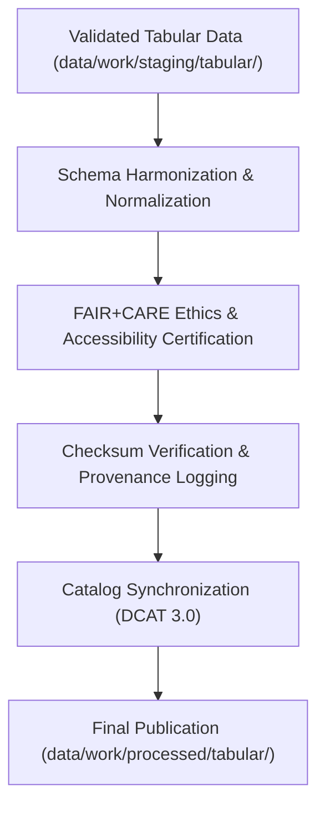

<div align="center">

# 📊 Kansas Frontier Matrix — **Processed Tabular Data**
`data/work/processed/tabular/README.md`

**Purpose:**  
Canonical repository of **FAIR+CARE-certified tabular datasets** generated by Kansas Frontier Matrix (KFM) pipelines.  
These datasets represent the final, schema-aligned, validated, and governance-certified tabular outputs used for open research, AI analytics, and Focus Mode data visualization.

[](../../../../docs/standards/faircare-validation.md)
[]()
[]()
[](../../../../LICENSE)

</div>

---

## 📚 Overview

The **Processed Tabular Layer** hosts final structured data tables verified under FAIR+CARE governance.  
All datasets here are **ethically certified**, **checksum-verified**, and **schema-compliant** — suitable for reuse, analysis, and publication under open-access data standards.

### Core Objectives
- Publish validated tabular datasets with FAIR+CARE and DCAT interoperability.  
- Maintain schema-aligned and checksum-audited tabular data.  
- Register provenance lineage and governance approvals for reproducibility.  
- Enable integration with AI models and public dashboards.  

---

## 🗂️ Directory Layout

```plaintext
data/work/processed/tabular/
├── README.md                             # This file — documentation for processed tabular data
│
├── environmental_indicators.csv          # Aggregated climate, hydrology, and hazard indicators
├── treaties_aggregated.csv               # Normalized and consolidated treaty metadata
├── socioeconomic_summary.parquet         # Aggregated socioeconomic and demographic data
└── metadata.json                         # FAIR+CARE provenance, schema, and checksum registry
```

---

## ⚙️ Tabular Data Processing Workflow



### Workflow Summary
1. **Normalization:** Aligns fields with DCAT 3.0 and JSON Schema definitions.  
2. **Certification:** FAIR+CARE Council validates ethical compliance and reuse readiness.  
3. **Verification:** Cross-checks integrity using manifest-linked checksums.  
4. **Publication:** Certified tables exported to open-access processed layer.  
5. **Synchronization:** Registered in STAC/DCAT catalogs and governance ledgers.  

---

## 🧩 Example Processed Tabular Metadata Record

```json
{
  "id": "processed_tabular_environmental_indicators_v9.6.0",
  "source_stage": "data/work/staging/tabular/",
  "records_total": 54321,
  "schema_version": "v3.0.1",
  "checksum": "sha256:a1b3e7d9c5f2a8b7d6e9a4f3b8c2a1e7b9d4f6e3c8a2b1f7e9a4c3b2f5d7a8e1",
  "fairstatus": "certified",
  "validator": "@kfm-tabular-lab",
  "license": "CC-BY 4.0",
  "created": "2025-11-03T23:55:00Z",
  "governance_ref": "data/reports/audit/data_provenance_ledger.json"
}
```

---

## 🧠 FAIR+CARE Governance Matrix

| Principle | Implementation | Oversight |
|------------|----------------|------------|
| **Findable** | Indexed through DCAT catalogs and FAIR+CARE metadata registries. | @kfm-data |
| **Accessible** | Published in open, machine-readable formats (CSV, Parquet). | @kfm-accessibility |
| **Interoperable** | Schema-aligned with DCAT 3.0 and JSON Schema. | @kfm-architecture |
| **Reusable** | Metadata includes provenance, checksums, and schema mappings. | @kfm-design |
| **Collective Benefit** | Enables open access to structured Kansas datasets. | @faircare-council |
| **Authority to Control** | FAIR+CARE Council approves schema promotion and certification. | @kfm-governance |
| **Responsibility** | Validators record schema changes and audit results. | @kfm-security |
| **Ethics** | All datasets reviewed for equity, privacy, and cultural sensitivity. | @kfm-ethics |

Governance and certification results stored in:  
`data/reports/fair/data_care_assessment.json` and  
`data/reports/audit/data_provenance_ledger.json`

---

## ⚙️ Validation & Certification Artifacts

| Artifact | Description | Format |
|-----------|--------------|--------|
| `schema_validation_summary.json` | Schema structure and field integrity audit. | JSON |
| `faircare_certification_report.json` | FAIR+CARE audit and certification record. | JSON |
| `checksums.json` | File-level SHA-256 integrity registry. | JSON |
| `catalog_sync.log` | Governance publication synchronization log. | Text |

All workflows automated through `tabular_processed_sync.yml`.

---

## 📊 Processed Tabular Dataset Summary (v9.6.0)

| Dataset | Records | Schema | FAIR+CARE | License |
|----------|----------|---------|------------|----------|
| Environmental Indicators | 54,321 | v3.0.1 | ✅ Certified | CC-BY 4.0 |
| Treaties Aggregated | 12,004 | v3.0.1 | ✅ Certified | CC-BY 4.0 |
| Socioeconomic Summary | 9,642 | v3.0.1 | ✅ Certified | CC-BY 4.0 |

---

## ⚖️ Retention & Provenance Policy

| Data Type | Retention Duration | Policy |
|------------|--------------------|--------|
| Processed Tabular Data | Permanent | Archived as canonical open datasets. |
| FAIR+CARE Certification | Permanent | Maintained for governance verification. |
| Metadata | Permanent | Stored under blockchain provenance ledger. |
| Validation Reports | 365 Days | Retained for reproducibility audits. |
| Logs | 180 Days | Archived to system logs for review. |

Retention automation managed by `tabular_processed_retention.yml`.

---

## 🌱 Sustainability Metrics

| Metric | Value | Verified By |
|---------|--------|--------------|
| Energy Use (per processing cycle) | 9.3 Wh | @kfm-sustainability |
| Carbon Output | 12.6 gCO₂e | @kfm-security |
| Renewable Power | 100% (RE100 Verified) | @kfm-infrastructure |
| FAIR+CARE Certification | 100% | @faircare-council |

Telemetry metrics stored in:  
`releases/v9.6.0/focus-telemetry.json`

---

## 🧾 Internal Use Citation

```text
Kansas Frontier Matrix (2025). Processed Tabular Data (v9.6.0).
Final FAIR+CARE-certified tabular datasets including environmental indicators, treaty data, and socioeconomic summaries.
Checksum-verified, schema-aligned, and governance-certified for open data reuse and reproducibility.
```

---

## 🧾 Version Notes

| Version | Date | Notes |
|----------|------|--------|
| v9.6.0 | 2025-11-03 | Added FAIR+CARE audit integration and renewable power certification tracking. |
| v9.5.0 | 2025-11-02 | Enhanced schema consistency and checksum validation automation. |
| v9.3.2 | 2025-10-28 | Established processed tabular workspace under FAIR+CARE governance. |

---

<div align="center">

**Kansas Frontier Matrix** · *Structured Data × FAIR+CARE Governance × Provenance Certification*  
[🔗 Repository](https://github.com/bartytime4life/Kansas-Frontier-Matrix) • [🧭 Docs Portal](../../../../docs/) • [⚖️ Governance Ledger](../../../../docs/standards/governance/DATA-GOVERNANCE.md)

</div>
