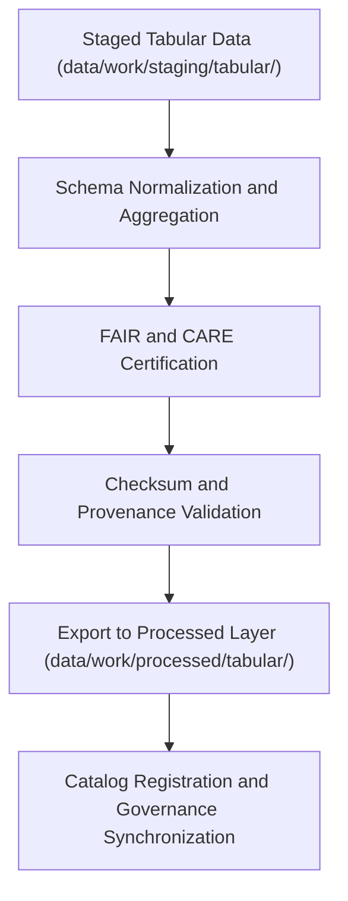

<div align="center">

# 📊 Kansas Frontier Matrix — **Processed Tabular Data**
`data/work/processed/tabular/README.md`

**Purpose:** Canonical repository of FAIR+CARE-certified tabular datasets generated by the Kansas Frontier Matrix (KFM).  
This layer hosts final, schema-aligned, and governance-certified tabular data products ready for publication, distribution, and analytical use.

[](../../../../docs/standards/faircare-validation.md)
[](../../../../LICENSE)
[](../../../../docs/architecture/repo-focus.md)

</div>

---

## 📚 Overview

The `data/work/processed/tabular/` directory contains **finalized tabular datasets** that have completed ETL transformation, schema validation, FAIR+CARE audits, and provenance certification.  
These datasets form the structured foundation for analytics, reporting, and catalog indexing within KFM’s open-data ecosystem.

### Core Responsibilities:
- Maintain validated tabular datasets under open FAIR+CARE governance.  
- Guarantee schema integrity and version traceability for every dataset.  
- Provide model-ready, human-readable, and machine-interoperable data.  
- Preserve data lineage across staging, validation, and processed workflows.  

All tabular data here are open-access under CC-BY 4.0 and registered in KFM’s governance ledger.

---

## 🗂️ Directory Layout

```plaintext
data/work/processed/tabular/
├── README.md                             # This file — overview of processed tabular datasets
│
├── environmental_indicators.csv          # Aggregated environmental and climate indicators for Kansas
├── treaties_aggregated.csv               # Cleaned and normalized treaty and archival tabular data
├── socioeconomic_summary.parquet         # Socioeconomic summary tables for regional analytics
└── metadata.json                         # Provenance, schema, and FAIR+CARE certification metadata
```

---

## ⚙️ Processing Workflow



### Workflow Steps:
1. **Normalization:** Apply consistent schema definitions and field naming standards.  
2. **Aggregation:** Merge validated staging tables and compute summary indicators.  
3. **Audit:** Run FAIR+CARE validation and ethics checks.  
4. **Certification:** Register lineage and checksums in governance ledger.  
5. **Publication:** Export datasets as CSV or Parquet for analytics and catalog use.

---

## 🧩 Example Metadata Record

```json
{
  "id": "processed_tabular_environmental_indicators_v9.3.2",
  "schema_version": "v3.0.1",
  "source_stage": "data/work/staging/tabular/",
  "records_total": 54321,
  "fields": 22,
  "checksum": "sha256:ce5f19cbf89b23a6a746aef4f09e17b3a13d57e1...",
  "fairstatus": "certified",
  "validator": "@kfm-tabular-lab",
  "license": "CC-BY 4.0",
  "governance_ref": "data/reports/audit/data_provenance_ledger.json"
}
```

---

## 🧠 FAIR+CARE Governance Summary

| Principle | Implementation |
|------------|----------------|
| **Findable** | Indexed in catalog with dataset ID, metadata, and schema version. |
| **Accessible** | Open-access CSV and Parquet formats under CC-BY 4.0. |
| **Interoperable** | Schema and metadata aligned with JSON Schema and DCAT. |
| **Reusable** | Provenance metadata and checksums ensure reproducibility. |
| **Collective Benefit** | Promotes equitable data access and open research collaboration. |
| **Authority to Control** | FAIR+CARE Council validates final dataset certifications. |
| **Responsibility** | Validators document audit logs and FAIR+CARE outcomes. |
| **Ethics** | Datasets reviewed to ensure neutrality and data privacy compliance. |

Certification records are archived within:  
`data/reports/fair/data_care_assessment.json`  
and `data/reports/audit/data_provenance_ledger.json`.

---

## ⚙️ Validation & QA Reports

| Report | Description | Output |
|---------|-------------|---------|
| `schema_validation_summary.json` | Final schema conformance and type validation report. | JSON |
| `faircare_certification_report.json` | FAIR+CARE ethics audit summary. | JSON |
| `checksums.json` | File integrity and provenance hash registry. | JSON |
| `catalog_sync.log` | Catalog integration and STAC/DCAT synchronization log. | Text |

All validation and publishing tasks managed by `processed_tabular_sync.yml`.

---

## ⚖️ Governance & Provenance Integration

| Record | Description |
|---------|-------------|
| `metadata.json` | Captures schema version, checksum, and FAIR+CARE certification details. |
| `data/reports/audit/data_provenance_ledger.json` | Logs lineage, ethics certification, and dataset traceability. |
| `data/reports/fair/data_care_assessment.json` | FAIR+CARE compliance and ethics tracking record. |
| `releases/v9.3.2/manifest.zip` | Global checksum registry for processed tabular datasets. |

Governance synchronization executed post-certification cycle.

---

## 🧾 Retention & Publication Policy

| Data Category | Retention | Policy |
|----------------|------------|--------|
| Processed Tabular Data | Permanent | Retained under CC-BY 4.0 as canonical open data. |
| Validation Reports | 365 days | Archived for re-audit and reproducibility. |
| Governance Metadata | Permanent | Retained for lineage, citation, and ethical traceability. |
| Catalog Logs | 90 days | Archived after successful publication. |

Retention and archival operations managed via `tabular_data_retention.yml`.

---

## 🧾 Citation

```text
Kansas Frontier Matrix (2025). Processed Tabular Data (v9.3.2).
FAIR+CARE-certified tabular datasets including environmental, treaty, and socioeconomic indicators for Kansas.
Available under CC-BY 4.0 via the Kansas Frontier Matrix open data catalog.
```

---

## 🧾 Version Notes

| Version | Date | Notes |
|----------|------|--------|
| v9.3.2 | 2025-10-28 | Completed FAIR+CARE certification, checksum validation, and STAC/DCAT catalog alignment. |
| v9.2.0 | 2024-07-15 | Added environmental indicators and socioeconomic data aggregations. |
| v9.0.0 | 2023-01-10 | Established tabular processed layer for open data publication under FAIR+CARE governance. |

---

<div align="center">

**Kansas Frontier Matrix** · *Structured Data × FAIR+CARE Governance × Provenance Certification*  
[🔗 Repository](https://github.com/bartytime4life/Kansas-Frontier-Matrix) • [🧭 Docs Portal](../../../../docs/) • [⚖️ Governance Ledger](../../../../docs/standards/governance/)

</div>