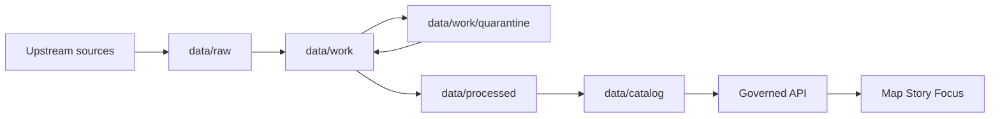

<!-- [KFM_META_BLOCK_V2]
doc_id: kfm://doc/52092b91-f257-4a6f-a572-f7a39db21b6e
title: data/work/quarantine — Quarantine Zone README
type: standard
version: v1
status: draft
owners: TBD (data stewards)
created: 2026-02-24
updated: 2026-02-24
policy_label: internal
related:
  - ../../raw/README.md
  - ../README.md
  - ../../processed/README.md
  - ../../catalog/README.md
tags: [kfm, data, work, quarantine, governance]
notes:
  - Directory contract for artifacts blocked from promotion (fail-closed).
[/KFM_META_BLOCK_V2] -->

# data/work/quarantine/


 <!-- TODO: replace with real workflow badge -->

**Purpose:** A governed holding area for dataset artifacts that **cannot be promoted** due to validation failures, unclear licensing/rights, sensitivity concerns, or upstream instability.

> ⚠️ **WARNING**
> **Nothing in `data/work/quarantine/` is publishable**. Do not wire this path into indexes, APIs, tiles, Story Nodes, or Focus Mode retrieval.

---

## Quick navigation

- [Purpose](#purpose)
- [Truth path position](#truth-path-position)
- [What belongs here](#what-belongs-here)
- [What must NOT be here](#what-must-not-be-here)
- [Recommended directory layout](#recommended-directory-layout)
- [Required artifacts for each quarantine entry](#required-artifacts-for-each-quarantine-entry)
- [Quarantine workflow](#quarantine-workflow)
- [Exit criteria](#exit-criteria)
- [Related references](#related-references)

---

## Non‑negotiable rules

- **Quarantine is not promotable.** Treat every entry as **publish denied** by default.
- **No “temporary promote.”** If a dataset is quarantined, it stays quarantined until remediated and re-run.
- **No manual edits to data artifacts.** Changes under `data/` should be produced by deterministic runs and accompanied by a run receipt (and promotion manifest when applicable).
- **No downstream consumption.** Indexers, APIs, and UIs must only read promoted artifacts, never quarantine paths.

[Back to top](#dataworkquarantine)

---

## Policy label note

Quarantine entries should carry `policy_label: quarantine` (or another restrictive label) to ensure they are **not exposed** through governed surfaces.

Starter policy labels (controlled vocabulary):

- `public`
- `public_generalized`
- `restricted`
- `restricted_sensitive_location`
- `internal`
- `embargoed`
- `quarantine`

> NOTE  
> Treat this list as the **minimum starter set**. Update it only through the controlled vocabulary process.

[Back to top](#dataworkquarantine)

---

## Purpose

`data/work/quarantine/` is the **fail-closed** workspace for artifacts that are *blocked from promotion*.

Typical reasons include:

- **License/rights are unclear** (online ≠ reusable)
- **Validation fails** (schema, spatial, temporal, completeness, link checks)
- **Sensitivity is unclear or requires mitigation** (e.g., sensitive locations, restricted categories)
- **Upstream instability prevents reproducible acquisition** (cannot reliably re-fetch the same inputs)

This directory exists to make “blocked” status **explicit and auditable**, instead of leaking into the rest of the pipeline as ad-hoc exceptions.

[Back to top](#dataworkquarantine)

---

## Truth path position

In KFM, data moves through a lifecycle (“truth path”) where only promoted versions can reach runtime surfaces.



**Interpretation:**

- `data/raw/` is immutable acquisition.
- `data/work/` is where normalization + QA happens.
- `data/work/quarantine/` is where failures and unresolved governance issues are **isolated**.
- Promotion moves vetted outputs to `data/processed/` + `data/catalog/` (and only then into indexes/API/UI).

[Back to top](#dataworkquarantine)

---

## What belongs here

Acceptable contents include:

- Normalized **intermediate** artifacts (e.g., parsed/cleaned files) that are *not* publishable yet
- **Machine-readable QA reports** (prefer JSON) and human summaries
- **Candidate redactions/generalizations** and mitigation notes
- **Evidence about why promotion is blocked** (reason code + remediation plan)
- **Run receipts** and checksums for the run that produced (or attempted to produce) the artifacts

[Back to top](#dataworkquarantine)

---

## What must NOT be here

Hard exclusions:

- ✅ **No promoted outputs** (those belong in `data/processed/` and `data/catalog/`)
- ✅ **No raw acquisitions** (those belong in `data/raw/`)
- ✅ **No secrets or credentials** (tokens, API keys, passwords)
- ✅ **No ad-hoc “temporary” publishing** from quarantine (ever)
- ✅ **No direct UI/API consumption** (no tiles, no indexes, no Story Node references)

If you believe something in quarantine should be exposed, the correct fix is to **remediate + rerun + promote** through the promotion gates.

[Back to top](#dataworkquarantine)

---

## Recommended directory layout

> NOTE  
> This is a **recommended** structure to keep quarantine entries consistent and reviewable.  
> If the repo already has a different convention, follow the repo convention and update this README.

```text
data/work/quarantine/
  README.md

  <dataset_slug>/
    <candidate_id>/                    # dataset_version_id or spec_hash prefix (preferred)
      quarantine.json                  # reason code + policy default + ownership
      remediation.md                   # plan (who/what/when) to resolve quarantine
      run_receipt.json                 # the run that produced this entry
      checksums.txt                    # digests for artifacts in this folder
      qa/
        validation.json                # machine-readable validation outputs
        validation_summary.md          # human summary (optional)
      artifacts/
        ... intermediate outputs ...
      notes/
        ... supporting context ...
```

Naming guidance (recommended):

- `dataset_slug`: stable dataset identifier used across the system.
- `candidate_id`: prefer the **dataset version id**; otherwise use a stable spec hash prefix.

[Back to top](#dataworkquarantine)

---

## Required artifacts for each quarantine entry

Every quarantine entry **must** include, at minimum:

1. **Reason code** (why it is quarantined)
2. **Remediation plan** (who resolves it, by when, and how)
3. **Policy default**: deny publish
4. **Validation outputs** (if validation triggered quarantine)
5. **Run receipt** (inputs/outputs + environment) for auditability

### quarantine.json (template)

```json
{
  "kfm_quarantine_manifest_version": "v1",
  "dataset_slug": "example_dataset",
  "candidate_id": "2026-02.abcd1234",
  "reason_code": "license_unclear | validation_failed | sensitivity_unclear | upstream_instability",
  "detected_at": "2026-02-24T00:00:00Z",
  "policy_default": "deny_publish",
  "owners": [
    { "role": "steward", "principal": "TBD" }
  ],
  "remediation_target_date": "2026-03-15",
  "notes": "Short explanation + links to QA outputs and upstream terms snapshot."
}
```

### remediation.md (template)

```md
# Remediation plan

## Summary
- What is blocked?
- Why is it blocked?
- What is the smallest safe fix?

## Owner
- Steward: TBD
- Engineer (if needed): TBD

## Deadline
- Target date: YYYY-MM-DD

## Steps
- [ ] Collect/confirm license + rights holder (or choose metadata-only mode)
- [ ] Fix validation failures (schema/spatial/temporal/completeness)
- [ ] Decide sensitivity classification + obligations (generalize/suppress/etc.)
- [ ] Re-run pipeline deterministically
- [ ] Verify catalogs + cross-links if promotion is intended
- [ ] Promote via PR with run receipt + promotion manifest

## Evidence / links
- QA report:
- Terms snapshot:
- Upstream reference:
```

[Back to top](#dataworkquarantine)

---

## Quarantine workflow

### When to quarantine (triggers)

Use quarantine when any of the following is true:

| Trigger | Examples | Typical next step |
|---|---|---|
| `license_unclear` | No explicit license; conflicting rights statements; unclear attribution | Capture terms snapshot; contact rights holder; switch to metadata-only if needed |
| `validation_failed` | Schema mismatch; invalid geometries; impossible dates; link checks fail | Fix pipeline/schema; re-run; store validation JSON |
| `sensitivity_unclear` | Potential sensitive locations; restricted categories; unclear consent | Perform sensitivity review; define obligations; generalize/suppress |
| `upstream_instability` | Source changes break re-fetch; no stable versioning/ETag | Snapshot raw inputs; pin queries; add drift monitoring |

### What “fail-closed” means here

- Quarantine entries are treated as **denied for publication** by default.
- Do not create exceptions that bypass quarantine (no “temporary promote”).
- Resolution happens by remediation + deterministic rerun, not by hand-editing outputs.

[Back to top](#dataworkquarantine)

---

## Exit criteria

A quarantine entry can exit quarantine only when **the original blocking condition is resolved** and the dataset version can pass the promotion gates.

Minimum checks before promotion:

- [ ] Identity/versioning is stable (dataset id + version id derived from a stable spec hash)
- [ ] License + rights metadata is explicit and compatible (or dataset stays quarantined)
- [ ] Sensitivity classification is assigned; obligations are defined and recorded
- [ ] Validation passes; QA outputs are archived with the run receipt
- [ ] Run receipt + checksums enumerate inputs/outputs and environment
- [ ] Catalog artifacts validate (DCAT/STAC/PROV) and cross-links resolve (if applicable)
- [ ] Policy tests and contract tests pass in CI

If the dataset is **not** promotable (e.g., rights never clear), it may remain quarantined indefinitely or be converted into a **metadata-only reference** (if supported by your governance policy).

[Back to top](#dataworkquarantine)

---

## Related references

- `data/raw/` — immutable acquisition (terms snapshot + checksums)
- `data/work/` — normalization + QA
- `data/processed/` — publishable artifacts (only after promotion)
- `data/catalog/` — DCAT/STAC/PROV + run receipts

If these READMEs do not exist yet, create them using the same directory-doc standard.
