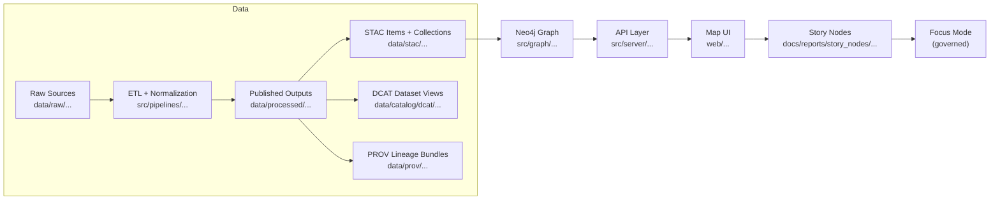

# 📊 Reports Workspace (`data/work/reports/`)


> [!IMPORTANT]
> This directory is **Work Stage** only 🧪  
> Anything here is **intermediate** and **not publishable** until it’s promoted to `data/processed/…` and registered with the catalogs (`STAC/DCAT/PROV`).

---

## 🧭 Quick Navigation

- [🎯 Purpose](#-purpose)
- [🗺️ Where this fits in the KFM pipeline](#️-where-this-fits-in-the-kfm-pipeline)
- [📦 What belongs here (and what doesn’t)](#-what-belongs-here-and-what-doesnt)
- [🗂️ Standard report work package layout](#️-standard-report-work-package-layout)
- [🏷️ Naming conventions](#️-naming-conventions)
- [✅ Promotion checklist (work → processed + catalogs)](#-promotion-checklist-work--processed--catalogs)
- [🧼 Cleanup & git hygiene](#-cleanup--git-hygiene)
- [🔐 Governance & safety](#-governance--safety)
- [📚 Index of report work packages](#-index-of-report-work-packages)

---

## 🎯 Purpose

This folder is the **workbench** for building report artifacts (draft analysis outputs, QA summaries, map exports, tables, charts) **before** they become “evidence artifacts” that the rest of the system can depend on.

Typical use-cases ✅  
- Exploratory analysis outputs (draft plots, intermediate tables)
- Draft report exports (`.md`, `.pdf`, `.html`) while iterating
- Temporary joins, denormalized views, cached query results
- Pipeline run logs + reproducibility notes

Non-goals ❌  
- This is **not** the canonical home for published artifacts  
- This is **not** the narrative/story system (`docs/reports/story_nodes/…`)
- This is **not** the final data product staging area (`data/processed/…`)

---

## 🗺️ Where this fits in the KFM pipeline



**Translation:** `data/work/reports/` sits “early” in the lifecycle—supporting iteration—**but nothing here should leapfrog the catalogs**.

---

## 📦 What belongs here (and what doesn’t)

### ✅ Belongs here
- `draft/` exports, work-in-progress figures and tables
- Intermediate computations you can regenerate (or want to keep around briefly)
- “Run context” (inputs list, params, commit hash, environment notes)
- Logs / validation outputs produced during report building

### ❌ Does NOT belong here
- **Published** report outputs intended for the UI / API  
  → promote to `data/processed/...` + register in `DCAT/PROV` (and `STAC` if spatial)
- Long-lived narrative content  
  → use `docs/reports/story_nodes/…` (draft vs published)
- Raw source files  
  → use `data/raw/<domain>/…`

---

## 🗂️ Standard report work package layout

Create one folder per report “work package”:

```text
data/work/reports/
└── 📁 YYYY-MM-DD__<report_slug>/
    ├── 📄 README.md                 # run log + intent + links (required)
    ├── 📄 report.manifest.yml        # machine-friendly manifest (recommended)
    ├── 📁 inputs/                   # pointers + small samples (NO huge raws)
    ├── 📁 notebooks/                # exploratory analysis
    ├── 📁 scripts/                  # deterministic build steps (preferred long-term)
    ├── 📁 figures/                  # charts, maps, diagrams (draft okay)
    ├── 📁 exports/                  # draft report outputs (md/html/pdf)
    ├── 📁 logs/                     # validation + run logs
    └── 📁 tmp/                      # safe-to-delete scratch
```

> [!TIP]
> If it’s getting “stable”, start moving logic from `notebooks/` into `scripts/` so the work becomes deterministic and re-runnable. 🧰

---

## 🏷️ Naming conventions

### Report folder names
**Format:** `YYYY-MM-DD__<report_slug>`  
Example: `2026-02-03__dust-bowl__layer-audit` ✅

Rules:
- `YYYY-MM-DD` = the start date of the work package (or the publication date when promoted)
- `report_slug` = lowercase + `kebab-case` (keep it short, searchable)
- Optional extra segments via `__` (double underscore) for clarity

### File names inside a report
Prefer:
- `report.md`, `report.pdf`, `report.html`
- `figures/figure__<slug>.png`
- `tables/table__<slug>.parquet` (or `.csv` if needed)

---

## 🧾 Report manifest template (recommended)

Store a machine-friendly manifest alongside the human README:

<details>
<summary>📄 <code>report.manifest.yml</code> (starter template)</summary>

```yaml
id: "report__YYYY-MM-DD__<report_slug>"
title: "<Human readable title>"
status: "work"          # work | review | promoted
owners:
  - "<name_or_handle>"
created: "YYYY-MM-DD"
updated: "YYYY-MM-DD"

inputs:
  datasets:
    - "<dcat_dataset_id_or_stac_collection_id>"
  files:
    - "relative/path/if_applicable"

method:
  pipelines:
    - "src/pipelines/<...>"   # if a pipeline exists
  params:
    key: value
  environment:
    notes: "python=3.x, node=xx, etc."
  reproducibility:
    git_commit: "<hash>"
    run_id: "<optional-run-id>"

outputs:
  drafts:
    - "exports/report.md"
    - "exports/report.pdf"
  figures:
    - "figures/..."

promotion_targets:
  processed_path: "data/processed/reports/<report_slug>/"
  dcat_entry: "data/catalog/dcat/<id>.jsonld"
  prov_bundle: "data/prov/<id>.json"
  stac_items: []   # add if geospatial assets are produced
```

</details>

---

## ✅ Promotion checklist (work → processed + catalogs)

When the report becomes something others should cite/use, **promote it**:

> [!NOTE]
> The “promotion” step is what turns a report into a **first-class evidence artifact** that can be referenced safely downstream.

### 1) Freeze the work 🧊
- [ ] Inputs are enumerated (dataset IDs / file refs)
- [ ] Parameters captured (config / CLI args / notebook settings)
- [ ] Repro info captured (commit hash, environment notes)

### 2) Move final outputs to processed ✅
Promote final artifacts (not drafts) to something like:

- `data/processed/reports/<report_slug>/...`

Include:
- [ ] final report file(s) (`report.pdf`, `report.md`, etc.)
- [ ] final figures used
- [ ] derived datasets (if any) that the report depends on

### 3) Register metadata boundary artifacts 🧩
- [ ] **DCAT** dataset entry for the report artifact (discoverability)
- [ ] **PROV** lineage bundle linking raw → work → processed
- [ ] **STAC** (if spatial assets are produced) items/collections for maps/rasters/vectors

### 4) Optional: connect to narrative 🧠
If this report supports a public-facing explanation, create/extend:
- `docs/reports/story_nodes/draft/<story_slug>/...`

…and link the story back to the report’s dataset IDs.

---

## 🧼 Cleanup & git hygiene

### Safe-to-delete ✅
- `tmp/`
- local caches (`.cache/`, `.ipynb_checkpoints/`, `__pycache__/`)
- one-off exports in `exports/` that are superseded

### Avoid committing 🚫
- giant binaries and raw dumps
- duplicate copies of `data/raw/…` files
- secrets, keys, credentials (never)

> [!WARNING]
> If you feel tempted to commit a large artifact here because “it’s important” — that’s usually a sign it should be **promoted** and cataloged instead. 🧷

---

## 🔐 Governance & safety

- 🧾 **No unsourced claims** in anything that will be promoted or used for narrative
- 🧭 Follow the pipeline ordering — don’t bypass catalogs to feed UI/story content
- 🧑‍⚖️ If content is sensitive (sovereignty, privacy, restricted locations), route through the governed path (API + review) before it’s surfaced

---

## 📚 Index of report work packages

> [!TIP]
> Keep this list short + current. Link only “active” or “recent” work packages.

| Date | Report | Status | Notes |
|------|--------|--------|-------|
| YYYY-MM-DD | `YYYY-MM-DD__<report_slug>` | 🧪 work | short description |
| YYYY-MM-DD | `YYYY-MM-DD__<report_slug>` | ✅ promoted | links to `data/processed/...` |

---

### ⭐ Quick mantra
**Work here → Promote to processed → Register catalogs → Then tell the story.** 🧠🗺️✅