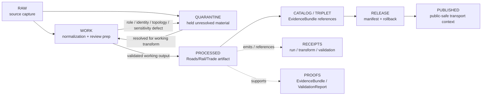

<!-- [KFM_META_BLOCK_V2]
doc_id: kfm://data/work/roads-rail-trade/readme
title: Roads/Rail/Trade WORK README
type: data-work-domain-index-readme
version: v0.1.0
status: draft
owners:
  - <roads-rail-trade-domain-steward>
  - <network-topology-steward>
  - <transport-facility-steward>
  - <roads-rail-trade-source-steward>
  - <rights-reviewer>
  - <sensitivity-reviewer>
  - <pipeline-steward>
  - <release-steward>
created: 2026-06-29
updated: 2026-06-29
policy_label: restricted-review
truth_posture: cite-or-abstain
lifecycle_phase: work
responsibility_root: data/
domain: roads-rail-trade
artifact_family: roads-rail-trade-working-normalization-lane
sensitivity_posture: fail-closed; no-public-path; source-role-preservation-required; route-status-not-assumed; legal-status-not-inferred; topology-review-required; critical-transport-review-required; cultural-corridor-review-required; release-blocked
related:
  - ../README.md
  - ../../README.md
  - ../../raw/roads-rail-trade/README.md
  - ../../quarantine/roads-rail-trade/README.md
  - ../../processed/roads-rail-trade/README.md
  - ../../processed/roads-rail-trade/road-segments/README.md
  - ../../processed/roads-rail-trade/facilities/README.md
  - ../../catalog/domain/roads-rail-trade/README.md
  - ../../published/layers/roads-rail-trade/README.md
  - ../../proofs/roads-rail-trade/README.md
  - ../../receipts/README.md
  - ../../registry/sources/roads-rail-trade/README.md
  - ../../../docs/domains/roads-rail-trade/README.md
  - ../../../docs/domains/roads-rail-trade/ARCHITECTURE.md
  - ../../../docs/domains/roads-rail-trade/CANONICAL_PATHS.md
  - ../../../docs/domains/roads-rail-trade/OBJECT_FAMILIES.md
  - ../../../docs/domains/roads-rail-trade/PIPELINE.md
  - ../../../docs/domains/roads-rail-trade/SENSITIVITY.md
  - ../../../docs/domains/roads-rail-trade/SOURCE_FAMILIES.md
  - ../../../docs/domains/roads-rail-trade/SOURCE_REGISTRY.md
  - ../../../docs/domains/roads-rail-trade/SOURCES.md
  - ../../../docs/domains/roads-rail-trade/UBIQUITOUS_LANGUAGE.md
  - ../../../docs/domains/roads-rail-trade/VERIFICATION_BACKLOG.md
  - ../../../docs/architecture/source-roles.md
  - ../../../docs/architecture/source-role-anti-collapse.md
  - ../../../release/manifests/README.md
tags:
  - kfm
  - data
  - work
  - roads-rail-trade
  - roads
  - rail
  - trade-routes
  - transport-network
  - route-identity
  - segment-identity
  - network-topology
  - corridors
  - facilities
  - restrictions
  - status-events
  - source-role
  - sensitivity
  - no-public-path
  - evidence-first
notes:
  - "This README replaces the greenfield stub at `data/work/roads-rail-trade/README.md`."
  - "WORK is a governed intermediate lifecycle lane between RAW/QUARANTINE and PROCESSED; it is not proof, catalog, registry, policy, release, public API/UI output, public map/tile output, routing engine, operations surface, emergency-routing surface, legal road-status authority, infrastructure condition surface, or generated-answer authority."
  - "Roads/Rail/Trade WORK must preserve source role, rights, sensitivity posture, object-family distinction, route/segment identity, topology basis, temporal semantics, evidence linkage, validation state, correction path, and rollback context before any downstream move."
  - "Source-role anti-collapse is mandatory: observed, regulatory, modeled, aggregate, administrative, candidate, and synthetic roles are not interchangeable and promotion never upgrades a role."
  - "README/path presence confirms documentation or path evidence only; it does not prove payloads, schemas, validators, receipts, access controls, CI enforcement, source descriptors, connector activation, or release readiness."
[/KFM_META_BLOCK_V2] -->

<a id="top"></a>

# Roads/Rail/Trade WORK

Governed working lane for Roads/Rail/Trade normalization, segmentation, geometry repair, network topology preparation, route and corridor identity reconciliation, source-role review, rights review, sensitivity review, validation preparation, and downstream-ready shaping before processed artifacts, catalog records, triplets, releases, public layers, PMTiles, reports, stories, graph edges, vector indexes, or public-safe derivatives exist.

<p>
  
  
  
  
  
  
</p>

**Quick links:** [Scope](#scope) · [Repo fit](#repo-fit) · [Lifecycle boundary](#lifecycle-boundary) · [Confirmed child lanes](#confirmed-child-lanes) · [Proposed work lanes](#proposed-work-lanes) · [Accepted inputs](#accepted-inputs) · [Exclusions](#exclusions) · [Roads/Rail/Trade working rules](#roadsrailtrade-working-rules) · [Directory map](#directory-map) · [Exit gates](#exit-gates) · [Forbidden shortcuts](#forbidden-shortcuts) · [Required checks](#required-checks-before-use) · [Status notes](#status-notes)

> [!CAUTION]
> `data/work/roads-rail-trade/` is a no-public-path working lane. It is not public, not processed truth, not catalog truth, not proof, not receipt authority, not source registry authority, not rights authority, not policy authority, not release authority, not road-status authority, not rail-status authority, not route truth, not facility-condition truth, not routing authority, not legal-designation authority, not emergency-routing guidance, not public map/API/UI output, and not an AI-answer source. Public clients, normal UI surfaces, map layers, PMTiles, reports, stories, graph/vector indexes, search indexes, and generated answers must not read this lane directly.

---

## Scope

`data/work/roads-rail-trade/` holds in-progress Roads/Rail/Trade material after RAW source admission or quarantine return, while stewards and pipelines prepare it for normalization, validation, source-role reconciliation, road/rail segmentation, route/corridor identity reconciliation, network topology preparation, geometry/CRS repair, temporal-state handling, status/restriction event review, operator/facility matching, rights review, sensitivity review, catalog readiness, or processed-stage promotion.

WORK exists for **controlled transformation and review preparation**. It may contain intermediate tables, vectors, geometry drafts, segmentation drafts, conflation outputs, topology repair drafts, route-membership candidates, corridor matching candidates, facility matching candidates, status/restriction event normalization drafts, historic route claim drafts, trade-route corridor drafts, QA outputs, source-role review notes, sensitivity review notes, and run-local sidecars when those artifacts are not yet validated processed objects, catalog records, proofs, receipts, release decisions, published products, routing products, legal determinations, or public-safe claims.

Roads/Rail/Trade owns road and rail evidence, corridor and route membership, network topology, crossings, bridges, ferries, transport facilities, restriction/status events, operator assignments, historic route claims, and trade-route corridor context. It may cite Settlements/Infrastructure, Hydrology, Hazards, Archaeology/Cultural Heritage, People/Land, Agriculture, Geology, Habitat, Fauna, Flora, and Soil, but those lanes keep their own canonical truth and sensitivity policy.

---

## Repo fit

| Field | Value |
|---|---|
| Path | `data/work/roads-rail-trade/` |
| Responsibility root | `data/` |
| Lifecycle phase | `work/` |
| Domain lane | `roads-rail-trade` |
| Artifact role | Working normalization, segmentation, topology preparation, identity reconciliation, source-role review, sensitivity review, QA, and validation-preparation lane |
| Public access posture | No public path; no normal UI; no governed-public API exposure |
| Upstream | `data/raw/roads-rail-trade/` after source admission, or `data/quarantine/roads-rail-trade/` after governed hold resolution |
| Downstream | `data/quarantine/roads-rail-trade/` for unresolved holds, or `data/processed/roads-rail-trade/` after work-stage gates close |
| Release authority | `release/`, not this directory |
| Proof authority | `data/proofs/`, not this directory |
| Receipt authority | `data/receipts/`, not this directory |
| Registry authority | `data/registry/`, not this directory |
| Policy authority | `policy/`, not this directory |
| Default failure posture | `HOLD`, `QUARANTINE`, `DENY`, `RESTRICT`, or `ABSTAIN` when source role, rights, source family, route identity, segment identity, topology, temporal role, geometry/support, sensitivity, evidence, review, correction, rollback, access basis, or release support is insufficient |

---

## Lifecycle boundary

```text
RAW -> WORK / QUARANTINE -> PROCESSED -> CATALOG / TRIPLET -> PUBLISHED
```



WORK may support later processing, restricted review, public-safe derivative preparation, topology/model handling, and evidence assembly, but it does not bypass quarantine, processed validation, proof construction, source-role review, rights review, sensitivity review, policy review, release, correction, or rollback requirements.

---

## Confirmed child lanes

No `data/work/roads-rail-trade/` child README lanes were confirmed during this edit. This parent README is confirmed as authored, but child workstream routing remains proposed until child README paths are created and verified.

| Child lane | Status | Boundary summary |
|---|---|---|
| `<none confirmed>` | **UNKNOWN** | Do not infer payloads, SourceDescriptors, connectors, validators, fixtures, receipts, access controls, CI checks, review completion, or release readiness from this parent README. |

---

## Proposed work lanes

The work lanes below are planning targets implied by RAW, QUARANTINE, PROCESSED, and Roads/Rail/Trade doctrine patterns. Treat them as **PROPOSED / NEEDS VERIFICATION** until README paths, payload policy, schemas, validators, fixtures, receipts, and CI enforcement are verified.

| Proposed lane | Purpose | Hard boundary |
|---|---|---|
| `road-segments/` | Working road segmentation, geometry repair, conflation, identity matching, and topology support. | Road segment geometry is not route status, legal designation, emergency routing, or navigation authority by itself. |
| `rail-segments/` | Working rail segmentation, geometry repair, identity matching, and topology support. | Rail geometry is not current operations, operator status, or right-of-way proof by itself. |
| `corridors/` | Working named corridor, trade-route, and historic-corridor preparation. | Cultural, historic, and sensitive corridors require steward review and generalized public treatment where required. |
| `route-membership/` | Working route-to-segment and corridor-to-segment association preparation. | Membership is distinct from segment identity and must remain evidence-bound. |
| `network-nodes/` | Working junction, crossing, terminus, and topology-node preparation. | Topology is derived context, not source truth by itself. |
| `crossings/` | Working bridge, ferry, rail-road crossing, and water/transport crossing context. | Hydrology and Settlements/Infrastructure retain their own truth. |
| `facilities/` | Working depot, station, yard, terminal, interchange, and transport-facility matching. | Facility context is not ownership, condition, vulnerability, or operations authority by itself. |
| `events/` | Working restriction, status, closure, construction, and related event normalization. | Time-bound events are not static segment/facility identity. |
| `operators/` | Working operator assignment and service-context preparation. | Operator assignment is not legal ownership or access/right proof by itself. |
| `historic/` | Working historic route claims and trade-route interpretation support. | Historic/cultural claims remain evidence-bound and sensitivity-reviewed. |
| `topology/` | Working graph topology, traversal, snapping, edge/node rules, and QA. | Modeled graph is not canonical source truth or routing authority. |

---

## Accepted inputs

Accepted material is limited to intermediate, non-public working artifacts such as:

- source-normalization drafts derived from admitted Roads/Rail/Trade RAW captures;
- working vectors, tables, graph drafts, geometry repair drafts, segmentation outputs, conflation outputs, snapping outputs, topology repair outputs, and QA artifacts;
- road segment, rail segment, corridor route, route membership, network node, crossing, bridge, ferry, transport facility, restriction event, status event, operator assignment, historic route claim, and trade-route corridor working candidates that remain clearly labeled as working/candidate class;
- source-role review notes for observed, regulatory, modeled, aggregate, administrative, candidate, synthetic, and generated-carrier material;
- identity reconciliation outputs for source IDs, route IDs, segment IDs, facility IDs, operator labels, route names, corridor names, temporal windows, geometry support, and topology support;
- rights-review preparation notes, source-license interpretation notes, citation checks, upstream-source-chain notes, allowed-use caveats, and source-role inheritance notes that are not authoritative registry or policy records;
- redaction, generalization, aggregation, precision-control, representation, withholding, and delayed-publication preparation artifacts that still need receipts and review before downstream use;
- source-role, rights, sensitivity, route identity, segment identity, facility identity, temporal role, topology, evidence, citation, attribution, review, and validation notes used to decide whether material returns to quarantine or proceeds to processed;
- run-local manifests, logs, checksums, and sidecars used to understand a working transform when they are not authoritative receipts, proofs, registries, schemas, policy rules, or release records;
- README or index sidecars that explain local work state without becoming public, proof, catalog, registry, policy, access authority, release authority, route-status authority, legal-status authority, routing authority, or generated-answer authority.

> [!IMPORTANT]
> Working artifacts must keep source role and object family visible. Observed, regulatory, modeled, aggregate, administrative, candidate, synthetic, status, restriction, historic, cultural, and generated-carrier material must not be flattened into the same authority class for convenience.

---

## Exclusions

| Do not place here | Correct authority home |
|---|---|
| Immutable Roads/Rail/Trade source capture, source-native files, source API responses, agency/steward exports, source logs, original geometries, original source identifiers, and source-native timestamps | `data/raw/roads-rail-trade/` |
| Source-role collapse, route identity unresolved, segment/topology defect, rights unknown, sensitivity unresolved, evidence open, temporal role defect, schema/geometry/source-version defect, cultural-corridor review unresolved, critical-transport review unresolved, malformed, disputed, unsafe, or not-yet-reviewed material | `data/quarantine/roads-rail-trade/` |
| Validated normalized Roads/Rail/Trade outputs | `data/processed/roads-rail-trade/` |
| Validated road-segment processed outputs | `data/processed/roads-rail-trade/road-segments/` |
| Validated transport-facility processed outputs | `data/processed/roads-rail-trade/facilities/` |
| Public-safe published layers, PMTiles, reports, stories, API payloads, downloads, graph edges, or public artifacts | `data/published/` only after release gates close |
| Catalog records, STAC/DCAT/PROV records, triplets, graph records, or EvidenceBundle state | `data/catalog/`, `data/triplets/`, or proof lanes |
| EvidenceBundle, ProofPack, validation report, or claim-proof authority | `data/proofs/` |
| Final `RunReceipt`, `TransformReceipt`, `ValidationReceipt`, `SourceRoleReviewReceipt`, `RedactionReceipt`, `AggregationReceipt`, `ReviewRecord`, `PolicyDecision`, correction receipt, or release receipt records | `data/receipts/` or accepted review/receipt lanes |
| SourceDescriptor, source activation, source registry, rights registry, freshness registry, sensitivity registry, or access registry records | `data/registry/` or accepted registry lanes |
| Release manifests, correction notices, withdrawal notices, signatures, rollback cards, release decisions, or release candidates | `release/` |
| Schemas, contracts, validators, tests, packages, pipelines, pipeline specs, app/UI/API code, or policy rules | `schemas/`, `contracts/`, `tools/`, `tests/`, `pipelines/`, `pipeline_specs/`, `apps/`, `policy/` |
| Legal route status, current operations status, emergency route guidance, navigation/routing authority, right-of-way proof, ownership proof, facility-condition disclosure, or life-safety guidance | Owning official or governed release authority; otherwise abstain or deny |
| Settlements/Infrastructure, Hydrology, Hazards, Archaeology/Cultural Heritage, People/Land, Agriculture, Geology, Habitat, Fauna, Flora, or Soil canonical truth | Owning domain lanes, not Roads/Rail/Trade WORK |
| Sensitive operational details, private agreement terms, restricted source values, or exposure-enabling implementation details | Do not store in this README or ordinary working Markdown |

---

## Roads/Rail/Trade working rules

| Rule | Handling |
|---|---|
| Keep WORK non-public | Nothing here is a public surface, public-candidate artifact, map tile, PMTiles output, graph source, vector-index source, or normal UI/API source. |
| Preserve source role | Observed, regulatory, modeled, aggregate, administrative, candidate, synthetic, and generated records stay distinct. |
| Preserve object-family identity | Road segment, rail segment, corridor route, route membership, network node, crossing, bridge, ferry, transport facility, restriction event, status event, operator assignment, historic route claim, and trade-route corridor stay distinct. |
| Preserve route and segment identity | Geometry similarity, name matching, or topology snapping does not prove identity by itself. |
| Preserve time kinds | Source time, observed time, valid/effective time, retrieval time, release time, correction time, vintage, and stale-state behavior remain explicit where applicable. |
| Keep administrative separate from observed | Administrative rosters, route designations, inventories, and geometry products are not observed condition or event timelines by themselves. |
| Keep regulatory separate from observed | Designations, posted restrictions, freight corridors, and right/permission records remain regulatory or administrative context until proof closes. |
| Keep model separate from source truth | Routing, traversal, reconstructed alignment, and freight-flow models require model/run support and cannot replace source records. |
| Keep cross-domain truth separate | Settlements/Infrastructure, Hydrology, Hazards, Archaeology/Cultural Heritage, People/Land, Agriculture, Geology, Habitat, Fauna, Flora, and Soil can be referenced through governed joins, but Roads/Rail/Trade does not own their canonical truth. |
| Keep sensitivity visible | Critical-transport, cultural-corridor, historic-route, archaeology-adjacent, operator, condition, restriction, and emergency-adjacent joins fail closed until reviewed. |
| Do not launder quarantine | Material cannot leave quarantine through WORK unless the hold reason is explicitly resolved and recorded. |
| Do not launder into public | WORK cannot become public or published material without governed review, receipts, release, correction, rollback, and public-safe representation controls. |
| Separate review from transformation | Segmentation, conflation, topology repair, route matching, or event normalization does not equal reviewer approval, policy decision, receipt closure, release approval, or public permission. |

---

## Directory map

```text
data/work/roads-rail-trade/
├── README.md
├── <future-workstream-or-source-family>/
│   └── <run_id_or_batch_id>/
│       ├── work_manifest.json
│       ├── input_refs.json
│       ├── transform_notes.md
│       ├── source_role_review.notes.md
│       ├── topology_review.notes.md
│       ├── sensitivity_review.notes.md
│       ├── qa_notes.md
│       ├── checksums.sha256
│       └── README.md
└── index.local.json
```

`index.local.json` is optional and must remain WORK-local. It is not a public index, catalog record, release manifest, source registry, review record, graph edge source, layer/story/report pointer, search index, vector index, map source, tile source, route authority, road/rail-status authority, routing authority, legal-status authority, or retrieval source for generated answers.

> [!NOTE]
> The directory map confirms the parent README path only. Future workstream folders are proposed patterns and do not prove payloads, schemas, validators, fixtures, workflows, receipts, access controls, or CI checks exist.

---

## Exit gates

| Exit route | Minimum requirement |
|---|---|
| Stay WORK | Normalization, segmentation, topology repair, route/corridor identity reconciliation, source-role reconciliation, rights review, sensitivity review, temporal handling, evidence-bundle preparation, validation preparation, or correction planning remains incomplete. |
| Quarantine | Source role, rights, sensitivity, route identity, segment identity, network topology, geometry/support, temporal role, source family, schema, citation, digest, policy, review, evidence, correction, or rollback state is unresolved enough that work should stop. |
| Reject / return | Steward review says the material is misfiled, unsupported, not retainable, or outside the Roads/Rail/Trade work lane. |
| Promote to PROCESSED | Working artifact has sufficient lineage, source-role preservation, object-family distinction, route/segment identity support, topology support, validation support, rights posture, review state where required, correction path, rollback context, and downstream-ready metadata. |
| Prepare public-safe derivative | Only a transformed derivative, not unresolved source or sensitive working material, may move toward public-safe processed/catalog/published paths after validation, review, policy, receipt, correction, rollback, and public-safe representation requirements are satisfied. |
| Support catalog/release later | Only after later PROCESSED, CATALOG/TRIPLET, proof, receipt, review, policy, release, correction, and rollback gates close. |

Cultural, historic, critical-transport, condition, operator, restriction, and emergency-adjacent material additionally requires policy-aware review and public-safe representation before public context can exist.

---

## Forbidden shortcuts

```text
data/work/roads-rail-trade/
→ data/catalog/
→ data/published/
→ public API / MapLibre / PMTiles / report / story / graph / vector index / generated answer
```

is forbidden unless the appropriate governed lifecycle transitions have actually happened and left inspectable evidence.

```text
data/work/roads-rail-trade/
→ data/processed/roads-rail-trade/
```

is also forbidden for source-role collapse, route identity unresolved, segment/topology defects, rights unknown, sensitivity unresolved, evidence open, temporal-role defects, schema/geometry/source-version defects, cultural-corridor review unresolved, critical-transport review unresolved, and unresolved source-role material. Route unresolved material to quarantine instead.

---

## Required checks before use

- [ ] Confirm the material belongs to the Roads/Rail/Trade domain lane.
- [ ] Confirm the material belongs in WORK rather than RAW, QUARANTINE, PROCESSED, CATALOG, PROOF, RECEIPT, REGISTRY, RELEASE, PUBLISHED, SCHEMA, POLICY, CODE, PIPELINE, or TEST roots.
- [ ] Confirm source reference, source family, source role, upstream citation chain, rights posture, endpoint identity, retrieval/admission context, product version/vintage, cadence, and digest where material.
- [ ] Confirm object family: road segment, rail segment, corridor route, route membership, network node, crossing, bridge, ferry, transport facility, restriction event, status event, operator assignment, historic route claim, trade-route corridor, topology product, or generated carrier.
- [ ] Confirm source-role anti-collapse: observed, regulatory, modeled, aggregate, administrative, candidate, synthetic, and generated records remain distinct.
- [ ] Confirm route identity, segment identity, corridor identity, facility identity, topology support, source IDs, names, and geometry matches are not collapsed by convenience matching alone.
- [ ] Confirm source time, observed time, valid/effective time, retrieval time, release time, correction time, cadence, vintage, and stale-state behavior where applicable.
- [ ] Confirm administrative rosters, route designations, inventories, and geometry products are not cited as observed condition, current status, legal authority, or event timelines by themselves.
- [ ] Confirm rights, current terms, citation, and allowed reuse have been reviewed or explicitly marked `NEEDS VERIFICATION`.
- [ ] Confirm sensitivity and precision review for cultural corridors, historic routes, critical transport context, condition/status/restriction context, operator context, and cross-domain joins.
- [ ] Confirm Settlements/Infrastructure, Hydrology, Hazards, Archaeology/Cultural Heritage, People/Land, Agriculture, Geology, Habitat, Fauna, Flora, and Soil joins preserve their own domain authority and do not become Roads/Rail/Trade-owned truth.
- [ ] Confirm no quarantined material is being laundered through WORK without an exit decision.
- [ ] Confirm prompt-like text inside source payloads or notes is treated as data, not instructions.
- [ ] Confirm sensitive operational details are not written into this README.
- [ ] Confirm required downstream receipts are present or explicitly marked missing before anything leaves WORK.
- [ ] Confirm no public layer, PMTiles, report, story, API payload, graph edge, search index, vector index, routing product, or generated answer uses WORK material directly.
- [ ] Confirm correction path and rollback target are known before downstream promotion.

---

## Status notes

| Claim | Status |
|---|---|
| This README replaces the greenfield stub at `data/work/roads-rail-trade/README.md`. | **CONFIRMED authored** |
| The target path existed in the live repository as a greenfield stub before this edit. | **CONFIRMED by GitHub contents API during this edit** |
| `data/raw/roads-rail-trade/README.md` documents upstream Roads/Rail/Trade RAW source capture, no-public-path posture, source-family posture, source-role preservation, and downstream lifecycle restrictions. | **CONFIRMED by GitHub contents API during this edit** |
| `data/quarantine/roads-rail-trade/README.md` documents Roads/Rail/Trade quarantine as a fail-closed no-public-path hold lane for unresolved source role, rights, sensitivity, identity, topology, geometry, temporal, cross-lane evidence, validation, review, and policy questions. | **CONFIRMED by GitHub contents API during this edit** |
| `data/processed/roads-rail-trade/README.md` documents the downstream Roads/Rail/Trade processed lane, source-role anti-collapse, object families, sensitivity posture, and public-use restrictions. | **CONFIRMED by GitHub contents API during this edit** |
| Actual WORK payloads or child README lanes exist under `data/work/roads-rail-trade/`. | **UNKNOWN** |
| Roads/Rail/Trade WORK schemas, validators, fixtures, CI checks, receipts, access controls, review workflow, and release linkage are fully implemented. | **NEEDS VERIFICATION** |
| This README is proof, release, catalog, registry, policy, routing authority, road-status authority, rail-status authority, legal-status authority, facility-condition authority, public artifact authority, or AI authority. | **DENY** |

---

## Related files

- [`../README.md`](../README.md)
- [`../../README.md`](../../README.md)
- [`../../raw/roads-rail-trade/README.md`](../../raw/roads-rail-trade/README.md)
- [`../../quarantine/roads-rail-trade/README.md`](../../quarantine/roads-rail-trade/README.md)
- [`../../processed/roads-rail-trade/README.md`](../../processed/roads-rail-trade/README.md)
- [`../../processed/roads-rail-trade/road-segments/README.md`](../../processed/roads-rail-trade/road-segments/README.md)
- [`../../processed/roads-rail-trade/facilities/README.md`](../../processed/roads-rail-trade/facilities/README.md)
- [`../../catalog/domain/roads-rail-trade/README.md`](../../catalog/domain/roads-rail-trade/README.md)
- [`../../published/layers/roads-rail-trade/README.md`](../../published/layers/roads-rail-trade/README.md)
- [`../../proofs/roads-rail-trade/README.md`](../../proofs/roads-rail-trade/README.md)
- [`../../receipts/README.md`](../../receipts/README.md)
- [`../../registry/sources/roads-rail-trade/README.md`](../../registry/sources/roads-rail-trade/README.md)
- [`../../../docs/domains/roads-rail-trade/README.md`](../../../docs/domains/roads-rail-trade/README.md)
- [`../../../docs/domains/roads-rail-trade/ARCHITECTURE.md`](../../../docs/domains/roads-rail-trade/ARCHITECTURE.md)
- [`../../../docs/domains/roads-rail-trade/CANONICAL_PATHS.md`](../../../docs/domains/roads-rail-trade/CANONICAL_PATHS.md)
- [`../../../docs/domains/roads-rail-trade/OBJECT_FAMILIES.md`](../../../docs/domains/roads-rail-trade/OBJECT_FAMILIES.md)
- [`../../../docs/domains/roads-rail-trade/PIPELINE.md`](../../../docs/domains/roads-rail-trade/PIPELINE.md)
- [`../../../docs/domains/roads-rail-trade/SENSITIVITY.md`](../../../docs/domains/roads-rail-trade/SENSITIVITY.md)
- [`../../../docs/domains/roads-rail-trade/SOURCE_FAMILIES.md`](../../../docs/domains/roads-rail-trade/SOURCE_FAMILIES.md)
- [`../../../docs/domains/roads-rail-trade/SOURCE_REGISTRY.md`](../../../docs/domains/roads-rail-trade/SOURCE_REGISTRY.md)
- [`../../../docs/domains/roads-rail-trade/SOURCES.md`](../../../docs/domains/roads-rail-trade/SOURCES.md)
- [`../../../docs/domains/roads-rail-trade/UBIQUITOUS_LANGUAGE.md`](../../../docs/domains/roads-rail-trade/UBIQUITOUS_LANGUAGE.md)
- [`../../../docs/domains/roads-rail-trade/VERIFICATION_BACKLOG.md`](../../../docs/domains/roads-rail-trade/VERIFICATION_BACKLOG.md)
- [`../../../release/manifests/README.md`](../../../release/manifests/README.md)

---

## Maintenance checklist

- [ ] Replace placeholder owners with confirmed steward roles.
- [ ] Confirm whether Roads/Rail/Trade WORK child lanes exist and add them to the directory map only after verification.
- [ ] Confirm Roads/Rail/Trade WORK schemas, validators, and fixture expectations.
- [ ] Confirm required receipt family names and storage homes for WORK-to-PROCESSED promotion.
- [ ] Confirm source-role review, route/segment identity handling, topology validation, temporal-state handling, sensitivity review, rights review, evidence-bundle closure, and validation linkage.
- [ ] Confirm all relative links after adjacent docs stabilize.
- [ ] Confirm rollback target for this README expansion in the commit or release notes.

[Back to top](#top)
