# 🧪 `data/work/runs/` — Run Artifacts (Logs • Manifests • Validation)


> This folder is the **execution-time “flight recorder”** for KFM pipelines.  
> It stores **run-scoped artifacts** (manifests, logs, metrics, and validation reports) that prove what happened during a pipeline run and support replay/debug — **before** promotion to canonical outputs and published provenance.

---

## 🎯 Purpose

KFM’s non‑negotiables: **determinism**, **traceability**, and **governed publication**.  
This directory exists to:

- 📌 Capture **what ran** (pipeline + config snapshot + environment hints)
- 🔎 Capture **what it touched** (inputs/outputs with hashes and paths)
- 🧾 Capture **what it proved** (validation reports + policy gate results)
- 🧠 Support **reproducibility** (re-run with the same inputs → same outputs)
- 🧰 Keep dev/CI runs **inspectable** without polluting `data/processed/`

---

## ✅ What belongs here

- 🧾 **Run manifest(s)** (inputs, outputs, checksums, timestamps)
- 🧪 **Validation reports** (schema checks, geometry checks, QA summaries, policy checks)
- 🧵 **Logs** (structured logs preferred: JSONL)
- 📈 **Metrics** (runtime, row counts, feature counts, memory, etc.)
- 🧊 **Config snapshots** (the exact config used for the run)
- 🧰 **Intermediate scratch** that is needed for *debugging* / *replay* (not long-term)

---

## 🚫 What does NOT belong here

- 🏛️ **Canonical published data** → `data/processed/**`
- 🗂️ **Canonical catalogs & governance artifacts** → `data/stac/**`, `data/catalog/**`, `data/prov/**` (or legacy `data/provenance/**`)
- 🔑 **Secrets / tokens / credentials** (ever)
- 📦 **Gigantic permanent artifacts** that should be treated as datasets (promote them properly)

> [!IMPORTANT]
> Treat `data/work/runs/**` as **ephemeral**.  
> If an artifact must be **audited** or **referenced by the system**, it must be promoted to:
> - `data/processed/**` (data product)  
> - `data/stac/**` + `data/catalog/**` + `data/prov/**` (published metadata + lineage)

---

## 🧭 Where `runs/` sits in the canonical pipeline

```mermaid
flowchart LR
  A["data/raw/** 🧱 Raw inputs"] --> B["data/work/** 🧪 Intermediate"]
  B --> C["data/processed/** 🏁 Final outputs"]
  C --> D["data/stac/** 🗺️ STAC"]
  C --> E["data/catalog/** 🧾 DCAT"]
  B --> F["data/prov/** 🧬 PROV (lineage)"]
  C --> F
  D --> G["Graph 🧠"]
  E --> H["API 🧩"]
  H --> I["UI 🗺️"]
  I --> J["Story Nodes 📚"]
  J --> K["Focus Mode 🔍"]
```



**`data/work/runs/`** is the *run artifact sink* that supports **B → C → (D/E/F)** with evidence.

---

## 🗂️ Recommended layout

We keep the structure predictable so tooling can:
- discover runs
- summarize outcomes
- upload CI artifacts
- generate PROV bundles that reference run IDs

```text
data/work/runs/
├── README.md
├── .gitkeep                          (optional)
├── <pipeline_name>/                  (e.g. import_census, soils_sda, ocr_newspapers)
│   └── <run_id>/                     (unique per execution)
│       ├── run.yaml                  # primary run metadata (human + machine friendly)
│       ├── status.json               # {state: running|success|failed|aborted, ...}
│       ├── config/                   # snapshot of configs used for this run
│       │   ├── pipeline.yaml
│       │   └── params.json
│       ├── manifests/
│       │   ├── inputs.json           # paths + checksums + versions
│       │   └── outputs.json          # paths + checksums + row counts
│       ├── logs/
│       │   ├── pipeline.jsonl        # structured logs (preferred)
│       │   └── stderr.log
│       ├── validation/
│       │   ├── schema_report.json
│       │   ├── geometry_report.json
│       │   └── policy_gate.json
│       ├── metrics/
│       │   ├── runtime.json
│       │   └── counters.json
│       ├── scratch/                  # optional: intermediate files (ephemeral)
│       └── _SUCCESS                  # sentinel file (or _FAILED with reason)
```

> [!TIP]
> If your pipeline writes intermediate files under `data/work/<domain>/...`, keep them there.  
> This `data/work/runs/` folder is for **run-level evidence & reporting**, not domain staging.

---

## 🧾 Run ID conventions

Pick a run ID that is:
- unique ✅
- sortable by time ✅
- easy to paste into PROV ✅

**Recommended formats:**
- **ULID**: `01J2N7FZ2B9Q7W8KZK3K8Q2Y2D`  
- **Timestamp + commit**: `2026-02-03T21-14-08Z__import_census__a1b2c3d`

> [!NOTE]
> PROV records should reference the **run ID or commit hash** so lineage can link:
> `raw → work → processed` with a specific, replayable activity.

---

## ✅ Minimum “definition of done” for a run

A run is “publishable” only when these are true:

- [ ] `status.json` ends in `success`
- [ ] `manifests/inputs.json` contains hashes for *every* input
- [ ] `manifests/outputs.json` contains hashes + counts for *every* output
- [ ] `validation/**` exists and indicates pass/fail (no silent skips)
- [ ] Outputs are **promoted** to `data/processed/**`
- [ ] Metadata is updated/created in `data/stac/**` and `data/catalog/**`
- [ ] A PROV lineage record is written to `data/prov/**` (or legacy `data/provenance/**`)
- [ ] No output is **less restricted** than its inputs (classification propagation)

---

## 📄 Suggested `run.yaml` (template)

```yaml
run_id: "2026-02-03T21-14-08Z__import_census__a1b2c3d"
pipeline:
  name: "import_census"
  entrypoint: "pipelines/import_census.py"
  version:
    git_commit: "a1b2c3d"
    repo_dirty: false
runtime:
  started_at: "2026-02-03T21:14:08Z"
  finished_at: "2026-02-03T21:18:44Z"
  host: "devbox-01"
  runner: "local"   # local|ci|prod
actor:
  invoked_by: "admin"   # user or service account
inputs_manifest: "manifests/inputs.json"
outputs_manifest: "manifests/outputs.json"
validation:
  schema_report: "validation/schema_report.json"
  geometry_report: "validation/geometry_report.json"
  policy_gate: "validation/policy_gate.json"
promotion:
  processed_paths:
    - "data/processed/census/1900_population.geojson"
prov:
  target_path: "data/prov/import_census/2026-02-03/import_census__run.jsonld"
notes: "Byte-identical rerun expected with same raw inputs."
```

---

## 🧾 Suggested `manifests/inputs.json` (template)

```json
{
  "run_id": "2026-02-03T21-14-08Z__import_census__a1b2c3d",
  "generated_at": "2026-02-03T21:14:10Z",
  "inputs": [
    {
      "path": "data/raw/census_1900/census_1900.csv",
      "sha256": "…",
      "size_bytes": 12345678
    }
  ]
}
```

---

## 🧹 Retention & cleanup

Because `data/work/runs/**` is ephemeral, choose a retention policy that fits your workflow:

- 🧪 Local dev: keep last **10–50** runs per pipeline
- 🤖 CI: keep only runs attached to **PR artifacts** (upload zipped runs)
- 🏛️ Published runs: keep only what’s necessary to regenerate PROV + audits (and ensure it’s copied to `data/prov/**`)

> [!WARNING]
> Never delete a run until its **immutable provenance** has been created in `data/prov/**` (or legacy `data/provenance/**`).

---

## 🔐 Security & governance guardrails

- 🔒 **No secrets** in logs/manifests/config snapshots
- 🧪 Validation should **fail closed** (missing metadata = block promotion)
- 🧭 Keep **policy gate results** (OPA/rego decisions, schema compliance)
- 🧬 Ensure run artifacts are sufficient to **audit** and **replay**

---

## 🧩 Git hygiene (recommended)

Typically, only this README is committed. Everything else is local/CI artifact output.

```gitignore
# Keep the docs, ignore run artifacts
data/work/runs/**
!data/work/runs/README.md
```

---

## 🔗 Related docs (repo paths)

- 📘 `docs/MASTER_GUIDE_v13.md`
- 🧬 `docs/standards/KFM_PROV_PROFILE.md`
- 🗺️ `docs/standards/KFM_STAC_PROFILE.md`
- 🧾 `docs/standards/KFM_DCAT_PROFILE.md`
- 🧱 `docs/standards/KFM_REPO_STRUCTURE_STANDARD.md`

---

## 🆘 Common issues

<details>
  <summary><strong>🐳 Docker volume permission issues writing under <code>data/</code></strong></summary>

If a container user doesn’t match host permissions, pipelines may fail to write run artifacts.

**Symptoms**
- `Permission denied` writing to `data/work/runs/...`

**Fix ideas**
- Ensure `data/` is writable on host
- Align container user/group IDs with host user
- Use a dedicated writable volume mount for `data/`

</details>

<details>
  <summary><strong>🧪 “Run succeeded, but results changed” (non-determinism)</strong></summary>

Deterministic pipelines should produce byte-identical outputs for identical inputs.

**Check**
- Did an external dependency change?
- Did you capture config snapshots in `config/`?
- Are timestamps embedded into outputs?

**Mitigation**
- Move timestamps into manifests/logs, not into processed dataset content
- Hash inputs and compare manifests across runs

</details>