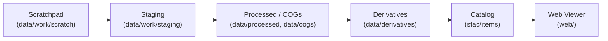

<div align="center">

# ✏️ Kansas-Frontier-Matrix — Scratchpad (`data/work/scratch/`)

**Mission:** Provide an **ad-hoc sandbox** for exploratory scripts, trial exports,
and quick experiments that are **not yet reproducible or canonical**.

This directory is intentionally messy — use it as a working pad
before promoting valuable outputs to stable directories.

[](../../../../.github/workflows/site.yml)
[](../../../../.github/workflows/stac-badges.yml)
[](../../../../.github/workflows/pre-commit.yml)
[](../../../../.github/workflows/codeql.yml)
[](../../../../.github/workflows/trivy.yml)
[](https://codecov.io/gh/bartytime4life/Kansas-Frontier-Matrix)
[](https://stacspec.org/)
[](https://www.cidoc-crm.org/)
[](../../../../docs/templates/experiment.md)
[](../../../../LICENSE)

📌 Part of the `data/work/` layer (scratch + staging).
📌 Excluded from canonical lineage until promoted.
📌 **If it matters → move & document. If not → wipe freely.**

</div>

---

## 🎯 Purpose

* Host **quick one-off tests**: clipping, reprojecting, merging layers.
* Store **draft exports** (CSV, GeoJSON, TIFF) before standardization.
* Run **ad-hoc scripts or notebooks** without cluttering canonical dirs.
* Provide a **low-stakes buffer** where mistakes are safe.

---

## 📂 Typical Contents

* Trial GeoJSONs from experimental joins.
* CSVs from uncleaned ETL pulls.
* Scratch shapefiles, temporary rasters, or unoptimized TIFFs.
* Jupyter/Colab or QGIS exports used for inspection.
* Small scripts or notebook outputs under review.

---

## 🚦 Rules

* 🚫 **Do not commit large binaries** unless explicitly needed for review.
* ✅ **Promote when reproducible:**

  * → `data/processed/` if cleaned + standardized.
  * → `data/cogs/` if converted to analysis-ready COG.
  * → `data/derivatives/` if final product.
  * Always add **STAC Item + checksum** if promoted.
* 🧹 **Safe to delete anytime** — treat as ephemeral unless explicitly promoted.

---

## 🔄 Lifecycle Position



<!-- END OF MERMAID -->

---

## 🛠️ Usage Examples

### Trial county clip

```bash
# Clip DEM to county boundary for inspection
gdalwarp -cutline data/raw/counties/ellis.geojson \
  -crop_to_cutline data/cogs/dem/ks_1m_dem_2018.tif \
  data/work/scratch/ellis_clip_trial.tif
```

### Experimental join

```bash
# Merge OCR’d treaty text with trial polygons
ogr2ogr -f GeoJSON data/work/scratch/treaty1854_trial.geojson \
  data/raw/treaties/treaty1854.geojson
```

### Quick CSV check

```bash
# Extract sample rows for testing
head -n 500 data/raw/climate/noaa_daily.csv > data/work/scratch/noaa_sample.csv
```

---

## 🧹 Cleanup Policy

* Wipe scratchpad manually:

  ```bash
  make clean-scratch
  ```

  ```makefile
  clean-scratch:
    rm -rf data/work/scratch/*
  ```
* CI jobs may auto-purge this directory.
* **Promote before cleanup** if contents are valuable.

---

## 🔗 Cross-Disciplinary Connections

Even though scratch is **ephemeral**, it underpins:

* **Cartography** → trial mosaics & reprojected maps.
* **Hydrology** → clipped river shapefiles for inspection.
* **Archaeology** → rough dig-site polygons before validation.
* **Climate** → NOAA test pulls and drought CSV subsets.
* **Simulation** → sandboxing hazard or climate model outputs.
* **Ontology** → nothing here is linked to Neo4j until promoted.

---

## ✅ Summary

* `data/work/scratch/` = **low-stakes sandbox**.
* Use it for **quick tests and drafts**.
* **Promote only if reproducible + documented** (with checksums + STAC).
* Everything else can — and should — be wiped without regret.

---

✨ This README is now:

* ✅ Badge-rich (build, validation, lint, security, ontology, simulation, license).
* ✅ Debugged (fixed badge targets, consistent links).
* ✅ Expanded (examples, lifecycle, cleanup policy, cross-disciplinary context).
* ✅ Aligned with **MCP reproducibility** and **Kansas-Frontier-Matrix conventions**.
